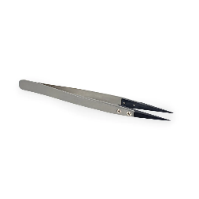

# Surface Service Guides Repair overview

## General Information, Precautions, and Warnings

### Tools

This section documents the tools recommended or required by Microsoft to
successfully complete a repair on a Surface device. Microsoft Service
Tools (recommended and required) are sold by iFixit in partnership with
Microsoft. Items under Electronic Repair Hardware and Tools can be
commonly purchased from electronic repair retailers. Lastly, items under
standard tools and misc. items on this list can be commonly purchased
from consumer retailers.

**Recommended Microsoft Service Tools**

  ---------------------------------------------------------------------------------------------------------------------------------------------
  [ESD-safe Surface Battery Cover -                                                New](images/service-guides/image6.jpeg){width="1.1497320647419074in"
                                                                                height="1.1497320647419074in"}
  ----------------------------------------------------------------------------- ---------------------------------------------------------------

  ---------------------------------------------------------------------------------------------------------------------------------------------

### Required Microsoft Service Tools**

### Required Electronic Repair Hardware or Tools**

  --------------------------------------------------------------------------------------------
  Anti-static Wrist Strap (1 MOhm     {width="1.15in"
                                      height="0.7637182852143483in"}
  ----------------------------------- --------------------------------------------------------
  ESD-safe mat or benchtop            {width="1.15in"
                                      height="1.15in"}

  Nylon Spudger/Probing Tool          {width="1.15in"
                                      height="0.15923009623797024in"}

  Plastic Opening Pick                {width="1.15in"
                                      height="1.15in"}

  Plastic Opening Tool                {width="1.15in"
                                      height="1.15in"}

ESD-safe Tweezers                   {width="1.15in"
                                      height="1.15in"}
  --------------------------------------------------------------------------------------------

### Required Standard Tools and Misc Items 

- 2IP Torx-Plus Driver

- 3IP Torx-Plus Driver

- 5IP Torx-Plus Driver

- 6IP Torx-Plus Driver

- USB 3.0 Thumb drive -- 16-GB minimum storage

- Isopropyl alcohol dispenser bottle (use 70% IPA)

- Cleaning swabs

- Microfiber Cloth

- Lint free cleaning cloth

- 4 Gallon Bucket

- 2.0 Gallons Sand, Clean

- 65W Microsoft Surface Power Supply

- 0.1mm Thickness Gauge

- 0.15mm Thickness Gauge

### General Safety Precautions

{width="0.16724956255468065in"
height="0.14066601049868765in"} Always observe the following general
safety precautions:

- Opening and/or repairing any electronic device can present a risk of
    electric shock, fire, serious personal injury, death, damage to the
    device or other property, and/or other hazards. Exercise caution
    when undertaking the repair activities described in this Guide. The
    repair activities identified in this Guide should only be undertaken
    by technically inclined individuals with the knowledge, experience,
    and specialized tools required to repair Microsoft devices.

- Improper use or handling of devices or their batteries may result in
    fire or explosion. Only open the enclosure on a device as outlined
    in this Guide.

- Don't heat, puncture, mutilate, or dispose of devices or their
    batteries in fire. Don't leave or charge devices in direct sunlight
    or expose devices or their batteries to temperatures outside the
    recommended operating range of 0°C to 60°C/32°F to 140°F for an
    extended period. Doing so can result in battery failure, electric
    shock, fire, serious personal injury, death, and/or damage to the
    device or other property.

- We recommend wearing protective eyewear and gloves when
    disassembling/re-assembling a device.

- Clean your work surface regularly to remove debris and abrasive
    particles.

- While working on devices, avoid the use of clothing accessories such
    as bracelets, rings, or watches that can cause electrical shorts
    and/or damage the battery.

- As you remove each subassembly from the device, place the
    subassembly (and all accompanying screws) away from the work area to
    prevent damage to the device or to the subassembly.

- If battery damage (e.g., leaking, expansion, folds, or other) is
    discovered during device repair or if the battery is impacted or
    damaged during replacement, **DO NOT** proceed. Refer to the
    [Actions to take in case of a Thermal
    Event](#actions-to-take-in-case-of-a-thermal-event) section or
    contact Microsoft directly for proper device disposition.

For additional product safety information relevant to Microsoft Surface
devices, see [aka.ms/surface-safety](http://aka.ms/surface-safety) or
the Surface app. To open the Surface app, select the Start button, enter
Surface into the search box, then select the Surface app.

## Electro-Static Discharge (ESD) Prevention

- Review and follow the general guidelines and ESD prevention steps in
    this Guide prior to beginning work.

- Ensure your work surface is level/flat and covered with ESD-safe,
    soft, nonmarring material.

- Before opening a device, always wear an anti-static wrist strap and
    confirm your work area is properly grounded to protect vulnerable
    electronics from electrostatic discharge (ESD).

- Parts removed from a device during the repair process should be
    stored in ESD-safe bags and packaged for return or recycling in the
    same packaging that the new replacement part came in.

### Repair-Specific Precautions and Warnings

- For Autopilot managed Surface Products refer to the following
    guidelines posted
    [here](https://docs.microsoft.com/en-us/mem/autopilot/autopilot-mbr).

> {width="0.9069444444444444in"
> height="0.2in"}**:** Before opening a device, ensure it is powered off
> and disconnected from its power source. Disconnect the device charger
> or power cord from mains power.

- For devices with rechargeable lithium-ion batteries that power on,
    fully discharge the battery before beginning repair. To expedite the
    battery discharge process:

  - Disconnect the charger from the device.

  - Increase display brightness to the highest level.

  - Turn on wi-fi and Bluetooth.

  - Open the Camera app in Windows.

  - Play music or video files from a local drive or streaming
        service.

- Operate the device in this mode until the battery is fully
    discharged and the device powers off.

- Review the General Safety Precautions and Battery Safety Sections of
    this Guide before beginning work.

{width="0.9069444444444444in"
height="0.2in"}**:** For Surface devices where the battery is affixed to
the back cover, place the back cover with the battery in a location
where it will be protected from possible punctures, impacts, crushing,
or drops during the repair process. Refer to the [Battery
Safety](#battery-safety) section in this guide for more information.

{width="0.9069444444444444in"
height="0.2in"}**:** During all activities (excluding feet-only
replacement) check to ensure that no loose articles are on the back
cover or remain inside the device before reassembling it.

**IMPORTANT:** Remove the rSSD (removable Solid-State Drive) whenever
the Keyboard is removed from the device. rSSD removal disconnects the
battery from all device logical components for safety purposes. Refer to
Procedure-Removal (rSSD) section for details.

**IMPORTANT:** Whenever the rSSD has been removed, powering on the
device requires that the rSSD and Keyboard are installed.

**IMPORTANT:** The serial number for this device model is located on its
original cover. To keep track of the device's serial number, please
record it using waterproof ink on a sticker or label and apply the
sticker or label to an easily accessible area on the device exterior.
For serial number location please see the [Device Identity
Information](#device-identity-information) section. The serial number
can't be added permanently to a replacement part. Microsoft may have
provided a label for this use in the replacement part's packaging

### Battery Safety

- This device contains a built-in, lithium-ion rechargeable battery.
    Battery safety is a significant concern when repairing a device.

- For optimum compatibility, performance, and product safety, we
    recommend using genuine Microsoft replacement parts available on
    [Microsoft.com](https://www.microsoft.com/en-us/store/b/surface-repair-parts)
    and other online part retailers such as iFixit. Use of non-Microsoft
    (nongenuine), incompatible, reused, or modified batteries; improper
    battery installation; improper handling or storage of batteries;
    and/or failure to follow the instructions in this Guide could cause
    battery overheating, expansion, venting, leaking, or a thermal event
    which could result in fire, serious personal injury, death, data
    loss, or damage to the device or other property damage.

- Before beginning device repair, ensure your workspace is free of
    flammable debris or materials, has adequate ventilation, and that
    you have a fire suppressant device (example: fire blanket, container
    of sand, Class B fire extinguisher) within easy reach or you are
    within 20 feet of a fireproof enclosure. Fireproof enclosures should
    be kept free of combustible or flammable materials.

> {width="0.9069444444444444in"
> height="0.2in"}**:** It is recommended that an ESD-safe battery cover
> be placed across the device to protect the battery from any physical
> contact or accidental damage whenever the display is removed for
> internal repairs. Ensure corners of cover are always aligned with the
> corners of the device while battery is exposed. If the battery cover
> is misaligned during activities in any way, re-align before continuing
> work.

- Use personal protective equipment (PPE) when handling damaged,
    venting, or hot battery packs.

- Use the following best practices when handling batteries:

  - Always fully discharge batteries by running an application such
        as video playback with the device unplugged. If the device doesn't function while unplugged, you may leave out this step.

  - Don't puncture, impact, strike, bend, or crush the battery or a
        device containing a battery.

  - Keep your workspace clear of debris, extra tools, and sharp
        objects.

  - Exercise caution when using sharp tools near the battery to
        avoid impacting or poking the battery.

  - Don't leave loose screws or small parts inside the device.

  - Avoid using tools that conduct electricity.

  - Don't drop or throw a lithium-ion battery.

  - Don't expose the battery to excessive heat, sunlight, or
        temperatures outside the battery's normal operating range (0°C
        to 60°C) / (32°F to 140°F)

  - Ensure you handle, recycle, and/or dispose of used or damaged
        batteries in accordance with local laws and regulations. Follow
        Handling Used, Damaged, or Defective Li-ion Batteries below.

- If the device repair can't be completed immediately and the device
    needs to be stored temporarily before restarting the repair

  - Select a storage location and process that follows the battery
        safety precautions in this Guide.

  - Avoid exposing the device to environmental conditions and
        objects that could damage the battery pack.

  - Reinspect the battery pack as outlined in this Guide prior to
        restarting repair and installing the new battery pack.

### Battery Warning Level

{width="0.9069444444444444in"
height="0.2in"}**:** Note that the battery bears the following
warning label. Heed the information provided on the label.

{width="6.5in" height="1.85in"}

### Lithium-Ion Battery Inspection

Upon device opening, we recommend that you visually inspect the battery
for signs of damage. Factors to consider when inspecting the battery
include, but aren't limited to:

- Evidence of leaking or venting

- Visible signs of physical or mechanical damage, such as:

  - Expansion or swelling. In expanded or swollen batteries, the
        soft pouch encasing the cell pulls away from the inner material
        and appears baggy, loose, or puffy.

  - Discoloration of the battery casing.

  - Odor, smell, or visible corrosion. Leaked battery electrolyte
        smells like nail polish remover (acetone).

  - Dents along the battery cell edges or on the top surface.

  - Surface scratches that have exposed the aluminum beneath the
        black coating layer on the battery.

  - Loose or damaged wires.

  - Known misuse or abuse.

Any battery exhibiting the signs listed above must be replaced. Consult
the [Battery Replacement Process](#_bookmark49) section of this document
for battery replacement instructions.

### Handling Used, Damaged, or Defective Lithium-Ion Batteries

- **DO NOT** dispose of used lithium-ion batteries, whether damaged or
    not, in household or commercial garbage or recycling bins.

{width="0.9069444444444444in"
height="0.2in"}**: DO NOT SHIP DAMAGED OR DEFECTIVE BATTERIES ALONE OR
INSIDE DEVICES.**

Damaged or defective batteries and devices containing damaged or
defective batteries require special packaging and handling.

> Prior to transport:

- Follow all instructions provided by your local e-waste recycling or
    household hazardous waste collection provider.

- Place the device or battery in individual, nonmetallic inner
    packaging, such as a zip-to-close plastic bag, that completely
    encloses the device or battery.

- Surround the inner packaging with noncombustible, electrically
    nonconductive, absorbent cushioning material.

- Each damaged battery or device containing a damaged battery should
    be packed individually in its own carton and that carton should be
    clearly marked as containing a damaged battery.

For more information on industry practices concerning damaged,
defective, or recalled batteries, please see [PHMSA
Lithium-Battery-Recycling-Safety-Advisory](https://www.phmsa.dot.gov/sites/phmsa.dot.gov/files/2022-05/Final-5-16-Lithium-Battery-Recycling-Safety-Advisory.pdf).

Undamaged, used lithium batteries can be sent to e-waste recycling or
household hazardous waste collection points for processing. See
<https://www.microsoft.com/en-us/legal/compliance/recycling> for more
information.

### Actions to take in case of a Thermal Event

- **DO NOT** use water. Immediately smother the battery or device with
    clean, dry sand, a fire blanket, or an appropriate (Class B) fire
    extinguisher. If using sand, dump the sand all at once until the
    device is completely covered.

- Contact local fire authorities if further assistance is needed.

- Exit the work area and ventilate it until it's clear of smoke.

- Wait at least 2 hours before attempting to touch the device.

- Dispose of the damaged battery or device in accordance with local
    environmental or e-waste laws and guidelines.

### Report Battery Thermal Events to Microsoft

A thermal event is a rapid chemical chain reaction that can occur inside
a battery cell. During a thermal event, the energy stored inside the
battery is released suddenly, resulting in heating and/or smoke and, in
some instances, fire or flame. A battery thermal event can be triggered
by physical damage to the battery (including during replacement/repair),
improper storage, or exposure to temperatures outside of the battery's
operating range.

Act immediately if you see any of the following symptoms of a battery
thermal event:

- Smoke, soot, sparks, or flame emitted by the battery or from a
    device containing a battery.

- The battery pouch suddenly expands in size.

- A popping or hissing noise from the battery or a device containing a
    battery.

**Stop Repair and Contact Microsoft**

If any Microsoft device visually exhibits any of the following symptoms,
cease all further repair efforts and contact Microsoft Surface Customer
Support to report and obtain next steps:

- Any burned or melted components, traces, or plastic parts on the
    outside of the device, or which otherwise exhibits heat damage,
    including charring seen in charging and other ports.

- Any burned or melted components, traces, or plastic parts on the
    inside of the device, or which otherwise exhibits heat damage.

- Any accessories exhibiting melting or heat damage that are included
    with the Microsoft device, such as power supplies, keyboards, mice,
    cables, charging connectors, etc.

- Any devices that exhibit a case that has separated apart or opened
    for reasons other than impact damage from dropping, evidence of
    tampering, or separation caused by a malfunctioning battery.

- Any other finding that may constitute a safety hazard to the user,
    such as sharp edges on plastics. Microsoft Surface Customer Support
    will ask you to provide the following information:

  - The model and serial number of the affected Microsoft Surface
        device and/or accessory(ies).

  - A brief description of the damage found.

  - Clear photographs depicting the symptoms observed.