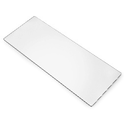
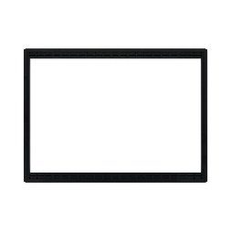

## Tools

This section documents the tools recommended or required by Microsoft to
successfully complete a repair on a Surface device. Microsoft Service
Tools (recommended and required) are sold by iFixit in partnership with
Microsoft. Items under Electronic Repair Hardware and Tools can be
commonly purchased from electronic repair retailers. Lastly, items under
standard tools and misc. items on this list can be commonly purchased
from consumer retailers.

**Recommended Microsoft Service Tools**

| [ESD-safe Surface Battery Cover - iFixit](https://www.ifixit.com/products/surface-battery-cover-m1214771-001) |  |
|----|----|

**Required Microsoft Service Tools**

| [Surface Display Debonding Tool (M1214770-001) - iFixit](https://www.ifixit.com/products/surface-display-debonding-tool-m1214770-001) |  |
|----|----|
| [Surface Display Bonding Frame (M1260233-001) - iFixit](https://www.ifixit.com/products/surface-display-bonding-frame-m1260233-001) |  |

**Required Electronic Repair Hardware or Tools**

| Anti-static Wrist Strap (1 MOhm resistance) |  |
|----|----|
| ESD-safe mat or benchtop |  |
| Nylon Spudger/Probing Tool |  |
| Plastic Opening Pick |  |
| Plastic Opening Tool |  |
| ESD-safe Tweezers |  |

**Required Standard Tools and Misc Items**

- 3IP Torx-Plus Driver

- Metric ruler

- Fine tipped marker

- 3mm Allen Driver

- Display Bonding Weights

  - Weight Requirement: minimum 32 kg (70 lbs.) / maximum 35 kg (77
    lbs.)

  - Minimum Dimensions: 280 mm x 200 mm (11 in x 8 in)

  - Geometry must be symmetrical, to allow for even weight distribution.

  - Weight used must be a flat plate, with consistent flatness and not
    protrude from contact plane with the Bonding Frame.

  - Shot bag filled with steel shot, not sand, to ensure proper weight
    displacement.

  - Weight must contact the full perimeter of the frame when placed
    above it.

  - Recommended Weights: Ruck Plates of 9 kg + 9 kg + 14 kg (20 lbs. +
    20 lbs. + 30 lbs.)

  - Alternate weights: Steel Shot Bags of 9 kg + 9 kg + 14 kg (20 lbs. +
    20 lbs. + 30 lbs.)

- Foam Pad

  - Foam Pad included with the Surface Display Bonding Frame.

  - Material: EVA Foam

  - Thickness: 9.5 mm (3/8 inch)

  - Density: 0.03 g/cm3 (2 lbs./cu Ft)

  - Dimensions: Minimum 229 mm x 305 mm (9 in x 12 in)

- Loctite 7649 Retaining Compound

- Loctite 243 Threadlocker

- USB 3.0 Thumb drive – 16 GB minimum storage

- Isopropyl alcohol dispenser bottle (use 70% IPA)

- Cleaning swabs

- Microfiber Cloth

- Lint free cleaning cloth

- 1 Gallon Enclosure

- 0.5 Gallons Sand, Clean

- Surface Dock

- 65W Microsoft Surface Power Supply

- Two 2-in spring clamps
