# Surface Laptop 13-in Component Disassembly and Reassembly

> [!CAUTION]
> Review the [Repair Safety Guidelines](surface-repair-safety-guidelines.md#general-safety-precautions) page and [Battery Safety](surface-repair-safety-guidelines.md#Battery-Safety) guidelines in their entirety before proceeding with any repair steps.

## Prerequisite Steps

Steps outlined in this section should be conducted prior to starting any
repair on a Surface device.

- **Power off device –** Ensure the device is powered off completely and
  the battery has been fully discharged. Refer to the [Repair-Specific Precautions and Warnings](surface-repair-safety-guidelines.md#Repair-specific-precautions-and-warnings) for details.
  Once discharged, the device should be disconnected from all power
  sources.

- **ESD Prevention –** Ensure ESD prevention steps and general
  guidelines are followed prior to opening the device. Refer to the [ESD Prevention section](surface-repair-safety-guidelines.md#Electro-Static-Discharge-(ESD)-precautions) for details.

- **Position Device –** To prevent damage to the device, ensure the
  device is placed on a clean surface free of debris.

**Important: Device Serial Number Notation.** The serial number for this
device is located on its original bottom cover. It is crucial to retain
the device’s original serial number for future support from Microsoft.
The D Bucket FRU will remove the device’s original serial number and
the original device serial number cannot be permanently added to a
replacement part. To ensure the original serial number is retained,
record it using waterproof ink on a label. Affix the label to an easily
accessible area on the device exterior and keep a record of the serial
number in a secure location. Microsoft has provided a label for this
purpose within the replacement part’s packaging. The label included in
the part’s packaging has space designated for the original serial number
as well as the part's product identifier.

  

## Feet Replacement

**Preliminary Requirements**

**Important:** Be sure to follow all special (bolded) notes of caution
within each process section.

**Required Tools**

- Soft ESD-Safe Mat

- Plastic Guitar Pick

**Primary Components**

- 4 Feet (Refer to the Illustrated Service Parts List)

**Procedure – Removal (feet)**

1.  Place the device on an ESD safe soft surface with the bottom side
    facing up.

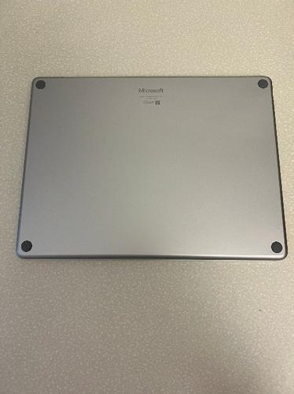

2.  Gently insert a plastic guitar pick between the foot and the bottom
    D bucket to pry the foot up. You may need to try gently inserting
    the pick from a different direction, but **do not use a metal tool
    and only use the specified plastic tool.**

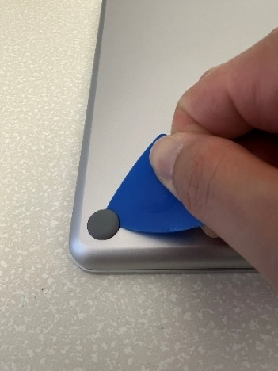

3.  Repeat steps 1 and 2 to remove the remaining 3 feet and place them
    aside for reuse (if not damaged).

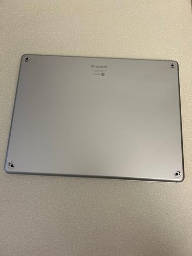

**Procedure – Installation (feet)**

1.  Carefully align the grooves on the feet with the long hole on the D
    Bucket and press the foot down vertically until it is completely
    flat to the D Bucket.

:::image type="content" source="./images/Surface_LT_13in/LT13in_Repair/media/image4.jpeg" alt-text="A person holding a small button AI-generated content may be incorrect.":::

2.  Repeat the previous step for the remaining feet.

:::image type="content" source="./images/Surface_LT_13in/LT13in_Repair/media/image1.jpeg" alt-text="A close-up of a computer AI-generated content may be incorrect.":::

## C Cover Replacement

**Preliminary Requirements**

**Important:** Be sure to follow all special (bolded) notes of caution
within each process section.

**Required Tools**

- Soft ESD-Safe Mat

- New Plastic Guitar Picks

- 5IP Torx Plus Screwdriver

- Sharpie

- Ruler

**Primary Components**

- C Cover Keyset Subassembly

- 5 5IP Screws (for C Cover)

- 20 Trackpad Shims (4 different thicknesses)

- 8 5IP Screws (for trackpad)

- 2 Conductive Tapes

- 4 Trackpad Alignment Papers

**Procedure – Removal (C Cover)**

1.  Follow “Procedure – removal (feet)”

2.  With the feet removed, use a 5IP Torx Plus screwdriver to remove the
    4 newly exposed screws. **Be sure to press down firmly with the
    screwdriver to avoid any chance for screw stripping. Additionally,
    please keep track and count the number of screws removed to ensure
    there are no extra screws in the area.**

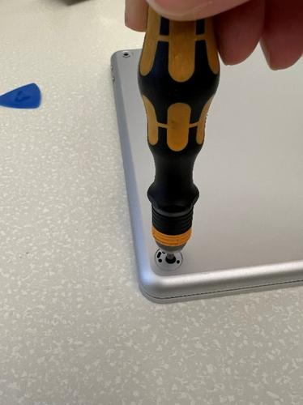

3.  Gently flip the device around and open the display cover to the
    maximum angle.

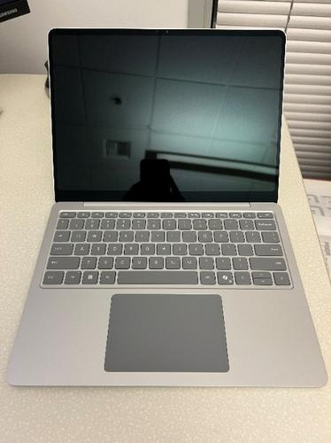

4.  Use a sharpie and ruler to draw a line 3mm away from the edge of 2
    guitar picks to prevent inserting the guitar pick too deep while
    removing the C Cover. **If this step is not followed, you may risk
    damaging your device.**

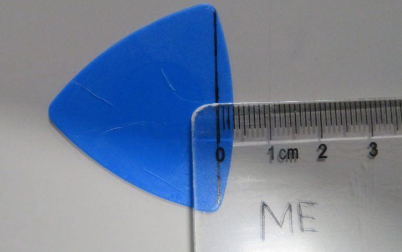

5.  With your device flat on an ESD safe surface for the remainder of
    this removal process, firmly but carefully insert the plastic guitar
    pick between the C Cover and the D bucket at least 5mm below the top
    right corner; this requires some force and patience. **Do not use a
    metal tool and only use the specified plastic tool.**

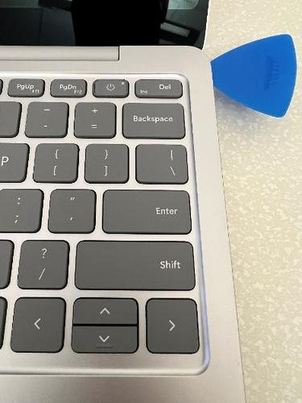

6.  Firmly but carefully, wiggle the guitar pick up and down until you
    hear a popping sound to disengage the nearby snap. With the snap
    disengaged, there will be some space between the C Cover and D
    bucket to gently slide the guitar pick along the right edge of the
    device. **At this point, you may insert the guitar pick past the 3mm
    marked line but** **when halfway down the right edge of the device,
    do not insert the guitar pick beyond the 3mm line marked or you may
    risk damaging your device.**

7.  Repeat this process until all 5 snaps on the right edge are
    disengaged. Stop when you reach the bottom corner of the device.
    **It is very important to take your time during this step, or you
    may risk damaging your device.**

8.  Leave the guitar pick in the bottom right corner to ensure the
    covers stay separated.

9.  With one hand, very gently lift and hold the top right corner of the
    C Cover. With your other hand, using another guitar pick, carefully
    disengage the snaps along the top edge of the C Cover, starting from
    the top right and moving to the top left. As you go along, once the
    nearby snap is disengaged, there will be some space between the C
    Cover and the D bucket - allowing you to gently slide the guitar
    pick along the top edge.

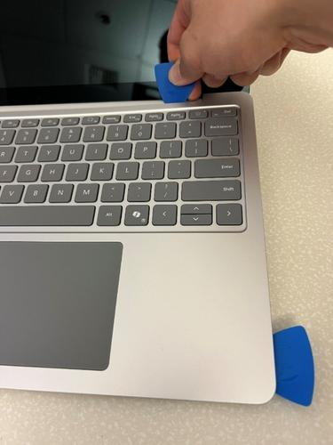
:::image type="content" source="./images/Surface_LT_13in/LT13in_Repair/media/image10.jpeg" alt-text="A person&#39;s hands holding a blue pick on a computer keyboard AI-generated content may be incorrect.":::

10. Firmly but carefully, insert the plastic guitar pick between the C
    Cover and the D bucket 5mm below the top left corner.

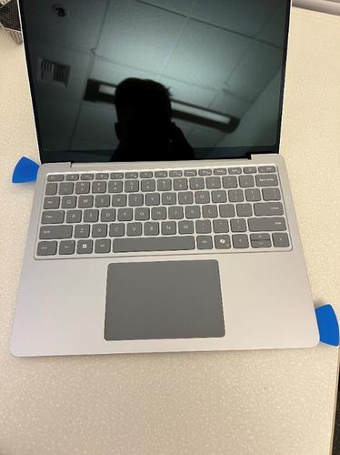

11. Firmly but carefully, wiggle the guitar pick up and down until you
    hear a popping sound to disengage the nearby snap. With the snap
    disengaged, there will be some space between the C Cover and D
    bucket to gently slide the guitar pick along the left edge of the
    device. **At this point, you may insert the guitar pick past the 3mm
    marked line but** **when halfway down the left edge of the device,
    do not insert the guitar pick beyond the 3mm line marked or you may
    risk damaging your device.**

12. Repeat this process until all 5 snaps on the left edge are
    disengaged. Stop when you reach the bottom corner of the device.
    **It is very important to take your time during this step, or you
    may risk damaging your device.**

13. With both hands, very gently wiggle and tilt the bottom of the C
    Cover upwards towards the display cover and away from the battery to
    separate it from the D bucket.

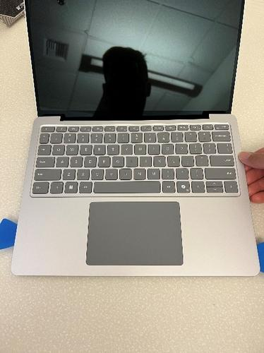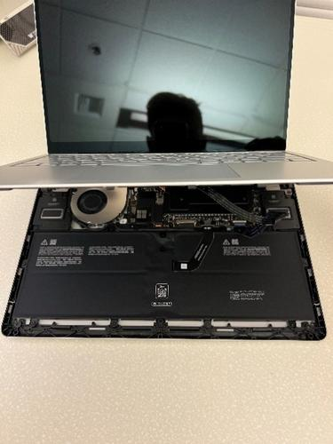

14. Use a plastic guitar pick to disengage the trackpad FPC buckle.

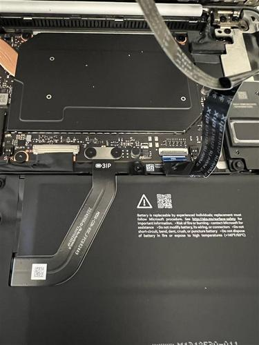

15. Disconnect the trackpad FPC and place the C Cover on an ESD safe,
    soft surface for reuse. **Carefully inspect and count all 23 snaps
    and hooks on the C Cover and D bucket (7 at the top, 5 on the left,
    5 on the right, 6 on the bottom). If there are any missing or
    cracked snaps on the C Cover, it cannot be reused. If there are any
    missing or cracked hooks on the D bucket, it cannot be reused.**

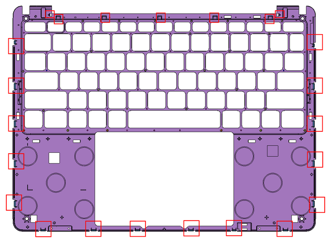

**Procedure – Installation (C Cover)**

1.  Follow “Procedure – Removal (Trackpad)” without Steps 8 and 9.

2.  Follow “Procedure – Installation (Trackpad)” without Step 10.

3.  Use plastic tweezers to remove the liner on the top thermal pad.

:::image type="content" source="./images/Surface_LT_13in/LT13in_Repair/media/image16.jpeg" alt-text="A close-up of a computer AI-generated content may be incorrect.":::

4.  Hold the C Cover with one hand and carefully install the FPC onto
    the motherboard receptacle. After the FPC is fully seated, use a
    plastic guitar pick to close the buckle on the receptacle.

:::image type="content" source="./images/Surface_LT_13in/LT13in_Repair/media/image17.png" alt-text="A close up of a circuit board AI-generated content may be incorrect.":::

5.  Gently place the C Cover onto the D Bucket and slowly press down on
    the snaps around the entire perimeter of the C Cover.

:::image type="content" source="./images/Surface_LT_13in/LT13in_Repair/media/image18.jpeg" alt-text="A hand on a keyboard AI-generated content may be incorrect.":::

6.  Gently shake the device and listen carefully for any rattling
    sounds. If heard, follow “Procedure – Removal (C Cover)” Steps 3-15
    and check for any loose connectors, screws, snaps, hooks, etc.

7.  Turn the device over and use a 5IP Torx Plus Screwdriver to install
    the 4 screws. After the screws are snug and seated, only tighten the
    screws an additional ~1/8 turn (~45 degrees) to avoid stripping the
    threads. **Be sure to press down firmly with the screwdriver to
    avoid any chance for screw stripping. Additionally, please keep
    track and count the number of screws removed to ensure there are no
    extra screws in the area.**

:::image type="content" source="./images/Surface_LT_13in/LT13in_Repair/media/image5.jpeg" alt-text="A hand holding a screwdriver AI-generated content may be incorrect.":::

8.  Follow “Procedure – Installation (Feet)”

## Trackpad Replacement

**Preliminary Requirements**

**Important:** Be sure to follow all special (bolded) notes of caution
within each process section.

**Required Tools**

- Soft ESD-Safe Mat

- Plastic Guitar Pick

- Adjustable Torque Screwdriver that can be set to 1.2kgf\*cm compatible
  with 5IP Torx Plus Bits or a preset 5IP Torx Plus Screwdriver (set to
  1.2kgf\*cm)

- Metal ESD Safe Tweezers

- Plastic ESD Safe Tweezers

- 0.2mm Thick Feeler Gauge

- Calipers

**Primary Components**

- Trackpad Subassembly

- 5 5IP Screws (for C Cover)

- 20 Trackpad Shims (4 different thicknesses)

- 8 5IP Screws (for trackpad)

- 2 Conductive Tapes

- 4 Trackpad Alignment Papers

- 1 Top Thermal Pad (for C Cover)

**Procedure – Removal (Trackpad)**

1.  Follow “Procedure – Removal (Feet)”

2.  Follow “Procedure – Removal (C Cover)

3.  With a plastic prybar, disengage the 4 FPC buckles and remove the 2
    grounding tapes on the trackpad.

:::image type="content" source="./images/Surface_LT_13in/LT13in_Repair/media/image19.jpeg" alt-text="A hand holding a black tool AI-generated content may be incorrect.":::
:::image type="content" source="./images/Surface_LT_13in/LT13in_Repair/media/image20.jpeg" alt-text="A close up of a device AI-generated content may be incorrect.":::

4.  Use isopropyl alcohol (70% IPA) and cleaning swabs to clean any
    adhesive remaining from the 2 grounding tapes.

5.  With your fingers, gently disconnect the 4 FPCs connected to the
    trackpad. Please place the trackpad FPC gently aside on an ESD safe
    surface for reuse during reassembly if it is not damaged.

6.  With a 5IP Torx Plus Screwdriver, remove the 7 screws holding the
    Trackpad to the C Cover. **Be sure to press down firmly with the
    screwdriver to avoid any chance for screw stripping. Additionally,
    please keep track and count the number of screws removed to ensure
    there are no extra screws in the area.**

:::image type="content" source="./images/Surface_LT_13in/LT13in_Repair/media/image21.jpeg" alt-text="A close-up of a computer AI-generated content may be incorrect.":::

7.  With your hand, remove the Trackpad subassembly from the C Cover.

8.  With metal ESD safe tweezers, remove the black shims from the C
    Cover.

:::image type="content" source="./images/Surface_LT_13in/LT13in_Repair/media/image22.jpeg" alt-text="A close-up of a computer AI-generated content may be incorrect.":::

9.  With plastic ESD safe tweezers, remove the thermal pad on the C
    Cover.

:::image type="content" source="./images/Surface_LT_13in/LT13in_Repair/media/image23.jpeg" alt-text="A hand holding a tweezers AI-generated content may be incorrect.":::

10. Use isopropyl alcohol (70% IPA) and cleaning swabs to clean any
    adhesive remaining from the black shims and the thermal pad.

**Procedure – Installation (Trackpad)**

1.  Attach alignment paper to the 4 corners of the Trackpad and press
    the corners down firmly. However, ensure the alignment paper does
    not fold between the trackpad and the bracket.

:::image type="content" source="./images/Surface_LT_13in/LT13in_Repair/media/image24.jpeg" alt-text="A rectangular grey rectangular object with metal corners AI-generated content may be incorrect.":::

2.  With calipers, measure the height between the top surface of the TP
    glass and the bottom surface of the TP bracket at each of the 5 shim
    locations. Then, measure the height between the top and bottom
    surface at each of the 5 shim locations. Using the difference
    between those 2 measurements at each shim location, determine which
    shim to install on to the C Cover with the following:

    1.  If the difference between the measurements is ≤ -0.05, do not
        install a shim at that location.

    2.  If the difference between the measurements is ≥ -0.05 and ≤
        0.05, install the 0.1mm thick shim.

    3.  If the difference between the measurements is ≥ 0.05 and ≤ 0.1,
        install the 0.15mm thick shim.

    4.  If the difference between the measurements is ≥ 0.1 and ≤ 0.15,
        install the 0.2mm thick shim.

    5.  If the difference between the measurements is ≥ 0.15 and ≤ 0.30,
        install the 0.3mm thick shim.

:::image type="content" source="./images/Surface_LT_13in/LT13in_Repair/media/image25.jpeg" alt-text="A person measuring a piece of metal AI-generated content may be incorrect.":::

:::image type="content" source="./images/Surface_LT_13in/LT13in_Repair/media/image26.jpeg" alt-text="A person measuring a device AI-generated content may be incorrect.":::

3.  With your fingers, firmly press the shims in for 30 seconds each.

:::image type="content" source="./images/Surface_LT_13in/LT13in_Repair/media/image27.jpeg" alt-text="A finger pointing at a device AI-generated content may be incorrect.":::

4.  Gently insert the Trackpad subassembly into the C Cover and
    reassemble the 7 5IP screws with a 5IP Torx Plus Screwdriver set to
    1.2kgf\*cm. **Be sure to press down firmly with the screwdriver to
    avoid any chance for screw stripping. Additionally, please keep
    track and count the number of screws removed to ensure there are no
    extra screws in the area.**

:::image type="content" source="./images/Surface_LT_13in/LT13in_Repair/media/image28.jpeg" alt-text="A close-up of a computer AI-generated content may be incorrect.":::

5.  With your fingers, carefully and gently remove the 4 alignment
    papers. Be sure that the entire alignment paper piece is completely
    removed and does not remain stuck between the C Cover and the
    Trackpad subassembly. If a piece of paper gets stuck, it must be
    removed, so plastic ESD-safe tweezers may be necessary.

:::image type="content" source="./images/Surface_LT_13in/LT13in_Repair/media/image29.jpeg" alt-text="A close-up of a touchpad AI-generated content may be incorrect.":::

6.  Gently flip your C Cover around and use a 0.2mm feeler gauge around
    the entire perimeter of the Trackpad subassembly to ensure it is
    never above the C Cover surface at any point. Additionally, click
    the two bottom corners to check if the trackpad gets stuck against
    the C Cover surface. If it is, redo Step 7 from “Procedure – Removal
    (Trackpad) and Step 2 from “Procedure – Installation (Trackpad)
    before proceeding to the next step.

:::image type="content" source="./images/Surface_LT_13in/LT13in_Repair/media/image30.png" alt-text="A hand holding a plastic piece of paper on a keyboard AI-generated content may be incorrect.":::

7.  Gently flip your C Cover around and install 2 new grounding tapes.
    Be sure to firmly press them down for 30 seconds each.

:::image type="content" source="./images/Surface_LT_13in/LT13in_Repair/media/image31.jpeg" alt-text="A finger on a circuit board AI-generated content may be incorrect.":::

8.  With your fingers and plastic ESD safe tweezers, carefully reconnect
    the 4 FPCs to the trackpad.

:::image type="content" source="./images/Surface_LT_13in/LT13in_Repair/media/image32.jpeg" alt-text="A close-up of a computer AI-generated content may be incorrect.":::

9.  With a plastic prybar, engage the 4 FPC buckles.

:::image type="content" source="./images/Surface_LT_13in/LT13in_Repair/media/image19.jpeg" alt-text="A hand holding a black tool AI-generated content may be incorrect.":::

10. With your fingers, carefully place the new thermal pad aligned to
    the indents on the C Cover. Be sure to firmly press it down for 30
    seconds.

:::image type="content" source="./images/Surface_LT_13in/LT13in_Repair/media/image33.jpeg" alt-text="A finger pointing at a circuit board AI-generated content may be incorrect.":::

11. Follow “Procedure – Installation (C Cover)”

12. Follow “Procedure – Installation (Feet)”

13. **  
    **

## SSD Replacement

**Preliminary Requirements**

**Important:** Be sure to follow all special (bolded) notes of caution
within each process section.

**Required Tools**

- Soft ESD-Safe Mat

- 5IP Torx Plus Screwdriver

- Plastic ESD Safe Tweezers

**Primary Components**

- Feet (Refer to the Illustrated Service Parts
  List)

**Procedure – Removal (SSD)**

1.  Follow “Procedure – Removal (C Cover)”

2.  With plastic ESD safe tweezers, remove the thermal pad on the C
    Cover.

:::image type="content" source="./images/Surface_LT_13in/LT13in_Repair/media/image23.jpeg" alt-text="A hand holding a tweezers AI-generated content may be incorrect.":::

3.  Use isopropyl alcohol (70% IPA) and cleaning swabs to clean any
    adhesive remaining from the thermal pad.

4.  With plastic ESD safe tweezers, remove the conductive tape on top of
    the SSD.

:::image type="content" source="./images/Surface_LT_13in/LT13in_Repair/media/image34.jpeg" alt-text="A close up of a device AI-generated content may be incorrect.":::

5.  With a 5IP Torx Plus screwdriver, remove the 5IP screw holding down
    the SSD. **Be sure to press down firmly with the screwdriver to
    avoid any chance for screw stripping. Additionally, please keep
    track and count the number of screws removed to ensure there are no
    extra screws in the area.**

:::image type="content" source="./images/Surface_LT_13in/LT13in_Repair/media/image35.jpeg" alt-text="A hand holding a screwdriver AI-generated content may be incorrect.":::

6.  With your fingers, gently wiggle and lift the SSD out of the PCBA
    connector at a 15 degree angle.

:::image type="content" source="./images/Surface_LT_13in/LT13in_Repair/media/image36.jpeg" alt-text="A hand holding a small circuit board AI-generated content may be incorrect.":::

7.  With plastic ESD safe tweezers, remove the thermal pad on the D
    Bucket.

:::image type="content" source="./images/Surface_LT_13in/LT13in_Repair/media/image37.jpeg" alt-text="A close up of a computer AI-generated content may be incorrect.":::

8.  Use isopropyl alcohol (70% IPA) and cleaning swabs to clean any
    adhesive remaining from the thermal pad and on the SSD connector on
    the PCBA.

**Procedure – Installation (SSD)**

1.  Use plastic tweezers to remove the liner on the bottom thermal pad
    and gently place it on the D Bucket like below. Be sure to lightly
    press it down for 30 seconds.

:::image type="content" source="./images/Surface_LT_13in/LT13in_Repair/media/image38.png" alt-text="A close up of a circuit board AI-generated content may be incorrect.":::

2.  Gently install the SSD into the receptacle on the PCBA at a
    15-degree angle and ensure the foam is not pinched between the
    receptacle and the pins on the SSD.

:::image type="content" source="./images/Surface_LT_13in/LT13in_Repair/media/image36.jpeg" alt-text="A hand holding a small circuit board AI-generated content may be incorrect.":::

3.  Use a 5IP Torx Plus screwdriver to tighten the 1 screw. After the
    screw is snug and seated, only tighten the screws an additional ~1/8
    turn (~45 degrees) to avoid stripping the threads. **Be sure to
    press down firmly with the screwdriver to avoid any chance for screw
    stripping. Additionally, please keep track and count the number of
    screws removed to ensure there are no extra screws in the area.**

:::image type="content" source="./images/Surface_LT_13in/LT13in_Repair/media/image35.jpeg" alt-text="A hand holding a screwdriver AI-generated content may be incorrect.":::

4.  Use plastic tweezers to gently install the tape on top of the SSD
    and receptacles on the PCBA.

:::image type="content" source="./images/Surface_LT_13in/LT13in_Repair/media/image39.png" alt-text="A close up of a computer AI-generated content may be incorrect.":::

1.  Remove the liner and use a plastic spudger to ensure the edges of
    the tape matches the line up of the edges below. Be sure to firmly
    press it down for 30 seconds.

:::image type="content" source="./images/Surface_LT_13in/LT13in_Repair/media/image40.png" alt-text="A close up of a circuit board AI-generated content may be incorrect.":::

14. Use plastic tweezers to remove the liner on the top thermal pad and
    gently place it on the C Cover like below. Be sure to lightly press
    it down for 30 seconds.

:::image type="content" source="./images/Surface_LT_13in/LT13in_Repair/media/image41.png" alt-text="A close up of a metal panel AI-generated content may be incorrect.":::

15. Follow “Procedure – Installation (C Cover)”

16. Follow “Procedure – Installation (Feet)”

**  
**

## Battery Replacement

**Preliminary Requirements**

**Important:** Be sure to follow all special (bolded) notes of caution
within each process section.

**Required Tools**

- 5IP Torx Plus Screwdriver

- 3IP Torx Plus Screwdriver

- Plastic ESD Safe Prybar

- Soft ESD-Safe Mat

**Primary Components**

- Battery Subassembly

- 10 5IP Screws (for Battery)

- 3 3IP Screws (for Battery)

- 5 5IP Screws (for C Cover)

- 1 Bottom Thermal Pad (for D Bucket)

- 2 5IP Screws (for SSD)

- 1 Top Thermal Pad (for C Cover)

- 1 Tape (for SSD)

**Procedure – Removal (Battery)**

1.  Follow “Procedure – Removal (SSD)”

<!-- -->

1.  Use a 3IP Torx Plus Screwdriver to remove the 2 screws holding down
    the battery connector. Be very careful as you are near the battery.
    **Be sure to press down firmly with the screwdriver to avoid any
    chance for screw stripping. Additionally, please keep track and
    count the number of screws removed to ensure there are no extra
    screws in the area.**

:::image type="content" source="./images/Surface_LT_13in/LT13in_Repair/media/image42.jpeg" alt-text="A close up of a device AI-generated content may be incorrect.":::

2.  With a Plastic ESD Safe Prybar, gently disconnect the battery
    connector from the PCBA.

<!-- -->

2.  With a 5IP Torx Plus Screwdriver, remove the 9 screws around the
    perimeter of the battery. Be very careful as you are near the
    battery. **Be sure to press down firmly with the screwdriver to
    avoid any chance for screw stripping. Additionally, please keep
    track and count the number of screws removed to ensure there are no
    extra screws in the area.**

:::image type="content" source="./images/Surface_LT_13in/LT13in_Repair/media/image43.jpeg" alt-text="A hand holding a screwdriver AI-generated content may be incorrect.":::
:::image type="content" source="./images/Surface_LT_13in/LT13in_Repair/media/image44.jpeg" alt-text="A hand holding a screwdriver AI-generated content may be incorrect.":::

3.  To prevent the device from potentially tipping over, tilt the
    display cover so that it is less than 75 degrees open.

4.  With your hands only touching the frame of the battery and not the
    cell itself, gently and carefully lift the battery frame away from
    the D Bucket.

:::image type="content" source="./images/Surface_LT_13in/LT13in_Repair/media/image45.jpeg" alt-text="A hand holding a device AI-generated content may be incorrect.":::

**Procedure – Installation (Battery)**

5.  Ensure that all screws are accounted for and there are no floating
    screws near the D Bucket where the battery will be installed.

6.  Gently use both hands to pick up the battery by the left and right
    lifting tabs only.

:::image type="content" source="./images/Surface_LT_13in/LT13in_Repair/media/image46.png" alt-text="A black electronic device in a pink box AI-generated content may be incorrect.":::

7.  Gently use both hands to lower the battery into the D Bucket and
    ensure the positioning pin aligns to the hole on the battery.

:::image type="content" source="./images/Surface_LT_13in/LT13in_Repair/media/image47.png" alt-text="A black rectangular object with white text AI-generated content may be incorrect.":::

8.  Use a 5IP Torx Plus screwdriver to tighten the 9 screws. After the
    screw is snug and seated, only tighten the screws an additional ~1/8
    turn (~45 degrees) to avoid stripping the threads.

:::image type="content" source="./images/Surface_LT_13in/LT13in_Repair/media/image44.jpeg" alt-text="A hand holding a screwdriver AI-generated content may be incorrect.":::

9.  Use a 3IP Torx Plus screwdriver to tighten the 2 screws. After the
    screw is snug and seated, only tighten the screws an additional ~1/8
    turn (~45 degrees) to avoid stripping the threads. **Be sure to
    press down firmly with the screwdriver to avoid any chance for screw
    stripping. Additionally, please keep track and count the number of
    screws removed to ensure there are no extra screws in the area.**

:::image type="content" source="./images/Surface_LT_13in/LT13in_Repair/media/image42.jpeg" alt-text="A close up of a device AI-generated content may be incorrect.":::

10. Follow “Procedure – Installation (SSD)”

11. Follow “Procedure – Installation (C Cover)”

12. Follow “Procedure – Installation (Feet)”

**  
**

## Speaker Replacement

**Preliminary Requirements**

**Important:** Be sure to follow all special (bolded) notes of caution
within each process section.

**Required Tools**

- Plastic ESD Safe Tweezers

- Soft ESD-Safe Mat

**Primary Components**

- 2 Speakers (right and left)

- 5 5IP Screws (for C Cover)

- 1 Bottom Thermal Pad (for D Bucket)

- 2 5IP Screws (for SSD)

- 1 Top Thermal Pad (for C Cover)

- 1 Tape (for SSD)

**Procedure – Removal (Speaker)**

1.  Follow “Procedure – Removal (SSD)”

2.  With your fingers and plastic ESD safe tweezers, gently disconnect
    the right speaker connector from the PCBA and remove the right
    speaker.

:::image type="content" source="./images/Surface_LT_13in/LT13in_Repair/media/image48.jpeg" alt-text="The inside of a computer AI-generated content may be incorrect.":::

3.  With your fingers and plastic ESD safe tweezers, gently disconnect
    the left speaker connector from the PCBA.

:::image type="content" source="./images/Surface_LT_13in/LT13in_Repair/media/image49.jpeg" alt-text="A close up of a computer AI-generated content may be incorrect.":::

4.  With your fingers and plastic ESD safe tweezers, gently route the
    left speaker connector out of the cable groove and away from the
    cable on top of it to eventually remove the left speaker.

:::image type="content" source="./images/Surface_LT_13in/LT13in_Repair/media/image50.jpeg" alt-text="A hand holding a tweezers to a computer AI-generated content may be incorrect.":::

**Procedure – Installation (Speaker)**

1.  Gently install the right speaker onto the D Bucket and ensure the
    positioning pins are aligned with the holes on the speaker.

:::image type="content" source="./images/Surface_LT_13in/LT13in_Repair/media/image51.png" alt-text="A close up of a computer AI-generated content may be incorrect.":::

2.  Gently route the right speaker connector through the ridge on the D
    Bucket to the receptable on the motherboard and use a plastic
    spudger to ensure it is fully seated.

:::image type="content" source="./images/Surface_LT_13in/LT13in_Repair/media/image52.png" alt-text="A close up of a circuit board AI-generated content may be incorrect.":::

3.  Gently install the left speaker onto the D Bucket and ensure the
    positioning pins are aligned with the holes on the speaker.

:::image type="content" source="./images/Surface_LT_13in/LT13in_Repair/media/image53.png" alt-text="A close up of a fan AI-generated content may be incorrect.":::

4.  Gently unrouted the left display cable from the ridges on the D
    Bucket and gently route the left speaker connector through the
    ridges on the D Bucket to the receptable on the motherboard and use
    a plastic spudger to ensure it is fully seated.

:::image type="content" source="./images/Surface_LT_13in/LT13in_Repair/media/image54.png" alt-text="A close up of a computer AI-generated content may be incorrect.":::

17. Gently reroute the left display cable through the ridges on the D
    Bucket and be sure that it is routed properly (like below) to avoid
    potential damage.

:::image type="content" source="./images/Surface_LT_13in/LT13in_Repair/media/image55.png" alt-text="A close up of a computer AI-generated content may be incorrect.":::

18. Follow “Procedure – Installation (SSD)”

19. Follow “Procedure – Installation (C Cover)”

20. Follow “Procedure – Installation (Feet)”

**  
**

## USB-C Replacement

**Preliminary Requirements**

**Important:** Be sure to follow all special (bolded) notes of caution
within each process section.

**Required Tools**

- Plastic Opening Pick

- Soft ESD-Safe Mat

**Primary Components**

- USB-C Subassembly

- 2 3IP Screws (for USB-C Daughterboard)

- 3 5IP Screws (for USB-C Bracket)

- 2 5IP Screws (for USB-C Bracket to Hinge)

- 1 USB-C Tape

- 5 5IP Screws (for C Cover)

- 1 Bottom Thermal Pad (for D Bucket)

- 2 5IP Screws (for SSD)

- 1 Top Thermal Pad (for C Cover)

- 1 Tape (for SSD)

**Procedure – Removal (USB-C)**

1.  With plastic ESD safe tweezers, carefully remove the conductive tape
    on top of the USB-C connectors.

:::image type="content" source="./images/Surface_LT_13in/LT13in_Repair/media/image56.jpeg" alt-text="A hand holding a tweezers to a cell phone AI-generated content may be incorrect.":::

2.  Use isopropyl alcohol (70% IPA) and cleaning swabs to clean any
    adhesive remaining on the bracket.

3.  With a 5IP Torx Plus Screwdriver, remove the 3 5IP screws holding
    down the USB-C bracket and remove the bracket. **Be sure to press
    down firmly with the screwdriver to avoid any chance for screw
    stripping. Additionally, please keep track and count the number of
    screws removed to ensure there are no extra screws in the area.**

:::image type="content" source="./images/Surface_LT_13in/LT13in_Repair/media/image57.jpeg" alt-text="A hand holding a screwdriver AI-generated content may be incorrect.":::

4.  With a plastic ESD safe prybar, disconnect the USB-C FPC from the
    PCBA.

:::image type="content" source="./images/Surface_LT_13in/LT13in_Repair/media/image58.jpeg" alt-text="A hand holding a screwdriver AI-generated content may be incorrect.":::

5.  With a 3IP Torx Plus Screwdriver, remove the 1 3IP screw and remove
    the USB-C daughterboard. **Be sure to press down firmly with the
    screwdriver to avoid any chance for screw stripping. Additionally,
    please keep track and count the number of screws removed to ensure
    there are no extra screws in the area.**

:::image type="content" source="./images/Surface_LT_13in/LT13in_Repair/media/image59.jpeg" alt-text="A hand holding an object to a device AI-generated content may be incorrect.":::

**Procedure – Installation (USB-C)**

1.  Gently install the USB-C daughterboard into the side hole of the D
    Bucket and align the screw holes.

2.  Use a plastic spudger to connect the USB-C FPC to the connector on
    the PCBA. Ensure the FPC is completely flat and the USB-C
    subassembly is not tilted upwards.

:::image type="content" source="./images/Surface_LT_13in/LT13in_Repair/media/image60.jpeg" alt-text="A close up of a circuit board AI-generated content may be incorrect.":::

3.  Use a 3IP Torx Plus screwdriver to tighten the 1 screw. After the
    screw is snug and seated, only tighten the screws an additional ~1/8
    turn (~45 degrees) to avoid stripping the threads. **Be sure to
    press down firmly with the screwdriver to avoid any chance for screw
    stripping. Additionally, please keep track and count the number of
    screws removed to ensure there are no extra screws in the area.**

:::image type="content" source="./images/Surface_LT_13in/LT13in_Repair/media/image59.jpeg" alt-text="A hand holding an object to a device AI-generated content may be incorrect.":::

4.  Assemble the reusable USB-C bracket and ensure the holes on the
    bracket are aligned to the screw holes on the hinge and D Bucket. Be
    sure to route any cables away to avoid potential damage.

:::image type="content" source="./images/Surface_LT_13in/LT13in_Repair/media/image61.jpeg" alt-text="A close-up of a computer AI-generated content may be incorrect.":::

5.  Use a 5IP Torx Plus screwdriver to tighten the 3 screws. After the
    screw is snug and seated, only tighten the screws an additional ~1/8
    turn (~45 degrees) to avoid stripping the threads. **Be sure to
    press down firmly with the screwdriver to avoid any chance for screw
    stripping. Additionally, please keep track and count the number of
    screws removed to ensure there are no extra screws in the area.**

:::image type="content" source="./images/Surface_LT_13in/LT13in_Repair/media/image57.jpeg" alt-text="A hand holding a screwdriver AI-generated content may be incorrect.":::

6.  Use plastic tweezers to line up and install the USB-C tape to the
    edge of the D Bucket. Be sure not to cover any screws.

7.  Firmly press the tape down for 30 seconds.

:::image type="content" source="./images/Surface_LT_13in/LT13in_Repair/media/image63.jpeg" alt-text="A hand holding a device AI-generated content may be incorrect.":::

21. Follow “Procedure – Installation (SSD)”

22. Follow “Procedure – Installation (C Cover)”

23. Follow “Procedure – Installation (Feet)”

**  
**

## Fan Replacement

**Preliminary Requirements**

**Important:** Be sure to follow all special (bolded) notes of caution
within each process section.

**Required Tools**

- Plastic Opening Pick

- Soft ESD-Safe Mat

**Primary Components**

- Fan Subassembly

- Fan/Thermal Module Tape

- 4 3IP Screws (for Fan)

- 5 5IP Screws (for C Cover)

- 1 Bottom Thermal Pad (for D Bucket)

- 2 5IP Screws (for SSD)

- 1 Top Thermal Pad (for C Cover)

- 1 Tape (for SSD)

**Procedure – Removal (Fan)**

1.  Follow “Procedure – Removal (SSD)”

2.  Using plastic ESD safe tweezers and your fingers, remove the tape on
    top of the fan.

:::image type="content" source="./images/Surface_LT_13in/LT13in_Repair/media/image64.jpeg" alt-text="A computer fan with a fan in it AI-generated content may be incorrect.":::

3.  Using a plastic ESD safe prybar, disconnect the two antenna cables
    from the PCBA.

:::image type="content" source="./images/Surface_LT_13in/LT13in_Repair/media/image65.jpeg" alt-text="A close up of a computer AI-generated content may be incorrect.":::

4.  With a 3IP Torx Plus Screwdriver, remove the 3 3IP screws holding
    the fan down to the D Bucket. **Be sure to press down firmly with
    the screwdriver to avoid any chance for screw stripping.
    Additionally, please keep track and count the number of screws
    removed to ensure there are no extra screws in the area.**

:::image type="content" source="./images/Surface_LT_13in/LT13in_Repair/media/image66.jpeg" alt-text="A hand holding a screwdriver AI-generated content may be incorrect.":::

5.  Using a plastic ESD safe prybar, disengage the buckle holding the
    fan FPC to the PCBA and disconnect the FPC.

:::image type="content" source="./images/Surface_LT_13in/LT13in_Repair/media/image67.jpeg" alt-text="A close up of a computer AI-generated content may be incorrect.":::

6.  With your hands, remove the fan and be mindful of the routed cable.

7.  Use isopropyl alcohol (70% IPA) and cleaning swabs to clean any
    adhesive remaining from the tape on the thermal module.

8.  

**Procedure – Installation (Fan)**

2.  Gently install the fan into the D Bucket and ensure the pins on the
    D Bucket align to the holes on the fan. Be sure to route any cables
    away to avoid any potential damage.

:::image type="content" source="./images/Surface_LT_13in/LT13in_Repair/media/image68.jpeg" alt-text="A close-up of a computer part AI-generated content may be incorrect.":::

3.  Use a 3IP Torx Plus screwdriver to tighten the 3 screws. After the
    screw is snug and seated, only tighten the screws an additional ~1/8
    turn (~45 degrees) to avoid stripping the threads. **Be sure to
    press down firmly with the screwdriver to avoid any chance for screw
    stripping. Additionally, please keep track and count the number of
    screws removed to ensure there are no extra screws in the area.**

:::image type="content" source="./images/Surface_LT_13in/LT13in_Repair/media/image66.jpeg" alt-text="A hand holding a screwdriver AI-generated content may be incorrect.":::

4.  Use a plastic tweezer to connect the Fan FPC into the PCBA
    connector.

:::image type="content" source="./images/Surface_LT_13in/LT13in_Repair/media/image69.jpeg" alt-text="A close up of a computer AI-generated content may be incorrect.":::

5.  Use a plastic spudger to close the Fan FPC buckle on the PCBA
    connector.

:::image type="content" source="./images/Surface_LT_13in/LT13in_Repair/media/image69.jpeg" alt-text="A close up of a computer AI-generated content may be incorrect.":::

6.  Route the two antenna cables, but ensure the AB Cover Display cable
    is to the left of the two antenna cables and not on top them.

:::image type="content" source="./images/Surface_LT_13in/LT13in_Repair/media/image70.png" alt-text="A finger touching a metal object AI-generated content may be incorrect.":::

7.  Reconnect the two antenna cables from the AB Cover display to the
    connectors on the PCBA. Be sure to use a plastic spudger and plastic
    tweezers to ensure they are fully seated in the ridges on the PCBA
    and connected to the receptacles on the PCBA.

:::image type="content" source="./images/Surface_LT_13in/LT13in_Repair/media/image71.png" alt-text="A close up of a circuit board AI-generated content may be incorrect.":::

8.  Install the tape to secure the antenna cable routing and be sure to
    firmly press it down for 30 seconds.

:::image type="content" source="./images/Surface_LT_13in/LT13in_Repair/media/image72.jpeg" alt-text="A finger on a device AI-generated content may be incorrect.":::

9.  Follow “Procedure – Installation (SSD)”

10. Follow “Procedure – Installation (C Cover)”

11. Follow “Procedure – Installation (Feet)”

**  
**

## Thermal Module Replacement

**Preliminary Requirements**

**Important:** Be sure to follow all special (bolded) notes of caution
within each process section.

**Required Tools**

- Plastic Opening Pick

- Soft ESD-Safe Mat

**Primary Components**

- Thermal Module Subassembly

- Thermal Module Shield

- 6 3IP Screws (for Thermal Module)

- Fan/Thermal Module Tape

- 4 3IP Screws (for Fan)

- 5 5IP Screws (for C Cover)

- 1 Bottom Thermal Pad (for D Bucket)

- 2 5IP Screws (for SSD)

- 1 Top Thermal Pad (for C Cover)

- 1 Tape (for SSD)

**Procedure – Removal (Thermal Module)**

1.  Follow “Procedure – Removal (Fan)”

2.  With a plastic ESD safe prybar, firmly pry up on the shield lid from
    the corner and around the entire perimeter to remove it.

:::image type="content" source="./images/Surface_LT_13in/LT13in_Repair/media/image73.jpeg" alt-text="A close-up of a computer AI-generated content may be incorrect.":::

3.  With plastic ESD safe tweezers, slightly peel back the tape covering
    one of the thermal module screws.

:::image type="content" source="./images/Surface_LT_13in/LT13in_Repair/media/image74.jpeg" alt-text="A person fixing a device AI-generated content may be incorrect.":::

4.  Use a 3IP Torx Plus Screwdriver to remove the 5 screws in the
    labeled reverse order (4, 3, 2, 1). **Be sure to press down firmly
    with the screwdriver to avoid any chance for screw stripping.
    Additionally, please keep track and count the number of screws
    removed to ensure there are no extra screws in the area.**

:::image type="content" source="./images/Surface_LT_13in/LT13in_Repair/media/image75.jpeg" alt-text="A hand holding a screwdriver AI-generated content may be incorrect.":::

5.  With your fingers, gently and slowly wiggle the left side of the
    thermal module away from the PCBA to remove it.

:::image type="content" source="./images/Surface_LT_13in/LT13in_Repair/media/image76.jpeg" alt-text="A close-up of a computer motherboard AI-generated content may be incorrect.":::

6.  Use a cotton swab with isopropyl alcohol (70% IPA) to clean any
    adhesive remaining on the PCBA.

:::image type="content" source="./images/Surface_LT_13in/LT13in_Repair/media/image77.png" alt-text="A close up of a circuit board AI-generated content may be incorrect.":::

**Procedure – Installation (Thermal Module)**

1.  Gently install the thermal module onto the PCBA and ensure the holes
    on the thermal module line up with the pins on the D Bucket and
    PCBA. Be sure to route any cables, connectors, and tapes away to
    prevent any potential damage.

:::image type="content" source="./images/Surface_LT_13in/LT13in_Repair/media/image78.png" alt-text="A close up of a circuit board AI-generated content may be incorrect.":::

2.  Use a 3IP Torx Plus screwdriver to install and lightly tighten the 5
    new screws in the labeled correct order (1, 2, 3, 4). **Be sure to
    press down firmly with the screwdriver to avoid any chance for screw
    stripping. Additionally, please keep track and count the number of
    screws removed to ensure there are no extra screws in the area.**

:::image type="content" source="./images/Surface_LT_13in/LT13in_Repair/media/image79.jpeg" alt-text="A close up of a device AI-generated content may be incorrect.":::

3.  Once all 5 screws are snug and seated, tighten them an additional
    ~1/8 turn (~45 degrees) to avoid stripping the threads.

4.  Use a plastic spudger to ensure the tape on the USB-A and Audio Jack
    subassembly covers the top left Thermal Module screw.

:::image type="content" source="./images/Surface_LT_13in/LT13in_Repair/media/image80.png" alt-text="A close up of a metal object AI-generated content may be incorrect.":::

5.  Gently install the shield on top of the Thermal Module and use a
    plastic spudger to ensure the outer frame is assembled properly to
    the PCBA.

:::image type="content" source="./images/Surface_LT_13in/LT13in_Repair/media/image81.jpeg" alt-text="A close up of a circuit board AI-generated content may be incorrect.":::

6.  Follow “Procedure – Installation (Fan)”

<!-- -->

12. Follow “Procedure – Installation (SSD)”

13. Follow “Procedure – Installation (C Cover)”

14. Follow “Procedure – Installation (Feet)”

**  
**

## USB-A and Audio Jack Replacement

**Preliminary Requirements**

**Important:** Be sure to follow all special (bolded) notes of caution
within each process section.

**Required Tools**

- Plastic Opening Pick

- Soft ESD-Safe Mat

**Primary Components**

- USB-A and Audio Jack Subassembly

- 2 3IP Screws (for USB-A and Audio Jack Daughterboard)

- 3 5IP Screws (for USB-A and Audio Jack Bracket)

- 2 5IP Screws (for USB-A and Audio Jack Bracket to Hinge)

- 1 USB-A and Audio Jack Tape

- 1 USB-A and Audio Jack Foil

- 1 USB-A and Audio Jack Gasket

- 5 5IP Screws (for C Cover)

- 1 Bottom Thermal Pad (for D Bucket)

- 2 5IP Screws (for SSD)

- 1 Top Thermal Pad (for C Cover)

- 1 Tape (for SSD)

**Procedure – Removal (USB-A and Audio Jack)**

7.  Follow “Procedure – Removal (SSD)”

8.  With a 5IP Torx Plus Screwdriver, remove the 3 screws holding down
    the USB-A and Audio Jack bracket and remove it with your fingers.
    **Be sure to press down firmly with the screwdriver to avoid any
    chance for screw stripping. Additionally, please keep track and
    count the number of screws removed to ensure there are no extra
    screws in the area.** Please note that you will need to use
    sufficient force to overcome the adhesive holding it down.

:::image type="content" source="./images/Surface_LT_13in/LT13in_Repair/media/image82.jpeg" alt-text="A machine with a screwdriver AI-generated content may be incorrect.":::

9.  With plastic ESD safe tweezers, remove the tape on top of the
    connector. If the AB Cover display and thermal module are still
    attached, be careful not to pinch any of the cables.

:::image type="content" source="./images/Surface_LT_13in/LT13in_Repair/media/image83.jpeg" alt-text="A close up of a device AI-generated content may be incorrect.":::

10. With a plastic ESD safe prybar, disengage the buckle holding down
    the USB-A and Audio Jack FPC.

:::image type="content" source="./images/Surface_LT_13in/LT13in_Repair/media/image84.jpeg" alt-text="A close-up of a device AI-generated content may be incorrect.":::

11. With a plastic ESD safe prybar and plastic ESD safe tweezer,
    disconnect the USB-A and Audio Jack FPC.

:::image type="content" source="./images/Surface_LT_13in/LT13in_Repair/media/image85.jpeg" alt-text="A person holding a black tool AI-generated content may be incorrect.":::

12. With a 3IP Torx Plus Screwdriver, remove the 1 3IP screw holding
    down the USB-A and Audio Jack board. **Be sure to press down firmly
    with the screwdriver to avoid any chance for screw stripping.
    Additionally, please keep track and count the number of screws
    removed to ensure there are no extra screws in the area.**

:::image type="content" source="./images/Surface_LT_13in/LT13in_Repair/media/image86.jpeg" alt-text="A close-up of a device AI-generated content may be incorrect.":::

13. With your fingers and a plastic ESD safe prybar, wiggle and lift up
    on the USB-A and Audio Jack board to remove it.

:::image type="content" source="./images/Surface_LT_13in/LT13in_Repair/media/image87.jpeg" alt-text="A close-up of a device AI-generated content may be incorrect.":::

14. With a plastic ESD safe prybar, remove the foil and gasket on the
    USB-A and Audio Jack bracket.

15. Use isopropyl alcohol (70% IPA) and cleaning swabs to clean any
    adhesive remaining on the bracket.

16. 

**Procedure – Installation (USB-A and Audio Jack)**

1.  Gently place the USB-A and Audio Jack daughterboard into the D
    Bucket and ensure the board is flat and the holes are fully aligned
    with the positioning pin.

:::image type="content" source="./images/Surface_LT_13in/LT13in_Repair/media/image88.jpeg" alt-text="A close up of a device AI-generated content may be incorrect.":::

2.  Use a 3IP Torx Plus screwdriver to tighten the 1 screw. After the
    screw is snug and seated, only tighten the screws an additional ~1/8
    turn (~45 degrees) to avoid stripping the threads. **Be sure to
    press down firmly with the screwdriver to avoid any chance for screw
    stripping. Additionally, please keep track and count the number of
    screws removed to ensure there are no extra screws in the area.**

3.  Use plastic tweezers to line up and install the USB-A and Audio Jack
    absorber to the edge of the USB connector.

:::image type="content" source="./images/Surface_LT_13in/LT13in_Repair/media/image89.png" alt-text="A close up of a device AI-generated content may be incorrect.":::

4.  Use a plastic spudger to firmly press the absorber down for 30
    seconds.

5.  Assemble the reusable USB-A and Audio Jack bracket and ensure the
    holes on the bracket are aligned to the screw holes on the
    daughterboard. Be sure to route any cables away to avoid potential
    damage.

:::image type="content" source="./images/Surface_LT_13in/LT13in_Repair/media/image90.png" alt-text="The inside of a device AI-generated content may be incorrect.":::

6.  Use a 5IP Torx Plus screwdriver to tighten the 3 screws. After the
    screw is snug and seated, only tighten the screws an additional ~1/8
    turn (~45 degrees) to avoid stripping the threads. **Be sure to
    press down firmly with the screwdriver to avoid any chance for screw
    stripping. Additionally, please keep track and count the number of
    screws removed to ensure there are no extra screws in the area.**

7.  Use plastic tweezers to line up and install the USB-A and Audio Jack
    foil to the edge of the USB connector. Be sure not to cover any
    screws.

:::image type="content" source="./images/Surface_LT_13in/LT13in_Repair/media/image91.png" alt-text="A close up of a device AI-generated content may be incorrect.":::

8.  Use plastic tweezers to line up and install the USB-A and Audio Jack
    gasket to the edge of the bracket. Be sure not to cover any screws.

<!-- -->

15. Follow “Procedure – Installation (SSD)”

16. Follow “Procedure – Installation (C Cover)”

17. Follow “Procedure – Installation (Feet)”

**  
**

## AB Cover (Display) Replacement

**Preliminary Requirements**

**Important:** Be sure to follow all special (bolded) notes of caution
within each process section.

**Required Tools**

- Plastic Opening Pick

- Soft ESD-Safe Mat

**Primary Components**

- 1 AB Cover (Display) Subassembly

- 1 Top Display Connector Tape

- 1 Top Display Connector Foam

- 5 5IP Screws (for AB Cover Hinges)

- 3 5IP Screws (for USB-A and Audio Jack Bracket)

- 2 5IP Screws (for USB-A and Audio Jack Bracket to Hinge)

- 1 USB-A and Audio Jack Foil

- 1 USB-A and Audio Jack Gasket

- 2 5IP Screws (for USB-C Daughterboard)

- 3 5IP Screws (for USB-C Bracket)

- 1 USB-C Tape

- 1 Fan/Thermal Module Tape

- 5 5IP Screws (for C Cover)

- 1 Bottom Thermal Pad (for D Bucket)

- 2 5IP Screws (for SSD)

- 1 Top Thermal Pad (for C Cover)

- 1 Tape (for SSD)

**Procedure – Removal (FRU)**

1.  Follow “Procedure – Removal (SSD)”

2.  With a 5IP Torx Plus Screwdriver, remove the 3 screws holding down
    the USB-A and Audio Jack bracket and remove it with your fingers.
    **Be sure to press down firmly with the screwdriver to avoid any
    chance for screw stripping. Additionally, please keep track and
    count the number of screws removed to ensure there are no extra
    screws in the area.** Please note that you will need to use
    sufficient force to overcome the adhesive holding it down.

:::image type="content" source="./images/Surface_LT_13in/LT13in_Repair/media/image82.jpeg" alt-text="A machine with a screwdriver AI-generated content may be incorrect.":::

3.  With plastic ESD safe tweezers, carefully remove the conductive tape
    on top of the USB-C connectors.

:::image type="content" source="./images/Surface_LT_13in/LT13in_Repair/media/image56.jpeg" alt-text="A hand holding a tweezers to a cell phone AI-generated content may be incorrect.":::

4.  Use isopropyl alcohol (70% IPA) and cleaning swabs to clean any
    adhesive remaining on the bracket.

5.  With a 5IP Torx Plus Screwdriver, remove the 3 5IP screws holding
    down the USB-C bracket and remove the bracket. **Be sure to press
    down firmly with the screwdriver to avoid any chance for screw
    stripping. Additionally, please keep track and count the number of
    screws removed to ensure there are no extra screws in the area.**

:::image type="content" source="./images/Surface_LT_13in/LT13in_Repair/media/image57.jpeg" alt-text="A hand holding a screwdriver AI-generated content may be incorrect.":::

6.  Using plastic ESD safe tweezers and your fingers, remove the tape on
    top of the fan.

:::image type="content" source="./images/Surface_LT_13in/LT13in_Repair/media/image64.jpeg" alt-text="A computer fan with a fan in it AI-generated content may be incorrect.":::

7.  Use isopropyl alcohol (70% IPA) and cleaning swabs to clean any
    adhesive remaining on the fan.

8.  Using a plastic ESD safe prybar, disconnect the two antenna cables
    from the PCBA.

:::image type="content" source="./images/Surface_LT_13in/LT13in_Repair/media/image65.jpeg" alt-text="A close up of a computer AI-generated content may be incorrect.":::

9.  With a plastic ESD safe prybar, disengage the bottom display
    connector buckle on the PCBA and gently disconnect the cable with
    your fingers.

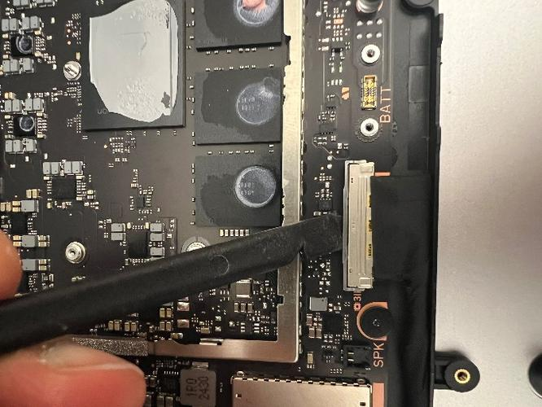

10. With a plastic ESD safe prybar, gently lift the top display cable
    upwards and use your fingers to remove the tape.

:::image type="content" source="./images/Surface_LT_13in/LT13in_Repair/media/image94.jpeg" alt-text="A close-up of a computer AI-generated content may be incorrect.":::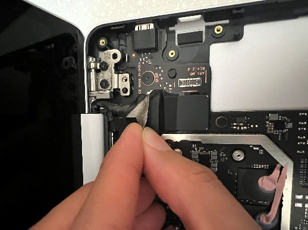

11. Use isopropyl alcohol (70% IPA) and cleaning swabs to clean any
    adhesive remaining from the removed tape.

12. With a plastic ESD safe prybar, disengage the top display connector
    buckle on the PCBA and gently disconnect the cable with your
    fingers.

:::image type="content" source="./images/Surface_LT_13in/LT13in_Repair/media/image96.jpeg" alt-text="A close-up of a computer motherboard AI-generated content may be incorrect.":::

13. Adjust the display cover to about 90 degrees and use a 5IP Torx Plus
    Screwdriver to remove the 4 5IP screws on the 2 hinges. **Be sure to
    press down firmly with the screwdriver to avoid any chance for screw
    stripping. Additionally, please keep track and count the number of
    screws removed to ensure there are no extra screws in the area.**

:::image type="content" source="./images/Surface_LT_13in/LT13in_Repair/media/image97.jpeg" alt-text="A close-up of a machine AI-generated content may be incorrect.":::

14. Using both hands, gently wiggle and remove the AB Cover display from
    the D Bucket.

**Procedure – Installation (AB Cover)**

1.  Gently line up the AB Cover to the D Bucket and ensure the pins on
    the D Bucket are aligned to the holes on the hinges.

:::image type="content" source="./images/Surface_LT_13in/LT13in_Repair/media/image98.png" alt-text="A close up of a device AI-generated content may be incorrect.":::
:::image type="content" source="./images/Surface_LT_13in/LT13in_Repair/media/image99.png" alt-text="A close up of a device AI-generated content may be incorrect.":::

2.  Use a 5IP Torx Plus Screwdriver to lightly install 1 screw per
    hinge. Be sure to hold the AB Cover display with one hand so the
    device does not fall over. **Be sure to press down firmly with the
    screwdriver to avoid any chance for screw stripping. Additionally,
    please keep track and count the number of screws removed to ensure
    there are no extra screws in the area.**

:::image type="content" source="./images/Surface_LT_13in/LT13in_Repair/media/image97.jpeg" alt-text="A close-up of a machine AI-generated content may be incorrect.":::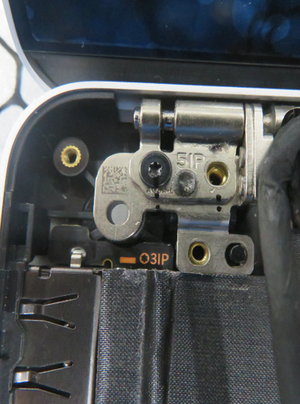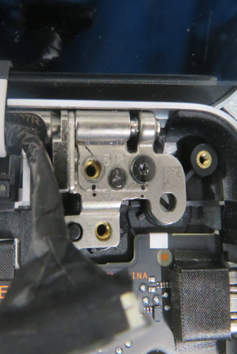

3.  Close the AB Cover display but be careful not to clamp down on any
    wires. Adjust the positioning of the AB Cover display while the
    screws are still not fully seated to ensure the AB Cover display
    step to the D Bucket is within 0.25mm and 0.3mm on both sides
    (feeler gauge) and the AB Cover display gap to the D Bucket is
    within 0.05mm and 0.25mm on both sides before moving on to the next
    step.

4.  Open the AB Cover display \<90 degrees to ensure the device does not
    fall over. Use a 5IP Torx Plus screwdriver to install the remaining
    screw on each hinge. Tighten all 4 hinge screws until they are snug
    and seated and then only tighten the screws an additional ~1/4 turn
    (~90 degrees) to avoid stripping the threads. **Be sure to press
    down firmly with the screwdriver to avoid any chance for screw
    stripping. Additionally, please keep track and count the number of
    screws removed to ensure there are no extra screws in the area.**

5.  Follow “Procedure – Installation (USB-A and Audio Jack)” Steps 1-8

6.  Route the two antenna cables but ensure the AB Cover Display cable
    is to the left of the two antenna cables and not on top them.

:::image type="content" source="./images/Surface_LT_13in/LT13in_Repair/media/image70.png" alt-text="A finger touching a metal object AI-generated content may be incorrect.":::

7.  Reconnect the two antenna cables from the AB Cover display to the
    connectors on the PCBA. Be sure to use a plastic spudger to ensure
    they are fully seated and connected.

:::image type="content" source="./images/Surface_LT_13in/LT13in_Repair/media/image71.png" alt-text="A close up of a circuit board AI-generated content may be incorrect.":::

8.  Install the tape to secure the antenna cable routing and be sure to
    firmly press it down for 30 seconds.

:::image type="content" source="./images/Surface_LT_13in/LT13in_Repair/media/image72.jpeg" alt-text="A finger on a device AI-generated content may be incorrect.":::

9.  Gently install the top AB Cover Display cable to the connector on
    the PCBA and use a plastic spudger to ensure the buckle is closed.

:::image type="content" source="./images/Surface_LT_13in/LT13in_Repair/media/image106.png" alt-text="A close up of a computer chip AI-generated content may be incorrect.":::

10. Use plastic tweezers to align the display connector tape to the edge
    of the thermal moulde shield and plastic hinge on the D Bucket.

11. Use a plastic spudger to firmly secure the display connector tape
    into the gap and crease like below.

12. Firmly press the display connector tape down for 30 seconds at the
    location below.

:::image type="content" source="./images/Surface_LT_13in/LT13in_Repair/media/image109.png" alt-text="A finger pointing at a black piece of electronic equipment AI-generated content may be incorrect.":::

13. Use a plastic spudger to firmly secure the display connector tape
    into the gap and crease with the thermal module shield.

:::image type="content" source="./images/Surface_LT_13in/LT13in_Repair/media/image110.png" alt-text="A close up of a black device AI-generated content may be incorrect.":::

14. Use a plastic spudger to firmly secure the display connector tape
    into the gap and crease with the USB-C connector on the PCBA.

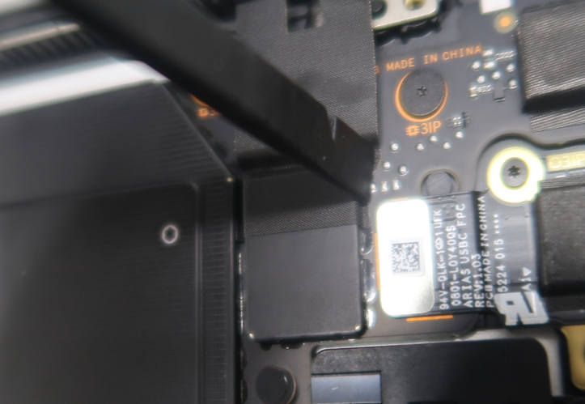

15. Firmly press the display connector tape down for 30 seconds at the
    location below.

:::image type="content" source="./images/Surface_LT_13in/LT13in_Repair/media/image112.png" alt-text="A finger on a black device AI-generated content may be incorrect.":::

16. Use a plastic spudger to firmly secure the display connector tape
    into the gap and crease with the AB Cover Display hinge.

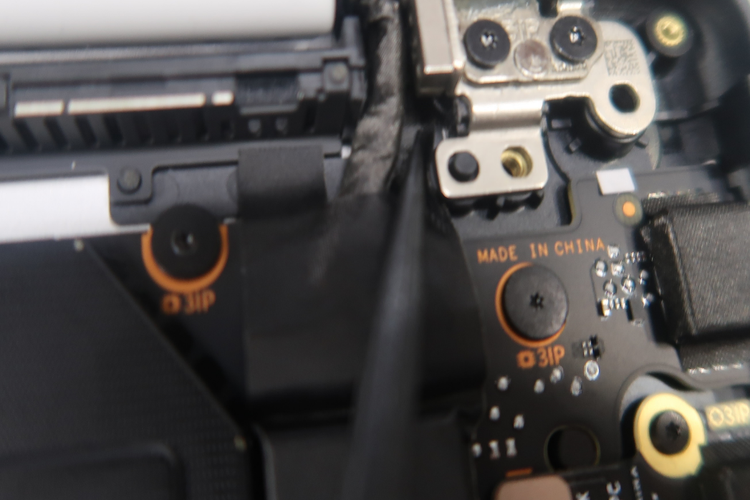

17. Follow “Procedure – Installation (USB-C)” Steps 4-7

18. Use plastic tweezers to install the display connector foam aligned
    with the USB-C bracket like below.

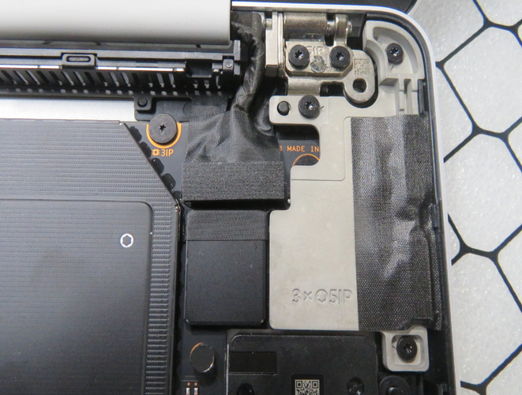

19. Gently route the left display cable through the ridges on the D
    Bucket and connect it with the bottom receptacle on the PCBA. Be
    sure that it is routed properly (like below) to avoid potential
    damage.

:::image type="content" source="./images/Surface_LT_13in/LT13in_Repair/media/image55.png" alt-text="A close up of a computer AI-generated content may be incorrect.":::
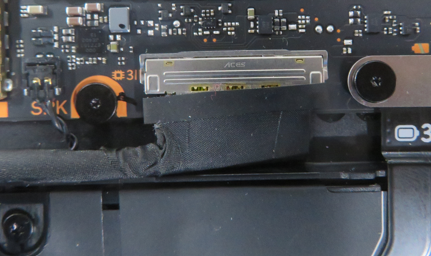

20. Use a plastic spudger to ensure the buckle on the display connector
    is closed.

:::image type="content" source="./images/Surface_LT_13in/LT13in_Repair/media/image116.jpeg" alt-text="A black device with a black tool AI-generated content may be incorrect.":::

21. Follow “Procedure – Installation (SSD)”

22. Follow “Procedure – Installation (C Cover)”

23. Follow “Procedure – Installation (Feet)”

**  
**

## PCBA Replacement

**Preliminary Requirements**

**Important:** Be sure to follow all special (bolded) notes of caution
within each process section.

**Required Tools**

- Plastic Opening Pick

- Soft ESD-Safe Mat

**Primary Components**

- 1 PCBA Subassembly

- 8 3IP Screws (for PCBA)

- 3 3IP Screws (for Battery)

- 1 Top Display Connector Tape

- 1 Top Display Cable Tape

- 1 Top Display Connector Foam

- 5 5IP Screws (for AB Cover Hinges)

- 3 5IP Screws (for USB-A and Audio Jack
  Bracket)

- 2 5IP Screws (for USB-A and Audio Jack Bracket to
  Hinge)

- 1 USB-A and Audio Jack Foil

- 1 USB-A and Audio Jack Gasket

- 2 5IP Screws (for USB-C Daughterboard)

- 3 5IP Screws (for USB-C Bracket)

- 1 USB-C Tape

- 1 Fan/Thermal Module Tape

- 5 5IP Screws (for C Cover)

- 1 Bottom Thermal Pad (for D Bucket)

- 2 5IP Screws (for SSD)

- 1 Top Thermal Pad (for C Cover)

- 1 Tape (for SSD)

**Procedure – Removal (PCBA)**

1.  Follow “Procedure – Removal (Thermal Module)”

2.  Use isopropyl alcohol (70% IPA) and cleaning swabs and a plastic ESD
    safe prybar to clean any adhesive remaining on the thermal module.

3.  Use a 3IP Torx Plus Screwdriver to remove the 2 screws holding down
    the battery connector. Be very careful as you are near the battery.
    **Be sure to press down firmly with the screwdriver to avoid any
    chance for screw stripping. Additionally, please keep track and
    count the number of screws removed to ensure there are no extra
    screws in the area.**

:::image type="content" source="./images/Surface_LT_13in/LT13in_Repair/media/image37.jpeg" alt-text="A close up of a computer AI-generated content may be incorrect.":::

4.  With a Plastic ESD Safe Prybar, gently disconnect the battery
    connector from the PCBA.

:::image type="content" source="./images/Surface_LT_13in/LT13in_Repair/media/image117.jpeg" alt-text="A close up of a device AI-generated content may be incorrect.":::

5.  With plastic ESD safe tweezers, carefully remove the conductive tape
    on top of the USB-C connectors.

:::image type="content" source="./images/Surface_LT_13in/LT13in_Repair/media/image56.jpeg" alt-text="A hand holding a tweezers to a cell phone AI-generated content may be incorrect.":::

6.  Use isopropyl alcohol (70% IPA) and cleaning swabs to clean any
    adhesive remaining on the bracket.

7.  With a 5IP Torx Plus Screwdriver, remove the 3 5IP screws holding
    down the USB-C bracket and remove the bracket. **Be sure to press
    down firmly with the screwdriver to avoid any chance for screw
    stripping. Additionally, please keep track and count the number of
    screws removed to ensure there are no extra screws in the area.**

:::image type="content" source="./images/Surface_LT_13in/LT13in_Repair/media/image57.jpeg" alt-text="A hand holding a screwdriver AI-generated content may be incorrect.":::

8.  With a plastic ESD safe prybar, disconnect the USB-C FPC from the
    PCBA.

:::image type="content" source="./images/Surface_LT_13in/LT13in_Repair/media/image58.jpeg" alt-text="A hand holding a screwdriver AI-generated content may be incorrect.":::

9.  With your fingers and plastic ESD safe tweezers, gently disconnect
    the right speaker connector from the PCBA and remove the right
    speaker.

:::image type="content" source="./images/Surface_LT_13in/LT13in_Repair/media/image119.jpeg" alt-text="The inside of a computer AI-generated content may be incorrect.":::

10. With your fingers and plastic ESD safe tweezers, gently disconnect
    the left speaker connector from the PCBA.

:::image type="content" source="./images/Surface_LT_13in/LT13in_Repair/media/image49.jpeg" alt-text="A close up of a computer AI-generated content may be incorrect.":::

11. With a plastic ESD safe prybar, disengage the bottom display
    connector buckle on the PCBA and gently disconnect the cable with
    your fingers.

:::image type="content" source="./images/Surface_LT_13in/LT13in_Repair/media/image93.jpeg" alt-text="A hand holding a black pen AI-generated content may be incorrect.":::

12. With a plastic ESD safe prybar, gently lift the top display cable
    upwards and use your fingers to remove the tape.

:::image type="content" source="./images/Surface_LT_13in/LT13in_Repair/media/image94.jpeg" alt-text="A close-up of a computer AI-generated content may be incorrect.":::

13. With a plastic ESD safe prybar, disengage the top display connector
    buckle on the PCBA and gently disconnect the cable with your
    fingers.

:::image type="content" source="./images/Surface_LT_13in/LT13in_Repair/media/image96.jpeg" alt-text="A close-up of a computer motherboard AI-generated content may be incorrect.":::

14. Use isopropyl alcohol (70% IPA) and cleaning swabs and a plastic ESD
    safe prybar to clean any adhesive remaining on the top display
    cable.

15. With a plastic ESD safe prybar, disengage the USB-A and Audio Jack
    buckle on the PCBA and disconnect the FPC.

:::image type="content" source="./images/Surface_LT_13in/LT13in_Repair/media/image120.jpeg" alt-text="A hand holding a black pen AI-generated content may be incorrect.":::

16. Using a 3IP Torx Plus Screwdriver, remove the 7 3IP screws on the
    PCBA holding it to the D Bucket. **Be sure to press down firmly with
    the screwdriver to avoid any chance for screw stripping.
    Additionally, please keep track and count the number of screws
    removed to ensure there are no extra screws in the area.**

:::image type="content" source="./images/Surface_LT_13in/LT13in_Repair/media/image121.jpeg" alt-text="A hand holding a screwdriver AI-generated content may be incorrect.":::

17. Using your fingers, gently lift up the PCBA from the left side to
    remove it from the D Bucket.

:::image type="content" source="./images/Surface_LT_13in/LT13in_Repair/media/image122.jpeg" alt-text="A hand holding a circuit board AI-generated content may be incorrect.":::

**Procedure – Installation (PCBA)**

1.  Gently place the PCBA into the D Bucket, being careful not to
    scratch it against the reused connectors.

2.  Use a 3IP Torx Plus screwdriver to lightly tighten the 7 screws.
    **Be sure to press down firmly with the screwdriver to avoid any
    chance for screw stripping. Additionally, please keep track and
    count the number of screws removed to ensure there are no extra
    screws in the area.**

:::image type="content" source="./images/Surface_LT_13in/LT13in_Repair/media/image121.jpeg" alt-text="A hand holding a screwdriver AI-generated content may be incorrect.":::

9.  Use a feeler gauge to ensure the gap between the SSD receptable on
    the PCBA and the grounding foam on the D bucket is between 0.3mm and
    1.2mm. If it is not, loosen the 7 screws to shift the PCBA in
    whichever direction is necessary to ensure the gap is within those
    limits before moving on to the next step.

10. Tighten the screws until they are snug and seated and then only
    tighten the screws an additional ~1/8 turn (~45 degrees) to avoid
    stripping the threads.

11. Remove the tape underneath the top display cable. Use isopropyl
    alcohol (70% IPA) and cleaning swabs to clean any adhesive remaining
    on the top display cable.

<!-- -->

8.  Apply the new tape underneath the top display cable and firmly press
    the tape down for 30
    seconds.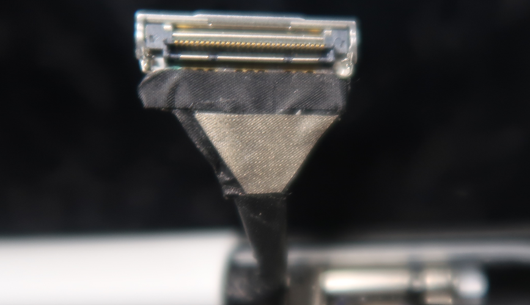

<!-- -->

24. Follow “Procedure – Installation (Thermal Module)”

25. Follow “Procedure – Installation (AB Cover)”

26. Follow “Procedure – Installation (USB-C)”

27. Reconnect all original FPCs and connectors to the PCBA. However,
    replacement is necessary if there is any visible damage.

28. Follow “Procedure – Installation (SSD)”

29. Follow “Procedure – Installation (C Cover)”

30. Follow “Procedure – Installation (Feet)”

**  
**

## D Bucket Replacement

**Preliminary Requirements**

**Important:** Be sure to follow all special (bolded) notes of caution
within each process section.

**Important:** This replacement part does not include the original
serial number of the device. For future Microsoft support, please
handwrite the original serial number on the label provided by Microsoft
and attach it to either the exterior of the device or directly onto an
exposed part. The label included in the part’s packaging has space
designated for the original serial number as well as the part's product
identifier.

**Required Tools**

- Plastic Opening Pick

- Soft ESD-Safe Mat

**Primary Components**

- Feet (Refer to the Illustrated Service Parts
  List)

**Procedure – Removal (D Bucket)**

1.  Follow “Procedure – Removal (PCBA)”

2.  With your fingers, gently peel and remove the USB-A and Audio Jack
    FPC from the D Bucket.

:::image type="content" source="./images/Surface_LT_13in/LT13in_Repair/media/image124.jpeg" alt-text="A hand holding a metal strip AI-generated content may be incorrect.":::

3.  Gently peel and remove the aluminum foil and foams on top of the
    USB-A and Audio Jack FPC.

4.  Use isopropyl alcohol (70% IPA) and cleaning swabs to clean any
    adhesive remaining on the USB-A and Audio Jack FPC.

**Procedure – Installation (D Bucket)**

1.  Follow “Procedure – Installation (PCBA)” Steps 1-4

2.  Follow “Procedure – Installation (USB-A and Audio Jack)” Steps 1 and
    2

3.  Reusing the USB-A and Audio Jack FPC, align and apply the new
    aluminum foil and foams like below.

:::image type="content" source="./images/Surface_LT_13in/LT13in_Repair/media/image125.png" alt-text="A metal strip on a mesh surface AI-generated content may be incorrect.":::

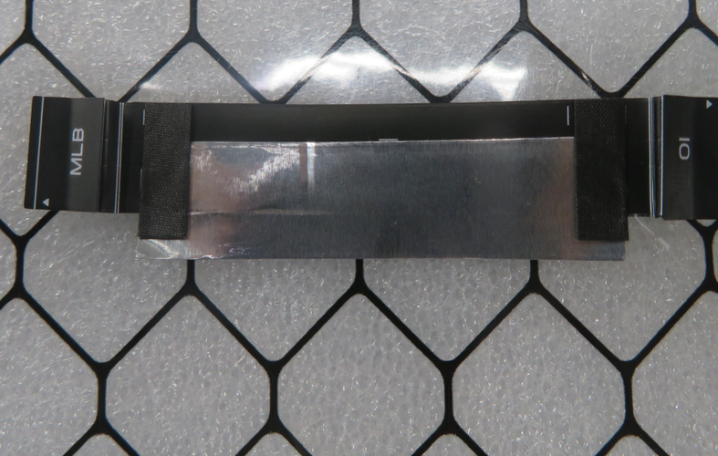

4.  Before pressing and installing the USB-A and Audio Jack FPC
    subassembly onto the D Bucket, connect the ends of the FPC to the
    USB-A and Audio Jack daughterboard connector and PCBA connector.

5.  Use a plastic spudger to press the buckle on both connectors closed.

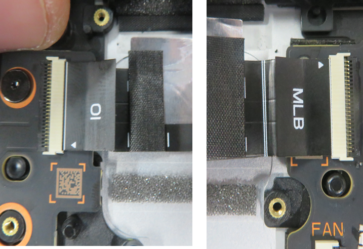

6.  Install the USB-A and Audio Jack FPC subassembly to the D Bucket and
    be sure to firmly press the foil down for 30 seconds each.

:::image type="content" source="./images/Surface_LT_13in/LT13in_Repair/media/image128.png" alt-text="A close up of a metal object AI-generated content may be incorrect.":::

7.  Use a plastic tweezer to remove the liner on the SSD thermal pad.

:::image type="content" source="./images/Surface_LT_13in/LT13in_Repair/media/image129.png" alt-text="A close-up of a device AI-generated content may be incorrect.":::

8.  Follow the remaining steps on “Procedure – Installation (USB-A and
    Audio Jack)”

9.  Follow the remaining steps on “Procedure – Installation (PCBA)”

10. Follow “Procedure – Installation (USB-C)”

11. Follow “Procedure – Installation (AB Cover)”

12. Follow “Procedure – Installation (Thermal Module)”

13. Follow “Procedure – Installation (Fan)”

14. Follow “Procedure – Installation (Speaker)”

15. Follow “Procedure – Installation (Battery)”

16. Follow “Procedure – Installation (SSD)”

17. Follow “Procedure – Installation (C Cover)”

18. Follow “Procedure – Installation (Feet)”

# Environmental Compliance Requirements

All waste electrical and electronic equipment (WEEE), waste electronic
components, waste batteries, and electronic waste residuals must be
managed according to applicable laws and regulations. and H09117,
“Conformance Standards for Environmentally Sound Management of Waste
Electrical and Electronic Equipment (WEEE)” which is available at this
link: <https://www.microsoft.com/en-pk/download/details.aspx?id=11691> .
In case of questions, please contact <AskECT@microsoft.com> .

19. **do not use a metal tool and only use the specified plastic tool.**

20. **Be sure to press down firmly with the screwdriver to avoid any
    chance for screw stripping. Additionally, please keep track and
    count the number of screws removed to ensure there are no extra
    screws in the area.**

21. **After the screws are snug and seated, only tighten the screws an
    additional ~1/8 turn (~45 degrees) to avoid stripping the threads.**

22. **Follow “Procedure – Installation (SSD)”**

