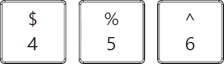
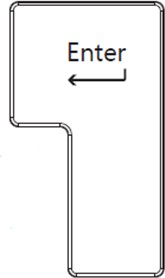
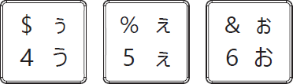
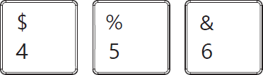
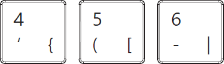
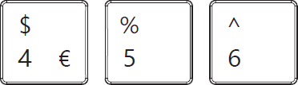

# Surface Laptop 13-in Device Information and Service Parts

## Device Identity Information

- Microsoft Surface Laptop 13”

The model and serial number for Surface Laptops is on the bottom center
closest to the display hinge point.

:::image type="content" source="./images/Surface_LT_13in/LT13in_ID/media/image1.png" alt-text="A white rectangular object with a blue label Description automatically generated":::

:::image type="content" source="./images/Surface_LT_13in/LT13in_ID/media/image2.png" alt-text="A computer parts and symbols AI-generated content may be incorrect.":::

> [!IMPORTANT]
> Device Serial Number Notation. The serial number for this device is located on its original bottom cover. It is crucial to retain the device’s original serial number for future support from Microsoft. The D Bucket FRU will remove the device’s original serial number and the original device serial number cannot be permanently added to a replacement part. To ensure the original serial number is retained, record it using waterproof ink on a label. Affix the label to an easily accessible area on the device exterior and keep a record of the serial number in a secure location. Microsoft has provided a label for this purpose within the replacement part’s packaging. The label included in the part’s packaging has space designated for the original serial number as well as the part's product identifier.

## Genuine Microsoft Replacement Parts

- Genuine Microsoft replacement parts can be obtained directly from
  Microsoft on
  [Microsoft.com](https://www.microsoft.com/store/b/surface-repair-parts).

- Genuine Microsoft replacement parts are also available on the partner
  sites below:

  - [iFixit](https://www.ifixit.com/collaborations/microsoft)

## Illustrated Service Parts List

**IMPORTANT:** Repair workflows may require multiple parts to be ordered
to complete the repair successfully. Please check the primary and
additional components section in each repair workflow to ensure you have
all required parts before beginning your repair.

| **Item** | **Component** | **SKU Part No.** |
|:--:|----|:--:|
| **1** | **Independent Trackpad** |  |
|  | **Platinum** | **EP2-35066** |
|  | **Ocean** | **EP2-35065** |
|  | **Violet** | **EP2-35068** |
| **2** | **C Cover Keyset** |  |
|  | **Platinum (AMER/ASIA)** | **EP2-34199** |
|  | **Platinum (CANADA)** | **EP2-34200** |
|  | **Platinum (JAPAN)** | **EP2-34216** |
|  | **Platinum (FRANCE)** | **EP2-34202** |
|  | **Platinum (GERMANY)** | **EP2-34203** |
|  | **Platinum (SWITZ)** | **EP2-34214** |
|  | **Platinum (UK)** | **EP2-34201** |
|  | **Ocean (AMER/ASIA)** | **EP2-34217** |
|  | **Ocean (CANADA)** | **EP2-34218** |
|  | **Ocean (JAPAN)** | **EP2-34234** |
|  | **Ocean (FRANCE)** | **EP2-34220** |
|  | **Ocean (GERMANY)** | **EP2-34221** |
|  | **Ocean (SWITZ)** | **EP2-34232** |
|  | **Ocean (UK)** | **EP2-34219** |
|  | **Violet (AMER/ASIA)** | **EP2-34235** |
|  | **Violet (CANADA)** | **EP2-34236** |
|  | **Violet (JAPAN)** | **EP2-34252** |
|  | **Violet (FRANCE)** | **EP2-34238** |
|  | **Violet (GERMANY)** | **EP2-34239** |
|  | **Violet (SWITZ)** | **EP2-34250** |
|  | **Violet (UK)** | **EP2-34237** |
| **3** | **Feet** |  |
|  | **Platinum** | **EP2-34351** |
|  | **Ocean** | **EP2-34350** |
|  | **Violet** | **EP2-34352** |
| **4** | **PCBA** |  |
|  | **16** | **EP2-35079** |
|  | **24** | **EP2-35080** |
| **5** | **Fan** | **EP2-35070** |
| **6** | **Speakers** | **EP2-35071** |
| **7** | **Battery** | **EP2-34197** |
| **8** | **Thermal Module** | **EP2-35064** |
| **9** | **USB-A and Audio Jack** | **EP2-34198** |
| **10** | **USB-C Port** | **EP2-35072** |
| **11** | **D Bucket** |  |
|  | **Platinum** | **EP2-34348** |
|  | **Ocean** | **EP2-34347** |
|  | **Violet** | **EP2-34349** |
| **12** | **AB Cover** |  |
|  | **Platinum** | **EP2-34344** |
|  | **Ocean** | **EP2-34343** |
|  | **Violet** | **EP2-34346** |
| **13** | **SSD** |  |

| **Description**              | **Enter Key**                                                                 | **“4,5,6” Keys**                                                                 |
|-------------------------------|------------------------------------------------------------------------------|----------------------------------------------------------------------------------|
| 104 English, US              |                             |                                |
| 105 Canadian, Bilingual      |                             |                               |
| 109 Japan                    |                            |                                |
| 105 Austria/Germany          |                             |                                |
| 105 French                   |                             |                               |
| 105 English, UK Ireland      |                             |                               |
| 105 Switzerland, Luxembourg  |                             |                               |
