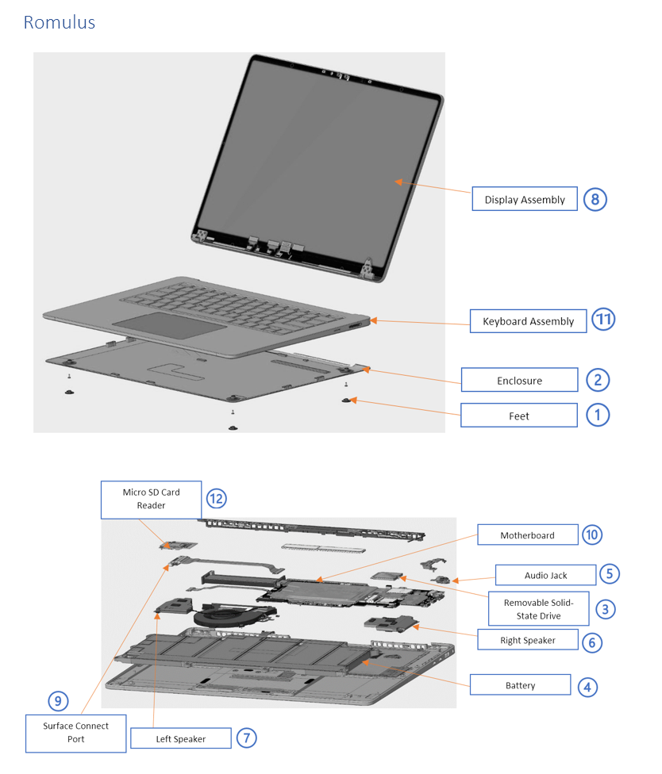
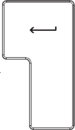
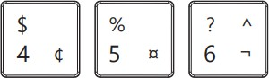
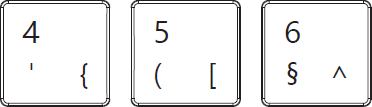
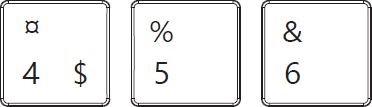
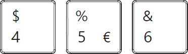
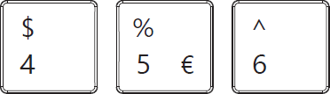
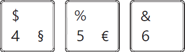

## Surface Laptop 7th Edition

### Device Identity Information

- Surface Laptop 7th Edition

Support Link –
[Link](https://support.microsoft.com/en-us/hub/4295675/surface-laptop-help)

The model and serial number for Surface Laptops is on the bottom center
closest to the display hinge point.

### Illustrated Service Parts List

**IMPORTANT:** Repair workflows may require multiple parts to be ordered
to complete the repair successfully. Please check the primary and
additional components section in each repair workflow to ensure you have
all required parts before beginning your repair.

| **Item** | **Component** | **SKU Part No.** |
|:--:|----|----|
| **1** | **Feet** |  |
|  | Platinum | E0A-00001 |
|  | Graphite | E0A-00002 |
|  | Dune | E0A-00003 |
|  | Sapphire | E0A-00004 |
| **2** | **Enclosure** |  |
|  | Platinum – 13” | C0X-00001 |
|  | Platinum – 15” | C0Y-00001 |
|  | Graphite – 13” | C0X-00002 |
|  | Graphite – 15” | C0Y-00002 |
|  | Dune – 13” | C0X-00003 |
|  | Sapphire – 13” | C0X-00004 |
| **3** | **Removable Solid-State Drive** |  |
|  | 256GB | E0S-00001 |
|  | 512GB | E0T-00001 |
|  | 1TB | E0U-00001 |
| **4** | **Battery** |  |
|  | Battery – 13” | C0A-00001 |
|  | Battery – 15” | C0B-00001 |
| **5** | **Audio Jack** |  |
|  | Audio Jack | E0G-00001 |
| **6** | **Right Speaker** |  |
|  | Right Speaker – 13” | E0D-00002 |
|  | Right Speaker – 15” | EOL-00002 |
| **7** | **Left Speaker** |  |
|  | Left Speaker – 13” | E0D-00001 |
|  | Left Speaker – 15” | E0L-00001 |
| **8** | **Display Assembly (Includes Camera)** |  |
|  | Platinum – 13” | D0K-00001 |
|  | Platinum – 15” | D0L-00001 |
|  | Graphite – 13” | D0K-00002 |
|  | Graphite – 15” | D0L-00002 |
|  | Dune – 13” | D0K-00003 |
|  | Sapphire – 13” | D0K-00004 |
| **9** | **Surface Connect Port** |  |
|  | Surface Connect Port - 13” | E0B-00001 |
|  | Surface Connect Port - 15” | E0I-00001 |
| **10** | **Motherboard (includes main processor and main memory, and thermal module)** |  |
|  | Plus 16GB – 13” Commercial | C0P-00001 |
|  | Plus 16GB – 13” | C0P-00002 |
|  | Elite 16GB – 13” Commercial | C0Q-00001 |
|  | Elite 16GB – 13” | C0Q-00002 |
|  | Elite 16GB – 15” Commercial | C0T-00001 |
|  | Elite 16GB – 15” | C0T-00002 |
|  | Elite 32GB – 13” Commercial | C0R-00001 |
|  | Elite 32GB – 13” | C0R-00002 |
|  | Elite 32GB – 15” Commercial | C0U-00001 |
|  | Elite 32GB – 15” | C0U-00002 |
|  | Elite 64GB – 13” | EP2-07971 |
|  | Elite 64GB – 15” | EP2-07972 |
| **11** | **Keyboard Assembly (includes Trackpad)** |  |
|  | Platinum – Arabic – 13” | D0P-00008 |
|  | Platinum – Arabic – 15” | D0Q-00008 |
|  | Graphite – Arabic – 13” | D0P-00026 |
|  | Graphite – Arabic – 15” | D0Q-00026 |
|  | Dune – Arabic – 13” | EP2-00813 |
|  | Sapphire – Arabic – 13” | EP2-00814 |
|  | Platinum – Belgium– 13” | D0P-00014 |
|  | Platinum – Belgium – 15” | D0Q-00014 |
|  | Graphite – Belgium – 13” | D0P-00032 |
|  | Graphite – Belgium – 15” | D0Q-00032 |
|  | Dune –Belgium – 13” | D0P-00047 |
|  | Sapphire – Belgium– 13” | D0P-00058 |
|  | Platinum – Chinese Traditional (Taiwan) – 13” | D0P-00007 |
|  | Platinum – Chinese Traditional (Taiwan) – 15” | D0Q-00007 |
|  | Graphite – Chinese Traditional (Taiwan) – 13” | D0P-00025 |
|  | Graphite – Chinese Traditional (Taiwan) – 15” | D0Q-00025 |
|  | Platinum – Canada EN/FR – 13” | D0P-00002 |
|  | Platinum – Canada EN/FR – 15” | D0Q-00002 |
|  | Graphite – Canada EN/FR – 13” | D0P-00020 |
|  | Graphite – Canada EN/FR – 15” | D0Q-00020 |
|  | Platinum – English International – 13” | D0P-00010 |
|  | Platinum – English International – 15” | D0Q-00010 |
|  | Graphite – English International – 13” | D0P-00028 |
|  | Graphite – English International – 15” | D0Q-00028 |
|  | Dune – English International – 13” | D0P-00043 |
|  | Sapphire – English International – 15” | D0P-00054 |
|  | Platinum – English UK – 13” | D0P-00009 |
|  | Platinum – English UK – 15” | D0Q-00009 |
|  | Graphite – English UK – 13” | D0P-00053 |
|  | Graphite – English UK – 15” | D0Q-00028 |
|  | Dune – English UK – 13” | D0P-00042 |
|  | Sapphire – English UK – 13” | D0P-00053 |
|  | Platinum- English – 13” | D0P-00001 |
|  | Platinum – English – 15” | D0Q-00001 |
|  | Graphite – English – 13” | D0P-00019 |
|  | Graphite – English – 15” | D0Q-00019 |
|  | Dune – English – 13” | D0P-00037 |
|  | Sapphire – English – 13” | D0P-00048 |
|  | Platinum – French – 13” | D0P-00012 |
|  | Platinum – French – 15” | D0Q-00012 |
|  | Graphite – French – 13” | D0P-00030 |
|  | Graphite – French – 15” | D0Q-00030 |
|  | Dune – French – 13” | D0P-00045 |
|  | Sapphire – French – 13” | D0P-00056 |
|  | Platinum – German – 13” | D0P-00011 |
|  | Platinum – German – 15” | D0Q-00011 |
|  | Graphite – German – 13” | D0P-00029 |
|  | Graphite – German – 15” | D0Q-00029 |
|  | Dune – German – 13” | D0P-00044 |
|  | Sapphire – German – 13” | D0P-00055 |
|  | Platinum – Italian – 13” | D0P-00015 |
|  | Platinum – Italian – 15” | D0Q-00015 |
|  | Graphite – Italian – 13” | D0P-00033 |
|  | Graphite – Italian – 15” | D0Q-00033 |
|  | Platinum – Japanese – 13” | D0P-00004 |
|  | Platinum – Japanese – 15” | D0Q-00004 |
|  | Graphite – Japanese – 13” | D0P-00022 |
|  | Graphite – Japanese – 15” | D0Q-00022 |
|  | Dune – Japanese – 13” | D0P-00039 |
|  | Sapphire – Japanese – 13” | D0P-00050 |
|  | Platinum – Korean – 13” | D0P-00005 |
|  | Platinum – Korean – 15” | D0Q-00005 |
|  | Graphite – Korean – 13” | D0P-00023 |
|  | Graphite – Korean – 15” | D0Q-00023 |
|  | Dune – Korean – 13” | D0P-00040 |
|  | Sapphire – Korean – 13” | D0P-00051 |
|  | Platinum – Nordic – 13” | D0P-00016 |
|  | Platinum – Nordic – 15” | D0Q-00018 |
|  | Graphite – Nordic – 13” | D0P-00036 |
|  | Graphite – Nordic – 15” | D0Q-00036 |
|  | Platinum – Portuguese – 13” | D0P-00016 |
|  | Platinum – Portuguese – 15” | D0Q-00016 |
|  | Graphite – Portuguese – 13” | D0P-00034 |
|  | Graphite – Portuguese – 15” | D0Q-00016 |
|  | Platinum – Spanish (Mexico) – 13” | D0P-00003 |
|  | Platinum – Spanish (Mexico) – 15” | D0Q-00003 |
|  | Graphite – Spanish (Mexico) – 13” | D0P-00021 |
|  | Graphite – Spanish (Mexico) -15” | D0Q-00021 |
|  | Platinum – Spanish (Spain) – 13” | D0P-00017 |
|  | Platinum – Spanish (Spain) – 15” | D0Q-00017 |
|  | Graphite – Spanish (Spain) – 13” | D0P-00035 |
|  | Graphite – Spanish (Spain) – 15” | D0Q-00035 |
|  | Platinum – Swiss/Luxembourg – 13” | D0P-00013 |
|  | Platinum – Swiss/Luxembourg – 15” | D0Q-00013 |
|  | Graphite – Swiss/Luxembourg – 13” | D0P-00031 |
|  | Graphite – Swiss/Luxembourg – 15” | D0Q-00031 |
|  | Dune – Swiss/Luxembourg – 13” | D0P-00046 |
|  | Sapphire – Swiss/Luxembourg – 13” | D0P-00057 |
|  | Platinum – Thai – 13” | D0P-00006 |
|  | Platinum – Thai – 15” | D0Q-00006 |
|  | Graphite – Thai – 13” | D0P-00024 |
|  | Graphite – Thai – 15” | D0Q-00024 |
| **12** | **Micro SD Card Reader** |  |
|  | Micro SD Card Reader – 15” | E0J-00001 |

| **Description**                          | **Enter Key**                                                                 | **“4,5,6” Keys**                                                                 |
|------------------------------------------|-------------------------------------------------------------------------------|----------------------------------------------------------------------------------|
| 104 English, US                          |                                       |                                         |
| 105 Canadian, Bilingual                  |                                       |                                        |
| 109 Japan                                |                                      |                                         |
| 105 Austria/Germany                      |                                       |                                         |
| 105 Belgium AZERTY                       |                                       |                                         |
| 105 Nordic Denmark, Finland, Norway, Sweden |                                       |                                         |
| 105 French                               |                                       |                                         |
| 105 English, UK Ireland                  |                                       |                                         |
| 105 Italy                                |                                       |                                         |
| 105 Switzerland, Luxembourg              |                                       |                                         |
| 104 English, International Netherlands   |                                       |                                         |
| 105 Portuguese                           |                                       |                                         |
| 105 Spanish, European                    |                                       |                                         |

### Genuine Microsoft Replacement Parts

- Genuine Microsoft replacement parts can be obtained directly from
  Microsoft on
  [Microsoft.com](https://www.microsoft.com/en-us/store/b/surface-repair-parts).

- Genuine Microsoft replacement parts are also available on the partner
  sites below:

  - [iFixit](https://www.ifixit.com/collaborations/microsoft)