**Microsoft Surface Laptop 7th Edition Service Guide**

*Disclaimer of Warranties and Limitation of Damages*

All information, content, materials, and products made available in or
in conjunction with this Guide are provided by Microsoft on “as-is” and
“as available” basis, unless otherwise specified by Microsoft in
writing. Microsoft makes no representations or warranties of any kind,
express or implied, as to the information, content, materials, and
products included or otherwise made available to you or accompanying
this Guide unless specified in writing. You expressly agree that your
use of the information, content, materials, and product in or
accompanying this Guide is at your sole risk.

To the fullest extent permissible by law, Microsoft disclaims all
warranties, express or implied, including but not limited to implied
warranties of merchantability and fitness for a particular purpose. To
the fullest extent permissible by law, Microsoft shall not be liable for
damages of any kind arising from the use of information, content,
materials, or product made available in or in conjunction with this
Guide, including but not limited to direct, indirect, incidental,
consequential, and/or punitive damages unless otherwise specified in
writing.

*Notice*

Microsoft and its suppliers may have patents, patent applications,
trademarks, copyrights, trade secrets and/or other intellectual property
rights covering subject matter in this document. Microsoft’s furnishing
of this document to recipient does not grant or imply any license to any
patents, trademarks, copyrights, trade secrets or other intellectual
property rights, and recipient’s permitted use of any such intellectual
property rights, if any, is solely governed by the Agreements.

This document and the information it contains are subject to change
without notice. You can find the latest information on Surface device
servicing and repair at <https://aka.ms/surfaceservicing> . Always
consult the most up-to-date information available before performing
device service or repair.

©2024 Microsoft Corporation. All rights reserved.

Document Part Number: M1318466

| **Rev** | **Date**   | **Changes Made** |
|:-------:|------------|------------------|
|    A    | 06/18/2024 | Initial Release  |

# Table of Contents

[Introduction [6](#introduction)](#introduction)

[Device Identity Information
[6](#device-identity-information)](#device-identity-information)

[General Information, Precautions, and Warnings
[7](#general-information-precautions-and-warnings)](#general-information-precautions-and-warnings)

[Tools [7](#tools)](#tools)

[General Safety Precautions
[9](#general-safety-precautions)](#general-safety-precautions)

[Electro-Static Discharge (ESD) Prevention
[10](#electro-static-discharge-esd-prevention)](#electro-static-discharge-esd-prevention)

[Repair-Specific Precautions and Warnings
[10](#repair-specific-precautions-and-warnings)](#repair-specific-precautions-and-warnings)

[Battery Safety [11](#battery-safety)](#battery-safety)

[Battery Warning Level
[12](#battery-warning-level)](#battery-warning-level)

[Lithium-Ion Battery Inspection
[12](#lithium-ion-battery-inspection)](#lithium-ion-battery-inspection)

[Handling Used, Damaged, or Defective Lithium-Ion Batteries
[13](#handling-used-damaged-or-defective-lithium-ion-batteries)](#handling-used-damaged-or-defective-lithium-ion-batteries)

[Actions to take in case of a Thermal Event
[13](#actions-to-take-in-case-of-a-thermal-event)](#actions-to-take-in-case-of-a-thermal-event)

[Report Battery Thermal Events to Microsoft
[13](#report-battery-thermal-events-to-microsoft)](#report-battery-thermal-events-to-microsoft)

[Illustrated Service Parts List
[15](#illustrated-service-parts-list)](#illustrated-service-parts-list)

[Software Tools – Diagnostic, Calibration, and Troubleshooting
[21](#software-tools-diagnostic-calibration-and-troubleshooting)](#software-tools-diagnostic-calibration-and-troubleshooting)

[Genuine Microsoft Replacement Parts
[21](#genuine-microsoft-replacement-parts)](#genuine-microsoft-replacement-parts)

[General Support [21](#general-support)](#general-support)

[Software Tools [21](#software-tools)](#software-tools)

[Calibration and Authentication
[21](#calibration-and-authentication)](#calibration-and-authentication)

[Hardware Troubleshooting Approach
[22](#hardware-troubleshooting-approach)](#hardware-troubleshooting-approach)

[Component Removal and Replacement Procedures
[22](#component-removal-and-replacement-procedures)](#component-removal-and-replacement-procedures)

[Prerequisite Steps [22](#prerequisite-steps)](#prerequisite-steps)

[Feet Replacement [23](#feet-replacement)](#feet-replacement)

[Enclosure Replacement
[24](#enclosure-replacement)](#enclosure-replacement)

[Removable Solid-State Drive Replacement
[26](#removable-solid-state-drive-replacement)](#removable-solid-state-drive-replacement)

[Battery Replacement [29](#battery-replacement)](#battery-replacement)

[Audio Jack Replacement
[33](#audio-jack-replacement)](#audio-jack-replacement)

[Right Speaker Replacement
[35](#right-speaker-replacement)](#right-speaker-replacement)

[Left Speaker Replacement
[39](#left-speaker-replacement)](#left-speaker-replacement)

[Micro SD Reader Replacement
[42](#micro-sd-reader-replacement)](#micro-sd-reader-replacement)

[Display Assembly Replacement
[44](#display-assembly-replacement)](#display-assembly-replacement)

[Surface Connect Replacement
[51](#surface-connect-replacement)](#surface-connect-replacement)

[Motherboard Replacement Process
[54](#motherboard-replacement-process)](#motherboard-replacement-process)

[Keyboard Replacement Process
[64](#keyboard-replacement-process)](#keyboard-replacement-process)

[Environmental Compliance Requirements
[68](#environmental-compliance-requirements)](#environmental-compliance-requirements)

# Introduction

This Service Guide provides instructions for repairing Microsoft Surface
devices using genuine Microsoft parts. It is intended for technically
inclined individuals with the knowledge, experience, and specialized
tools required to repair Microsoft devices.

**IMPORTANT:** Read this Guide in its entirety before starting any
repairs. If at any point you are unsure or uncomfortable about
performing the repairs, as detailed in this Guide, **DO NOT** proceed.
Contact Microsoft for additional support options.

**:** Failure to follow the
instructions in this Guide; use of non-Microsoft (non-genuine),
incompatible, or modified replacement parts; and/or failure to use
proper tools could result in serious personal injury, death, and/or
damage to the product or other property.

# Device Identity Information

- Surface Laptop 7th Edition

Support Link –
[Link](https://support.microsoft.com/en-us/hub/4295675/surface-laptop-help)

The model and serial number for Surface Laptops is on the bottom center
closest to the display hinge point.

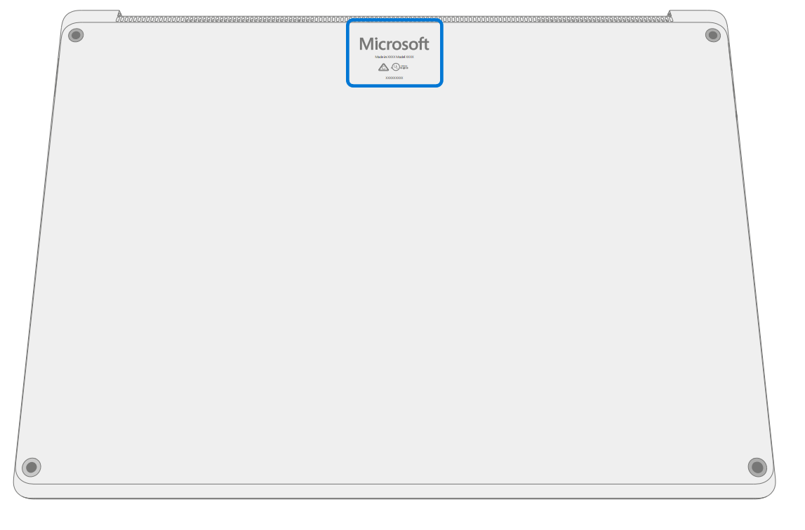

# General Information, Precautions, and Warnings

## Tools

This section documents the tools recommended or required by Microsoft to
successfully complete a repair on a Surface device. Microsoft Service
Tools (recommended and required) are sold by iFixit in partnership with
Microsoft. Items under Electronic Repair Hardware and Tools can be
commonly purchased from electronic repair retailers. Lastly, items under
standard tools and misc. items on this list can be commonly purchased
from consumer retailers.

**Recommended Microsoft Service Tools**

| [ESD-safe Surface Battery Cover - iFixit](https://www.ifixit.com/products/surface-battery-cover-m1214771-001) |  |
|----|----|

**Required Microsoft Service Tools**

**Required Electronic Repair Hardware or Tools**

| Anti-static Wrist Strap (1 MOhm resistance) |  |
|----|----|
| ESD-safe mat or benchtop |  |
| Nylon Spudger/Probing Tool |  |
| Plastic Opening Pick |  |
| Plastic Opening Tool |  |
| ESD-safe Tweezers |  |

**Required Standard Tools and Misc Items**

- 2IP Torx-Plus Driver

- 3IP Torx-Plus Driver

- 5IP Torx-Plus Driver

- 6IP Torx-Plus Driver

- USB 3.0 Thumb drive – 16 GB minimum storage

- Isopropyl alcohol dispenser bottle (use 70% IPA)

- Cleaning swabs

- Microfiber Cloth

- Lint free cleaning cloth

- 4 Gallon Bucket

- 2.0 Gallons Sand, Clean

- 65W Microsoft Surface Power Supply

- 0.1mm Thickness Gauge

- 0.15mm Thickness Gauge

## General Safety Precautions

 Always observe the following
general safety precautions:

- Opening and/or repairing any electronic device can present a risk of
  electric shock, fire, serious personal injury, death, damage to the
  device or other property, and/or other hazards. Exercise caution when
  undertaking the repair activities described in this Guide. The repair
  activities identified in this Guide should only be undertaken by
  technically inclined individuals with the knowledge, experience, and
  specialized tools required to repair Microsoft devices.

- Improper use or handling of devices or their batteries may result in
  fire or explosion. Only open the enclosure on a device as outlined in
  this Guide.

- Do not heat, puncture, mutilate, or dispose of devices or their
  batteries in fire. Do not leave or charge devices in direct sunlight
  or expose devices or their batteries to temperatures outside the
  recommended operating range of 0°C to 60°C/32°F to 140°F for an
  extended period. Doing so can result in battery failure, electric
  shock, fire, serious personal injury, death, and/or damage to the
  device or other property.

- We recommend wearing protective eyewear and gloves when
  disassembling/re-assembling a device.

- Clean your work surface regularly to remove debris and abrasive
  particles.

- While working on devices, avoid the use of clothing accessories such
  as bracelets, rings, or watches that can cause electrical shorts
  and/or damage the battery.

- As you remove each subassembly from the device, place the subassembly
  (and all accompanying screws) away from the work area to prevent
  damage to the device or to the subassembly.

- If battery damage (e.g., leaking, expansion, folds or other) is
  discovered during device repair or if the battery is impacted or
  damaged during replacement, **DO NOT** proceed. Refer to the [Actions
  to take in case of a Thermal
  Event](#actions-to-take-in-case-of-a-thermal-event) section or contact
  Microsoft directly for proper device disposition.

For additional product safety information relevant to Microsoft Surface
devices, see [aka.ms/surface-safety](http://aka.ms/surface-safety) or
the Surface app. To open the Surface app, select the Start button, enter
Surface into the search box, then select the Surface app.

## Electro-Static Discharge (ESD) Prevention

- Review and follow the general guidelines and ESD prevention steps in
  this Guide prior to beginning work.

- Ensure your work surface is level/flat and covered with ESD-safe,
  soft, non-marring material.

- Before opening a device, always wear an anti-static wrist strap and
  confirm your work area is properly grounded to protect vulnerable
  electronics from electrostatic discharge (ESD).

- Parts removed from a device during the repair process should be stored
  in ESD-safe bags and packaged for return or recycling in the same
  packaging that the new replacement part came in.

## Repair-Specific Precautions and Warnings

- For Autopilot managed Surface Products refer to the following
  guidelines posted
  [here](https://docs.microsoft.com/en-us/mem/autopilot/autopilot-mbr).

>  style="width:0.90694in;height:0.2in" />**:** Before opening a device,
> ensure it is powered off and disconnected from its power source.
> Disconnect the device charger or power cord from mains power.

- For devices with rechargeable lithium-ion batteries that power on,
  fully discharge the battery before beginning repair. To expedite the
  battery discharge process:

  - Disconnect the charger from the device.

  - Increase display brightness to the highest level.

  - Turn on wi-fi and Bluetooth.

  - Open the Camera app in Windows.

  - Play music or video files from a local drive or streaming service.

- Operate the device in this mode until the battery is fully discharged
  and the device powers off.

- Review the General Safety Precautions and Battery Safety Sections of
  this Guide before beginning work.

**:** For Surface devices where
the battery is affixed to the back cover, place the back cover with the
battery in a location where it will be protected from possible
punctures, impacts, crushing, or drops during the repair process. Refer
to the [Battery Safety](#battery-safety) section in this guide for more
information.

**:** During all activities
(excluding feet-only replacement) check to ensure that no loose articles
are on the back cover or remain inside the device before reassembling
it.

**IMPORTANT:** Remove the rSSD (removable Solid-State Drive) whenever
the Keyboard is removed from the device. rSSD removal disconnects the
battery from all device logical components for safety purposes. Refer to
Procedure-Removal (rSSD) section for details.

**IMPORTANT:** Whenever the rSSD has been removed, powering on the
device requires that the rSSD and Keyboard are installed.

**IMPORTANT:** The serial number for this device model is located on its
original cover. To keep track of the device’s serial number, please
record it using waterproof ink on a sticker or label and apply the
sticker or label to an easily accessible area on the device exterior.
For serial number location please see the [Device Identity
Information](#device-identity-information) section. The serial number
cannot be added permanently to a replacement part. Microsoft may have
provided a label for this use in the replacement part’s packaging

## Battery Safety

- This device contains a built-in, lithium-ion rechargeable battery.
  Battery safety is a significant concern when repairing a device.

- For optimum compatibility, performance, and product safety, we
  recommend using genuine Microsoft replacement parts available on
  [Microsoft.com](https://www.microsoft.com/en-us/store/b/surface-repair-parts)
  and other online part retailers such as iFixit. Use of non-Microsoft
  (non-genuine), incompatible, reused, or modified batteries; improper
  battery installation; improper handling or storage of batteries;
  and/or failure to follow the instructions in this Guide could cause
  battery overheating, expansion, venting, leaking, or a thermal event
  which could result in fire, serious personal injury, death, data loss,
  or damage to the device or other property damage.

- Before beginning device repair, ensure your workspace is free of
  flammable debris or materials, has adequate ventilation, and that you
  have a fire suppressant device (example: fire blanket, container of
  sand, Class B fire extinguisher) within easy reach or you are within
  20 feet of a fireproof enclosure. Fireproof enclosures should be kept
  free of combustible or flammable materials.

>  style="width:0.90694in;height:0.2in" />**:** It is recommended that an
> ESD-safe battery cover be placed across the device to protect the
> battery from any physical contact or accidental damage whenever the
> display is removed for internal repairs. Ensure corners of cover are
> always aligned with the corners of the device while battery is
> exposed. If the battery cover is misaligned during activities in any
> way, re-align before continuing work.

- Use personal protective equipment (PPE) when handling damaged,
  venting, or hot battery packs.

- Use the following best practices when handling batteries:

  - Always fully discharge batteries by running an application such as
    video playback with the device unplugged. If the device does not
    function while unplugged, you may leave out this step.

  - Do not puncture, impact, strike, bend, or crush the battery or a
    device containing a battery.

  - Keep your workspace clear of debris, extra tools, and sharp objects.

  - Exercise caution when using sharp tools near the battery to avoid
    impacting or poking the battery.

  - Do not leave loose screws or small parts inside the device.

  - Avoid using tools that conduct electricity.

  - Do not drop or throw a lithium-ion battery.

  - Do not expose the battery to excessive heat, sunlight, or
    temperatures outside the battery’s normal operating range (0°C to
    60°C) / (32°F to 140°F)

  - Ensure you handle, recycle, and/or dispose of used or damaged
    batteries in accordance with local laws and regulations. Follow
    Handling Used, Damaged or Defective Li-ion Batteries below.

- If the device repair cannot be completed immediately and the device
  needs to be stored temporarily before restarting the repair

  - Select a storage location and process that follows the battery
    safety precautions in this Guide.

  - Avoid exposing the device to environmental conditions and objects
    that could damage the battery pack.

  - Reinspect the battery pack as outlined in this Guide prior to
    restarting repair and installing the new battery pack.

## Battery Warning Level

**:** Please note that the
battery bears the following warning label. Please heed the information
provided on the label.

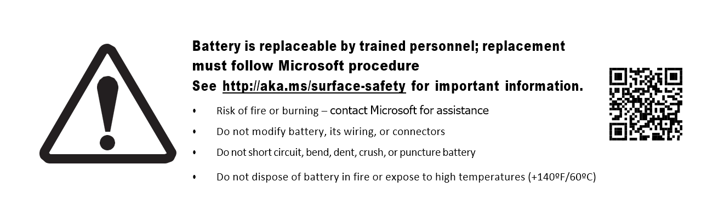

## Lithium-Ion Battery Inspection

Upon device opening, we recommend that you visually inspect the battery
for signs of damage. Factors to consider when inspecting the battery
include, but are not limited to:

- Evidence of leaking or venting

- Visible signs of physical or mechanical damage, such as:

  - Expansion or swelling. In expanded or swollen batteries, the soft
    pouch encasing the cell pulls away from the inner material and
    appears baggy, loose, or puffy.

  - Discoloration of the battery casing.

  - Odor, smell, or visible corrosion. Leaked battery electrolyte smells
    like nail polish remover (acetone).

  - Dents along the battery cell edges or on the top surface.

  - Surface scratches that have exposed the aluminum beneath the black
    coating layer on the battery.

  - Loose or damaged wires.

  - Known misuse or abuse.

Any battery exhibiting the signs listed above must be replaced. Consult
the [Battery Replacement Process](#_bookmark49) section of this document
for battery replacement instructions.

## Handling Used, Damaged, or Defective Lithium-Ion Batteries

- **DO NOT** dispose of used lithium-ion batteries, whether damaged or
  not, in household or commercial garbage or recycling bins.

**: DO NOT SHIP DAMAGED OR
DEFECTIVE BATTERIES ALONE OR INSIDE DEVICES.**

Damaged or defective batteries and devices containing damaged or
defective batteries require special packaging and handling.

> Prior to transport:

- Follow all instructions provided by your local e-waste recycling or
  household hazardous waste collection provider.

- Place the device or battery in individual, non-metallic inner
  packaging, such as a zip-to-close plastic bag, that completely
  encloses the device or battery.

- Surround the inner packaging with non-combustible, electrically
  non-conductive, absorbent cushioning material.

- Each damaged battery or device containing a damaged battery should be
  packed individually in its own carton and that carton should be
  clearly marked as containing a damaged battery.

For more information on industry practices concerning damaged,
defective, or recalled batteries, please see [PHMSA
Lithium-Battery-Recycling-Safety-Advisory](https://www.phmsa.dot.gov/sites/phmsa.dot.gov/files/2022-05/Final-5-16-Lithium-Battery-Recycling-Safety-Advisory.pdf).

Undamaged, used lithium batteries can be sent to e-waste recycling or
household hazardous waste collection points for processing. Please see
<https://www.microsoft.com/en-us/legal/compliance/recycling> for more
information.

## Actions to take in case of a Thermal Event

- **DO NOT** use water. Immediately smother the battery or device with
  clean, dry sand, a fire blanket, or an appropriate (Class B) fire
  extinguisher. If using sand, dump the sand all at once until the
  device is completely covered.

- Contact local fire authorities if further assistance is needed.

- Exit the work area and ventilate it until it is clear of smoke.

- Wait at least 2 hours before attempting to touch the device.

- Dispose of the damaged battery or device in accordance with local
  environmental or e-waste laws and guidelines.

## Report Battery Thermal Events to Microsoft

A thermal event is a rapid chemical chain reaction that can occur inside
a battery cell. During a thermal event, the energy stored inside the
battery is released suddenly, resulting in heating and/or smoke and, in
some instances, fire or flame. A battery thermal event can be triggered
by physical damage to the battery (including during replacement/repair),
improper storage, or exposure to temperatures outside of the battery’s
operating range.

Act immediately if you see any of the following symptoms of a battery
thermal event:

- Smoke, soot, sparks, or flame emitted by the battery or from a device
  containing a battery.

- The battery pouch suddenly expands in size.

- A popping or hissing noise from the battery or a device containing a
  battery.

**Stop Repair and Contact Microsoft**

If any Microsoft device visually exhibits any of the following symptoms,
cease all further repair efforts and contact Microsoft Surface Customer
Support to report and obtain next steps:

- Any burned or melted components, traces, or plastic parts on the
  outside of the device, or which otherwise exhibits heat damage,
  including charring seen in charging and other ports.

- Any burned or melted components, traces, or plastic parts on the
  inside of the device, or which otherwise exhibits heat damage.

- Any accessories exhibiting melting or heat damage that are included
  with the Microsoft device, such as power supplies, keyboards, mice,
  cables, charging connectors, etc.

- Any devices that exhibit a case that has separated apart or opened for
  reasons other than impact damage from dropping, evidence of tampering,
  or separation caused by a malfunctioning battery.

- Any other finding that may constitute a safety hazard to the user,
  such as sharp edges on plastics. Microsoft Surface Customer Support
  will ask you to provide the following information:

  - The model and serial number of the affected Microsoft Surface device
    and/or accessory(ies).

  - A brief description of the damage found.

  - Clear photographs depicting the symptoms observed.

# Illustrated Service Parts List

**IMPORTANT:** Repair workflows may require multiple parts to be ordered
to complete the repair successfully. Please check the primary and
additional components section in each repair workflow to ensure you have
all required parts before beginning your repair.

| **Item** | **Component** | **SKU Part No.** |
|:--:|----|----|
| **1** | **Feet** |  |
|  | Platinum | E0A-00001 |
|  | Graphite | E0A-00002 |
|  | Dune | E0A-00003 |
|  | Sapphire | E0A-00004 |
| **2** | **Enclosure** |  |
|  | Platinum – 13” | C0X-00001 |
|  | Platinum – 15” | C0Y-00001 |
|  | Graphite – 13” | C0X-00002 |
|  | Graphite – 15” | C0Y-00002 |
|  | Dune – 13” | C0X-00003 |
|  | Sapphire – 13” | C0X-00004 |
| **3** | **Removable Solid-State Drive** |  |
|  | 256GB | E0S-00001 |
|  | 512GB | E0T-00001 |
|  | 1TB | E0U-00001 |
| **4** | **Battery** |  |
|  | Battery – 13” | C0A-00001 |
|  | Battery – 15” | C0B-00001 |
| **5** | **Audio Jack** |  |
|  | Audio Jack | E0G-00001 |
| **6** | **Right Speaker** |  |
|  | Right Speaker – 13” | E0D-00002 |
|  | Right Speaker – 15” | EOL-00002 |
| **7** | **Left Speaker** |  |
|  | Left Speaker – 13” | E0D-00001 |
|  | Left Speaker – 15” | E0L-00001 |
| **8** | **Display Assembly (Includes Camera)** |  |
|  | Platinum – 13” | D0K-00001 |
|  | Platinum – 15” | D0L-00001 |
|  | Graphite – 13” | D0K-00002 |
|  | Graphite – 15” | D0L-00002 |
|  | Dune – 13” | D0K-00003 |
|  | Sapphire – 13” | D0K-00004 |
| **9** | **Surface Connect Port** |  |
|  | Surface Connect Port - 13” | E0B-00001 |
|  | Surface Connect Port - 15” | E0I-00001 |
| **10** | **Motherboard (includes main processor and main memory, and thermal module)** |  |
|  | Plus 16GB – 13” Commercial | C0P-00001 |
|  | Plus 16GB – 13” | C0P-00002 |
|  | Elite 16GB – 13” Commercial | C0Q-00001 |
|  | Elite 16GB – 13” | C0Q-00002 |
|  | Elite 16GB – 15” Commercial | C0T-00001 |
|  | Elite 16GB – 15” | C0T-00002 |
|  | Elite 32GB – 13” Commercial | C0R-00001 |
|  | Elite 32GB – 13” | C0R-00002 |
|  | Elite 32GB – 15” Commercial | C0U-00001 |
|  | Elite 32GB – 15” | C0U-00002 |
|  | Elite 64GB – 13” | EP2-07971 |
|  | Elite 64GB – 15” | EP2-07972 |
| **11** | **Keyboard Assembly (includes Trackpad)** |  |
|  | Platinum – Arabic – 13” | D0P-00008 |
|  | Platinum – Arabic – 15” | D0Q-00008 |
|  | Graphite – Arabic – 13” | D0P-00026 |
|  | Graphite – Arabic – 15” | D0Q-00026 |
|  | Dune – Arabic – 13” | EP2-00813 |
|  | Sapphire – Arabic – 13” | EP2-00814 |
|  | Platinum – Belgium– 13” | D0P-00014 |
|  | Platinum – Belgium – 15” | D0Q-00014 |
|  | Graphite – Belgium – 13” | D0P-00032 |
|  | Graphite – Belgium – 15” | D0Q-00032 |
|  | Dune –Belgium – 13” | D0P-00047 |
|  | Sapphire – Belgium– 13” | D0P-00058 |
|  | Platinum – Chinese Traditional (Taiwan) – 13” | D0P-00007 |
|  | Platinum – Chinese Traditional (Taiwan) – 15” | D0Q-00007 |
|  | Graphite – Chinese Traditional (Taiwan) – 13” | D0P-00025 |
|  | Graphite – Chinese Traditional (Taiwan) – 15” | D0Q-00025 |
|  | Platinum – Canada EN/FR – 13” | D0P-00002 |
|  | Platinum – Canada EN/FR – 15” | D0Q-00002 |
|  | Graphite – Canada EN/FR – 13” | D0P-00020 |
|  | Graphite – Canada EN/FR – 15” | D0Q-00020 |
|  | Platinum – English International – 13” | D0P-00010 |
|  | Platinum – English International – 15” | D0Q-00010 |
|  | Graphite – English International – 13” | D0P-00028 |
|  | Graphite – English International – 15” | D0Q-00028 |
|  | Dune – English International – 13” | D0P-00043 |
|  | Sapphire – English International – 15” | D0P-00054 |
|  | Platinum – English UK – 13” | D0P-00009 |
|  | Platinum – English UK – 15” | D0Q-00009 |
|  | Graphite – English UK – 13” | D0P-00053 |
|  | Graphite – English UK – 15” | D0Q-00028 |
|  | Dune – English UK – 13” | D0P-00042 |
|  | Sapphire – English UK – 13” | D0P-00053 |
|  | Platinum- English – 13” | D0P-00001 |
|  | Platinum – English – 15” | D0Q-00001 |
|  | Graphite – English – 13” | D0P-00019 |
|  | Graphite – English – 15” | D0Q-00019 |
|  | Dune – English – 13” | D0P-00037 |
|  | Sapphire – English – 13” | D0P-00048 |
|  | Platinum – French – 13” | D0P-00012 |
|  | Platinum – French – 15” | D0Q-00012 |
|  | Graphite – French – 13” | D0P-00030 |
|  | Graphite – French – 15” | D0Q-00030 |
|  | Dune – French – 13” | D0P-00045 |
|  | Sapphire – French – 13” | D0P-00056 |
|  | Platinum – German – 13” | D0P-00011 |
|  | Platinum – German – 15” | D0Q-00011 |
|  | Graphite – German – 13” | D0P-00029 |
|  | Graphite – German – 15” | D0Q-00029 |
|  | Dune – German – 13” | D0P-00044 |
|  | Sapphire – German – 13” | D0P-00055 |
|  | Platinum – Italian – 13” | D0P-00015 |
|  | Platinum – Italian – 15” | D0Q-00015 |
|  | Graphite – Italian – 13” | D0P-00033 |
|  | Graphite – Italian – 15” | D0Q-00033 |
|  | Platinum – Japanese – 13” | D0P-00004 |
|  | Platinum – Japanese – 15” | D0Q-00004 |
|  | Graphite – Japanese – 13” | D0P-00022 |
|  | Graphite – Japanese – 15” | D0Q-00022 |
|  | Dune – Japanese – 13” | D0P-00039 |
|  | Sapphire – Japanese – 13” | D0P-00050 |
|  | Platinum – Korean – 13” | D0P-00005 |
|  | Platinum – Korean – 15” | D0Q-00005 |
|  | Graphite – Korean – 13” | D0P-00023 |
|  | Graphite – Korean – 15” | D0Q-00023 |
|  | Dune – Korean – 13” | D0P-00040 |
|  | Sapphire – Korean – 13” | D0P-00051 |
|  | Platinum – Nordic – 13” | D0P-00016 |
|  | Platinum – Nordic – 15” | D0Q-00018 |
|  | Graphite – Nordic – 13” | D0P-00036 |
|  | Graphite – Nordic – 15” | D0Q-00036 |
|  | Platinum – Portuguese – 13” | D0P-00016 |
|  | Platinum – Portuguese – 15” | D0Q-00016 |
|  | Graphite – Portuguese – 13” | D0P-00034 |
|  | Graphite – Portuguese – 15” | D0Q-00016 |
|  | Platinum – Spanish (Mexico) – 13” | D0P-00003 |
|  | Platinum – Spanish (Mexico) – 15” | D0Q-00003 |
|  | Graphite – Spanish (Mexico) – 13” | D0P-00021 |
|  | Graphite – Spanish (Mexico) -15” | D0Q-00021 |
|  | Platinum – Spanish (Spain) – 13” | D0P-00017 |
|  | Platinum – Spanish (Spain) – 15” | D0Q-00017 |
|  | Graphite – Spanish (Spain) – 13” | D0P-00035 |
|  | Graphite – Spanish (Spain) – 15” | D0Q-00035 |
|  | Platinum – Swiss/Luxembourg – 13” | D0P-00013 |
|  | Platinum – Swiss/Luxembourg – 15” | D0Q-00013 |
|  | Graphite – Swiss/Luxembourg – 13” | D0P-00031 |
|  | Graphite – Swiss/Luxembourg – 15” | D0Q-00031 |
|  | Dune – Swiss/Luxembourg – 13” | D0P-00046 |
|  | Sapphire – Swiss/Luxembourg – 13” | D0P-00057 |
|  | Platinum – Thai – 13” | D0P-00006 |
|  | Platinum – Thai – 15” | D0Q-00006 |
|  | Graphite – Thai – 13” | D0P-00024 |
|  | Graphite – Thai – 15” | D0Q-00024 |
| **12** | **Micro SD Card Reader** |  |
|  | Micro SD Card Reader – 15” | E0J-00001 |

<table style="width:100%;">
<colgroup>
<col style="width: 0%" />
<col style="width: 43%" />
<col style="width: 0%" />
<col style="width: 19%" />
<col style="width: 0%" />
<col style="width: 36%" />
</colgroup>
<thead>
<tr>
<th colspan="2" style="text-align: center;"><blockquote>

<strong><u>Description</u></strong>

</blockquote></th>
<th colspan="2"><blockquote>

<strong><u>Enter Key</u></strong>

</blockquote></th>
<th colspan="2" style="text-align: center;"><blockquote>

<strong><u>“4,5,6” Keys</u></strong>

</blockquote></th>
</tr>
</thead>
<tbody>
<tr>
<td colspan="2"><blockquote>

104 English, US

</blockquote></td>
<td colspan="2"><blockquote>

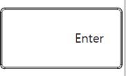

</blockquote></td>
<td colspan="2"><blockquote>

</blockquote></td>
</tr>
<tr>
<td colspan="2"><blockquote>

105 Canadian, Bilingual

</blockquote></td>
<td colspan="2"><blockquote>

</blockquote></td>
<td colspan="2"><blockquote>

</blockquote></td>
</tr>
<tr>
<td colspan="2"><blockquote>

109 Japan

</blockquote></td>
<td colspan="2"><blockquote>

</blockquote></td>
<td colspan="2"><blockquote>

</blockquote></td>
</tr>
<tr>
<td colspan="2"><blockquote>

105 Austria/Germany

</blockquote></td>
<td colspan="2"><blockquote>

</blockquote></td>
<td colspan="2"><blockquote>

</blockquote></td>
</tr>
<tr>
<td colspan="2"><blockquote>

105 Belgium AZERTY

</blockquote></td>
<td colspan="2"><blockquote>

</blockquote></td>
<td colspan="2"><blockquote>

</blockquote></td>
</tr>
<tr>
<td colspan="2"><blockquote>

105 Nordic Denmark, Finland, Norway, Sweden

</blockquote></td>
<td colspan="2"><blockquote>

</blockquote></td>
<td colspan="2"><blockquote>

</blockquote></td>
</tr>
<tr>
<td colspan="2"><blockquote>

105 French

</blockquote></td>
<td colspan="2"><blockquote>

</blockquote></td>
<td colspan="2"><blockquote>

</blockquote></td>
</tr>
<tr>
<td colspan="2"><blockquote>

105 English, UK Ireland

</blockquote></td>
<td colspan="2"><blockquote>

</blockquote></td>
<td colspan="2"><blockquote>

</blockquote></td>
</tr>
<tr>
<td colspan="2" style="text-align: center;"><u>Description</u></td>
<td colspan="2"><blockquote>

<u>Enter Key</u>

</blockquote></td>
<td colspan="2" style="text-align: center;"><u>“4,5,6” Keys</u></td>
</tr>
<tr>
<td colspan="2">105 Italy</td>
<td colspan="2"><blockquote>

</blockquote></td>
<td colspan="2"><blockquote>

</blockquote></td>
</tr>
<tr>
<td colspan="2">105 Switzerland, Luxembourg</td>
<td colspan="2"><blockquote>

</blockquote></td>
<td colspan="2"><blockquote>

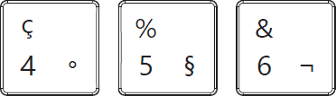

</blockquote></td>
</tr>
<tr>
<td colspan="2">104 English, International Netherlands</td>
<td colspan="2"><blockquote>

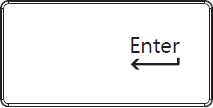

</blockquote></td>
<td colspan="2"><blockquote>

</blockquote></td>
</tr>
<tr>
<td colspan="2">105 Portuguese</td>
<td colspan="2"><blockquote>

</blockquote></td>
<td colspan="2"><blockquote>

</blockquote></td>
</tr>
<tr>
<td colspan="2">105 Spanish, European</td>
<td colspan="2"><blockquote>

</blockquote></td>
<td colspan="2"><blockquote>

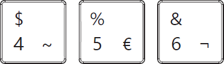

</blockquote></td>
</tr>
</tbody>
</table>

## Software Tools – Diagnostic, Calibration, and Troubleshooting

This section covers the software tools required to support a Surface
device through problem discovery and resolution.

## Genuine Microsoft Replacement Parts

- Genuine Microsoft replacement parts can be obtained directly from
  Microsoft on
  [Microsoft.com](https://www.microsoft.com/en-us/store/b/surface-repair-parts).

- Genuine Microsoft replacement parts are also available on the partner
  sites below:

  - [iFixit](https://www.ifixit.com/collaborations/microsoft)

## General Support

- For general Surface support, visit
  [www.support.microsoft.com](http://www.support.microsoft.com)

- To troubleshoot device feature/function problems or learn more about
  Surface Laptops visit <https://support.microsoft.com/surface> .

- If you would like to learn more about Windows, visit
  <https://support.microsoft.com/windows>

- To learn more about the accessibility features of the Surface Laptop,
  go to the online user guide at
  [aka.ms/Windows-Accessibility](https://support.microsoft.com/windows/discover-windows-accessibility-features-8b1068e6-d3b8-4ba8-b027-133dd8911df9)

## Software Tools

- How To: [Update Surface device firmware and
  OS](https://support.microsoft.com/en-us/help/4023505)

- How To: [Surface Tools
  Video](https://www.youtube.com/watch?v=H5VlA6-fuY8&t)

- How To: [Surface Diagnostic Toolkit User
  Guide](https://www.microsoft.com/en-us/download/details.aspx?id=100440)

- Download: [Surface drivers and
  firmware](https://support.microsoft.com/en-us/help/4023482)

- Download: [Surface Diagnostic Toolkit
  (SDT)](https://www.microsoft.com/en-us/download/details.aspx?id=100440)

- Download: [Surface Data
  Eraser](https://msdn.microsoft.com/en-us/library/mt605308.aspx)

- Download: [Surface Imaging
  Tools](https://support.microsoft.com/en-us/surfacerecoveryimage)

## Calibration and Authentication

Specific components require additional software calibration or
authentication after completing the installation of the component before
the part will function to full capability. The specific steps will be
called out in the pertinent repair workflows.

**Impacted Parts**

- **Display (TDM) –**

  - Pre-installation – requires a pre-installation repair workflow,
    completed in SDT, to put the device into repair mode.

  - Post-installation – requires a post-installation workflow, completed
    in SDT, to calibrate the display to the correct settings.

- **Battery** **–**

  - Pre-installation - requires a pre-installation repair workflow,
    completed in SDT, to put the device into repair mode.

  - Post-installation – requires a post-installation authentication
    workflow, completed in SDT, to authenticate the new battery as a
    valid Microsoft part.

- **Motherboard (PCBA)** –

  - Post-installation - requires a post-installation workflow for
    Display and an authentication for Battery, completed in SDT, to
    calibrate the display to the correct settings with the new board and
    ensure the battery is detected as an authentic part.

## Hardware Troubleshooting Approach

Microsoft recommends the following approach for troubleshooting Surface
devices:

1.  Update the device to the latest Operating System and Driver/Firmware
    versions using Windows Update.

**Important:** Ensuring your device is fully up to date is important for
ensuring the issue you are experiencing is not fixed by a software
update prior to conducting a hardware repair.

2.  Utilize the Surface Diagnostic Toolkit (SDT) after confirming the
    device is fully updated to confirm the hardware fault is still
    present prior to repair.

3.  After the repair is completed, run the Surface Diagnostic Toolkit
    (SDT) to validate the original hardware fault is resolved.

    1.  If the issue is still being experienced, it is recommended to
        reimage the device using a Surface Recovery Image (BMR) to
        return the device to a known OS/FW state. Additional repairs
        should only be conducted if the issue persists after re-imaging
        the device.

# Component Removal and Replacement Procedures

## Prerequisite Steps

Steps outlined in this section should be conducted prior to starting any
repair on a Surface device.

- **Power off device –** Ensure the device is powered off completely and
  the battery has been fully discharged. Refer to the [Repair-Specific
  Precautions and Warnings
  section](#general-information-precautions-and-warnings) for details.
  Once discharged, the device should be disconnected from all power
  sources.

- **ESD Prevention –** Ensure ESD prevention steps and general
  guidelines are followed prior to opening the device. Refer to the [ESD
  Prevention section](#electro-static-discharge-esd-prevention) for
  details.

- **Position Device –** To prevent damage to the device, ensure the
  device is placed on a clean surface free of debris.

## Feet Replacement

**Preliminary Requirements**

**Important:** Be sure to follow all special (bolded) notes of caution
within each process section.

**Required Tools**

- Plastic Opening Pick

- Soft ESD-Safe Mat

**Primary Components**

- Feet (Refer to the Illustrated Service Parts List)

**Additional Components (Ordered Separately)**

- N/A

**Procedure – Removal (Feet)**

1.  **Place Device –** Carefully place the closed device Display side
    down with the Feet facing up on a soft ESD-Safe Mat.

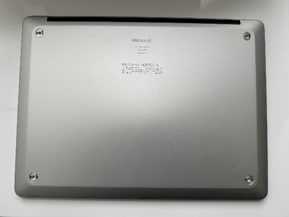

2.  **Remove the Feet –** Using the Nylon Spudger, carefully pry up all
    four feet to expose the screws.

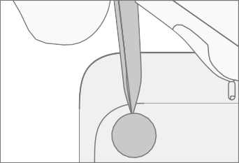

**Procedure – Installation (Feet)**

1.  **Install the Feet -** Line up the posts on the Foot to the matching
    hole pattern on the Enclosure. Press firmly until the foot clicks
    into place. Repeat for the other 3 feet.

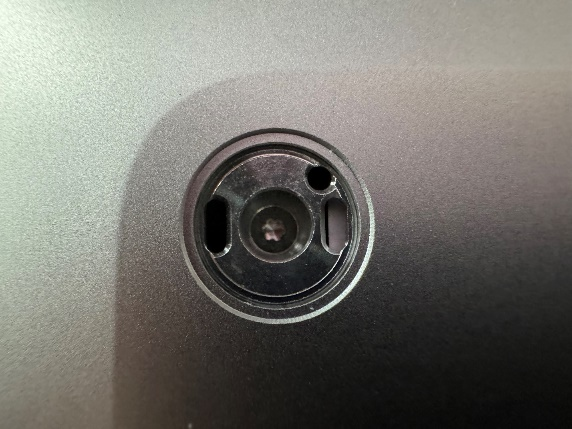

## Enclosure Replacement

**Preliminary Requirements**

**Important:** Be sure to follow all special (bolded) notes of caution
within each process section.

- **Device Serial Number Notation –** The replacement Enclosure supplied
  for repair will not have a serial number. To ensure the customer has
  the best experience with future Microsoft support cases, it is
  recommended to create a notation of the device serial number and
  provide it to the customer upon completion of the repair.

**Required Tools**

- Plastic Opening Pick

- Soft ESD-Safe Mat

- 5IP (Torx-Plus) Driver

**Primary Components**

- Enclosure (Refer to the Illustrated Service Parts List)

  - M1301718 Screws x 4 (Foot screws)

**Additional Components (Ordered Separately)**

- Feet (Refer to the Illustrated Service Parts List)

**Procedure – Removal (Enclosure)**

1.  **Place Device –** Carefully place the closed device Display side
    down with the Feet facing up on a soft ESD-Safe Mat.

2.  **Remove the Feet –** Refer to the [Procedure – Removal
    (Feet)](#feet-replacement) section of this document for detailed
    instructions.

3.  **Remove the Enclosure screws –** Using a 5IP (Torx-Plus) driver,
    uninstall each of the 4 screws from under the feet.

4.  **Separate the Enclosure from the Device –** Carefully insert the
    tip of a Plastic Opening Pick into the space between the Enclosure
    and the Keyboard Assembly as shown below. Move the Plastic Opening
    Pick around the perimeter of the device to create a gap. Using both
    hands, carefully lift the Enclosure off the device and place it on a
    soft ESD-Safe mat.

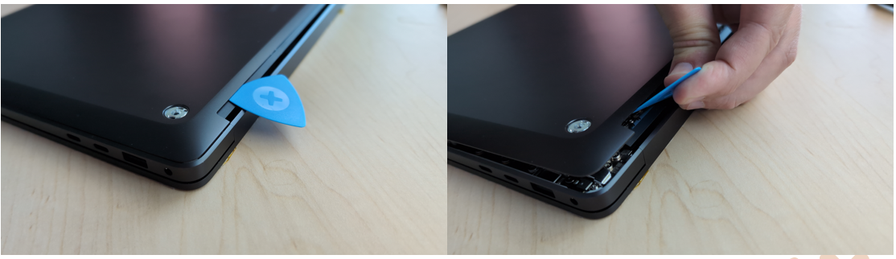

**Caution: Do Not** lift the Enclosure from the black plastic antenna.

**Procedure – Installation (Enclosure)**

1.  **Check for unexpected items within the Device -** Perform a through
    visual inspection of the device interior, or Enclosure if re-using,
    for any loose articles that may be present. Of specific importance
    are the magnets (identified below).

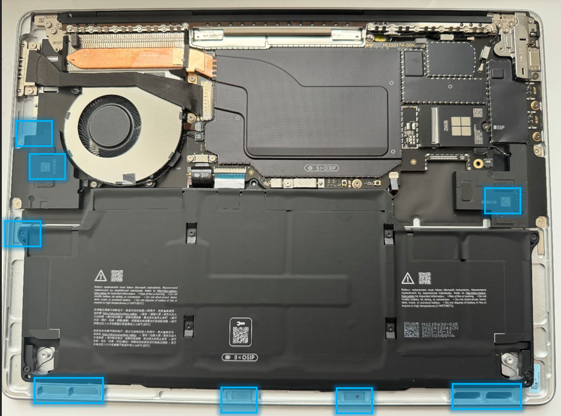

2.  **Install the Enclosure -** Using both hands, carefully lower the
    top or bottom edge of the Enclosure onto the device ensuring you
    line it up against the top edge as shown below. Once aligned, lower
    the Enclosure into place on to the Device. Finally, adjust the
    position of the Enclosure so that the gaps are even on all sides,
    and none of the sides are catching when you press the Enclosure down
    flat.

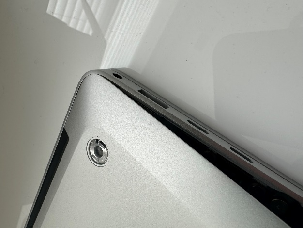

3.  **Fasten the Enclosure -** Using a 5IP (Torx-Plus) driver, install
    the 4 screws into the foot wells on the Enclosure. Each screw should
    be tightened until snug, and then turned another 45-degrees
    (1/8th turn) to fully fasten. Adjust the position of the
    Enclosure as you go to ensure even gaps around the perimeter.

> **Caution:** Ensure that the Enclosure is not stuck on a ledge as you
> are installing the screws. Shift the Enclosure as needed to avoid this
> condition.

4.  **Install the Feet –** Refer to the [Procedure – Installation
    (Feet)](#feet-replacement) section of this document for detailed
    instructions.

## Removable Solid-State Drive Replacement

**Preliminary Requirements**

**Important:** Be sure to follow all special (bolded) notes of caution
within each process section.

**Required Tools**

- Plastic Opening Pick

- Soft ESD-Safe Mat

- 5IP (Torx-Plus) Driver

- Anti-Static wrist strap (1M Ohm resistance)

- USB drive loaded with the Surface Diagnostic Toolkit

**Primary Components**

- Removable Solid-State Drive (Refer to the Illustrated Service Parts
  List)

  - M1301718 Screws x 4 (Foot screws)

  - M1246215 Screws x 1 (Solid-State Drive)
    

**Additional Components (Ordered Separately)**

- Feet (Refer to the Illustrated Service Parts List)

**Procedure – Removal (Removable Solid-State Drive)**

1.  **Place Device –** Carefully place the closed device Display side
    down with the Feet facing up on a soft ESD-Safe Mat.

2.  **Remove the Feet –** Refer to the [Procedure – Removal
    (Feet)](#feet-replacement) section of this document for detailed
    instructions.

3.  **Remove the Enclosure –** Refer to the [Procedure – Removal
    (Enclosure)](#enclosure-replacement) section of this document for
    detailed instructions.

4.  **Remove the tape -** Carefully peel up and completely remove the
    tape covering the Removable Solid-State Drive and the corresponding
    receptable. The gray spacer will also be removed along with the
    tape. Clean the top surfaces of the Removable Solid-State Drive and
    receptacle with IPA to remove any residual adhesive.

5.  **Remove the Removable Solid-State Drive –** Using a 5IP (Torx-Plus)
    driver, remove the screw ()
    holding the Removable Solid-State Drive onto the Motherboard. Lift
    the drive out of the device and place it on a soft ESD-Safe mat.

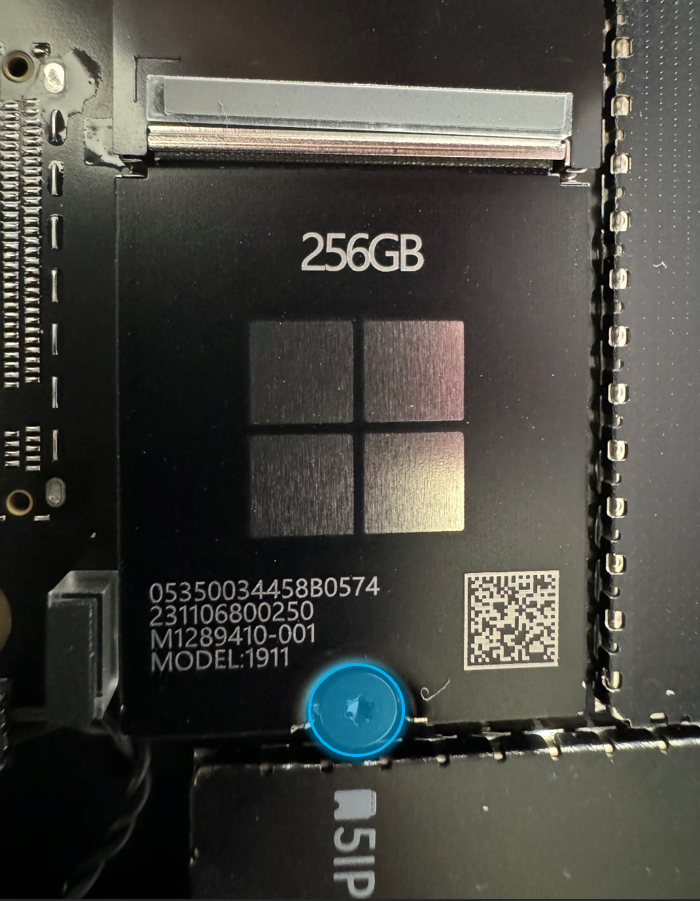

**Procedure – Installation (Removable Solid-State Drive)**

1.  **Insert the Removable Solid-State Drive –** Carefully insert the
    connector end of the Removable Solid-State Drive into the receptable
    on the motherboard while keeping the Removable Solid-State Drive as
    close as possible to horizontal.

**CAUTION:** Ensure that the Speaker wire does not get caught or trapped
when fastening the Removable Solid-State Drive to the Motherboard.

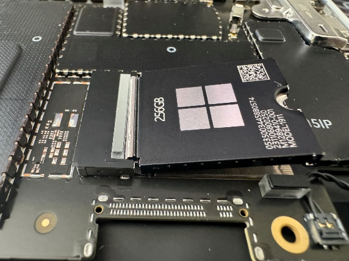

2.  **Install Removable Solid-State Drive screw –** Using a 5IP
    (Torx-Plus) driver, install the 1 new rSSD screw
    ()
    until the screw is just snug. Then turn the screw an additional
    45-degrees (1/8th turn) until screw is fully fastened.

> 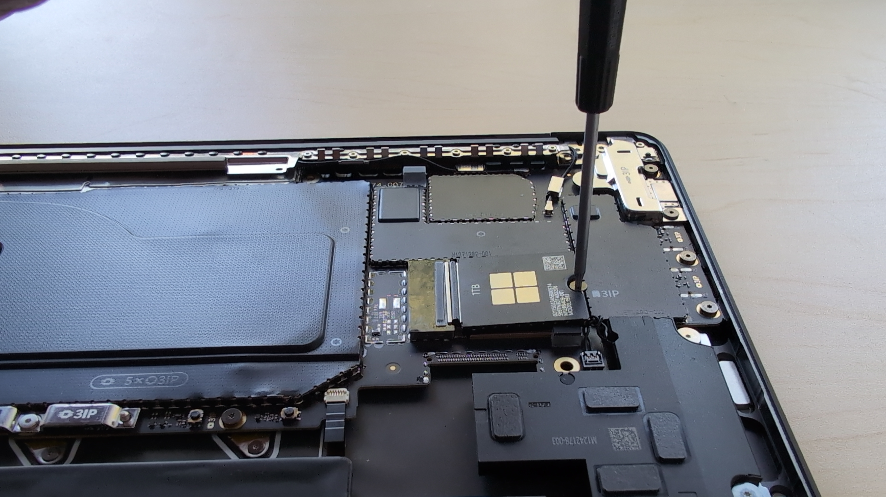 style="width:3.8in;height:2.13731in"
> alt="A close-up of a screwdriver Description automatically generated" />

3.  **Install Black Tape on Motherboard Receptacle –** Carefully place a
    new tape on the receptacle, making sure the cutout on the tape
    matches the shape of the raised flange on the receptacle.

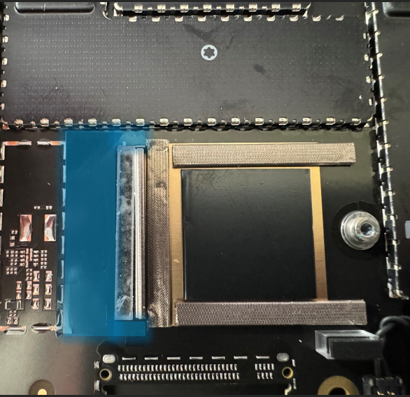

4.  **Install Spacer –** Place a new spacer on top of the Black Tape,
    parallel and as close as possible to the silver flange on the
    connector receptacle. Ensure the dot on one end of the spacer is
    oriented towards the display hinge and that the spacer is centered
    lengthwise with the silver flange.

> 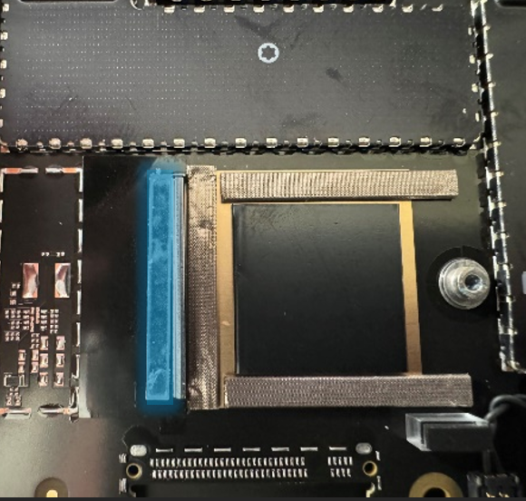 style="width:2.6in;height:2.47448in"
> alt="A close up of a circuit board Description automatically generated" />

5.  **Install Enclosure -** Refer to the [Procedure – Installation
    (Enclosure)](#enclosure-replacement) section of this document for
    detailed instructions.

6.  **Power on device –** Carefully place the device with the screen
    side facing up. Connect the device to a power supply and open the
    Display.

7.  **Image the device –** Reinstall the operating system and all
    drivers/firmware by using a USB-drive containing the latest Surface
    BMR for your model. Please see [the Software Tools – Diagnostic,
    Calibration, and
    Troubleshooting](#software-tools-diagnostic-calibration-and-troubleshooting)
    section for links to instructions on how to get the latest image and
    install it.

8.  **Run the Surface Diagnostic Toolkit (SDT) –** With Windows
    installed and sitting at the desktop, insert the USB drive
    containing SDT and launch the program. Run all diagnostics to ensure
    the device is functioning as expected before moving forward.

9.  **Power off the device –** Once the SDT tests have completed, power
    down the device and close the display. Invert the device so that the
    bottom of the device is facing up.

10. **Install the Feet -** Refer to the [Procedure – Installation
    (Feet)](#feet-replacement) section of this document for detailed
    instructions.

## Battery Replacement

**Preliminary Requirements**

**Important:** Be sure to follow all special (bolded) notes of caution
within each process section.

**WARNING:** Prior to handling the battery, the operator must remove all
jewelry, wear gloves and safety glasses, and have a bucket of sand
prepared in case of any battery event.

**WARNING:** In the case of a battery event, submerge the entire device
in sand. **DO NOT** attempt to pick up the device.

**Required Tools**

- Plastic Opening Pick

- Nylon Spudger

- ESD-Safe Tweezers

- Soft ESD-Safe Mat

- 5IP (Torx-Plus) Driver

- 3IP (Torx-Plus) Driver

- Anti-Static wrist strap (1M Ohm resistance)

- USB drive loaded with the Surface Diagnostic Toolkit

- 4 Gallon Bucket

- 2.0 Gallons of Clean Sand

**Primary Components**

- Battery (Refer to the Illustrated Service Parts List)

  - M1301718 Screws x 4 (Foot screws)

  - M1246215 Screws x 1 (Solid-State Drive)
    

  - M1266593 Screws x 2 (Battery FPC Bracket)
    

  - M1272782 Screws x 8 (Battery)
    

**Additional Components (Ordered Separately)**

- Feet (Refer to the Illustrated Service Parts List)

**Procedure – Preparation (Battery)**

**Important:** This section is only for instances where you are
replacing the battery. If the battery is being re-used, then this
section is not required.

1.  **Connect USB –** Connect USB with the Surface Diagnostic Toolkit
    (SDT) loaded to an available USB port on the device under repair.

2.  **Power on device –** Connect a power supply to the device. Press
    the power button on the device to power the device on. Allow it to
    boot to the Windows Desktop before continuing.

3.  **Launch SDT –** From the Windows Desktop, use Windows Explorer to
    navigate to the USB drive. Select the SDT executable (.exe) to
    launch the Surface Diagnostic Toolkit.

4.  **Run Battery Repair (Setup) –** From the SDT launch screen, select
    **Repair** from the drop-down menu. Next, select **Repair Setup and
    Validation** to enter the selection screen. Run the **Battery Repair
    (Setup)** to put your device into repair mode. Follow all on-screen
    instructions and allow the device to shut down when prompted.
    Disconnect the Power Supply and remove the USB drive before
    proceeding forward.

**Procedure – Removal (Battery)**

1.  **Place Device –** Carefully place the closed device Display side
    down with the Feet facing up on a soft ESD-Safe Mat.

2.  **Remove the Feet –** Refer to the [Procedure – Removal
    (Feet)](#feet-replacement) section of this document for detailed
    instructions.

3.  **Remove the Enclosure –** Refer to the [Procedure – Removal
    (Enclosure)](#enclosure-replacement) section of this document for
    detailed instructions.

4.  **Remove the Removable Solid-State Drive -** Refer to the [Procedure
    – Removal (Removable Solid-State
    Drive)](#removable-solid-state-drive-replacement) section of this
    document for detailed instructions.

5.  **Remove the Battery Connector Metal Bracket –** Using a 3IP
    (Torx-Plus) driver, remove the 2 screws
    () securing the metal bracket
    to the motherboard. Lift the metal bracket out of the device to
    expose the Battery FPC.

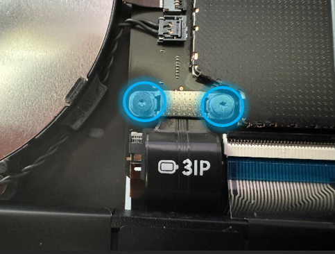

6.  **Disconnect the Battery FPC -** Using a Nylon Spudger, pry the
    Battery FPC connector, starting from the side of the connector, from
    the Motherboard.

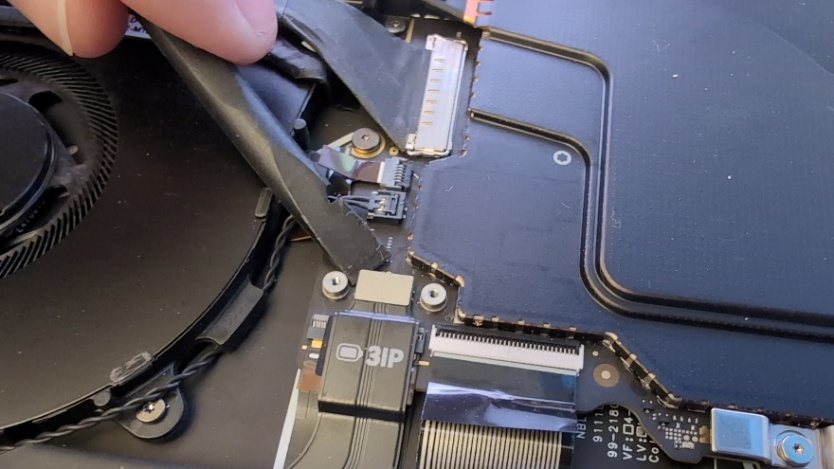

7.  **Remove the Battery Screws -** Using a 5IP (Torx-Plus) driver,
    remove the 8 screws
    ()
    securing the Battery.

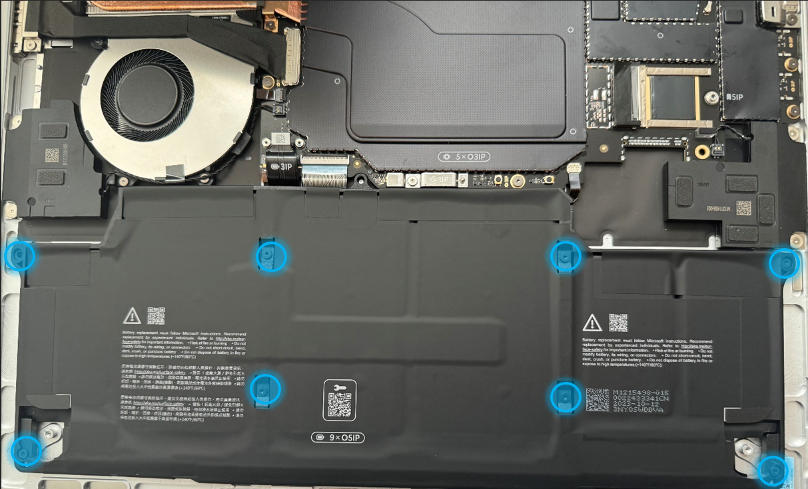

8.  **Remove the battery from the device -** Using your hands, grab the
    battery at the four points identified below and carefully lift the
    battery out of the device. Place the battery on a clean ESD-Safe Mat
    free of any debris.

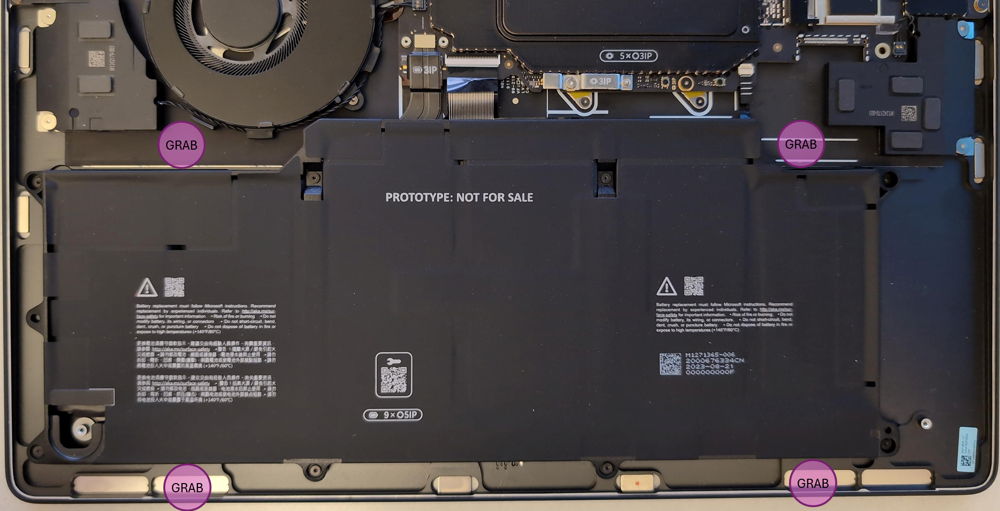

**WARNING:** Only handle the battery by the plastic frame. Bending,
twisting, or impacting the battery may damage the battery, the device,
and/or result in severe personal injury or property damage. Always use
two hands when handling the battery.

**Important:** Place the battery somewhere where the battery cannot
accidentally be contacted or damaged. **DO NOT** place anything on top
of the battery.

**Important:** When disposing of the battery, ensure you are recycling
according to local laws.

**Important:** The Motherboard Module and Battery are extremely
sensitive to ESD and can be easily damaged. It is critical that you
ensure proper grounding before performing any work on these parts.

**WARNING:** In the instance of a battery event, submerge the entire
device in a 4-gallon bucket filled with 2.0 gallons of clean sand.
Ensure the entire device is submerged. **DO NOT** attempt to pick up the
device.

**Procedure – Installation (Battery)**

1.  **Pre-installation device inspection –** Check the device interior
    for any loose articles that may be present.

    1.  Check and remove any foreign objects that the magnets may have
        attracted.

    2.  Pay special attention to the magnetized areas around the edges
        of the interior.

    3.  Verify that all removed screws are accounted for and have not
        been misplaced inside the device.

    4.  Loose screws should never be stored on the magnetic areas of the
        bucket.

**Important:** Verify the battery’s condition. Batteries exhibiting any
damage indicated in the Lithium-Ion Battery Inspection section must be
replaced.

2.  **Insert the Battery -** Using the attached loops, carefully lower
    the battery into the new device.

**Important:** Only handle new batteries with the plastic loops that
come attached. If reusing a battery, handle by the frame as indicated in
the battery removal instructions. Bending, twisting, or impacting the
battery may damage the battery, the device, and/or result in severe
personal injury or property damage. Always use two hands when handling
the battery.

3.  **Install the Battery screws -** Using a 5IP screwdriver, install
    the 8 battery frame screws
    ()
    until the screws are just snug, then tighten each by an additional
    45-degrees (1/8th turn).

**Important:** Do not overtighten the screws on the battery frame or
battery. If the frame is cracked, the battery must not be used.

4.  **Assemble the Battery FPC and FPC Bracket -** Assemble the Battery
    FPC to the Motherboard. Using a 3IP (Torx-Plus) driver, install 2
    FPC Bracket screws () until the screws are just
    snug. Turn each screw an additional 45-degrees (1/8th
    turn) until fully fastened.

5.  **Install the Removable Solid-State Drive –** Refer to [Procedure –
    Installation (Removable Solid-State
    Drive)](#removable-solid-state-drive-replacement) section of this
    document for detailed instructions.

6.  **Install the Enclosure –** Refer to [Procedure – Installation
    (Enclosure)](#enclosure-replacement) section of this document for
    detailed instructions.

**Procedure – Finalize (Battery)**

1.  **Power on Device –** Connect a Power Supply to the device and power
    it on until it reaches the Windows Desktop.

2.  **Connect USB –** Connect USB with the Surface Diagnostic Toolkit
    (SDT) loaded to an available USB port on the device under repair.

3.  **Launch SDT –** From the Windows Desktop, use Windows Explorer to
    navigate to the USB drive. Select the SDT executable (.exe) to
    launch the Surface Diagnostic Toolkit.

4.  **Allow the Battery to charge –** With the device connected to a
    power supply, allow the battery to charge until the battery icon in
    Windows reads at least 50% remaining battery charge.

5.  **Run Battery Authentication –** From the SDT launch screen, select
    **Repair** from the drop-down menu. Next, select **Repair Setup and
    Validation** to enter the selection screen. Select the **Battery
    Repair (Validation)** tool and follow the on-screen prompts until a
    successful authentication is completed.

**Important:** Battery authentication requires a stable internet
connection and the latest version of the [Surface Management
Extension](https://apps.microsoft.com/detail/9NCT159F4QVG?hl=en-US&gl=US).
If the battery validation tool fails or is not detected properly,
install the Surface Management Extension, reboot the device, and try
again with a new internet connection. If failures continue, reach out to
Microsoft Support.

6.  **Run the Surface Diagnostic Toolkit (SDT) –** Run all diagnostics
    to ensure the device is functioning as expected before moving
    forward.

7.  **Install Feet –** Refer to [Procedure – Installation
    (Feet)](#feet-replacement) section of this document for detailed
    instructions.

## Audio Jack Replacement

**Preliminary Requirements**

**Important:** Be sure to follow all special (bolded) notes of caution
within each process section.

**Required Tools**

- Plastic Opening Pick

- Nylon Spudger

- ESD-Safe Tweezers

- Soft ESD-Safe Mat

- 6IP (Torx-Plus) Driver

- 5IP (Torx-Plus) Driver

- 3IP (Torx-Plus) Driver

- Anti-Static wrist strap (1M Ohm resistance)

- USB drive loaded with the Surface Diagnostic Toolkit

**Primary Components**

- Audio Jack (Refer to the Illustrated Service Parts List)

  - M1301718 Screws x 4 (Foot screws)

  - M1246215 Screws x 1 (Solid-State Drive)
    

  - M1265600 Screws x 1 (Hinge & Chassis)
    

  - M1212080 Screws x 2 (Audio Jack Bridge)
    

  - M1263960 Screws x 1 (Audio Jack)
    

**Additional Components (Ordered Separately)**

- Feet (Refer to the Illustrated Service Parts List)

**Procedure – Removal (Audio Jack)**

1.  **Place Device –** Carefully place the closed device Display side
    down with the Feet facing up on a soft ESD-Safe Mat.

2.  **Remove the Feet –** Refer to the [Procedure – Removal
    (Feet)](#feet-replacement) section of this document for detailed
    instructions.

3.  **Remove the Enclosure –** Refer to the [Procedure – Removal
    (Enclosure)](#enclosure-replacement) section of this document for
    detailed instructions.

4.  **Remove the Removable Solid-State Drive -** Refer to the [Procedure
    – Removal (Removable Solid-State
    Drive)](#removable-solid-state-drive-replacement) section of this
    document for detailed instructions.

5.  **Remove the Audio Jack Bridge –** Using a 3IP (Torx-Plus) and 6IP
    (Torx-Plus) driver, remove the 3 screws securing the Audio Jack
    Bridge to the interior. Lift the Audio Jack Bridge out of the
    device.

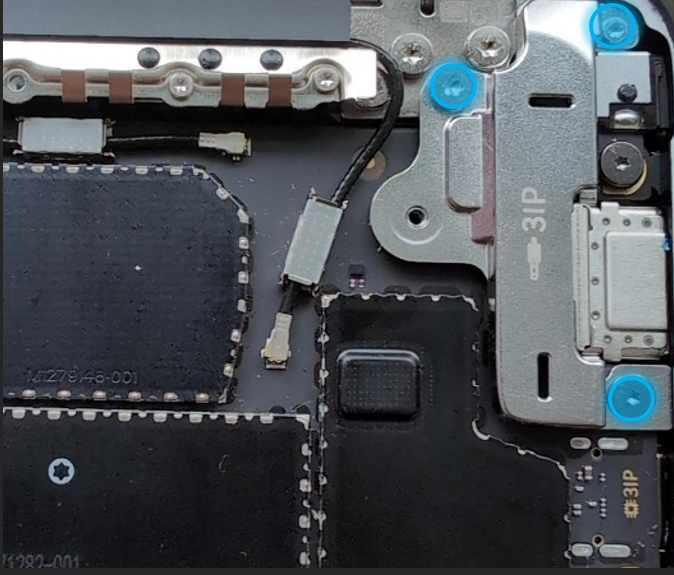

6.  **Remove the Audio Jack –**

    1.  Using a 3IP (Torx-Plus) screwdriver, remove the 1 screw securing
        the Audio Jack to the Motherboard.

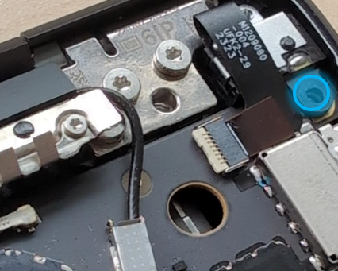

2.  Using a Nylon Spudger, flip the latch on the Motherboard to
    disengage the lock on the Audio Jack FPC. Remove the Audio Jack FPC
    from the connector on the Motherboard.

3.  Lift the Audio Jack out of the device.

**Procedure – Installation (Audio Jack)**

1.  **Install the Audio Jack –**

    1.  Place the Audio Jack into its position on the Motherboard.

    2.  Make sure the latch on the Motherboard receptacle is in the
        vertical position.

    3.  Insert the Audio Jack FPC into the receptacle and flip the latch
        down.

    4.  Using a 3IP (Torx-Plus) driver to install a new Audio Jack screw
        ()
        until just snug. Then turn the screw an additional 45-degrees
        (1/8th turn) until fully fastened.

2.  **Install the Audio Jack Bridge -** Install the previously removed
    Audio Jack Bridge into its position over the Audio Jack. Using a 3IP
    (Torx-Plus) and 6IP (Torx-Plus) driver, install 3 new screws (2 x
    ,
    1 x ).
    All screws should be tightened until just snug, and then turned
    another 45-degrees (1/8th turn) until fully fastened.

3.  **Install the Removable Solid-State Drive –** Refer to [Procedure –
    Installation (Removable Solid-State
    Drive)](#removable-solid-state-drive-replacement) section of this
    document for detailed instructions.

4.  **Install the Enclosure –** Refer to [Procedure – Installation
    (Enclosure)](#enclosure-replacement) section of this document for
    detailed instructions.

5.  **Power on device –** Carefully place the device with the screen
    side facing up. Connect the device to a power supply and open the
    Display.

6.  **Run the Surface Diagnostic Toolkit (SDT) –** Sitting at the
    desktop, insert the USB drive containing SDT and launch the program.
    Run all diagnostics to ensure the device is functioning as expected
    before moving forward.

7.  **Power off the device –** Once the SDT tests have completed, power
    down the device and close the display. Invert the device so that the
    bottom of the device is facing up.

8.  **Install the Feet -** Refer to the [Procedure – Installation
    (Feet)](#feet-replacement) section of this document for detailed
    instructions.

## Right Speaker Replacement

**Preliminary Requirements**

**Important:** Be sure to follow all special (bolded) notes of caution
within each process section.

**Required Tools**

- Plastic Opening Pick

- Nylon Spudger

- ESD-Safe Tweezers

- Soft ESD-Safe Mat

- 5IP (Torx-Plus) Driver

- 3IP (Torx-Plus) Driver

- Anti-Static wrist strap (1M Ohm resistance)

- USB drive loaded with the Surface Diagnostic Toolkit

**Primary Components**

- Right Speaker (Refer to the Illustrated Service Parts List)

  - M1301718 Screws x 4 (Foot screws)

  - M1246215 Screws x 1 (Solid-State Drive)
    

  - M1211914 Screws x 2 (Speaker)

  - M1167842 Tape x 1 (Right Speaker Tape)

**Additional Components (Ordered Separately)**

- Feet (Refer to the Illustrated Service Parts List)

**Procedure – Removal (Right Speaker)**

1.  **Place Device –** Carefully place the closed device Display side
    down with the Feet facing up on a soft ESD-Safe Mat.

2.  **Remove the Feet –** Refer to the [Procedure – Removal
    (Feet)](#feet-replacement) section of this document for detailed
    instructions.

3.  **Remove the Enclosure –** Refer to the [Procedure – Removal
    (Enclosure)](#enclosure-replacement) section of this document for
    detailed instructions.

4.  **Remove the Removable Solid-State Drive -** Refer to the [Procedure
    – Removal (Removable Solid-State
    Drive)](#removable-solid-state-drive-replacement) section of this
    document for detailed instructions.

5.  **Remove the Speaker tape –** Remove the tape and clean the surface
    with IPA to remove any residual adhesive.

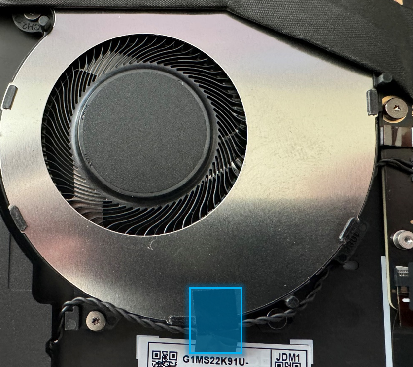

6.  **Remove the Right Speaker screws –** Using a 3IP (Torx-Plus) driver
    to remove the 2 screws securing the Right Speaker (which is on the
    left side when working on the device) to the Chassis.

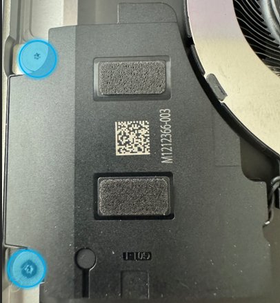

7.  **Remove the Right Speaker –** Remove the Right Speaker from the
    Chassis and de-route the cable. To remove the connector from the
    Motherboard, pull up vertically on the wireless until the connector
    comes free.

**Procedure – Installation (Right Speaker)**

1.  **Install the Right Speaker -** Place the new Right Speaker into the
    Chassis. Using a 3IP (Torx-Plus) driver, install 2 new screws. All
    screws should be installed until just snug, and then turned another
    45-degress (1/8th turn) until fully fastened.

2.  **Route and connect the Right Speaker wire –** Route the Right
    Speaker wire as shown below. Install the speaker connector into the
    receptacle on the Motherboard by pressing vertically until a snap is
    felt.

**NOTE:** The connector will have 2 visible gold contacts if it is
oriented in the correct direction.

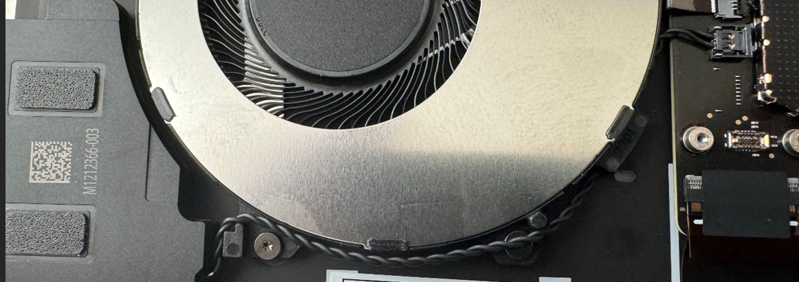

3.  **Place new Speaker Tape -** Place a new Tape over the speaker wire
    as shown below.

4.  **Install the Removable Solid-State Drive –** Refer to [Procedure –
    Installation (Removable Solid-State
    Drive)](#removable-solid-state-drive-replacement) section of this
    document for detailed instructions.

5.  **Install the Enclosure –** Refer to [Procedure – Installation
    (Enclosure)](#enclosure-replacement) section of this document for
    detailed instructions.

6.  **Power on device –** Carefully place the device with the screen
    side facing up. Connect the device to a power supply and open the
    Display.

7.  **Run the Surface Diagnostic Toolkit (SDT) –** Sitting at the
    desktop, insert the USB drive containing SDT and launch the program.
    Run all diagnostics to ensure the device is functioning as expected
    before moving forward.

8.  **Power off the device –** Once the SDT tests have completed, power
    down the device and close the display. Invert the device so that the
    bottom of the device is facing up.

9.  **Install the Feet -** Refer to the [Procedure – Installation
    (Feet)](#feet-replacement) section of this document for detailed
    instructions.

## Left Speaker Replacement

**Preliminary Requirements**

**Important:** Be sure to follow all special (bolded) notes of caution
within each process section.

**Required Tools**

- Plastic Opening Pick

- Nylon Spudger

- ESD-Safe Tweezers

- Soft ESD-Safe Mat

- 5IP (Torx-Plus) Driver

- 3IP (Torx-Plus) Driver

- Anti-Static wrist strap (1M Ohm resistance)

- USB drive loaded with the Surface Diagnostic Toolkit

**Primary Components**

- Right Speaker (Refer to the Illustrated Service Parts List)

  - M1301718 Screws x 4 (Foot screws)

  - M1246215 Screws x 1 (Solid-State Drive)
    

  - M1211914 Screws x 2 (Speaker)

**Additional Components (Ordered Separately)**

- Feet (Refer to the Illustrated Service Parts List)

**Procedure – Removal (Left Speaker)**

1.  **Place Device –** Carefully place the closed device Display side
    down with the Feet facing up on a soft ESD-Safe Mat.

2.  **Remove the Feet –** Refer to the [Procedure – Removal
    (Feet)](#feet-replacement) section of this document for detailed
    instructions.

3.  **Remove the Enclosure –** Refer to the [Procedure – Removal
    (Enclosure)](#enclosure-replacement) section of this document for
    detailed instructions.

4.  **Remove the Removable Solid-State Drive -** Refer to the [Procedure
    – Removal (Removable Solid-State
    Drive)](#removable-solid-state-drive-replacement) section of this
    document for detailed instructions.

5.  **Remove the Left Speaker Screws –** Using a 3IP (Torx-Plus), remove
    the 2 screws securing the Left Speaker, located on the Right side of
    the device when working on it, to the Chassis.

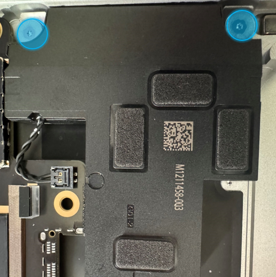

6.  **Remove the Left Speaker –** Remove the Left Speaker from the
    Chassis. To Remove the connector from the Motherboard, pull up
    vertically on the wires until the connector comes free.

**Procedure – Installation (Left Speaker)**

1.  **Install the Left Speaker –** Place the new Left Speaker into the
    Chassis. Using a 3IP (Torx-Plus) driver to install 2 new screws. All
    screws should be installed until just snug, and then turned another
    45-degrees (1/8th turn) until fully fastened.

2.  **Connect the Left Speaker –** Insert the speaker connector into the
    receptable on the Motherboard by pressing vertically until a snap is
    felt.

**NOTE:** The connector will have 2 visible gold contacts if it is
oriented in the correct direction.

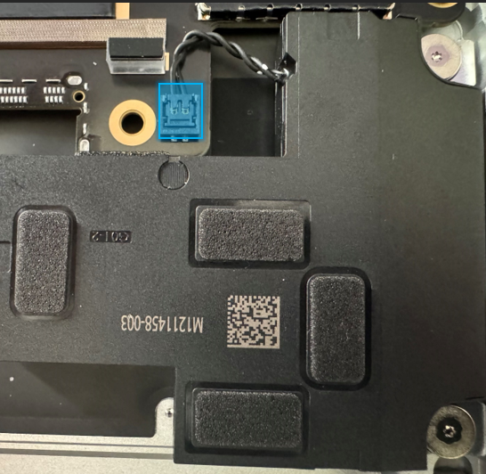

3.  **Install the Removable Solid-State Drive –** Refer to [Procedure –
    Installation (Removable Solid-State
    Drive)](#removable-solid-state-drive-replacement) section of this
    document for detailed instructions.

4.  **Install the Enclosure –** Refer to [Procedure – Installation
    (Enclosure)](#enclosure-replacement) section of this document for
    detailed instructions.

5.  **Power on device –** Carefully place the device with the screen
    side facing up. Connect the device to a power supply and open the
    Display.

6.  **Run the Surface Diagnostic Toolkit (SDT) –** Sitting at the
    desktop, insert the USB drive containing SDT and launch the program.
    Run all diagnostics to ensure the device is functioning as expected
    before moving forward.

7.  **Power off the device –** Once the SDT tests have completed, power
    down the device and close the display. Invert the device so that the
    bottom of the device is facing up.

8.  **Install the Feet -** Refer to the [Procedure – Installation
    (Feet)](#feet-replacement) section of this document for detailed
    instructions.

## Micro SD Reader Replacement

**Preliminary Requirements**

**Important:** Be sure to follow all special (bolded) notes of caution
within each process section.

**Required Tools**

- Plastic Opening Pick

- Nylon Spudger

- ESD-Safe Tweezers

- Soft ESD-Safe Mat

- 5IP (Torx-Plus) Driver

- 3IP (Torx-Plus) Driver

- Anti-Static wrist strap (1M Ohm resistance)

- USB drive loaded with the Surface Diagnostic Toolkit

**Primary Components**

- Micro SD (Refer to the Illustrated Service Parts List)

  - M1301718 Screws x 4 (Foot screws)

  - M1246215 Screws x 1 (Solid-State Drive)
    

  - M1235998 Screws x 2 (Micro SD)
    

**Additional Components (Ordered Separately)**

- Feet (Refer to the Illustrated Service Parts List)

**Procedure – Removal (Micro SD Reader)**

1.  **Place Device –** Carefully place the closed device Display side
    down with the Feet facing up on a soft ESD-Safe Mat.

2.  **Remove the Feet –** Refer to the [Procedure – Removal
    (Feet)](#feet-replacement) section of this document for detailed
    instructions.

3.  **Remove the Enclosure –** Refer to the [Procedure – Removal
    (Enclosure)](#enclosure-replacement) section of this document for
    detailed instructions.

4.  **Remove the Removable Solid-State Drive -** Refer to the [Procedure
    – Removal (Removable Solid-State
    Drive)](#removable-solid-state-drive-replacement) section of this
    document for detailed instructions.

5.  **Disconnect the Micro SD Reader Cable –** Using a Nylon Spudger,
    flip up the latch on the Micro SD Reader board and disconnect the
    connector.

6.  **Remove the Micro SD Reader –** Using a 3IP (Torx-Plus) driver,
    remove the 2 screws holding the Micro SD Reader into the Chassis and
    lift the Micro SD Reader out of the device.

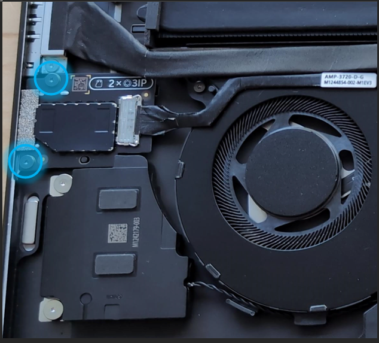

**Procedure – Installation (Micro SD Reader)**

1.  **Install the Micro SD Reader –**

    1.  Carefully place the new Micro SD Reader into the device chassis.

    2.  Verify that the reader is aligned with the opening on the
        outside of the device chassis.

    3.  Using a 3IP (Torx-Plus) driver, install 2 new screws
        ()
        until just snug and then turn each another 45-degrees
        (1/8th turn) until fully fastened.

>  style="width:2.6in;height:2.34984in"
> alt="A close up of a computer Description automatically generated" />

2.  **Connect the Micro SD Reader Cable -** Insert the Micro SD Reader
    cable into the receptacle on the Micro SD Reader board and close the
    latch. There should be a lick if the connector is inserted
    correctly, and the latch is fully closed.

3.  **Install the Removable Solid-State Drive –** Refer to [Procedure –
    Installation (Removable Solid-State
    Drive)](#removable-solid-state-drive-replacement) section of this
    document for detailed instructions.

4.  **Install the Enclosure –** Refer to [Procedure – Installation
    (Enclosure)](#enclosure-replacement) section of this document for
    detailed instructions.

5.  **Power on device –** Carefully place the device with the screen
    side facing up. Connect the device to a power supply and open the
    Display.

6.  **Run the Surface Diagnostic Toolkit (SDT) –** Sitting at the
    desktop, insert the USB drive containing SDT and launch the program.
    Run all diagnostics to ensure the device is functioning as expected
    before moving forward.

7.  **Power off the device –** Once the SDT tests have completed, power
    down the device and close the display. Invert the device so that the
    bottom of the device is facing up.

8.  **Install the Feet -** Refer to the [Procedure – Installation
    (Feet)](#feet-replacement) section of this document for detailed
    instructions.

## Display Assembly Replacement

**Preliminary Requirements**

**Important:** Be sure to follow all special (bolded) notes of caution
within each process section.

**Required Tools**

- Plastic Opening Pick

- Nylon Spudger

- ESD-Safe Tweezers

- Soft ESD-Safe Mat

- 6IP (Torx-Plus) Driver

- 5IP (Torx-Plus) Driver

- 3IP (Torx-Plus) Driver

- Anti-Static wrist strap (1M Ohm resistance)

- USB drive loaded with the Surface Diagnostic Toolkit

**Primary Components**

- Display Assembly (Refer to the Illustrated Service Parts List)

  - M1301718 Screws x 4 (Foot screws)

  - M1246215 Screws x 1 (Solid-State Drive)
    

  - M1265600 Screws x 8 (Hinge & Chassis)

  - M1274578 Screws x 12 (Antenna)

  - M1212080 Screws x 1 (Audio Jack Bridge)

  - M1263960 Screws x 2 (Audio Jack)

  - M1235995 Screws x 1 (Motherboard)

  - M1265416 Shield x 2 (Coax Cable Lid)

  - M1271924 Shield x 1 (T3 Shield)

  - M1288973 Foam x 1 (T3 Shield Foam \#1)

  - M1288974 Foam x 1 (T3 Shield Foam \#2)

  - M1291196 Tape x 1 (Display Assembly FPC Tape)

**Additional Components (Ordered Separately)**

- Feet (Refer to the Illustrated Service Parts List)

**Procedure – Preparation (Display Assembly)**

**Important:** This section is only for instances where you are
replacing the Display. If the Display is being re-used, then this
section is not required. If Display is unusable due to damage or fault,
connect an external monitor to the device to perform these steps.

1.  **Connect USB –** Connect USB with the Surface Diagnostic Toolkit
    (SDT) loaded to an available USB port on the device under repair.

2.  **Power on device –** Connect a power supply to the device. Press
    the power button on the device to power the device on. Allow it to
    boot to the Windows Desktop before continuing.

3.  **Launch SDT –** From the Windows Desktop, use Windows Explorer to
    navigate to the USB drive. Select the SDT executable (.exe) to
    launch the Surface Diagnostic Toolkit.

4.  **Run Touch Display Setup –** From the SDT launch screen, select
    **Repair** from the drop-down menu. Next, select **Repair Setup and
    Validation** to enter the selection screen. Run the **Touch Display
    (Setup)** tool to prepare your device for Display replacement.
    Follow all on-screen instructions and allow the device to shut down
    when prompted. Disconnect the Power Supply and remove the USB drive
    before proceeding forward.

**Procedure – Removal (Display Assembly)**

1.  **Place Device –** Carefully place the closed device Display side
    down with the Feet facing up on a soft ESD-Safe Mat.

2.  **Remove the Feet –** Refer to the [Procedure – Removal
    (Feet)](#feet-replacement) section of this document for detailed
    instructions.

3.  **Remove the Enclosure –** Refer to the [Procedure – Removal
    (Enclosure)](#enclosure-replacement) section of this document for
    detailed instructions.

4.  **Remove the Removable Solid-State Drive -** Refer to the [Procedure
    – Removal (Removable Solid-State
    Drive)](#removable-solid-state-drive-replacement) section of this
    document for detailed instructions.

5.  **Remove the Audio Jack -** Refer to the [Procedure – Removal
    (Audio](#audio-jack-replacement) Jack) section of this document for
    detailed instructions.

6.  **Remove the Antenna –**

    1)  Using a Nylon Spudger, pry up the 2 Coax Cable Lids.

> 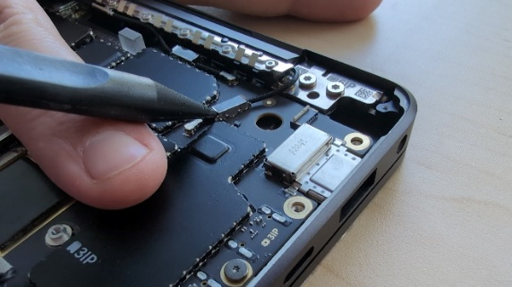 style="width:2.6in;height:1.46263in"
> alt="A person using a stylus to fix a device Description automatically generated" />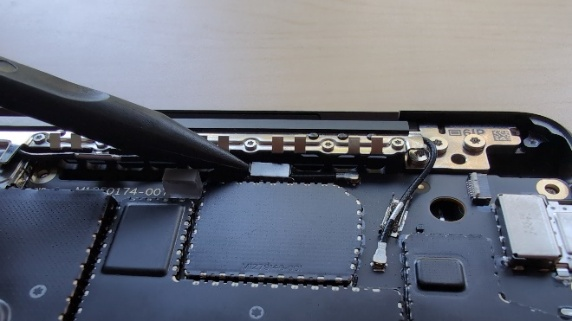 style="width:2.6in;height:1.46263in"
> alt="A close-up of a computer chip Description automatically generated" />

2)  Using a Nylon Spudger, disconnect the 2 Coax Cables.

> 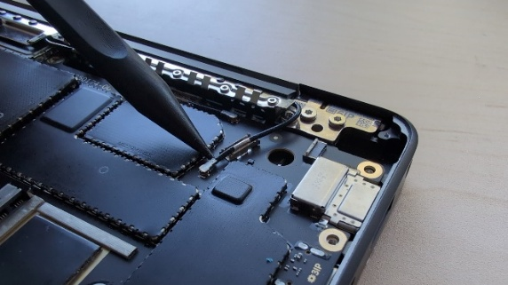 style="width:2.6in;height:1.46263in"
> alt="A close-up of a device Description automatically generated" />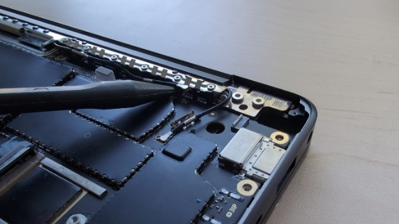 style="width:2.6in;height:1.46263in"
> alt="A close-up of a device Description automatically generated" />

3)  Using a 3IP (Torx-Plus) driver, remove the 11 screws from the
    antenna.

> 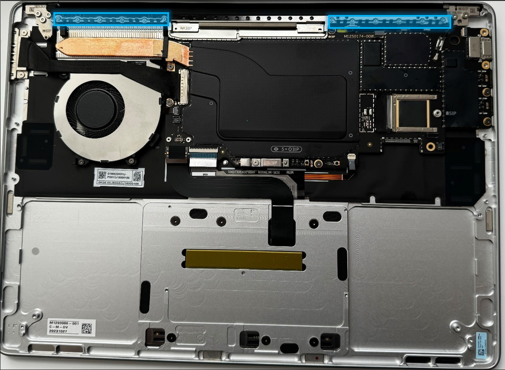 style="width:4.8in;height:1.94482in"
> alt="A close up of a computer Description automatically generated" />

4)  Lift the Antenna out of the Chassis.

<!-- -->

7.  **Remove the T3 Shield Lid –**

    1)  Using a Nylon Spudger, pry up the T3 Shield Lid starting with
        the right edge.

> 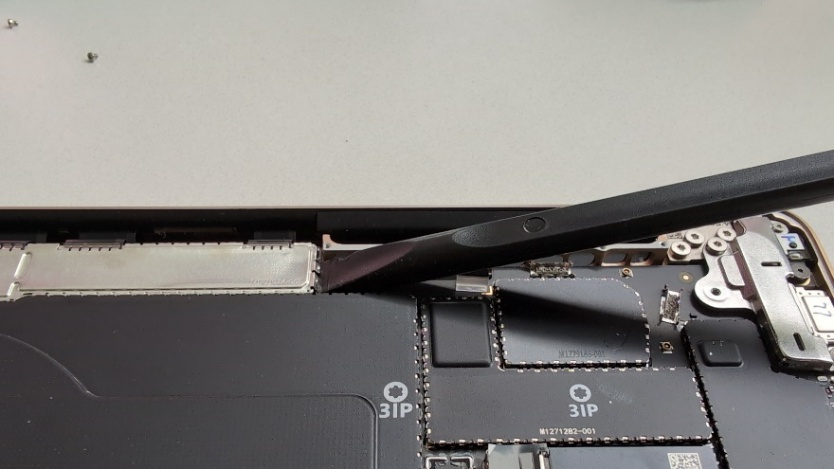 style="width:3.79967in;height:1.55417in"
> alt="A black tool on a black device Description automatically generated with medium confidence" />

**NOTE:** Remove the Motherboard screw next to the T3 Shield can give
better access for removal of the shield.

2)  Slide the Nylon Spudger under the shield moving right to left. Pause
    and shift the shield up and down as you work your way left as the
    shield will get stuck on its latches.

> 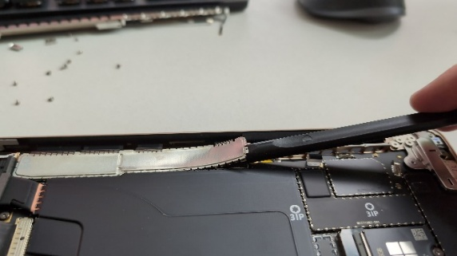 style="width:2.59931in;height:0.96931in"
> alt="A black object on a white surface Description automatically generated" />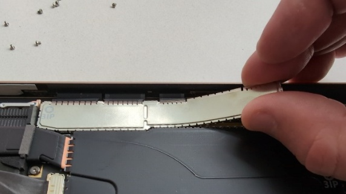 style="width:2.59977in;height:0.96944in"
> alt="A hand holding a film strip Description automatically generated" />

**Caution:** Ensure that the shield does not damage the Display FPC’s
during removal.

8.  **Disconnect the Display Assembly FPCs -** Using a Nylon Spudger,
    pry up the connectors from the side and gently wiggle them free. If
    the connectors start giving resistance as they are being pried up,
    lightly push the edge being pried back down.

**Caution:** Do not force the connector if it starts to give resistance.
Rock the connector back in the other direction to remove.

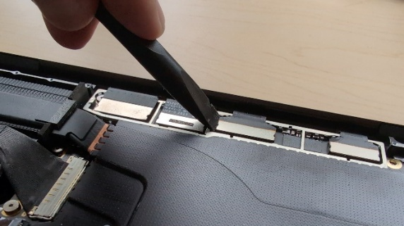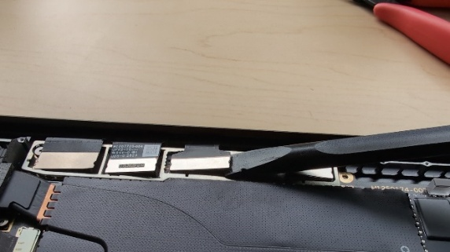

9.  **Reorient the Device –**

    1)  Open the Display Assembly to 90 Degrees.

    2)  Place the backside of the Display Assembly on the ESD-Safe Mat
        with the screen and keyboard facing up.

> 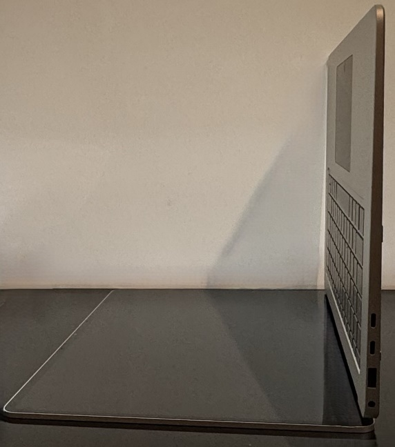 style="width:2.6in;height:2.94428in" />

10. **Remove the Left Hinge Screws – With** one hand holding the device
    still, use a 6IP (Torx-Plus) driver to remove the 3 screws on the
    Left Hinge.

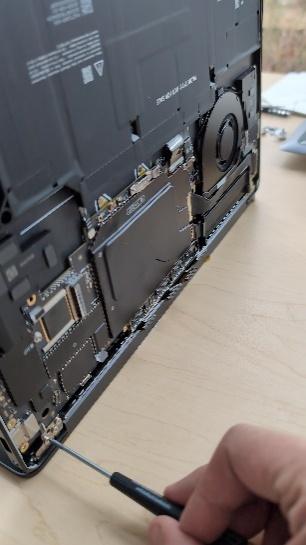

11. **Remove the Right Hinge Screws -** With one hand holding the device
    still, use a 6IP (Torx-Plus) driver to remove the 4 screws on the
    Right Hinge.

12. **Remove the Display Assembly from the Device -** Carefully lift the
    Chassis from the Display Assembly. Place the Display Assembly on an
    ESD-Safe mat.

**Procedure – Installation (Display Assembly)**

1.  **Orient Display Assembly –** Place the backside of the new Display
    Assembly on the ESD mat with each of the hinges set at 90-degree
    angles.

2.  **Install the new Display Assembly –** Carefully align the hinges
    into the packets on the device Enclosure.

**Important:** Ensure the Enclosure does not impact on the display
assembly glass.

3.  **Pre-fasten the right hinge screws -** Using a 6IP (Torx-Plus)
    driver, install 4 new right side hinge screws
    ()
    and tighten until it is just snug.

4.  **Pre-fasten the left hinge screws -** Using a 6IP (Torx-Plus)
    driver, install 3 new left side hinge screws
    ()
    and tighten until just snug.

5.  **Check alignment –**

    1.  Close the device.

    2.  Loosen all 8 hinge screws 90 degrees (1/4th turn).

    3.  Adjust the alignment until the gap between the Display Assembly
        and the Chassis is as even as possible.

> 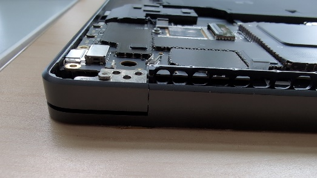 style="width:2.6in;height:1.46263in"
> alt="Close-up of a black electronic device Description automatically generated" />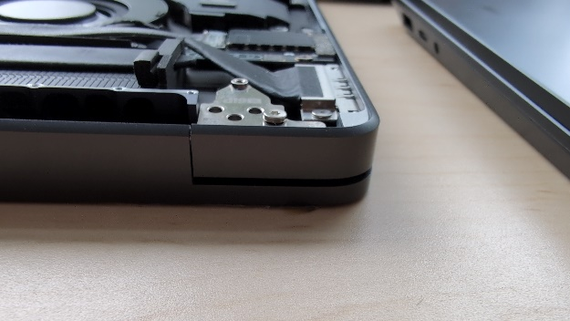 style="width:2.6in;height:1.46263in"
> alt="A close-up of a computer Description automatically generated" />

4.  Tighten down 1 screw on the left hinge until snug. Adjust to the
    right side so that the Chassis surface is flush with the Display
    Assembly.

5.  Tighten down 1 screw on the right hinge. Loosen the screw that was
    tightened down on the left hinge. Adjust the left side so that the
    Chassis surface is flush with the Display Assembly.

6.  Repeat as necessary until the left and right gaps are even and the
    back surfaces are flush.

<!-- -->

6.  **Tighten all hinge screws -** Tighten all 7 hinge screws until they
    are snug, and then tighten an additional 90 degrees (1/4 turn) to
    ensure they are securely fastened.

7.  **Connect the Display Assembly FPCs to the Motherboard -** Attach
    the display module cables to the receptacles on the Motherboard.

8.  **Place the Display Assembly FPC Tape –** Place the Display Assembly
    FPC Tape to the Display Assembly FPC as shown.

**Important:** Tape should be applied only to the Display Assembly FPC.

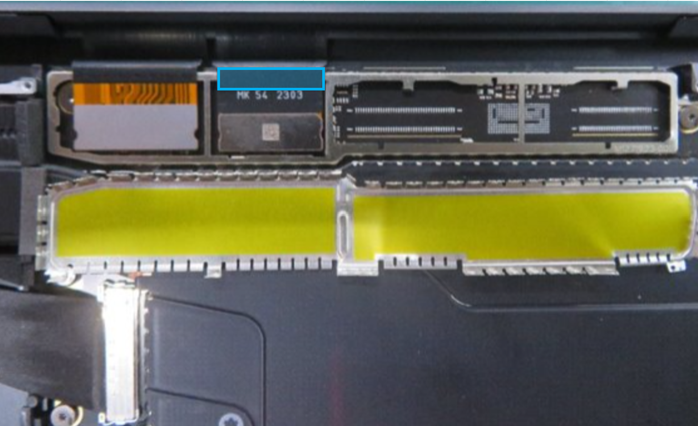

9.  **Install the T3 Shield Foams (as needed) –**

    1.  If the Display Assembly being installed has 2 FPCs, inspect the
        shield fence for foams. If the foams are not present, install
        the supplied foams as shown.

> 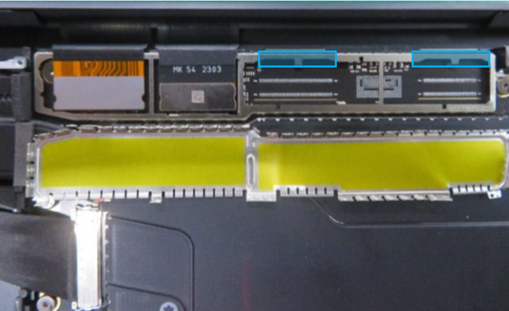 style="width:2.6in;height:1.59212in"
> alt="A close up of a device Description automatically generated" />

2.  If the Display Assembly being installed has 4 FPCs, inspect the
    shield fence for foams. Any foams on the shield fence should be
    removed.

**Important:** New Display Assemblies will only have 2 FPCs. The
remaining 2 connections on the Motherboard will remain empty. This is by
design.

10. **Install the Motherboard screw -** Using a 3IP (Torx-Plus) driver,
    install 1 new Motherboard screw
    ()
    until just snug and seated, and then turn another 45-degrees
    (1/8th turn) until fully fastened.

11. **Install the Antenna –**

    1.  Install the previously removed Antenna. Using a 3IP (Torx-Plus)
        driver, install 12 new screws
        ().
        All screws should be installed until just snug, and then turned
        another 45-degrees (1/8th turn) until fully fastened.

>  style="width:4.8in;height:1.94482in"
> alt="A close up of a computer Description automatically generated" />

2.  Connect the 2 Coax Cables to the Motherboard by aligning each with
    the socket, and pressing down until a click is felt.

3.  Install 2 new Coax Cable Lids to the Motherboard over the Coax
    Cables. Align and press into place until a click is felt.

> 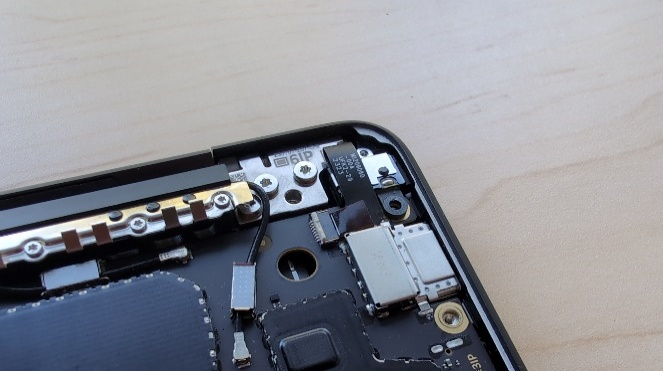 style="width:2.6in;height:1.2421in"
> alt="A close-up of a device Description automatically generated" />

12. **Install the Audio Jack –** Refer to [Procedure – Installation
    (Audio Jack)](#audio-jack-replacement) section of this document for
    detailed instructions.

13. **Install the Removable Solid-State Drive –** Refer to [Procedure –
    Installation (Removable Solid-State
    Drive)](#removable-solid-state-drive-replacement) section of this
    document for detailed instructions.

14. **Install the Enclosure –** Refer to [Procedure – Installation
    (Enclosure)](#enclosure-replacement) section of this document for
    detailed instructions.

15. **Power on device –** Carefully place the device with the screen
    side facing up. Connect the device to a power supply and open the
    Display.

**Procedure – Finalize (Display Assembly)**

**Important:** This section is only for instances where you are
replacing the Display. If the Display is being re-used, then this
section is not required. If Display is unusable due to damage or fault,
connect an external monitor to the device to perform these steps.

1.  **Connect USB –** Connect USB with the Surface Diagnostic Toolkit
    (SDT) loaded to an available USB port on the device under repair.

2.  **Launch SDT –** From the Windows Desktop, use Windows Explorer to
    navigate to the USB drive. Select the SDT executable (.exe) to
    launch the Surface Diagnostic Toolkit.

3.  **Run Touch Display Calibration –** From the SDT launch screen,
    select **Repair** from the drop-down menu. Next, select **Repair
    Setup and Validation** to enter the selection screen. Run the
    **Touch Display (Calibration)** tool to calibrate your new Display.
    Follow all on-screen instructions and allow the device to restart
    when prompted.

**Important:** If the calibration fails, reboot the device, and attempt
again. If the failure continues, then the Display may be faulty and
require replacement.

4.  **Launch SDT –** Once the device has rebooted and is at the Windows
    Desktop, use Windows Explorer to navigate to the USB drive. Select
    the SDT executable (.exe) to launch the Surface Diagnostic Toolkit.

5.  **Run the Surface Diagnostic Toolkit (SDT) –** Run all diagnostics
    to ensure the device is functioning as expected before moving
    forward.

6.  **Install Feet –** Refer to [Procedure – Installation
    (Feet)](#_Feet_Replacement_Process) for steps to install Feet.

## Surface Connect Replacement

**Preliminary Requirements**

**Important:** Be sure to follow all special (bolded) notes of caution
within each process section.

**Required Tools**

- Plastic Opening Pick

- Nylon Spudger

- ESD-Safe Tweezers

- Soft ESD-Safe Mat

- 5IP (Torx-Plus) Driver

- 3IP (Torx-Plus) Driver

- Isopropyl alcohol (91% or greater)

- Cleaning swabs

- Anti-Static wrist strap (1M Ohm resistance)

- USB drive loaded with the Surface Diagnostic Toolkit

**Primary Components**

- Surface Connect (Refer to the Illustrated Service Parts List)

  - M1301718 Screws x 4 (Foot screws)

  - M1246215 Screws x 1 (Solid-State Drive)
    

  - M1277572 Screws x 2 (Surface Connect)

  - M1301902 PSA x 1 (Surface Connect & Fan)

**Additional Components (Ordered Separately)**

- Feet (Refer to the Illustrated Service Parts List)

**Procedure – Removal (Surface Connect)**

1.  **Place Device –** Carefully place the closed device Display side
    down with the Feet facing up on a soft ESD-Safe Mat.

2.  **Remove the Feet –** Refer to the [Procedure – Removal
    (Feet)](#feet-replacement) section of this document for detailed
    instructions.

3.  **Remove the Enclosure –** Refer to the [Procedure – Removal
    (Enclosure)](#enclosure-replacement) section of this document for
    detailed instructions.

4.  **Remove the Removable Solid-State Drive -** Refer to the [Procedure
    – Removal (Removable Solid-State
    Drive)](#removable-solid-state-drive-replacement) section of this
    document for detailed instructions.

5.  **Disconnect the Surface Connect connector –** Using a Nylon
    Spudger, flip up the latch on the Motherboard, and disconnect the
    Surface Connect connector from the Motherboard.

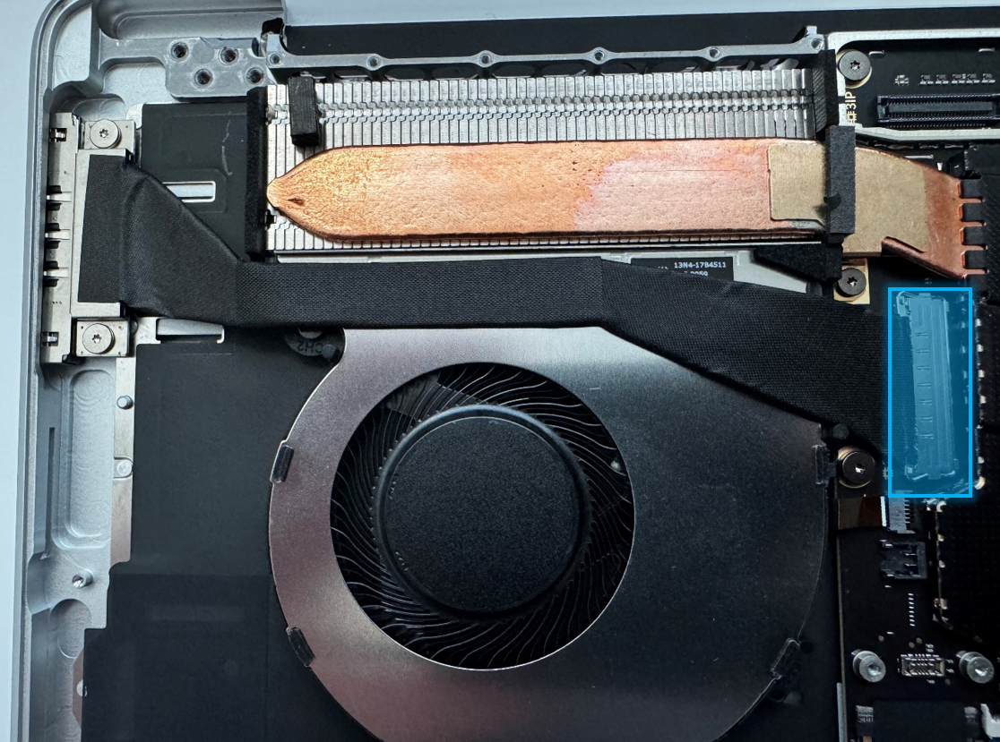

6.  **Remove the Surface Connect Cable -** Using a 3IP (Torx-Plus)
    driver, remove the 2 screws securing the Surface Connect port to the
    Motherboard. Lift the cable out of the device and place it on an
    ESD-Safe mat.

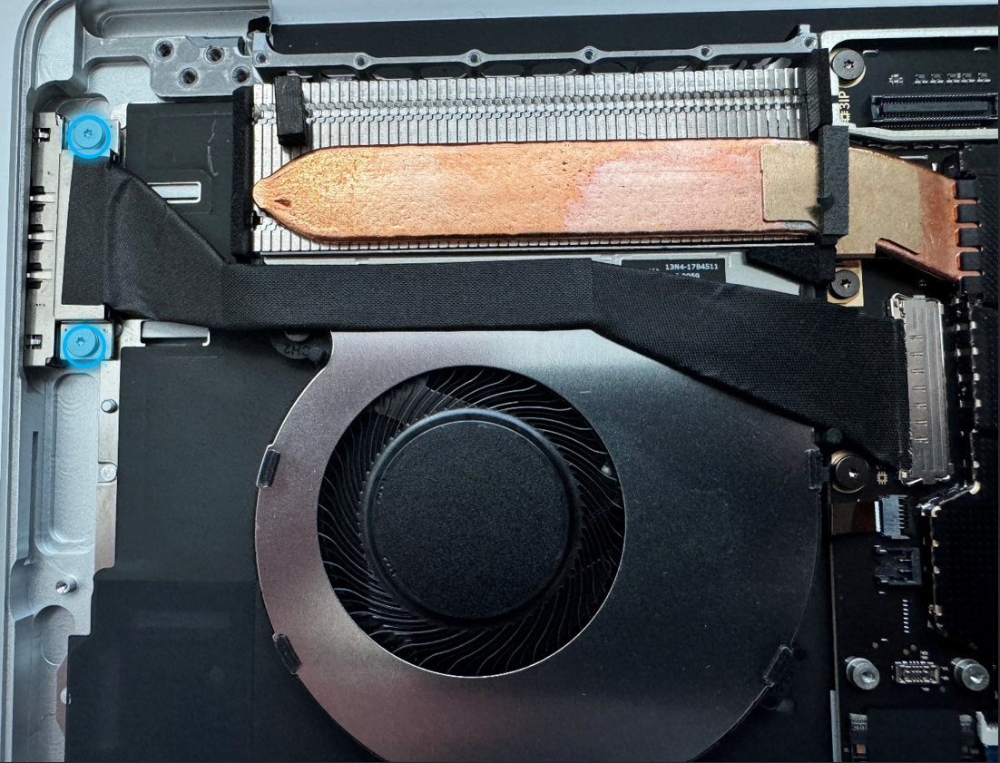

7.  **Remove residual adhesive -** Gently peel up the PSA
    (pressure-sensitive adhesive) under the Surface Connect Cable (on
    the Fan) and remove. Clean up the surface with IPA and cleaning
    swabs until all residual adhesive has been removed and the surface
    is clean.

**Procedure – Installation (Surface Connect)**

1.  **Install new PSA -** Place a new piece of PSA down onto the Fan as
    shown.

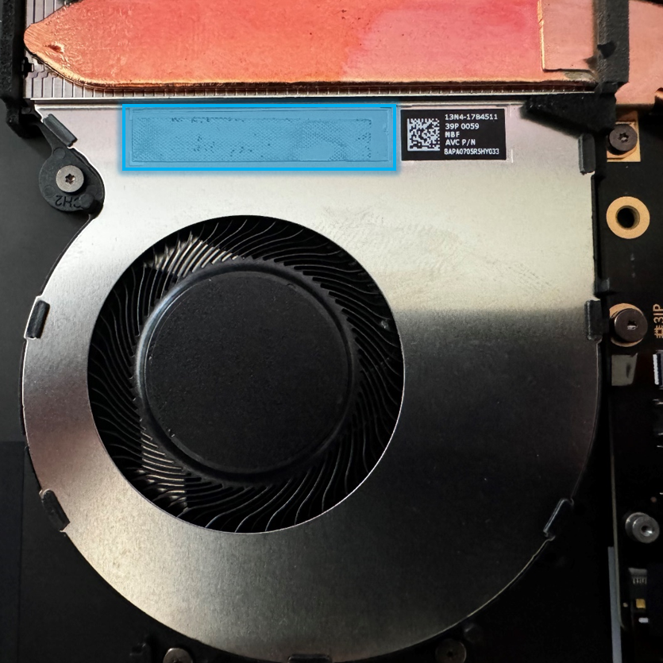

2.  **Install the Surface Connect Cable –**

    1.  Insert the connector of the Surface Connect Cable into the
        receptacle on the Motherboard and close the latch to secure it.
        There should be a click if the connector is inserted correct and
        the latch is fully closed.

    2.  Toe in the Surface Connect connector into the device chassis
        ensuring that the plastic housing is flush with the outside
        surface of the chassis. The port should be fully aligned with
        the external opening.

> 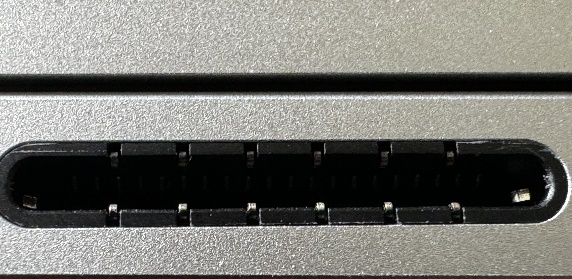 style="width:2.6in;height:1.26667in" />

3.  Using a 3IP (Torx-Plus) driver, install the 2 new Surface Connect
    screws until the screw is just snug and seated, and then turn each
    another 45-degrees (1/8th turn) until fully fastened.

4.  Lightly press the cable into the PSA to adhere the cable to the fan.

<!-- -->

3.  **Install the Removable Solid-State Drive –** Refer to [Procedure –
    Installation (Removable Solid-State
    Drive)](#removable-solid-state-drive-replacement) section of this
    document for detailed instructions.

4.  **Install the Enclosure –** Refer to [Procedure – Installation
    (Enclosure)](#enclosure-replacement) section of this document for
    detailed instructions.

5.  **Power on device –** Carefully place the device with the screen
    side facing up. Connect the device to a power supply and open the
    Display.

6.  **Run the Surface Diagnostic Toolkit (SDT) –** Sitting at the
    desktop, insert the USB drive containing SDT and launch the program.
    Run all diagnostics to ensure the device is functioning as expected
    before moving forward.

7.  **Power off the device –** Once the SDT tests have completed, power
    down the device and close the display. Invert the device so that the
    bottom of the device is facing up.

8.  **Install the Feet -** Refer to the [Procedure – Installation
    (Feet)](#feet-replacement) section of this document for detailed
    instructions.

## Motherboard Replacement Process

**Preliminary Requirements**

**Important:** Be sure to follow all special (bolded) notes of caution
within each process section.

**Important:** If replacing both the Motherboard and the Display
Assembly – complete the Motherboard replacement prior to performing the
Display Assembly Replacement to ensure proper part operation.

**Required Tools**

- Plastic Opening Pick

- Nylon Spudger

- ESD-Safe Tweezers

- Soft ESD-Safe Mat

- 6IP (Torx-Plus) Driver

- 5IP (Torx-Plus) Driver

- 3IP (Torx-Plus) Driver

- Isopropyl alcohol (91% or greater)

- Cleaning swabs

- Anti-Static wrist strap (1M Ohm resistance)

- USB drive loaded with the Surface Diagnostic Toolkit

**Primary Components**

- Motherboard (Refer to the Illustrated Service Parts List)

  - M1301718 Screws x 4 (Foot screws)

  - M1266593 Screws x 2 (Battery FPC Bracket)
    

  - M1272782 Screws x 8 (Battery) 

  - M1246215 Screws x 1 (Solid-State Drive)
    

  - M1265600 Screws x 1 (Hinge & Chassis)
    

  - M1274578 Screws x 14 (Antenna) 

  - M1212080 Screws x 1 (Audio Jack Bridge)
    

  - M1263960 Screws x 2 (Audio Jack)
    

  - M1235995 Screws x 8 (Motherboard)
    

  - M1263961 Screws x 2 (Motherboard)
    

  - M1277573 Screws x 1 (Motherboard)
    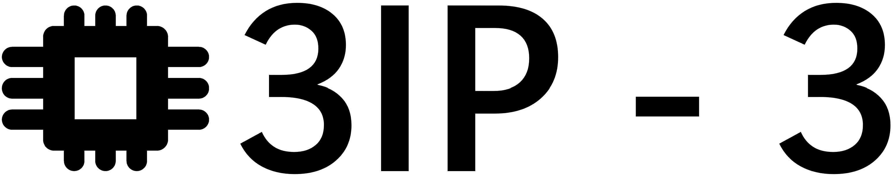

  - M1265416 Shield x 2 (Coax Cable Lid)

  - M1271279 Shield x 1 (T1 Shield

  - M1271924 Shield x 1 (T3 Shield)

  - M1288973 Foam x 1 (T3 Shield Foam \#1)

  - M1288974 Foam x 1 (T3 Shield Foam \#2)

  - M1287120 Tape x 1 (Touchpad FPC Tape)

  - M1019757 Syringe x 1 (Thermal Paste)

  - M1301902 PSA x 1 (Surface Connect & Fan)

**Additional Components (Ordered Separately)**

- Feet (Refer to the Illustrated Service Parts List)

**Procedure – Removal (Motherboard)**

1.  **Place Device –** Carefully place the closed device Display side
    down with the Feet facing up on a soft ESD-Safe Mat.

2.  **Remove the Feet –** Refer to the [Procedure – Removal
    (Feet)](#feet-replacement) section of this document for detailed
    instructions.

3.  **Remove the Enclosure –** Refer to the [Procedure – Removal
    (Enclosure)](#enclosure-replacement) section of this document for
    detailed instructions.

4.  **Remove the Removable Solid-State Drive -** Refer to the [Procedure
    – Removal (Removable Solid-State
    Drive)](#removable-solid-state-drive-replacement) section of this
    document for detailed instructions.

5.  **Remove the Audio Jack -** Refer to the [Procedure – Removal
    (Audio](#audio-jack-replacement) Jack) section of this document for
    detailed instructions.

6.  **Remove the Battery –** Refer to the [Procedure – Removal
    (Battery)](#battery-replacement) section of this document for
    detailed instructions.

7.  **Remove the Antenna –**

    1.  Using a Nylon Spudger, pry up the 2 Coax Cable Lids.

>  style="width:2.6in;height:1.46263in"
> alt="A person using a stylus to fix a device Description automatically generated" /> style="width:2.6in;height:1.46263in"
> alt="A close-up of a computer chip Description automatically generated" />

2.  Using a Nylon Spudger, disconnect the 2 Coax Cables.

>  style="width:2.6in;height:1.46263in"
> alt="A close-up of a device Description automatically generated" /> style="width:2.6in;height:1.46263in"
> alt="A close-up of a device Description automatically generated" />

3.  Using a 3IP (Torx-Plus) driver, remove the 11 screws from the
    antenna.

4.  Lift the Antenna out of the Chassis.

<!-- -->

8.  **Remove the T3 Shield Lid –**

    1.  Using a Nylon Spudger, pry up the T3 Shield Lid starting with
        the right edge.

>  style="width:3.79967in;height:1.31111in"
> alt="A black tool on a black device Description automatically generated with medium confidence" />

**NOTE:** Remove the Motherboard screw next to the T3 Shield can give
better access for removal of the shield.

2.  Slide the Nylon Spudger under the shield moving right to left. Pause
    and shift the shield up and down as you work your way left as the
    shield will get stuck on its latches.

>  style="width:2.59977in;height:0.97639in"
> alt="A black object on a white surface Description automatically generated" /> style="width:2.59977in;height:0.96944in"
> alt="A hand holding a film strip Description automatically generated" />

**Caution:** Ensure that the shield does not damage the Display FPC’s
during removal.

9.  **Disconnect the Display Assembly FPCs -** Using a Nylon Spudger,
    pry up the connectors from the side and gently wiggle them free. If
    the connectors start giving resistance as they are being pried up,
    lightly push the edge being pried back down.

**Caution:** Do not force the connector if it starts to give resistance.
Rock the connector back in the other direction to remove.

10. **Remove the T1 Shield –** Using a Nylon Spudger or ESD-Safe
    Tweezers, peel up the corner of the shield. Pry up the rest of the
    shield and remove.

11. **Remove the T5 Shield -** Using a Nylon Spudger or ESD-Safe
    Tweezers, peel up the corner of the shield. Pry up the rest of the
    shield and remove.

12. **Disconnect the Surface Connect Cable –** Using a Nylon Spudger,
    flip up the latch on the Motherboard and disconnect the Surface
    Connect connector from the Motherboard.

13. **Disconnect the Microsoft SD Reader Cable –** Using a Nylon
    Spudger, flip up the latch on the Micro SD Reader board and
    disconnect the connector from the Motherboard.

14. **Remove Microsoft SD Reader Cable PSA on Fan -** Peel up the Micro
    SD Reader cable from the Fan. Peel up and remove the PSA on the fan.
    Clean the surface with IPA and cleaning swabs until all residual
    adhesive is removed.

15. **Remove the Surface Connect PSA on Fan -** Peel up the Surface
    Connect cable from the Fan. Peel up and remove the PSA on the fan.
    Clean the surface with IPA and cleaning swabs until all residual
    adhesive is removed.

16. **Disconnect the Fan FPC -** Flip the latch on the Motherboard to
    disengage the lock on the Fan FPC. Remove the Fan FPC from the
    connector on the Motherboard.

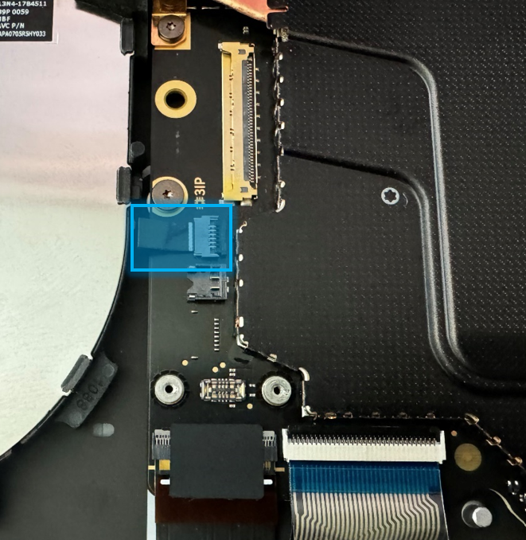

17. **Disconnect the Keyboard FPC -** Flip the latch on the Motherboard
    to disengage the lock on the Keyboard FPC. Remove the Keyboard FPC
    from the connector on the Motherboard.

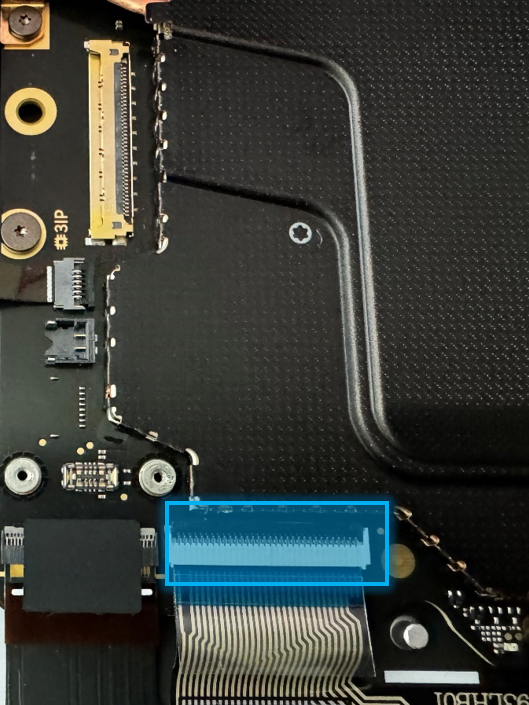

18. **Disconnect the Touch FPC –**

    1.  Remove the black tape covering the Touchpad FPC and the
        connector. Clean the surface with IPA and cleaning swabs to
        ensure all residual adhesive is removed.

> 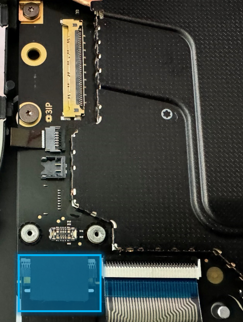 style="width:2.6in;height:3.45436in"
> alt="A close up of a computer Description automatically generated" />

2.  Flip the latch on the Motherboard to disengage the lock on the
    Touchpad FPC. Remove the Touchpad FPC from the connector on the
    Motherboard.

<!-- -->

19. **Disconnect the Keyboard Backlight FPC -** Flip the latch on the
    Motherboard to disengage the lock on the Keyboard Backlight FPC.
    Remove the Keyboard Backlight FPC from the connector on the
    Motherboard.

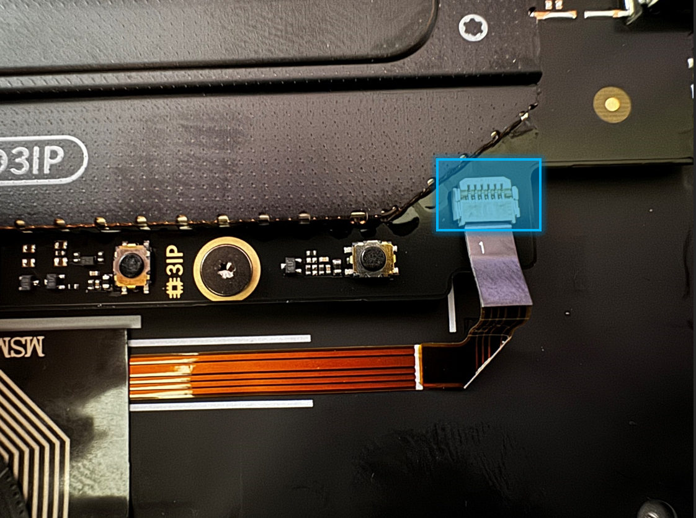

20. **Disconnect the Left Speaker -** To remove the connector from the
    Motherboard, pull up vertically on the wires until the connector
    comes free.

21. **Disconnect the Right Speaker -** To remove the connector from the
    Motherboard, pull up vertically on the wires until the connector
    comes free.

22. **Remove the Motherboard Steel Bracket –** Using a 3IP (Torx-Plus)
    Driver, remove the 1 screw holding the Motherboard Steel Bracket to
    the Enclosure.

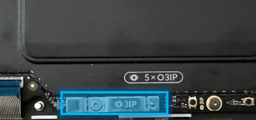

23. **Remove the Motherboard Shields–** Using ESD-Safe Tweezers,
    carefully remove the two metal shields identified below to expose
    the Motherboard screws underneath.

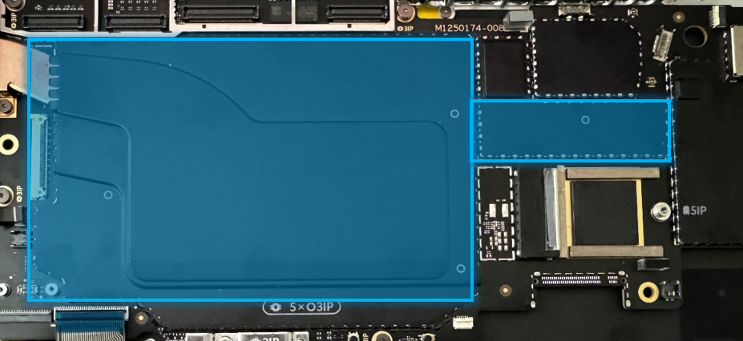

24. **Remove the Motherboard Screws -** Using a 3IP (Torx-Plus) driver,
    remove the 10 screws holding the Motherboard to the Chassis.

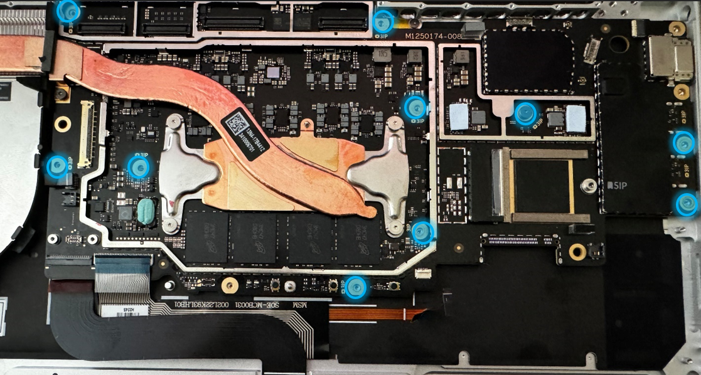

25. **Remove the Motherboard –** Using both hands, carefully lift the
    Motherboard out and up, taking care to avoid pulling on the thermal
    module or any connectors.

**Procedure – Installation (Motherboard)**

1.  **Install the Micro SD Reader Cable –** Insert the Micro SD Reader
    Cable into the connector on the bottom side of the Motherboard.

2.  **Install the Motherboard –**

**Important:** The Thermal Module should be installed onto the
Motherboard. Take caution during installation of the Motherboard to
avoid damage to the Thermal Module. Damage to the Thermal Module will
require replacement of the Motherboard or device.

1.  Lower the Motherboard USB-C side first into the device chassis.
    Ensure that the USB-C connectors fit in the corresponding holes in
    the Chassis.

2.  Lower the left side of the Motherboard and use your other hand to
    keep the component FPCs out of the way.

3.  Adjust the position of the Motherboard until all the hole’s line up
    with the screw bosses.

4.  Using a 3IP (Torx-Plus) driver, install 8 new Motherboard screws
    ()
    until just snug. Turn each screw another 45-degrees
    (1/8th turn) until fully fastened.

>  style="width:4.8in;height:2.56974in"
> alt="A close up of a circuit board Description automatically generated" />

5.  Using a 3IP (Torx-Plus) driver, install 2 new Motherboard screws
    ()
    until just snug. Turn each screw another 45-degrees
    (1/8th turn) until fully fastened.

> 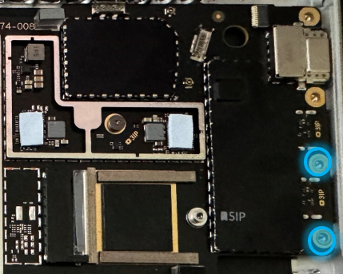 style="width:2.6in;height:2.07879in"
> alt="A close up of a circuit board Description automatically generated" />

**Important:** Ensure that the slots next to the thermal module screws
sit over the posts in the device chassis.

3.  **Assemble the T1 Shield –**

    1.  Using the provided syringe of thermal paste, apply the
        equivalent of 2 tick marks (marked on the side of the syringe)
        of thermal paste to the component marked below.

> 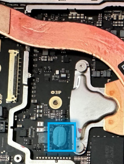 style="width:1.75704in;height:2.31956in"
> alt="A close up of a circuit board Description automatically generated" />

2.  Using the same syringe of thermal paste, apply the equivalent of ½
    ticket mark (marked on the side of the syringe) of thermal paste to
    the component marked below.

> 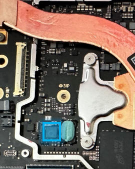 style="width:1.8751in;height:2.3404in"
> alt="A close up of a circuit board Description automatically generated" />

3.  Assemble and install a new T1 Shield.

<!-- -->

4.  **Assemble the Motherboard Steel Bracket -** Using a 3IP (Torx-Plus)
    driver, install 1 new screw ()
    until just snug, and then turn another 45-degrees (1/8th
    turn) until fully fastened.

5.  **Install the Removable Solid-State Drive –** Refer to [Procedure –
    Installation (Removable Solid-State
    Drive)](#removable-solid-state-drive-replacement) section of this
    document for detailed instructions.

6.  **Connect the Fan FPC -** Ensure the latch on the Motherboard
    receptable for the Fan FPC is in a vertical position before
    inserting the Fan FPC. Flip the latch on the Motherboard down to
    secure the Fan FPC.

7.  **Connect the Left Speaker wire -** Insert the speaker connector
    into the receptable on the Motherboard by pressing vertically until
    a snap is felt.

8.  **Connect the Right Speaker wire -** Insert the speaker connector
    into the receptable on the Motherboard by pressing vertically until
    a snap is felt.

9.  **Connect the Touchpad FPC -**

    1.  Ensure the latch on the Motherboard connector for the Touchpad
        FPC is in the vertical position before inserting the Touchpad
        FPC. Flip the latch on the Motherboard down to secure the
        Touchpad FPC.

    2.  Apply a new Touchpad FPC Tape across the FPC and the Motherboard
        connector.

>  style="width:2.6in;height:3.45436in"
> alt="A close up of a computer Description automatically generated" />

10. **Connect the Keyboard FPC -** Ensure the latch on the Motherboard
    connector for the Keyboard FPC is in a vertical position before
    inserting the Keyboard FPC. Flip the latch on the Motherboard down
    to secure the Keyboard FPC.

11. **Connect the Keyset Backlight FPC -** Ensure the latch on the
    Motherboard connector for the Keyset Backlight FPC is in a vertical
    position before inserting the Keyset Backlight FPC. Flip the latch
    on the Motherboard down to secure the Keyset Backlight FPC.

12. **Connect the Audio Jack FPC -** Ensure the latch on the Motherboard
    connector for the Audio Jack FPC is in the vertical position before
    inserting the Audio Jack FPC. Flip the latch on the Motherboard down
    to secure the Audio Jack FPC.

13. **Install new PSA -** Place a new piece of PSA down onto the Fan as
    shown.

14. **Install the Surface Connect Cable –** Insert the connector of the
    Surface Connect Cable into the receptacle on the Motherboard and
    close the latch to secure it. There should be a click if the
    connector is inserted correct and the latch is fully closed.

15. **Install the Display Assembly FPC’s, T3 Shield, and Antenna -**
    Refer to the [Procedure – Installation (Display
    Assembly)](#display-assembly-replacement) section of this document
    for detailed instructions.

16. **Install the Audio Jack -** Refer to the [Procedure – Installation
    (Audio Jack)](#audio-jack-replacement) section of this document for
    detailed instructions.

17. **Install the Battery - Refer** to the [Procedure – Installation
    (Battery)](#battery-replacement) section of this document for
    detailed instructions.

18. **Install the Enclosure –** Refer to [Procedure – Installation
    (Enclosure)](#enclosure-replacement) section of this document for
    detailed instructions.

**Procedure – Finalize (Motherboard)**

**Important:** If replacing both the Motherboard Module and the Display
Assembly – complete the Motherboard Module replacement prior to
performing the Display Assembly Replacement to ensure proper part
operation.

1.  **Power on Device –** Connect a Power Supply to the device and power
    it on until it reaches the Windows Desktop.

2.  **Connect USB –** Connect USB with the Surface Diagnostic Toolkit
    (SDT) loaded to an available USB port on the device under repair.

3.  **Launch SDT –** From the Windows Desktop, use Windows Explorer to
    navigate to the USB drive. Select the SDT executable (.exe) to
    launch the Surface Diagnostic Toolkit.

4.  **Run Touch Display Calibration –** From the SDT launch screen,
    select **Repair** from the drop-down menu. Next, select **Repair
    Setup and Validation** to enter the selection screen. Run the
    **Touch Display (Calibration)** tool to calibrate your new Display.
    Follow all on-screen instructions and allow the device to restart
    when prompted.

**Important:** If the calibration fails, reboot the device, and attempt
again. If the failure continues, then the Display may be faulty and
require replacement.

5.  **Allow the Battery to charge –** With the device connected to a
    power supply, allow the battery to charge until the battery icon in
    Windows reads at least 50% remaining battery charge.

6.  **Launch SDT –** Once the device has rebooted and is at the Windows
    Desktop, use Windows Explorer to navigate to the USB drive. Select
    the SDT executable (.exe) to launch the Surface Diagnostic Toolkit.

7.  **Run Battery Authentication –** From the SDT launch screen, select
    **Repair** from the drop-down menu. Next, select **Repair Setup and
    Validation** to enter the selection screen. Select the **Battery
    Repair (Validation)** tool to ensure the battery is detected as
    properly authenticated. If the battery reads anything other than
    authenticated, run the Validation tool in its entirety.

**Important:** Battery authentication requires a stable internet
connection and the latest version of the [Surface Management
Extension](https://apps.microsoft.com/detail/9NCT159F4QVG?hl=en-US&gl=US).
If the battery validation tool fails or is not detected properly,
install the Surface Management Extension, reboot the device, and try
again with a new internet connection. If failures continue, reach out to
Microsoft Support.

8.  **Run the Surface Diagnostic Toolkit (SDT) –** Run all diagnostics
    to ensure the device is functioning as expected before moving
    forward.

9.  **Install Feet –** Refer to [Procedure – Installation
    (Feet)](#_Feet_Replacement_Process) for steps to install Feet.

## Keyboard Replacement Process

**Preliminary Requirements**

**Important:** Be sure to follow all special (bolded) notes of caution
within each process section.

**Required Tools**

- Plastic Opening Pick

- Nylon Spudger

- ESD-Safe Tweezers

- Soft ESD-Safe Mat

- 6IP (Torx-Plus) Driver

- 5IP (Torx-Plus) Driver

- 3IP (Torx-Plus) Driver

- 2IP (Torx-Plus) Driver

- Isopropyl alcohol (91% or greater)

- Cleaning swabs

- Anti-Static wrist strap (1M Ohm resistance)

- USB drive loaded with the Surface Diagnostic Toolkit

**Primary Components**

- Keyboard Assembly (Refer to the Illustrated Service Parts List)

  - M1301718 Screws x 4 (Foot screws)

  - M1266593 Screws x 2 (Battery FPC Bracket)
    

  - M1272782 Screws x 8 (Battery) 

  - M1246215 Screws x 1 (Solid-State Drive)
    

  - M1265600 Screws x 1 (Hinge & Chassis)
    

  - M1274578 Screws x 14 (Antenna) 

  - M1212080 Screws x 1 (Audio Jack Bridge)
    

  - M1263960 Screws x 2 (Audio Jack)
    

  - M1235995 Screws x 8 (Motherboard)
    

  - M1263961 Screws x 2 (Motherboard)
    

  - M1277573 Screws x 1 (Motherboard)
    

  - M1211014 Screws x 4 (Speakers)

  - M1277572 Screws x 2 (Surface Connect)

  - M1235134 Screws x 3 (Fan)

  - M1249236 Screws x 4 (Mounting Brackets)

  - M1265416 Shield x 2 (Coax Cable Lid)

  - M1271279 Shield x 1 (T1 Shield

  - M1271924 Shield x 1 (T3 Shield)

  - M1288973 Foam x 1 (T3 Shield Foam \#1)

  - M1288974 Foam x 1 (T3 Shield Foam \#2)

  - M1287120 Tape x 1 (Touchpad FPC Tape)

  - M1167842 Tape x 1 (Right Speaker Tape)

  - M1019757 Syringe x 1 (Thermal Paste)

  - M1301902 PSA x 1 (Surface Connect & Fan)

**Additional Components (Ordered Separately)**

- Feet (Refer to the Illustrated Service Parts List)

**Procedure – Removal (Keyboard Assembly)**

1.  **Place Device –** Carefully place the closed device Display side
    down with the Feet facing up on a soft ESD-Safe Mat.

2.  **Remove the Feet –** Refer to the [Procedure – Removal
    (Feet)](#feet-replacement) section of this document for detailed
    instructions.

3.  **Remove the Enclosure –** Refer to the [Procedure – Removal
    (Enclosure)](#enclosure-replacement) section of this document for
    detailed instructions.

4.  **Remove the Removable Solid-State Drive -** Refer to the [Procedure
    – Removal (Removable Solid-State
    Drive)](#removable-solid-state-drive-replacement) section of this
    document for detailed instructions.

5.  **Remove the Audio Jack -** Refer to the [Procedure – Removal
    (Audio](#audio-jack-replacement) Jack) section of this document for
    detailed instructions.

6.  **Remove the Battery –** Refer to the [Procedure – Removal
    (Battery)](#battery-replacement) section of this document for
    detailed instructions.

7.  **Remove the Left Speaker –** Refer to the [Procedure – Removal
    (Left Speaker)](#left-speaker-replacement) section of this document
    for detailed instructions.

8.  **Remove the Right Speaker -** Refer to the [Procedure – Removal
    (Right Speaker)](#right-speaker-replacement) section of this
    document for detailed instructions.

9.  **Remove the Micro SD Reader –** Refer to the [Procedure – Removal
    (Micro SD Reader)](#micro-sd-reader-replacement) section of this
    document for detailed instructions.

10. **Remove the Display Assembly –** Refer to the [Procedure – Removal
    (Display Assembly)](#display-assembly-replacement) section of this
    document for detailed instructions.

11. **Remove the Surface Connect –** Refer to the [Procedure – Removal
    (Surface Connect)](#surface-connect-replacement) section of this
    document for detailed instructions.

12. **Remove the Motherboard -** Refer to the [Procedure – Removal
    (Motherboard)](#motherboard-replacement-process) section of this
    document for detailed instructions.

13. **Remove the Fan –** Using a 3IP (Torx-Plus) driver, remove the 3
    screws securing the Fan to the Keyboard Assembly. Remove the Fan
    from the device.

> 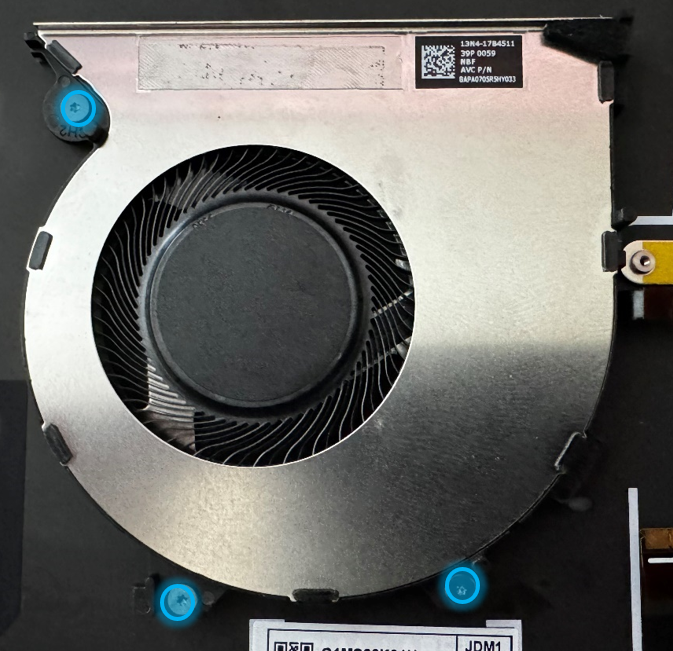 style="width:2.6in;height:2.51501in"
> alt="A close up of a fan Description automatically generated" />

14. **Remove the Mounting Brackets–** Using a 2IP (Torx-Plus) driver,
    remove the 2 screws holding each of the Mounting Brackets to the
    Keyboard Assembly. Remove the 2 Mounting Brackets from the device.

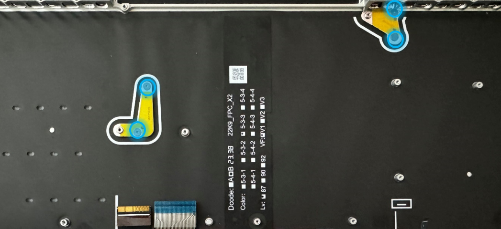

**Procedure – Installation (Keyboard Assembly)**

1.  **Install the Mounting Brackets –**

    1.  Place the 2 previously removed Mounting Brackets so that the
        yellow side is visible, and they are arranged as shown here.

>  style="width:2.6in;height:1.19194in"
> alt="A black board with white text and blue and yellow tape Description automatically generated" />

2.  Using a 2IP (Torx-Plus) driver, install 4 new Mounting Bracket
    screws until the screws are just snug, and then turn each another
    45-degrees (1/8th turn) until fully fastened.

<!-- -->

2.  **Install the Motherboard -** Refer to the [Procedure – Installation
    (Motherboard)](#motherboard-replacement-process) section of this
    document for detailed instructions. Complete steps 1-4 in that
    section.

3.  **Install the Removable Solid-State Drive –** Refer to [Procedure –
    Installation (Removable Solid-State
    Drive)](#removable-solid-state-drive-replacement) section of this
    document for detailed instructions.

4.  **Install the Fan -**

    1.  Using a 3IP (Torx-Plus) driver, install 3 new Fan screws until
        they are just snug, and then turn each another 45-degrees
        (1/8th turn) until fully fastened.

>  style="width:2.6in;height:2.51501in"
> alt="A close up of a fan Description automatically generated" />

2.  Ensure the latch on the Motherboard connector for the Fan is in a
    vertical position before inserting the Fan FPC. Flip the latch down
    to secure the Fan FPC.

<!-- -->

5.  **Install the Left Speaker -** Refer to [Procedure – Installation
    (Left Speaker)](#left-speaker-replacement) section of this document
    for detailed instructions.

6.  **Install the Right Speaker -** Refer to [Procedure – Installation
    (Right Speaker)](#right-speaker-replacement) section of this
    document for detailed instructions.

7.  **Continue with Motherboard installation -** Refer to the [Procedure
    – Installation (Motherboard)](#motherboard-replacement-process)
    section of this document for detailed instructions. You will start
    at Step 6.

8.  **Install the Display -** Refer to the [Procedure – Installation
    (Display)](#surface-connect-replacement) section of this document
    for detailed instructions.

9.  **Install the Audio Jack -** Refer to the [Procedure – Installation
    (Audio Jack)](#audio-jack-replacement) section of this document for
    detailed instructions.

10. **Install the Surface Connect -** Refer to the [Procedure –
    Installation (Surface Connect)](#surface-connect-replacement)
    section of this document for detailed instructions.

11. **Install the Battery -** Refer to the [Procedure – Installation
    (Battery)](#battery-replacement) section of this document for
    detailed instructions.

12. **Install the Enclosure -** Refer to the [Procedure – Installation
    (Enclosure)](#enclosure-replacement) section of this document for
    detailed instructions.

13. **Power on device –** Carefully place the device with the screen
    side facing up. Connect the device to a power supply and open the
    Display.

14. **Run the Surface Diagnostic Toolkit (SDT) –** Sitting at the
    desktop, insert the USB drive containing SDT and launch the program.
    Run all diagnostics to ensure the device is functioning as expected
    before moving forward.

15. **Power off the device –** Once the SDT tests have completed, power
    down the device and close the display. Invert the device so that the
    bottom of the device is facing up.

16. **Install the Feet -** Refer to the [Procedure – Installation
    (Feet)](#feet-replacement) section of this document for detailed
    instructions.

# Environmental Compliance Requirements

All waste electrical and electronic equipment (WEEE), waste electronic
components, waste batteries, and electronic waste residuals must be
managed according to applicable laws and regulations. and H09117,
“Conformance Standards for Environmentally Sound Management of Waste
Electrical and Electronic Equipment (WEEE)” which is available at this
link: <https://www.microsoft.com/en-pk/download/details.aspx?id=11691> .
In case of questions, please contact <AskECT@microsoft.com> .

©2024 Microsoft.
