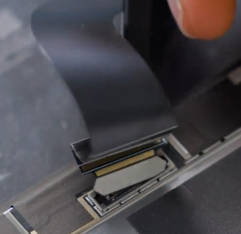
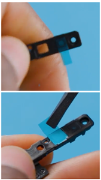

# Surface Pro 12-in Component Disassembly and Reassembly

> [!CAUTION]
> Review the [General Safety Precautions](surface-repair-safety-guidelines.md#general-safety-precautions) and [Battery Safety](surface-repair-safety-guidelines.md#battery-safety) guidelines in their entirety before proceeding with any repair steps.
> [!IMPORTANT]
> Read this Guide in its entirety before starting any repairs. If at any point you are unsure or uncomfortable about performing the repairs, as detailed in this Guide, **DO NOT** proceed. Contact Microsoft for additional support options.
> [!WARNING]
> Failure to follow the instructions in this Guide, use of non-Microsoft (non-genuine), incompatible, or modified replacement parts, and/or failure to use proper tools could result in serious injury, death, and/or damage to the product or other property.

## Prerequisite Steps

Steps outlined in this section should be conducted prior to starting any
repair on a Surface device.

- **Power off device –** Ensure the device is powered off completely and
  the battery has been fully discharged. Refer to the [Repair-Specific Precautions and Warnings](surface-repair-safety-guidelines.md#repair-specific-precautions-and-warnings) for guidelines.
  Once discharged, the device should be disconnected from all power
  sources.

- **ESD Prevention –** Ensure ESD prevention steps and general
  guidelines are followed prior to opening the device. Refer to the [ESD Prevention section](surface-repair-safety-guidelines.md#electrostatic-discharge-esd-precautions) for guidelines.

- **Position Device –** To prevent damage to the device, ensure the
  device is placed on a clean surface free of debris.

> [!IMPORTANT]
> During repair of the Surface Pro 12-inch, screws used to secure components in the device can be reused and are not provided in the FRU replacement kits. To obtain replacement screws, you will have to purchase the screw kit. Refer to the [Service Parts List](surface-pro-12in-device-information-and-service-parts.md#illustrated-service-parts-list) for the screw kit SKU and [Screw Map](surface-pro-12in-device-information-and-service-parts.md#surface-pro-12-inch-fru-screw-map) for screw type and tracking information.

## Kickstand Replacement Process

### Preliminary Requirements

> [!IMPORTANT]
> Be sure to follow all special (bolded) notes of caution within each process section.

**Required Tools**

- 3IP (Torx-Plus) driver

- Loctite 7649

- Loctite 243

- Soft ESD safe mat

- Microfiber cloth

**Primary Components**

- Kickstand (Refer to Illustrated Service Parts List)

**Optional Components (Ordered Separately)**

- Screw Kit (Refer to Illustrated Service Parts List)

  - Kickstand Screw (M1.6 x L2.0 3IP)

    - M1369669-001 for Platinum

    - M1369670-001 for Violet

    - M1369671-001 for Ocean

### Procedure Removal Kickstand

1.  **Place device screen-down on soft ESD-safe mat –** Ensure mat is
    clear of any abrasive material that may scratch the Touch Display
    Module (TDM) glass.

2.  **Extend the kickstand to approximately 120-degrees.**

    :::image type="content" source="./images/Surface_Pro_12in/Pro12_Repair/media/image2.png" alt-text="A hand holding a phone.":::

3.  **Remove the hinge screws –** Use your finger to hold the back of
    the kickstand behind the hinge. Using a 3IP (Torx-Plus) driver,
    remove one screw from each hinge. Ensure screws do not fall into the
    hinge opening.

    :::image type="content" source="./images/Surface_Pro_12in/Pro12_Repair/media/image3.png" alt-text="A camera on a metal hinge.":::

4.  **Angle Kickstand Down –** Firmly grip the hinges and the kickstand
    between thumb and index fingers. Rotate the kickstand from 120
    degrees to approximately 45 degrees.

    :::image type="content" source="./images/Surface_Pro_12in/Pro12_Repair/media/image4.png" alt-text="A person using a tablet.":::

5.  **Release Kickstand Threaded Bosses –** Using fingers on the underside of the kickstand and thumb on the topside, slightly rotate the kickstand about the axis as shown below. The kickstand should rotate ~5 degrees to free the two threaded bosses of the kickstand from the recesses of the hinges
    :::image type="content" source="./images/Surface_Pro_12in/Pro12_Repair/media/image5.png" alt-text="A person using a computer.":::

6.  **Remove Kickstand –** Using the palm of your hand, firmly hold the
    device down from the center of the IBC. Simultaneously, grip the
    kickstand off-center between your thumb and index finger and firmly
    pull. Pull with a moderate amount of force until the foam inserts
    slide out of the device. If the kickstand is stuck, ensure the
    threaded bosses have not slipped back into the recess on the hinges.

    :::image type="content" source="./images/Surface_Pro_12in/Pro12_Repair/media/image6.png" alt-text="A person holding a white box.":::

    :::image type="content" source="./images/Surface_Pro_12in/Pro12_Repair/media/image8.png" alt-text="A battery with a red x and green ticks.":::

> [!WARNING]
> Inspect the Kickstand foam tabs – damaged foam or tabs cannot be safely removed. Attempting to do so can result in damage to internal components. Do not insert anything other than the tabs into the slots. Ensure both tabs are complete and show no signs of tearing. If tabs show signs of tearing, part of the foam may still be inside the device. Do not attempt to remove it from the interior of the device, instead proceed to the [Procedure Removal Enclosure](#procedure-removal-enclosure) to replace the old enclosure.

### Procedure Installation Kickstand

> [!IMPORTANT]
> Use caution when handling new kickstand assembly to avoid cosmetic damage of the kickstand and the device.

1.  **Apply thread locker to screws –** Brush each of the new screws
    with Loctite 7649 Activator. Let each screw sit for 2 minutes after
    the applicator is applied before assembling the device.

    :::image type="content" source="./images/Surface_Pro_12in/Pro12_Repair/media/image10.png" alt-text="A hand holding a screwdriver":::

2.  **Insert Foam Tabs –** With the hinges still at ~ 45-degrees, start
    to slide the new kickstand’s foam tabs into the slots on the back of
    the device. Foam should slide in with minimal force – do not crumple
    the foam by using excess force. Do not slide the foams completely
    into the device – insert the foam tabs until ~3/4 of the foam tabs
    are inside the device.

    :::image type="content" source="./images/Surface_Pro_12in/Pro12_Repair/media/image12.png" alt-text="A person using a device to cut a piece of paper.":::

> [!CAUTION]
> Do not use any tool or sharp object to assist in inserting the tabs into the slots. Only the tabs should be inserted. Doing so could damage internal components.

3.  **Slot Outer Lip of Hinge into Kickstand –** Using fingers on the
    underside of the kickstand and thumb on the topside, slightly rotate
    the kickstand about the axis as shown below. The kickstand should
    rotate ~5-degrees to catch the outer lip of the hinge. Push the
    kickstand toward the device.

    :::image type="content" source="./images/Surface_Pro_12in/Pro12_Repair/media/image13.png" alt-text="A person holding a device.":::

4.  **Rotate the Kickstand Up –** Firmly grip the hinges and the
    kickstand between thumb and index fingers as shown below. Rotate the
    kickstand from 45-degrees to approximately 90-degrees.

    :::image type="content" source="./images/Surface_Pro_12in/Pro12_Repair/media/image14.png" alt-text="A person using a tablet.":::

5.  **Apply thread locker to screws bosses –** Apply one drop of Loctite
    243 thread locker to each screw boss.

    :::image type="content" source="./images/Surface_Pro_12in/Pro12_Repair/media/image15.png" alt-text="A white rectangular object with a blue dot":::

6.  **Install hinge screws –** Use your finger to hold the back of the
    kickstand behind the hinge while installing the screws with a 3IP
    (Torx-Plus) driver until they are fully seated in each hinge. Ensure
    the kickstand is properly aligned and seated in the hinges, then
    tighten the screws an additional ~quarter turn (~ 90-degrees). Be
    careful to tighten the screws only until snug to avoid stripping the
    kickstand threads. Ensure screws do not fall into hinge opening.

    :::image type="content" source="./images/Surface_Pro_12in/Pro12_Repair/media/image3.png" alt-text="A camera on a metal hinge.":::

7. **Final inspection Kickstand installation –** Fold the kickstand
    down and peel off protective plastic from the kickstand and logo if
    present. Verify the side edges of the kickstand are aligned with the
    midframe walls and there are no obvious steps/gaps between the
    kickstand and the enclosure.

8. **Clean the device –** Wipe the device thoroughly (including under
    the kickstand) with the microfiber cloth to remove any fingerprints.

## Display Module Replacement Process

### Preliminary Requirements

> [!IMPORTANT]
> Be sure to follow all special (bolded) notes of caution within each process section.

Required Tools

- 3IP (Torx-plus) driver

- Anti-static wrist strap (1 MOhm resistance)

- Microfiber / Lint free cloth

- Soft ESD-safe mat

- Isopropyl alcohol (91 % or greater IPA)

- Cleaning swab

- USB drive with Surface Diagnostic Toolkit

- Nylon Spudger

- Halberd Spudger

- ESD safe tweezers

- Plastic Opening pick

- Two 2-in spring clamps

- Metric ruler

- Fine tipped marker

- 3mm Allen Driver

- Foam Pad (see the Hardware Tools page for specifics)

- Display bonding weights (see the Hardware Tools page for
  specifics)

- [Surface Display Debonding Tool (M1214770-001) -  iFixit](https://www.ifixit.com/products/surface-display-debonding-tool-m1214770-001)

- [Surface Display Bonding Frame for Pro 12-inch (M1368685-001) - iFixit](https://www.ifixit.com/products/surface-vallejo-display-bonding-frame)

- [ESD-safe Surface Battery Cover -
  iFixit](https://www.ifixit.com/products/surface-battery-cover-m1214771-001)

**Primary Components**

- Display Module (Refer to Illustrated Service Parts List)

- Display Debonding Tape – M1369598-001

- 1 x TDM Shield Lid – M1352114-001

- 1 x TDM PSA Top – M1363597-001/M1352127-001

- 1 x TDM PSA Bottom – M1363594-001/M1368714-001

- 1 x TDM PSA Right – M1363596-001/M1368716-001

- 1 x TDM PSA Left – M1363595-001/M1368715-001

- 1 x Left Speaker Mesh – M1368712/13-001

- 1 x Right Speaker Mesh – M1368717/18-001

- 2 x Microphone Mesh – M1369585/86-001

- 1 x ACS diffuser – M1369587/88-001

- 1 x Display FPC – M1350322-001/M1350570-001

- 1 x NFC PSA – M1369582-001

- 1 x TIM Pad – M1369584-001

- 1 x T1 Shield Lid – M1369583-001

- 1 x T2 Shield Lid – M1369592-001

- 1 x T3 Top Shield Lid Gasket – M1352137/38-001

- 1 x Conductive tape 1 – M1337584/85-001

- 1 x Conductive tape 2 – M1357605/606-001

**Optional Components (Ordered Separately)**

- Screw Kit (Refer to Illustrated Service Parts List)

  - M1.2 x L1.5 3IP (Battery Bracket Screws)
    :::image type="icon" source="./images/Surface_Pro_12in/Pro12_Repair/media/image17.png" alt-text="A close-up of a screw.":::
    M1334202/203-001

### Procedure Preparation Display

> [!IMPORTANT]
> This section is only for instances where you are replacing the display. If the display is being re-used, then this section is not required. If display is unusable due to damage or fault, connect an external monitor to the device to perform these steps.
> [!IMPORTANT]
> Ensure the light levels of your work remain consistent during the software calibration process.

> [!WARNING]
>  **DO NOT** use a heat gun or hair dryer to de-bond the display

1.  **Connect USB –** Connect USB with the Surface Diagnostic Toolkit
    (SDT) loaded to an available USB port on the device under repair.

2.  **Power on device –** Connect a power supply to the device. Press
    the power button on the device to power the device on. Allow it to
    boot to the Windows Desktop before continuing.

3.  **Launch SDT –** From the Windows Desktop, use Windows Explorer to
    navigate to the USB drive. Select the SDT executable (.exe) to
    launch the Surface Diagnostic Toolkit.

4.  **Run Touch Display Setup –** From the SDT launch screen, select
    **Repair** from the drop-down menu. Next, select **Repair Setup and
    Validation** to enter the selection screen. Run the **Touch Display
    (Setup)** tool to prepare your device for display replacement.
    Follow all on-screen instructions and allow the device to shut down
    when prompted. Disconnect the Power Supply and remove the USB drive
    before proceeding forward.

5.  **Power Off Device** – Ensure the device is powered off by fully
    discharging the battery. Refer to the [Repair-Specific-Precautions-and-Warnings](surface-repair-safety-guidelines.md#repair-specific-precautions-and-warnings) section of the safety guidelines page. The device
    should be disconnected from a power supply and all cables and drives
    are removed.

### Procedure Removal Display

1.  **Apply Display Debonding Tape** – Wipe the surface of the display
    with a micro-fiber cloth and install the provided debonding tape
    (H-shaped tape) onto the front camera region of the display. Ensure
    that the front camera is centered within the circular cutout of the
    tape. Proceed to apply the rest of the tape around the enclosure

    :::image type="content" source="./images/Surface_Pro_12in/Pro12_Repair/media/image18.png" alt-text="A screen with a camera.":::

2.  **Remove the speaker meshes –** Close the kickstand and place the
    device face up on a clean surface. Using the opening pick, or
    plastic opening tool, widen the gap as shown by pushing the flat
    edge into the gap and moving it side to side along the device edge
    at the opening. The speaker mesh may crumple or fold into the
    devices – both results are okay as it will be removed entirely and
    replaced during installation. Repeat this process for the other
    speaker’s mesh.

    :::image type="content" source="./images/Surface_Pro_12in/Pro12_Repair/media/image19.png" alt-text="A drawing of a phone":::

3. **Debonding TDM Marking Pick Depth –** Using a metric ruler, draw a
    mark on the plastic pick at 3mm and 6mm.

    :::image type="content" source="./images/Surface_Pro_12in/Pro12_Repair/media/image20.png" alt-text="A blue and white object with medium confidence":::

4. **Prepare the Surface Display Debonding Tool** –

    1. Install the marked pick in the holder with the marks visible.
        Use a 3mm Allen Driver to adjust the pick height to the 3.5mm
        mark.

        :::image type="content" source="./images/Surface_Pro_12in/Pro12_Repair/media/image21.png" alt-text="A blue and grey object with a blue object in the middle with medium confidence":::

    2. Clamp the debonding tool to the edge of your workbench using a hand
        clamp on each side as shown in the image below. Ensure the cut depth
        adjustor can be accessed while the tool is clamped down. If it
        cannot be accessed, the clamps will have to be removed to access the
        bottom of the tool and then re-clamped after adjusting the height.

        :::image type="content" source="./images/Surface_Pro_12in/Pro12_Repair/media/image22.png" alt-text="A computer screen with a blue arrow pointing to the driver":::

5. **De-bond the Display** – The display of this device will follow the
    directional debonding process highlighted in the below image.

    1.  Ensure the pick height is at 3mm before starting. Place the
        right-side speaker edge of the device in the Surface Debonding
        Tool just above the marked pick. Ensure the pick enters the gap
        between the display and the enclosure edge.

    2.  While holding the device with both of your hands, push the
        device to the right through the Surface Debonding Tool track to
        cut through the right edge of the device. The device may be
        pushed side-to-side over the pick on this edge to ensure
        separation between the screen and the device. Do not push the
        device past the bottom right corner

        :::image type="content" source="./images/Surface_Pro_12in/Pro12_Repair/media/image23.png" alt-text="A diagram of a printer":::

    3.  Remove the device from the debonding fixture and place the
        left-side speaker edge of the device into the Surface Debonding
        Tool. Push the device to the left through the Surface Debonding
        Tool track to cut through the right edge of the device. The
        device may be pushed side-to-side over the pick on this edge to
        ensure separation between the screen and the device. Do not push
        the device past the bottom left corner.

        :::image type="content" source="./images/Surface_Pro_12in/Pro12_Repair/media/image23.png" alt-text="A diagram of a printer":::

6.  Remove the clamps holding the Surface Debonding Tool. Using a 3mm Allen Driver, adjust the pick height to the
    6mm mark. Re-clamp the debonding tool and place the device into the
    debonding tool at the left speaker edge. Push the device towards the
    top left corner and rotate it to cut through the top edge.

    :::image type="content" source="./images/Surface_Pro_12in/Pro12_Repair/media/image24.png" alt-text="A hand holding a black rectangular object.":::

> [!CAUTION]
> Stop pushing the device once the pick meets the debonding tape placed at the center of the top edge (shown in the red arrow). If the debonding pick goes over the front camera and damages the front camera foam gasket, you will have to replace the front camera with a new one.

7.  Remove the device from the Surface Debonding tool and place the
    device into the debonding tool at the right speaker edge. Push the
    device towards the top right corner and rotate it to cut through the
    top edge. **Stop** pushing the device once the pick meets the
    debonding tape placed at the center of the top edge. Remove the
    device from the debonding tool once this step is completed and place
    the device on the ESD safe mat, with the display facing upwards.

> [!CAUTION]
> Do not insert the pick more than 3mm along the left or    right edges of the display. The pick depth should not exceed 6mm along the top edge of the display. Do not insert the pick into the bottom edge of the display

8.  Remove the display debonding tape and insert the plastic opening
    tool into the right speaker opening of the device and gently move it
    from right to left along the top edge, separating the remaining
    adhesive around the front camera region.

    :::image type="content" source="./images/Surface_Pro_12in/Pro12_Repair/media/image25.png" alt-text="A hand holding a tablet.":::

9.  Rotate the device by 90⁰, with the left edge of the device facing
    you. Using the left and right speaker edges as holding points,
    gently lift the display from the enclosure until it is at a 45⁰
    angle to the bottom edge. Holding the display with one hand, insert
    the knife-edge of a Halberd Spudger into the bottom right corner of
    the display and cut through the bottom edge adhesive.

    :::image type="content" source="./images/Surface_Pro_12in/Pro12_Repair/media/image26.png" alt-text="A person using a tablet.":::

10. **Separate the Display Module from the enclosure** – Gently lift the
    display vertically away from the enclosure, slowly peeling off any
    residual adhesive. Be careful when lifting the edges of the display
    as it is still connected to the device by an FPC connected to the
    Motherboard. Flip the display so that the glass screen rests on the
    bottom edge of the device.

    :::image type="content" source="./images/Surface_Pro_12in/Pro12_Repair/media/image27.png" alt-text="A close up of a device.":::

> [!WARNING]
> It is recommended an ESD-safe Surface Battery Cover (highlighted with red arrow in picture above) is placed across the device from this point to protect the battery from any accidental damage during repair. Ensure the corners of the cover are always aligned with the corners of the device during repair. If the battery cover is misaligned during repair in any way, pause and re-align the cover before continuing.

11. **Begin Battery Shutoff Process** – Before proceeding to disconnect
    the Display FPC, you will need to shutoff the battery by
    disconnecting the battery connector from the Motherboard. This is to
    ensure electricity is not supplied to the device while the repair
    process is ongoing.

    1.  Using a pair of ESD-safe tweezers, remove the T3 Top shield lid
        gasket and the Conductive tape 2 respectively, as shown below.

        :::image type="content" source="./images/Surface_Pro_12in/Pro12_Repair/media/image28.png" alt-text="A close up of a device.":::

        :::image type="content" source="./images/Surface_Pro_12in/Pro12_Repair/media/image29.png" alt-text="remove Conductive tape 2":::

    2.  Remove the 2 screws
        () securing the battery
        connector bracket using a 3IP screwdriver and remove the bracket.

        :::image type="content" source="./images/Surface_Pro_12in/Pro12_Repair/media/image30.png" alt-text="A screwdriver on a device.":::

    3.  Gently disconnect the battery connector using a plastic spudger or
        plastic opening tool.

        :::image type="content" source="./images/Surface_Pro_12in/Pro12_Repair/media/image31.png" alt-text="A hand holding a tool.":::

12. **Disconnect the Display FPC** – Using a set of ESD-safe tweezers
    remove the shield lid over the display connector on the Display
    side. Lift at the corner of the shield lid as shown below. Proceed
    to disconnect the FPC connector by inserting the flat end of a
    plastic spudger.

    :::image type="content" source="./images/Surface_Pro_12in/Pro12_Repair/media/image32.png" alt-text="A person removing a piece of paper.":::
    

> [!IMPORTANT]
> Do not pull on the Display FPC to disconnect the display.

13. **Remove the Display FPC from Motherboard** –This step is only
    required if you are not re-using the original Display FPC. To remove
    the display FPC on the Motherboard side, follow the disassembly
    instructions below

    1.  **Remove Thermal Module** – Remove the conductive tape 1, T1
        Shield Lid, NFC FPC module, 7 screws
        (:::image type="icon" source="./images/Surface_Pro_12in/Pro12_Repair/media/image34.png" alt-text="A close-up of a screw.":::) and the Thermal Module. Refer to [Procedure Removal Thermal Module](#procedure-removal-thermal-module) for detailed instructions.

    2.  **Remove the T2 Shield Lid** – Using an ESD-safe tweezers,
        carefully remove the T2 shield lid

        :::image type="content" source="./images/Surface_Pro_12in/Pro12_Repair/media/image35.png" alt-text="A hand holding a black device.":::

    3.  **Remove the Display FPC** – Using the plastic opening tool or
        nylon spudger, remove the display FPC from the Motherboard by
        gently lifting at the top edge of the FPC.

        :::image type="content" source="./images/Surface_Pro_12in/Pro12_Repair/media/image36.png" alt-text="A person using a tool to fix a circuit board.":::

14. **Remove the speaker mesh and residual adhesive from the enclosure
    and display** – Inspect the edges of the device and display and
    remove any adhesive with the Nylon spudger. Remove any remaining
    speaker mesh from the enclosure. Use the flat end of a nylon spudger
    to remove it by inserting the spudger between the speaker mesh and
    the enclosure. Confirm a successful removal of the speaker mesh and
    its adhesive by verifying the three cutouts of the enclosure are
    exposed, as shown below.

    :::image type="content" source="./images/Surface_Pro_12in/Pro12_Repair/media/image37.png" alt-text="A close up of a device.":::

15. **Clean enclosure** – Using IPA and cleaning swabs, clean any
    residual adhesive from the enclosure edge. Ensure the area around
    the cameras (top edge) is clean and free of any dust or other
    contamination. Wipe the area around the camera with a lint-free
    cloth. **AVOID** contact with the Front Camera lens.

> [!IMPORTANT]
> Avoid contact with the Front Camera Lens and do not use IPA to clean the outer edges of the Display

### Procedure Installation Display

> [!IMPORTANT]
> Verify the battery’s condition prior to beginning the installation of the display. Devices exhibiting battery issues as outlined in the [Lithium-Ion Battery Inspection](surface-repair-safety-guidelines.md#lithium-ion-battery-inspection) section of the safety guidelines require whole device replacement.
> [!IMPORTANT]
> Leave the protective cling on the new display during all installation steps to prevent damage to the display panel.
> [!IMPORTANT]
> Carefully inspect all internal areas of the enclosure for any loose foreign objects prior to installing the display.

1.  **Inspect Antenna Deck for Damage** – Check the Left and Right
    Antenna Deck for any “peel-off” damage using the images below for
    comparison. If either Antenna Deck is damaged (peel-off damage
    indicated with red arrows), replace it with a new one before
    proceeding. Refer to [Procedure Installation (Antenna
    Deck)](#procedure-installation-antenna-deck) for detailed
    instructions.

    :::image type="content" source="./images/Surface_Pro_12in/Pro12_Repair/media/image38.png" alt-text="A close-up of a computer.":::

2.  **Install ACS Diffuser and Microphone Mesh** – Inspect the
    microphone deck to observe if the ACS diffuser or two Microphone
    meshes are damaged or separated from the microphone deck. If
    damaged, remove them using a plastic tweezer, and replace them with
    the new materials provided in the repair kit.

    :::image type="content" source="./images/Surface_Pro_12in/Pro12_Repair/media/image39.png" alt-text="A close up of a device.":::

    :::image type="content" source="./images/Surface_Pro_12in/Pro12_Repair/media/image40.png" alt-text="A close-up of a small piece of plastic.":::

3.  **Install the Display FPC to the Motherboard** – If the Display FPC
    was disassembled from the Motherboard. Follow the steps below to
    install the Display FPC.

    1.  **Connect Display FPC to the Motherboard** – Align the Display FPC
        connector to the receptacle on the Motherboard using the gold-marked
        lines for reference on positioning. Once aligned, gently press on
        the connector to connect it to the Motherboard.

        :::image type="content" source="./images/Surface_Pro_12in/Pro12_Repair/media/image41.png" alt-text="A close up of a circuit board.":::

> [!IMPORTANT]
> If the Display FPC is not aligned properly and is pressed upon, the connector pins will be damaged and the FPC will need to be replaced with a new one.

4.  **Install the T2 Shield Lid** - Remove the release papers from the
    TIM pads on the T2 shield lid. Assemble the shield lid in the
    direction indicated below, pressing around the shield cover with
    your hand. Check to ensure that there is no damage or deformation to
    the shield snaps.

    :::image type="content" source="./images/Surface_Pro_12in/Pro12_Repair/media/image42.png" alt-text="A close up of a computer chip.":::

5.  **Install Thermal Module** – Re-apply a new TIM Pad and install the
    Thermal Module, 7 screws(:::image type="icon" source="./images/Surface_Pro_12in/Pro12_Repair/media/image34.png" alt-text="A close-up of a screw.":::) FPC, and conductive tape 1. Refer to [Procedure Installation Thermal Module](#procedure-installation-thermal-module) for detailed instructions.

6.  **Reconnect the Battery FPC to the Motherboard** – Follow the steps
    below to connect the battery connector to the Motherboard.

    1.  Align the battery FPC connector to the receptacle on the
        Motherboard using the gold-marked line as reference. Gently
        press on the connector to connect it.

    2.  Assemble the battery connector bracket and fasten it into the
        enclosure using the 2 bracket screws
        () and a 3IP
        screwdriver.

    3.  Install the Conductive tape 2 according to the orientation shown
        below. Start installation from bottom to top. Remove the blue
        liner after installation.

        :::image type="content" source="./images/Surface_Pro_12in/Pro12_Repair/media/image43.png" alt-text="A close up of a device.":::

    4.  Install the T3 Top Shield Lid gasket in the orientation shown.

        :::image type="content" source="./images/Surface_Pro_12in/Pro12_Repair/media/image44.png" alt-text="A person fixing a device.":::

7.  **Apply new Display Module Adhesive** – After cleaning the enclosure
    with IPA along with PSA bonding surfaces, wait at least 30 seconds
    before applying the new PSA strips to allow for the surface to dry
    completely. Carefully apply the 4 strips of PSA to the enclosure as
    shown in the image below. Ensure the orientation of the PSA matches
    the enclosure outline before removing any liners. Leave the blue
    liner on the PSA, as it will be removed at a later step.

    :::image type="content" source="./images/Surface_Pro_12in/Pro12_Repair/media/image45.png" alt-text="A close up of a device.":::

8.  **Install new Speaker Mesh** – Perform the following:

    1.  Place the display face-down on a clean ESD safe surface.

    2.  Wipe down the outer edges of the display with a lint-free cloth.

    3.  When re-installing the original display, ensure the outer edges
        are clean of any PSA residue.

    4.  Remove the protective liner from the Left Speaker Mesh.

    5.  Using the clear handle, align the mesh into the display speaker
        opening on the right side of the device.

    6.  Press on the mesh for 10 seconds to activate the adhesive.

    7.  Carefully remove the clear handle.

    8.  Repeat the process for the Right Speaker Mesh on the other side

    :::image type="content" source="./images/Surface_Pro_12in/Pro12_Repair/media/image46.png" alt-text="A close-up of the display.":::

> [!IMPORTANT]
> As the Display is facing down, the orientation of the
> Display is flipped vs what it will be when it is applied to the
> Device. The Left Speaker Mesh is applied to the Right side of the
> Display, in this orientation, and the Right Speaker Mesh is applied to
> the left side of the Display. Each Speaker Mesh is designed
> specifically to fit its specified side.

9.  **Connect the Display Module** – Lay the display face-down on the
    bottom edge of the enclosure as was done after separating the
    display from the enclosure. Reconnect the Display FPC onto the
    connector on the display. Press on the connector to ensure it is
    fully seated. Proceed to install a new shield lid over the FPC.
    Ensure all edges of the shield are snapped into place by pressing
    all around the shield edges with your finger.

10. **Install the Display Module onto the Enclosure** – While holding
    the display (with the screen facing up), remove the PSA liners from
    the Enclosure to expose the adhesive on all 4 edges. Align the
    display along the bottom edge first (Toe-in) and lower the rest of
    the display after alignment is found. Ensure that the glass sits
    flush in the enclosure and does not rest anywhere on top of the
    Enclosure tip.

    :::image type="content" source="./images/Surface_Pro_12in/Pro12_Repair/media/image47.png" alt-text="A drawing of a tablet":::

11. **Bond the adhesive** – Place the Surface Display Bonding Frame on
    the device according to the orientation shown in the picture below.
    Place a foam pad over the bonding frame. Place 32kg of weight on top
    of the foam pad and bonding frame. Leave weight in place for 2
    minutes to ensure PSA activation.

    :::image type="content" source="./images/Surface_Pro_12in/Pro12_Repair/media/image48.png" alt-text="Bonding frame over Display":::

    1.  Ruck Weight Configuration

        :::image type="content" source="./images/Surface_Pro_12in/Pro12_Repair/media/image49.png" alt-text="A screenshot of a weight scale":::

    2.  Steel Shot Bag Configuration

        :::image type="content" source="./images/Surface_Pro_12in/Pro12_Repair/media/image50.png" alt-text="A collage of different types of pillows":::

12. **After bonding inspection** – Remove the weighted items from the
    device. Lift the device carefully out of the frame to avoid damage.
    Inspect the display for scratches, cracks, large gaps, and ensure it
    is flush to the enclosure.

13. **Power on device to the Windows Desktop** – Connect the device to
    power and press the power button. Allow the device to boot to the
    Windows Desktop before moving to the [Procedure Finalize (Display Module)](#procedure-finalize-display) section.

### Procedure Finalize Display

> [!IMPORTANT]
> This section is only for instances where you are replacing the display. If the display is being re-used, then this section is not required. If display is unusable due to damage or fault, connect an external monitor to the device to perform these steps.

1.  **Connect USB –** Connect USB with the Surface Diagnostic Toolkit
    (SDT) loaded to an available USB port on the device under repair.

2.  **Launch SDT –** From the Windows Desktop, use Windows Explorer to
    navigate to the USB drive. Select the SDT executable (.exe) to
    launch the Surface Diagnostic Toolkit.

3.  **Run Touch Display Calibration –** From the SDT launch screen,
    select **Repair** from the drop-down menu. Next, select **Repair
    Setup and Validation** to enter the selection screen. Run the
    **Touch Display (Calibration)** tool to calibrate your new display.
    Follow all on-screen instructions and allow the device to restart
    when prompted.

> [!IMPORTANT]
> If the calibration fails, reboot the device, and attempt again. If the failure continues, then the display may be faulty and require replacement.

4.  **Launch SDT –** Once the device has rebooted and is at the Windows
    Desktop, use Windows Explorer to navigate to the USB drive. Select
    the SDT executable (.exe) to launch the Surface Diagnostic Toolkit.

5.  **Run the Surface Diagnostic Toolkit (SDT) –** Run all diagnostics
    to ensure the device is functioning as expected before moving
    forward.

6.  **Final inspection -** Remove the protective cling from the display.
    Verify the side edges of the display are still flush, and that there
    are no obvious steps/gaps between the Display and the Enclosure.
    Wipe the device thoroughly (including under the kickstand) with a
    microfiber cloth to remove any fingerprints.

## Battery Replacement Process

### Preliminary Requirements

> [!IMPORTANT]
> Be sure to follow all special (bolded) notes of caution within each process section.

Required Tools

- 3IP (Torx-plus) driver

- Anti-static wrist strap (1 MOhm resistance)

- Microfiber / Lint free cloth

- Soft ESD-safe mat

- Isopropyl alcohol (91 % or greater IPA)

- Cleaning swab

- USB drive with Surface Diagnostic Toolkit

- Nylon Spudger

- Halberd Spudger

- ESD safe tweezers

- Plastic Opening pick

- Two 2-in spring clamps

- Metric ruler

- Fine tipped marker

- 3mm Allen Driver

- Foam Pad (see the Hardware Tools page for specifics)

- Display bonding weights (see the Hardware Tools page for
  specifics)

- [Surface Display Debonding Tool (M1214770-001) -
  iFixit](https://www.ifixit.com/products/surface-display-debonding-tool-m1214770-001)

- [Surface Display Bonding Frame for Pro 12-inch (M1368685-001) - iFixit](https://www.ifixit.com/products/surface-vallejo-display-bonding-frame)

- [ESD-safe Surface Battery Cover -
  iFixit](https://www.ifixit.com/products/surface-battery-cover-m1214771-001)

**Primary Components**

- Battery (Refer to Illustrated Service Parts List)

- Display Debonding Tape – M1369598-001

- 1 x TDM Shield Lid – M1352114-001

- 1 x TDM PSA Top – M1363597-001/M1352127-001

- 1 x TDM PSA Bottom – M1363594-001/M1368714-001

- 1 x TDM PSA Right – M1363596-001/M1368716-001

- 1 x TDM PSA Left – M1363595-001/M1368715-001

- 1 x Left Speaker Mesh – M1368712/13-001

- 1 x Right Speaker Mesh – M1368717/18-001

- 2 x Microphone Mesh – M1369585/86-001

- 1 x ACS diffuser – M1369587/88-001

- 1 x T3 Top Shield Lid Gasket – M1352137/38-001

- 1 x Conductive tape 2 – M1357605/606-001

- 1 x Battery FPC tape – M1369599/600-001

**Optional Components (Ordered Separately)**

- Screw Kit (Refer to Illustrated Service Parts List)

  - M1.2 x L1.5 3IP (Battery Bracket Screws)
     – M1334202/203-001

  - M1.6 \* L2.3 3IP (Battery Frame Screws)
     – M1341578/79-001

### Procedure Preparation Battery

> [!IMPORTANT]
> This section is only for instances where you are replacing the battery. If the battery is being re-used, then this section is not required.

1.  **Connect USB –** Connect USB with the Surface Diagnostic Toolkit
    (SDT) loaded to an available USB port on the device under repair.

2.  **Power on device –** Connect a power supply to the device. Press
    the power button on the device to power the device on. Allow it to
    boot to the Windows Desktop before continuing.

3.  **Launch SDT –** From the Windows Desktop, use Windows Explorer to
    navigate to the USB drive. Select the SDT executable (.exe) to
    launch the Surface Diagnostic Toolkit.

4.  **Run Battery Repair (Setup) –** From the SDT launch screen, select
    **Repair** from the drop-down menu. Next, select **Repair Setup and
    Validation** to enter the selection screen. Run the **Battery Repair
    (Setup)** to put your device into repair mode. Follow all on-screen
    instructions and allow the device to shut down when prompted.
    Disconnect the Power Supply and remove the USB drive before
    proceeding forward.

5.  **Power Off Device** – Ensure the device is powered off by fully
    discharging the battery. Refer to the [Repair-Specific-Precautions-and-Warnings](surface-repair-safety-guidelines.md#repair-specific-precautions-and-warnings) section of the safety guidelines page. The device
    should be disconnected from a power supply and all cables and drives
    are removed.

### Procedure Removal Battery

1.  **Remove the Display Module –** De-bond the Display using the
    Surface Debonding Tool. Remove the TDM shield lid and disconnect the
    battery connector
    () from the Motherboard to
    ensure complete battery shutoff. Refer to [Procedure Removal
    Display](#procedure-removal-display) for detailed instructions.

2.  **Remove the Battery Screws** – Remove the 7 screws
    () from the Battery frame
    using a 3IP (Torx-Plus) driver in the order shown below.

    :::image type="content" source="./images/Surface_Pro_12in/Pro12_Repair/media/image52.png" alt-text="A close up of a device.":::

3.  **Lift out the Battery from the Enclosure** – Using two hands, grab
    the battery by the points shown in the photo below and gently lift
    the battery out of the enclosure. Set the battery on a clean,
    ESD-safe, flat surface. If reusing the original battery in the case
    of an enclosure replacement, lift and install the battery directly
    into the new enclosure after inspecting the device for any foreign
    objects and screws.

    :::image type="content" source="./images/Surface_Pro_12in/Pro12_Repair/media/image53.png" alt-text="A hand holding a device.":::

> [!NOTE]
> If the Display FPC is still connected to the motherboard and rests on the battery, the battery will be removed by gently lifting it up from the screw bosses and towards the bottom side of the device. Ensure that the Display FPC connection is not bent at a 90⁰ angle.
> [!WARNING]
> Only handle the battery by the plastic frame. Bending, twisting, or impacting the battery may damage the battery, damage the device, and/or result in severe personal injury or property damage. Always use two hands when handling the battery.
> [!IMPORTANT]
> Place the battery somewhere where the battery cannot accidentally be contacted or damaged. **DO NOT** place anything on top of the battery.
> [!IMPORTANT]
> When disposing of the battery, ensure you are recycling according to local laws. See [Environmental Compliance Requirements](surface-environmental-compliance.md#environmental-compliance-requirements) for more details.
> [!IMPORTANT] 
> The Motherboard and Battery are very sensitive to ESD
> and can be easily damaged. It is critical that you ensure proper
> grounding before performing any work on these parts.
> [!WARNING]
> In the instance of a battery event, submerge the entire device in a 1-gallon Enclosure filled with .5 gallons of clean sand. Ensure the entire device is submerged. **DO NOT** attempt to pick up the device.

### Procedure Installation Battery

1.  **Inspect the device** **–** Check the device for any loose articles
    that may be present. Perform the following actions:

    1.  Check and remove any foreign objects that the magnets may have
        attracted.

    2.  Pay special attention to the magnetized areas around the
        Enclosures edge.

    3.  Verify all removed screws are accounted for and have not been
        misplaced inside the device.

    4.  Loose screws should never be stored on the magnetic areas of the
        Enclosure.

2.  **Insert the new Battery –** Carefully open the packaging of the
    battery. Pick up the battery using the handling loops and place it
    into the device. Align the holes so that the battery is set into
    place.

> [!WARNING]
> Only handle the new battery by the plastic loops.
> Bending, twisting, or impacting the battery may damage the battery,
> damage the device, and/or result in severe personal injury or property damage. Always use two hands when handling the battery.

3.  **Install the Battery screws –** Using a 3IP (Torx-plus) driver,
    install the 7 Battery frame screws
    () and then tighten each
    by an additional 1/8th turn (45⁰).

    :::image type="content" source="./images/Surface_Pro_12in/Pro12_Repair/media/image52.png" alt-text="A close up of a device.":::

> [!IMPORTANT]
> Be careful not to overtighten screws. If the Battery
> frame is cracked or the battery is damaged in any way during
> installation, it cannot be used and must be replaced.

4.  **Remove the liner –** Once all screws are seated, hold onto one of
    the left or right tabs of the battery liner and peel the liner away
    from the Battery. If you are working on other components, apply the
    ESD-safe Surface Battery Cover to ensure the Battery is protected.

5.  **Install Battery FPC Tape –** If the T1 Shield Lid has not been
    disassembled, remove the old battery FPC tape on the bottom left of
    the shield and replace it with a new one provided in the replacement
    kit in the orientation shown in the picture below.

    :::image type="content" source="./images/Surface_Pro_12in/Pro12_Repair/media/image54.png" alt-text="A close-up of a black sticker.":::

6.  **Install** **the Display Module** – Re-assemble the battery
    connector () and install the
    conductive tape 2 and the T3 Lid gasket. Align new PSA strips and
    install new speaker meshes on the display. Reconnect the TDM FPC and
    install the TDM Shield lid. Align the display on the bottom edge and
    press onto the device. Use the bonding frame tool to apply weight.
    Refer to [Procedure Installation (Display
    Module)](#procedure-installation-display) for detailed instructions.

### Procedure Finalize Battery

1.  **Power on Device –** Connect a Power Supply to the device and power
    it on until it reaches the Windows Desktop.

2.  **Connect USB –** Connect USB with the Surface Diagnostic Toolkit
    (SDT) loaded to an available USB port on the device under repair.

3.  **Launch SDT –** From the Windows Desktop, use Windows Explorer to
    navigate to the USB drive. Select the SDT executable (.exe) to
    launch the Surface Diagnostic Toolkit.

4.  **Allow the Battery to charge –** With the device connected to a
    power supply, allow the battery to charge until the battery icon in
    Windows reads at least 50% remaining battery charge.

5.  **Run Battery Authentication –** From the SDT launch screen, select
    **Repair** from the drop-down menu. Next, select **Repair Setup and
    Validation** to enter the selection screen. Select the **Battery
    Repair (Validation)** tool and follow the on-screen prompts until
    successful authentication is completed.

> [!IMPORTANT]
> Battery authentication requires a stable internet
> connection and the latest version of the [Surface Diagnostic Toolkit](https://www.microsoft.com/en-us/download/details.aspx?id=100440&msockid=3356787f36696b570c686c1c37e16a08).
> If the battery validation tool fails or is not detected properly,
> install the Surface Management Extension, reboot the device, and try
> again with a new internet connection. If failures continue, reach out
> to Microsoft Support.

6.  **Run the Surface Diagnostic Toolkit (SDT) –** Run all diagnostics
    to ensure the device is functioning as expected before moving
    forward.

7.  **Power down device** – Power down device using the OS start menu.

## Microphone Module Replacement Process

### Preliminary Requirements

> [!IMPORTANT]
> Be sure to follow all special (bolded) notes of caution within each process section.

Required Tools

- 3IP (Torx-plus) driver

- Anti-static wrist strap (1 MOhm resistance)

- Microfiber / Lint free cloth

- Soft ESD-safe mat

- Isopropyl alcohol (91 % or greater IPA)

- Cleaning swab

- USB drive with Surface Diagnostic Toolkit

- Nylon Spudger

- Halberd Spudger

- ESD safe tweezers

- Plastic Opening pick

- Two 2-in spring clamps

- Metric ruler

- Fine tipped marker

- 3mm Allen Driver

- Foam Pad (see the Hardware Tools page for specifics)

- Display bonding weights (see the Hardware Tools page for
  specifics)

- [Surface Display Debonding Tool (M1214770-001) -
  iFixit](https://www.ifixit.com/products/surface-display-debonding-tool-m1214770-001)

- [Surface Display Bonding Frame for Pro 12-inch (M1368685-001) - iFixit](https://www.ifixit.com/products/surface-vallejo-display-bonding-frame)

- [ESD-safe Surface Battery Cover -
  iFixit](https://www.ifixit.com/products/surface-battery-cover-m1214771-001)

**Primary Components**

- Microphone Module (Refer to Illustrated Service Parts List)

- Display Debonding Tape – M1369598-001

- 1 x TDM Shield Lid – M1352114-001

- 1 x TDM PSA Top – M1363597-001/M1352127-001

- 1 x TDM PSA Bottom – M1363594-001/M1368714-001

- 1 x TDM PSA Right – M1363596-001/M1368716-001

- 1 x TDM PSA Left – M1363595-001/M1368715-001

- 1 x Left Speaker Mesh – M1368712/13-001

- 1 x Right Speaker Mesh – M1368717/18-001

- 2 x Microphone Mesh – M1369585/86-001

- 1 x ACS diffuser – M1369587/88-001

- 1 x T3 Top Shield Lid Gasket – M1352137/38-001

- 1 x Conductive tape 2 – M1357605/606-001

- 2 x Microphone Mesh PSA – M1352125/26-001

- 1 x Thermal Paste 1cc – M1019757-006

**Optional Components (Ordered Separately)**

- Screw Kit (Refer to Illustrated Service Parts List)

  - M1.2 x L1.5 3IP (Battery Bracket Screws)
     – M1334202/203-001

  - M1.2 x L2.7 3IP (Microphone Deck Screws)
     – M1369668-001

  - M1.2 x L2.1 3IP (Microphone Board Screws)
     – M1341576/77-001

### Procedure Removal Microphone

1.  **Remove Display Module –** De-bond the Display using the Surface
    Debonding Tool. Remove the TDM shield lid and disconnect the battery
    connector () from the Motherboard to
    ensure complete battery shutoff. Refer to [Procedure Removal
    Display](#procedure-removal-display) for detailed instructions.

2.  **Remove the Microphone Deck** – Using a 3IP screwdriver, remove the
    3 screws () securing the deck to
    the enclosure in the order shown below. Carefully lift out the deck
    away from the enclosure using the plastic opening tool to lift it up
    from its edge.

    :::image type="content" source="./images/Surface_Pro_12in/Pro12_Repair/media/image57.png" alt-text="A close up of a device.":::

3.  **Remove the Left Microphone Board** – Using a 3IP screwdriver,
    remove the screw () securing the left
    microphone board to the enclosure. With the plastic opening tool or
    nylon spudger, gently lift on the edge of the board and disconnect
    it from the Motherboard.

    :::image type="content" source="./images/Surface_Pro_12in/Pro12_Repair/media/image58.png" alt-text="A close up of a device.":::

4.  **Clean the Thermal paste** – Clean any residue thermal paste
    underneath the left underneath the left microphone board using a
    cleaning swab.

    :::image type="content" source="./images/Surface_Pro_12in/Pro12_Repair/media/image59.png" alt-text="A close up of a device.":::

5.  **Remove the Right Microphone Board** – Using a 3IP screwdriver,
    remove the screw () securing the right
    microphone board to the enclosure. With the plastic opening tool or
    nylon spudger, gently lift on the edge of the board and disconnect
    it from the Motherboard.

    :::image type="content" source="./images/Surface_Pro_12in/Pro12_Repair/media/image60.png" alt-text="A close up of a device.":::

6.  **Remove Microphone Mesh PSA** - Using plastic tweezers, remove the
    old mesh PSA from the left and right microphone boards.

    :::image type="content" source="./images/Surface_Pro_12in/Pro12_Repair/media/image61.png" alt-text="A close up of a person holding a small device.":::

### Procedure Installation Microphone

1.  **Install Microphone Mesh PSA (Re-use only**) – This step is
    required only if you are re-using the microphone boards. If you are
    using a new set of microphones boards, move to step 2.

    1.  Remove the clear release paper from the microphone mesh PSAs and
        attach them to the left and right microphone boards using the
        gold-marked lines as locating reference.

        :::image type="content" source="./images/Surface_Pro_12in/Pro12_Repair/media/image62.png" alt-text="A close up of a finger.":::

    > [!IMPORTANT]
    >Ensure the mesh is not attached in a wrong position as
    > this will lead to poor sound quality.

2.  **Install the Right Microphone Board** – Align the right microphone
    board with the groove on the bucket, using the locating pins as
    reference for the top of the board, and the gold-marked line on the
    Motherboard as reference for the bottom of the board. Gently press
    on the board to connect it to the main Motherboard. Using a 3IP
    screwdriver, fasten the right microphone board screw
    (). Remove the blue
    release paper to expose the PSA.

    :::image type="content" source="./images/Surface_Pro_12in/Pro12_Repair/media/image63.jpeg" alt-text="A close-up of a device.":::

> [!IMPORTANT]
> Check to ensure that the coax cable of the right
> Antenna Deck does not run underneath the right microphone board but
> sits above or beside the board.

3.  **Apply Thermal Paste to the Enclosure** – Using the syringe
    provided in the replacement kit, apply half a grid of thermal paste
    (about 32mg) onto the location highlighted below

    :::image type="content" source="./images/Surface_Pro_12in/Pro12_Repair/media/image64.png" alt-text="A close-up of a blue device.":::

4.  **Install** **the Left Microphone Board** – Align the left
    microphone board with the groove on the bucket, using the locating
    pins as reference for the top of the board, and the gold-marked line
    on the Motherboard as reference for the bottom of the board. Gently
    press on the board to connect it to the main Motherboard. Using a
    3IP screwdriver, fasten the left microphone board screw
    (). Remove the blue
    release paper to expose the PSA.

    :::image type="content" source="./images/Surface_Pro_12in/Pro12_Repair/media/image65.jpeg" alt-text="A screwdriver on a device.":::

> [!IMPORTANT]
> Check to ensure that the coax cable of the left Antenna
> Deck does not run underneath the left microphone board but sits above
> or beside the board.

5.  **Install the Microphone Deck** – Follow the steps below to install
    the microphone deck.

    1.  **Re-assemble Microphone rubber** – Inspect the underside of the
        microphone deck to check that the 2 microphone rubbers are assembled
        into the deck. If they were removed during the de-bonding process,
        re-install them into the microphone deck. Ensure that they are
        installed in the proper orientation with the smooth side of the
        rubber facing outward as shown below.

        :::image type="content" source="./images/Surface_Pro_12in/Pro12_Repair/media/image66.png" alt-text="A close up of a finger.":::

    2.  **Install ACS Diffuser and Microphone Mesh** – Inspect the
        microphone deck to observe if the ACS diffuser or two Microphone
        meshes are damaged. If damaged, remove them using a plastic tweezer,
        and replace them with the new materials provided in the repair kit.

        :::image type="content" source="./images/Surface_Pro_12in/Pro12_Repair/media/image39.png" alt-text="A close up of a device.":::

        :::image type="content" source="./images/Surface_Pro_12in/Pro12_Repair/media/image40.png" alt-text="A close-up of a small piece of plastic.":::

    3.  **Fasten the Microphone Deck screws** – Assemble the microphone deck
        into position using the enclosure contours and alignment posts.
        Using a 3IP screwdriver, fasten the 3 screws
        () of the microphone deck
        into place in the order shown.

        :::image type="content" source="./images/Surface_Pro_12in/Pro12_Repair/media/image57.png" alt-text="A close up of a device.":::

6.  **Install** **the Display Module** – Re-assemble the battery
    connector () and install the
    conductive tape 2 and the T3 Lid gasket. Align new PSA strips and
    install new speaker meshes on the display. Reconnect the TDM FPC and
    install the TDM Shield lid. Align the display on the bottom edge and
    press onto the device. Use the bonding frame tool to apply weight.
    Refer to [Procedure Installation (Display Module)](#procedure-installation-display) for detailed instructions.

7.  **Power on device** – Carefully place device screen side up. Connect
    the device to a power supply, open display, and power on to the
    Windows desktop screen.

8. **Run the Surface Diagnostic Toolkit (SDT)** – Run SDT’s full
    diagnostic test to ensure device functions as expected.

## Front Camera Replacement Process

### Preliminary Requirements

> [!IMPORTANT]
> Be sure to follow all special (bolded) notes of caution within each process section.

Required Tools

- 3IP (Torx-plus) driver

- Anti-static wrist strap (1 MOhm resistance)

- Microfiber / Lint free cloth

- Soft ESD-safe mat

- Isopropyl alcohol (91 % or greater IPA)

- Cleaning swab

- USB drive with Surface Diagnostic Toolkit

- Nylon Spudger

- Halberd Spudger

- ESD safe tweezers

- Plastic Opening pick

- Two 2-in spring clamps

- Metric ruler

- Fine tipped marker

- 3mm Allen Driver

- Foam Pad (see the Hardware Tools page for specifics)

- Display bonding weights (see the Hardware Tools page for
  specifics)

- [Surface Display Debonding Tool (M1214770-001) -
  iFixit](https://www.ifixit.com/products/surface-display-debonding-tool-m1214770-001)

- [Surface Display Bonding Frame for Pro 12-inch (M1368685-001) - iFixit](https://www.ifixit.com/products/surface-vallejo-display-bonding-frame)

- [ESD-safe Surface Battery Cover -
  iFixit](https://www.ifixit.com/products/surface-battery-cover-m1214771-001)

**Primary Components**

- Front Camera (Refer to Illustrated Service Parts List)

- Display Debonding Tape – M1369598-001

- 1 x TDM Shield Lid – M1352114-001

- 1 x TDM PSA Top – M1363597-001/M1352127-001

- 1 x TDM PSA Bottom – M1363594-001/M1368714-001

- 1 x TDM PSA Right – M1363596-001/M1368716-001

- 1 x TDM PSA Left – M1363595-001/M1368715-001

- 1 x Left Speaker Mesh – M1368712/13-001

- 1 x Right Speaker Mesh – M1368717/18-001

- 2 x Microphone Mesh – M1369585/86-001

- 1 x ACS diffuser – M1369587/88-001

- 1 x NFC PSA – M1369582-001

- 1 x T1 Shield Lid – M1369583-001

- 1 x T3 Top Shield Lid Gasket – M1352137/38-001

- 1 x Conductive tape 1 – M1337584/85-001

- 1 x Conductive tape 2 – M1357605/606-001

- 2 x Microphone Mesh PSA – M1352125/26-001

- 1 x Front Camera PSA – M1369590/91-001

**Optional Components (Ordered Separately)**

- Screw Kit (Refer to Illustrated Service Parts List)

  - M1.2 x L1.5 3IP (Battery Bracket Screws)
     – M1334202/203-001

  - M1.2 x L2.7 3IP (Microphone Deck Screws)
     – M1369668-001

### Procedure Removal Front Camera

1.  **Remove the** **Display Module –** De-bond the Display using the
    Surface Debonding Tool. Remove the TDM shield lid and disconnect the
    battery connector
    () from the Motherboard to
    ensure complete battery shutoff. Refer to [Procedure Removal
    Display](#procedure-removal-display) for detailed instructions.

2.  **Remove conductive tape 1** – Using a pair of plastic tweezers,
    remove the conductive tape 1 from the T1 Shield Lid.

    :::image type="content" source="./images/Surface_Pro_12in/Pro12_Repair/media/image67.jpeg" alt-text="A close up of a computer.":::

3.  **Disconnect NFC FPC** – If your device is NFC-enabled, use a
    plastic spudger to disengage the NFC connector latch highlighted in
    the below picture and gently remove the NFC FPC from the connector.

    :::image type="content" source="./images/Surface_Pro_12in/Pro12_Repair/media/image68.jpeg" alt-text="A close up of a device.":::

4.  **Remove the T1 Shield Lid** – Using an ESD-safe tweezers, carefully
    remove the T1 shield lid identified below. If your device is
    NFC-enabled, do not discard the T1 Shield Lid as the NFC FPC will be
    reused during re-assembly.

    :::image type="content" source="./images/Surface_Pro_12in/Pro12_Repair/media/image69.jpeg" alt-text="A close up of a device.":::

5.  **Remove the Microphone Deck** – Using a 3IP screwdriver, remove the
    3 screws () securing the deck to
    the enclosure in the order shown below. Carefully lift out the deck
    away from the enclosure using the plastic opening tool to lift it up
    from its edge.

    :::image type="content" source="./images/Surface_Pro_12in/Pro12_Repair/media/image57.png" alt-text="A close up of a device.":::

6.  **Disconnect the Front Camera FPC** – Using the plastic opening
    tool, gently lift on the edge of the front camera FPC connector to
    disconnect it from the Motherboard.

    :::image type="content" source="./images/Surface_Pro_12in/Pro12_Repair/media/image70.jpeg" alt-text="A hand holding a blue tool.":::

7.  **Remove Front Camera** – Using the flat end of the plastic opening
    tool, position the tool underneath the bottom edge of the front
    camera and carefully lift to peel the front camera off the
    enclosure.

    :::image type="content" source="./images/Surface_Pro_12in/Pro12_Repair/media/image71.jpeg" alt-text="A close-up of a blue device.":::

8.  **Clean Front Camera PSA** – Using a pair of plastic tweezers or
    Nylon spudger, remove the old front camera PSA from the bucket
    and/or the camera. Clean the bucket area with IPA and cleaning
    swabs.

    :::image type="content" source="./images/Surface_Pro_12in/Pro12_Repair/media/image72.png" alt-text="A person using a small device.":::

### Procedure Installation Front Camera

1.  **Install the Front Camera PSA (Re-use only)** – This step is only
    required if the front camera is being re-used. If a new front camera
    is being used move to step 2. Remove the clear liner from the front
    camera PSA provided in the replacement kit. Align the PSA to the
    back of the front camera using the holes and cutout on the camera as
    guidance. Press firmly on the PSA against the camera for 10 seconds.

    :::image type="content" source="./images/Surface_Pro_12in/Pro12_Repair/media/image73.png" alt-text="A close-up of a finger holding a small piece of electronic device.":::

2.  **Prepare NFC FPC for re-assembly** – follow the instructions below
    to prepare the NFC module for re-assembly

    1.  Carefully remove the NFC module from the old T1 Shield Lid.

        :::image type="content" source="./images/Surface_Pro_12in/Pro12_Repair/media/image74.png" alt-text="A person holding a black object.":::

    > [!IMPORTANT]
    > Ensure that you do not start removal from the mid-section of the module as that will damage it permanently.

    2.  Clean any remnant adhesive from the back of the module using a
        cleaning swab and IPA.

    > [!IMPORTANT]
    > Use sparing amounts of IPA to clean the back surface of
    > the module as excessive use could cause the IPA to seep into the
    > module, damaging it.

    3.  Apply the new PSA provided in the replacement kit to the back of the
        NFC module, according to the picture below.

        :::image type="content" source="./images/Surface_Pro_12in/Pro12_Repair/media/image75.png" alt-text="A person holding a small device.":::

3.  **Install the Front Camera** – Remove the blue PSA liner at the back
    of the front camera. Using tweezers to handle the camera, install
    the camera using the locating pins for guidance. Gently press down
    on the camera firmly for 10 seconds. Remove the camera cover when
    finished (Only available in new front camera modules).

4.  **Connect the Front Camera FPC** – Using your fingers, or the flat
    end of a nylon spudger, press the Front Camera FPC into the
    connector on the Motherboard

5.  **Install the Microphone Deck** – Follow the steps below to install
    the microphone deck

    1.  **Re-assemble Microphone rubber** – Inspect the underside of the
        microphone deck to check that the 2 microphone rubbers are assembled
        into the deck. If they were removed during the de-bonding process,
        re-install them into the microphone deck. Ensure that they are
        installed in the proper orientation with the smooth side of the
        rubber facing outward as shown below.

        :::image type="content" source="./images/Surface_Pro_12in/Pro12_Repair/media/image66.png" alt-text="A close up of a finger.":::

    2.  **Install ACS Diffuser and Microphone Mesh** – Inspect the
        microphone deck to observe if the ACS diffuser or two Microphone
        meshes are damaged. If damaged, remove them using a plastic tweezer,
        and replace them with the new materials provided in the repair kit.

        :::image type="content" source="./images/Surface_Pro_12in/Pro12_Repair/media/image39.png" alt-text="A close up of a device.":::

        :::image type="content" source="./images/Surface_Pro_12in/Pro12_Repair/media/image40.png" alt-text="A close-up of a small piece of plastic.":::

    3.  **Fasten the Microphone Deck screws** – Assemble the microphone deck
        into position using the enclosure contours and alignment posts.
        Using a 3IP screwdriver, fasten the 3 screws
        ()of the microphone deck
        into place in the order shown.

        :::image type="content" source="./images/Surface_Pro_12in/Pro12_Repair/media/image57.png" alt-text="A close up of a device.":::

6.  **Install the T1 Shield**– Remove the release paper from the TIM pad
    on the T1 shield lid. Gently lift the battery cable and assemble the
    shield lid in the direction indicated below, pressing around the
    shield cover with your hand. Check to ensure that there is no damage
    or deformation to the shield snaps.

    :::image type="content" source="./images/Surface_Pro_12in/Pro12_Repair/media/image76.png" alt-text="A close up of a computer chip.":::

7.  **Assemble NFC FPC onto T1 Shield Lid** – If your device is an
    NFC-enabled device, connect the NFC module FPC into the ZIF
    connector, ensuring to engage the latch of connector. Remove the
    release paper backing of the module and assemble it onto the T1
    shield lid.

8.  **Install the Conductive Tape 1** – assemble the conductive tape 1
    onto the area marked below.

    :::image type="content" source="./images/Surface_Pro_12in/Pro12_Repair/media/image77.png" alt-text="A close up of a computer.":::

9.  **Install the Display Module** – Re-assemble the battery connector
    () and install the
    conductive tape 2 and the T3 Lid gasket. Align new PSA strips and
    install new speaker meshes on the display. Reconnect the TDM FPC and
    install the TDM Shield lid. Align the display on the bottom edge and
    press onto the device. Use the bonding frame tool to apply weight.
    Refer to [Procedure Installation (Display
    Module)](#procedure-installation-display) for detailed
    instructions**.**

10. **Power on device** – Carefully place device screen side up. Connect
    the device to a power supply, open display, and power on to the
    Windows desktop screen.

11. **Run the Surface Diagnostic Toolkit (SDT)** – Run SDT’s full
    diagnostic test to ensure device functions as expected.

## Infrared Camera Replacement Process

### Preliminary Requirements

> [!IMPORTANT]
> Be sure to follow all special (bolded) notes of caution within each process section.

Required Tools

- 3IP (Torx-plus) driver

- Anti-static wrist strap (1 MOhm resistance)

- Microfiber / Lint free cloth

- Soft ESD-safe mat

- Isopropyl alcohol (91 % or greater IPA)

- Cleaning swab

- USB drive with Surface Diagnostic Toolkit

- Nylon Spudger

- Halberd Spudger

- ESD safe tweezers

- Plastic Opening pick

- Two 2-in spring clamps

- Metric ruler

- Fine tipped marker

- 3mm Allen Driver

- Foam Pad (see the Hardware Tools page for specifics)

- Display bonding weights (see the Hardware Tools page for
  specifics)

- [Surface Display Debonding Tool (M1214770-001) -
  iFixit](https://www.ifixit.com/products/surface-display-debonding-tool-m1214770-001)

- [Surface Display Bonding Frame for Pro 12-inch (M1368685-001) - iFixit](https://www.ifixit.com/products/surface-vallejo-display-bonding-frame)

- [ESD-safe Surface Battery Cover -
  iFixit](https://www.ifixit.com/products/surface-battery-cover-m1214771-001)

**Primary Components**

- Infrared Camera (Refer to Illustrated Service Parts List)

- Display Debonding Tape – M1369598-001

- 1 x TDM Shield Lid – M1352114-001

- 1 x TDM PSA Top – M1363597-001/M1352127-001

- 1 x TDM PSA Bottom – M1363594-001/M1368714-001

- 1 x TDM PSA Right – M1363596-001/M1368716-001

- 1 x TDM PSA Left – M1363595-001/M1368715-001

- 1 x Left Speaker Mesh – M1368712/13-001

- 1 x Right Speaker Mesh – M1368717/18-001

- 2 x Microphone Mesh – M1369585/86-001

- 1 x ACS diffuser – M1369587/88-001

- 1 x NFC PSA – M1369582-001

- 1 x T1 Shield Lid – M1369583-001

- 1 x T3 Top Shield Lid Gasket – M1352137/38-001

- 1 x Conductive tape 1 – M1337584/85-001

- 1 x Conductive tape 2 – M1357605/606-001

- 2 x Microphone Mesh PSA – M1352125/26-001

- 1 x IR Camera PSA – M1369594/95-001

**Optional Components (Ordered Separately)**

- Screw Kit (Refer to Illustrated Service Parts List)

  - M1.2 x L1.5 3IP (Battery Bracket Screws)
     – M1334202/203-001

  - M1.2 x L2.7 3IP (Microphone Deck Screws)
     – M1369668-001

### Procedure Removal Infrared Camera

1.  **Remove the** **Display Module –** De-bond the Display using the
    Surface Debonding Tool. Remove the TDM shield lid and disconnect the
    battery connector
    () from the Motherboard to
    ensure complete battery shutoff. Refer to [Procedure Removal
    Display](#procedure-removal-display) for detailed instructions.

2.  **Remove conductive tape 1** – Using a pair of plastic tweezers,
    remove the conductive tape 1 from the T1 Shield Lid.

    :::image type="content" source="./images/Surface_Pro_12in/Pro12_Repair/media/image67.jpeg" alt-text="A close up of a computer.":::

3.  **Disconnect NFC FPC** – If your device is NFC-enabled, use a
    plastic spudger to disengage the NFC connector latch highlighted in
    the below picture and gently remove the NFC FPC from the connector.

    :::image type="content" source="./images/Surface_Pro_12in/Pro12_Repair/media/image68.jpeg" alt-text="A close up of a device.":::

4.  **Remove the T1 Shield Lid** – Using an ESD-safe tweezers, carefully
    remove the T1 shield lid identified below. If your device is
    NFC-enabled, do not discard the T1 Shield Lid as the NFC FPC will be
    reused during re-assembly.

    :::image type="content" source="./images/Surface_Pro_12in/Pro12_Repair/media/image78.jpeg" alt-text="A close up of a device.":::

5.  **Remove the Microphone Deck** – Using a 3IP screwdriver, remove the
    3 screws () securing the deck to
    the enclosure in the order shown below. Carefully lift out the deck
    away from the enclosure using the plastic opening tool to lift it up
    from its edge.

    :::image type="content" source="./images/Surface_Pro_12in/Pro12_Repair/media/image57.png" alt-text="A close up of a device.":::

6.  **Disconnect the IR Camera FPC** – Using the plastic opening tool,
    gently lift on the edge of the front camera FPC connector to
    disconnect it from the Motherboard.

    :::image type="content" source="./images/Surface_Pro_12in/Pro12_Repair/media/image79.jpeg" alt-text="An image related to the Surface Pro 12-inch repair process.":::

7.  **Remove IR Camera** – Using the flat end of the plastic opening
    tool, position the tool underneath the bottom edge of the front
    camera and carefully lift to peel the front camera off the
    enclosure.

    :::image type="content" source="./images/Surface_Pro_12in/Pro12_Repair/media/image80.jpeg" alt-text="A hand holding a blue tool.":::

8.  **Clean IR Camera PSA** – Using a pair of plastic tweezers or Nylon
    spudger, remove the old front camera PSA from the bucket and/or the
    camera. Clean the bucket area with IPA and cleaning swabs.

    :::image type="content" source="./images/Surface_Pro_12in/Pro12_Repair/media/image81.jpeg" alt-text="A close up of a device.":::

### Procedure Installation Infrared Camera

1.  **Install the IR Camera PSA** – Remove the bottom clear liner from
    the IR camera PSA provided in the replacement kit. Align the PSA to
    the enclosure region highlighted below using the enclosure outline
    as guidance. Press firmly on the PSA for 10 seconds.

    :::image type="content" source="./images/Surface_Pro_12in/Pro12_Repair/media/image82.png" alt-text="A close up of a device.":::

2.  **Prepare NFC FPC for re-assembly** – follow the instructions below
    to prepare the NFC module for re-assembly

    1.  Carefully remove the NFC module from the old T1 Shield Lid.

        :::image type="content" source="./images/Surface_Pro_12in/Pro12_Repair/media/image74.png" alt-text="A person holding a black object.":::
    >
    > [!IMPORTANT]
    > Ensure that you do not start removal from the
    > mid-section of the module as that will damage it permanently.

    2.  Clean any remnant adhesive from the back of the module using a
        cleaning swab and IPA.

    > [!IMPORTANT]
    > Use sparing amounts of IPA to clean the back surface of
    > the module as excessive use could cause the IPA to seep into the
    > module, damaging it.
    >
    3.  Apply the new PSA provided in the replacement kit to the back of the
        NFC module, according to the picture below.

        :::image type="content" source="./images/Surface_Pro_12in/Pro12_Repair/media/image75.png" alt-text="A person holding a small device.":::

3.  **Install the IR Camera** – Remove the blue PSA liner away from the
    IR camera PSA. Using tweezers to handle the camera, install the
    camera, using the right edge of the enclosure cutout as support for
    correct alignment. Gently press down on the camera firmly for 10
    seconds. Remove the camera cover when finished (Only available in
    new front camera modules).

4.  **Connect** **the IR Camera FPC** – Using your fingers, or the flat
    end of a nylon spudger, press the IR Camera FPC into the connector
    on the Motherboard.

5.  **Install the Microphone Deck** – Follow the steps below to install
    the microphone deck

    1.  **Re-assemble Microphone rubber** – Inspect the underside of the
        microphone deck to check that the 2 microphone rubbers are assembled
        into the deck. If they were removed during the de-bonding process,
        re-install them into the microphone deck. Ensure that they are
        installed in the proper orientation with the smooth side of the
        rubber facing outward as shown below.

        :::image type="content" source="./images/Surface_Pro_12in/Pro12_Repair/media/image66.png" alt-text="A close up of a finger.":::

    2.  **Install ACS Diffuser and Microphone Mesh** – Inspect the
        microphone deck to observe if the ACS diffuser or two Microphone
        meshes are damaged. If damaged, remove them using a plastic tweezer,
        and replace them with the new materials provided in the repair kit.

        :::image type="content" source="./images/Surface_Pro_12in/Pro12_Repair/media/image39.png" alt-text="A close up of a device.":::

        :::image type="content" source="./images/Surface_Pro_12in/Pro12_Repair/media/image40.png" alt-text="A close-up of a small piece of plastic.":::

    3.  **Fasten the Microphone Deck screws** – Assemble the microphone deck
        into position using the enclosure contours and alignment posts.
        Using a 3IP screwdriver, fasten the 3 screws
        () of the microphone deck
        into place in the order shown.

        :::image type="content" source="./images/Surface_Pro_12in/Pro12_Repair/media/image57.png" alt-text="A close up of a device.":::

6.  **Install the T1 Shield**– Remove the release paper from the TIM pad
    on the T1 shield lid. Gently lift the battery cable and assemble the
    shield lid in the direction indicated below, pressing around the
    shield cover with your hand. Check to ensure that there is no damage
    or deformation to the shield snaps.

    :::image type="content" source="./images/Surface_Pro_12in/Pro12_Repair/media/image76.png" alt-text="A close up of a computer chip.":::

7.  **Assemble NFC FPC onto T1 Shield Lid** – If your device is an
    NFC-enabled device, connect the NFC module FPC into the ZIF
    connector, ensuring to engage the latch of connector. Remove the
    release paper backing of the module and assemble it onto the T1
    shield lid.

8.  **Install the Conductive Tape 1** – assemble the conductive tape 1
    onto the area marked below.

    :::image type="content" source="./images/Surface_Pro_12in/Pro12_Repair/media/image77.png" alt-text="A close up of a computer.":::

9.  **Install the Display Module** – Re-assemble the battery connector
    () and install the
    conductive tape 2 and the T3 Lid gasket. Align new PSA strips and
    install new speaker meshes on the display. Reconnect the TDM FPC and
    install the TDM Shield lid. Align the display on the bottom edge and
    press onto the device. Use the bonding frame tool to apply weight.
    Refer to [Procedure Installation (Display
    Module)](#procedure-installation-display) for detailed
    instructions**.**

10. **Power on device** – Carefully place device screen side up. Connect
    the device to a power supply, open display, and power on to the
    Windows desktop screen.

11. **Run the Surface Diagnostic Toolkit (SDT)** – Run SDT’s full
    diagnostic test to ensure device functions as expected.

## Rear Camera Replacement Process

### Preliminary Requirements

> [!IMPORTANT]
> Be sure to follow all special (bolded) notes of caution within each process section.

Required Tools

- 3IP (Torx-plus) driver

- Anti-static wrist strap (1 MOhm resistance)

- Microfiber / Lint free cloth

- Soft ESD-safe mat

- Isopropyl alcohol (91 % or greater IPA)

- Cleaning swab

- USB drive with Surface Diagnostic Toolkit

- Nylon Spudger

- Halberd Spudger

- ESD safe tweezers

- Plastic Opening pick

- Two 2-in spring clamps

- Metric ruler

- Fine tipped marker

- 3mm Allen Driver

- Foam Pad (see the Hardware Tools page for specifics)

- Display bonding weights (see the Hardware Tools page for
  specifics)

- [Surface Display Debonding Tool (M1214770-001) -
  iFixit](https://www.ifixit.com/products/surface-display-debonding-tool-m1214770-001)

- [Surface Display Bonding Frame for Pro 12-inch (M1368685-001) - iFixit](https://www.ifixit.com/products/surface-vallejo-display-bonding-frame)

- [ESD-safe Surface Battery Cover -
  iFixit](https://www.ifixit.com/products/surface-battery-cover-m1214771-001)

**Primary Components**

- Rear Camera (Refer to Illustrated Service Parts List)

- Display Debonding Tape – M1369598-001

- 1 x TDM Shield Lid – M1352114-001

- 1 x TDM PSA Top – M1363597-001/M1352127-001

- 1 x TDM PSA Bottom – M1363594-001/M1368714-001

- 1 x TDM PSA Right – M1363596-001/M1368716-001

- 1 x TDM PSA Left – M1363595-001/M1368715-001

- 1 x Left Speaker Mesh – M1368712/13-001

- 1 x Right Speaker Mesh – M1368717/18-001

- 2 x Microphone Mesh – M1369585/86-001

- 1 x ACS diffuser – M1369587/88-001

- 1 x T3 Top Shield Lid Gasket – M1352137/38-001

- 1 x Conductive tape 2 – M1357605/606-001

- 1 x Conductive foam – M1369596-001

- 1 x T3 Top Shield Lid – M1368705-001

- 1 x Aluminum Foil Tape – M1357596/97-001

**Optional Components (Ordered Separately)**

- Screw Kit (Refer to Illustrated Service Parts List)

  - M1.2 x L1.5 3IP (Battery Bracket Screws)
     – M1334202/203-001

  - M1.2 x L1.9 3IP (Rear Camera Screws)
     – M1334206/07-001

### Procedure Removal Rear Camera

1.  **Remove the** **Display Module –** De-bond the Display using the
    Surface Debonding Tool. Remove the TDM shield lid and disconnect the
    battery connector
    () from the Motherboard to
    ensure complete battery shutoff. Refer to [Procedure Removal
    Display](#procedure-removal-display) for detailed instructions.

2.  **Remove the Aluminum foil tape** – Using a nylon spudger, remove
    the aluminum foil tape on the T3 top lid.

    :::image type="content" source="./images/Surface_Pro_12in/Pro12_Repair/media/image84.jpeg" alt-text="A hand holding a black tool.":::

3.  **Remove the T3 Top Shield Lid assembly** – Using plastic tweezers
    or a nylon spudger, remove the T3 top shield lid along with the tape
    that is attached to it.

    :::image type="content" source="./images/Surface_Pro_12in/Pro12_Repair/media/image85.jpeg" alt-text="A close up of a device.":::

4.  **Remove the Rear Camera FPC** – Using the plastic opening tool or a
    nylon spudger, gently pry up the rear camera FPC connector from
    bottom edge of the connector.

    :::image type="content" source="./images/Surface_Pro_12in/Pro12_Repair/media/image86.jpeg" alt-text="A hand holding a blue tool.":::

> [!NOTE]
> Avoid excessively bending the rear camera FPC when prying
> out the connector to prevent permanent damage to the FPC.

5.  **Remove the Rear Camera** – Using a 3IP screwdriver, remove the 2
    rear camera screws
    (). Gently peel the camera
    FPC away from the conductive foam underneath it and lift it out of
    the enclosure.

    :::image type="content" source="./images/Surface_Pro_12in/Pro12_Repair/media/image87.jpeg" alt-text="A close up of a screwdriver.":::

6.  **Remove the conductive foam** – Using your fingers, remove the
    conductive foam from the enclosure. Use IPA and cleaning swabs to
    clean off any residual adhesive on the laser-engraved region of the
    enclosure.

    :::image type="content" source="./images/Surface_Pro_12in/Pro12_Repair/media/image88.jpeg" alt-text="A hand holding a tool to a device.":::

### Procedure Installation Rear Camera

1.  **Install the conductive foam** – Remove the release paper on the
    bottom of the conductive foam and assemble it onto the
    laser-engraved area of the enclosure.

2.  **Install the Rear Camera** – Assemble the rear camera into the
    enclosure using the locating pins as reference. Using a 3IP
    screwdriver, fasten the 2 rear camera screws
    () into the enclosure.

    :::image type="content" source="./images/Surface_Pro_12in/Pro12_Repair/media/image87.jpeg" alt-text="A close up of a screwdriver.":::

3.  **Connect the Rear Camera FPC** – Remove the release paper on the
    top of the conductive foam, then connect the rear camera FPC
    connector to the Motherboard. Press the camera FPC against the
    conductive foam to activate the PSA underneath the FPC.

4.  **Assemble the T3 Top Shield Lid assembly**– Install the new T3 top
    shield lid provided in the replacement kit, ensuring all edges of
    the shield are snapped into place by pressing around the shield
    edge. Remove the release paper from the black tape attached to the
    shield lid. Using a pair of plastic tweezers, press down on the tape
    using the circular post for placement reference.

    :::image type="content" source="./images/Surface_Pro_12in/Pro12_Repair/media/image89.png" alt-text="A finger pressing a button on a device.":::

5.  **Assemble the Aluminum foil tape** – Remove the liner on the
    aluminum tape provided in the replacement kit. Use a pair of
    tweezers to assemble it, taking note of the cornered edge on the
    left-hand side. Press down at the step area and check that the foil
    is not damaged during assembly.

6.  **Install ACS Diffuser and Microphone Mesh** – Inspect the
    microphone deck to observe if the ACS diffuser or two Microphone
    meshes are damaged. If damaged, remove them using a plastic tweezer,
    and replace them with the new materials provided in the repair kit.

    :::image type="content" source="./images/Surface_Pro_12in/Pro12_Repair/media/image39.png" alt-text="A close up of a device.":::

7.  **Install the Display Module** – Re-assemble the battery connector
    () and install the
    conductive tape 2 and the T3 Lid gasket. Align new PSA strips and
    install new speaker meshes on the display. Reconnect the TDM FPC and
    install the TDM Shield lid. Align the display on the bottom edge and
    press onto the device. Use the bonding frame tool to apply weight.
    Refer to [Procedure Installation (Display
    Module)](#procedure-installation-display) for detailed
    instructions**.**

8.  **Power on device** – Carefully place device screen side up. Connect
    the device to a power supply, open display, and power on to the
    Windows desktop screen.

9.  **Run the Surface Diagnostic Toolkit (SDT)** – Run SDT’s full
    diagnostic test to ensure device functions as expected.

## Thermal Module Replacement Process

### Preliminary Requirements

> [!IMPORTANT]
> Be sure to follow all special (bolded) notes of caution within each process section.

Required Tools

- 3IP (Torx-plus) driver

- Anti-static wrist strap (1 MOhm resistance)

- Microfiber / Lint free cloth

- Soft ESD-safe mat

- Isopropyl alcohol (91 % or greater IPA)

- Cleaning swab

- USB drive with Surface Diagnostic Toolkit

- Nylon Spudger

- Halberd Spudger

- ESD safe tweezers

- Plastic Opening pick

- Two 2-in spring clamps

- Metric ruler

- Fine tipped marker

- 3mm Allen Driver

- Foam Pad (see the Hardware Tools page for specifics)

- Display bonding weights (see the Hardware Tools page for
  specifics)

- [Surface Display Debonding Tool (M1214770-001) -
  iFixit](https://www.ifixit.com/products/surface-display-debonding-tool-m1214770-001)

- [Surface Display Bonding Frame for Pro 12-inch (M1368685-001) - iFixit](https://www.ifixit.com/products/surface-vallejo-display-bonding-frame)

- [ESD-safe Surface Battery Cover -
  iFixit](https://www.ifixit.com/products/surface-battery-cover-m1214771-001)

**Primary Components**

- Thermal Module (Refer to Illustrated Service Parts List)

- Display Debonding Tape – M1369598-001

- 1 x TDM Shield Lid – M1352114-001

- 1 x TDM PSA Top – M1363597-001/M1352127-001

- 1 x TDM PSA Bottom – M1363594-001/M1368714-001

- 1 x TDM PSA Right – M1363596-001/M1368716-001

- 1 x TDM PSA Left – M1363595-001/M1368715-001

- 1 x Left Speaker Mesh – M1368712/13-001

- 1 x Right Speaker Mesh – M1368717/18-001

- 2 x Microphone Mesh – M1369585/86-001

- 1 x ACS diffuser – M1369587/88-001

- 1 x NFC PSA – M1369582-001

- 1 x T1 Shield Lid – M1369583-001

- 1 x T3 Top Shield Lid Gasket – M1352137/38-001

- 1 x Conductive tape 1 – M1337584/85-001

- 1 x Conductive tape 2 – M1357605/606-001

- 1 x TIM Pad – M1369584-001

**Optional Components (Ordered Separately)**

- Screw Kit (Refer to Illustrated Service Parts List)

  - M1.2 x L1.5 3IP (Battery Bracket Screws)
     – M1334202/203-001

  - M1.2 x L1.9 3IP (Thermal Module Screws)
     – M1334230/31-001

### Procedure Removal Thermal Module

1.  **Remove the Display Module –** De-bond the Display using the
    Surface Debonding Tool. Remove the TDM shield lid and disconnect the
    battery connector
    () from the Motherboard to
    ensure complete battery shutoff. Refer to [Procedure Removal
    Display](#procedure-removal-display) for detailed instructions.

2.  **Remove conductive tape 1** – Using a pair of plastic tweezers,
    remove the conductive tape 1 from the T1 Shield Lid.

    :::image type="content" source="./images/Surface_Pro_12in/Pro12_Repair/media/image67.jpeg" alt-text="A close up of a computer.":::

3.  **Disconnect NFC FPC** – If your device is NFC-enabled, use a
    plastic spudger to disengage the NFC connector latch highlighted in
    the below picture and gently remove the NFC FPC from the connector.

    :::image type="content" source="./images/Surface_Pro_12in/Pro12_Repair/media/image68.jpeg" alt-text="A close up of a device.":::

4.  **Remove the T1 Shield Lid** – Using an ESD-safe tweezers, carefully
    remove the T1 shield lid identified below. If your device is
    NFC-enabled, do not discard the T1 Shield Lid as the NFC FPC will be
    reused during re-assembly.

    :::image type="content" source="./images/Surface_Pro_12in/Pro12_Repair/media/image78.jpeg" alt-text="A close up of a device.":::

5.  **Remove the Thermal Module Screws** – Using a 3IP Screwdriver,
    remove the 7 screws
    () securing the thermal
    module to the Motherboard in the order shown below. Use caution not
    to lose any screws in the enclosure during the removal process.

    :::image type="content" source="./images/Surface_Pro_12in/Pro12_Repair/media/image90.png" alt-text="A close up of a device.":::

6.  **Remove the Thermal Module** – Using the plastic opening tool,
    gently apply light pressure under each edge of the thermal module to
    slowly separate the module from the thermal material underneath and
    the motherboard. Holding the thermal module securely with your
    hands, remove the module and set it aside.

    :::image type="content" source="./images/Surface_Pro_12in/Pro12_Repair/media/image91.png" alt-text="A person using a tool to remove the copper parts of a device.":::

7.  **Clean TIM residue from Motherboard** – Using a nylon spudger,
    scrape any TIM residue from the motherboard. Use IPA and a cleaning
    swab to clean any leftover residue.

    :::image type="content" source="./images/Surface_Pro_12in/Pro12_Repair/media/image92.png" alt-text="A person removing a chip from a computer.":::

8.  **Clean TIM residue from Thermal Module (Re-use only)** – If the
    thermal module is being reused, scrape any TIM residue from the area
    shown using a nylon spudger. Use IPA and a cleaning swab to clean
    any leftover residue.

    :::image type="content" source="./images/Surface_Pro_12in/Pro12_Repair/media/image93.png" alt-text="A person holding a chip.":::

### Procedure Installation Thermal Module

1.  **Apply new TIM Pad to Thermal Module (Re-use only)** – Carefully
    reapply the TIM material provided in the replacement kit onto the
    back of the thermal module.

    :::image type="content" source="./images/Surface_Pro_12in/Pro12_Repair/media/image94.png" alt-text="A person holding a small chip.":::
>
> [!NOTE]
> This step is only required if you are re-using the original
> Thermal Module. If you are installing a new Thermal Module, skip this
> step and begin at step 2

2.  **Prepare NFC FPC for re-assembly** – follow the instructions below
    to prepare the NFC module for re-assembly

    1.  Carefully remove the NFC module from the old T1 Shield Lid.

        :::image type="content" source="./images/Surface_Pro_12in/Pro12_Repair/media/image74.png" alt-text="A person holding a black object.":::

        > [!IMPORTANT]
        > Ensure that you do not start removal from the
        > mid-section of the module as that will damage it permanently.

    2.  Clean any remnant adhesive from the back of the module using a
        cleaning swab and IPA.

        > [!IMPORTANT]
        > Use sparing amounts of IPA to clean the back surface of
        > the module as excessive use could cause the IPA to seep into the
        > module, damaging it.

    3.  Apply the new PSA provided in the replacement kit to the back of the
        NFC module, according to the picture below.

        :::image type="content" source="./images/Surface_Pro_12in/Pro12_Repair/media/image75.png" alt-text="A person holding a small device.":::

3.  **Assemble the Thermal Module onto the Motherboard** – Remove the
    liner of the TIM on the thermal module and assemble it into place on
    the motherboard, using the locating posts as reference. Fasten the 7
    thermal module screws
    () in the order shown
    below using a 3IP screwdriver.

    :::image type="content" source="./images/Surface_Pro_12in/Pro12_Repair/media/image95.png" alt-text="A close up of a device.":::
>
> [!IMPORTANT]
> Take extra care not to bend or twist the Thermal
> Module. If any part of the Thermal Module or heat pipes are
> bent/deformed, then the whole module must be replaced.

4.  **Install the T1 Shield**– Remove the release paper from the TIM pad
    on the T1 shield lid. Gently lift the battery cable and assemble the
    shield lid in the direction indicated below, pressing around the
    shield cover with your hand. Check to ensure that there is no damage
    or deformation to the shield snaps.

    :::image type="content" source="./images/Surface_Pro_12in/Pro12_Repair/media/image76.png" alt-text="A close up of a computer chip.":::

5.  **Assemble NFC FPC onto T1 Shield Lid** – If your device is an
    NFC-enabled device, connect the NFC module FPC into the ZIF
    connector, ensuring to engage the latch of connector. Remove the
    release paper backing of the module and assemble it onto the T1
    shield lid.

6.  **Install the Conductive Tape 1** – assemble the conductive tape 1
    onto the area marked below.

    :::image type="content" source="./images/Surface_Pro_12in/Pro12_Repair/media/image77.png" alt-text="A close up of a computer.":::

7.  **Install ACS Diffuser and Microphone Mesh** – Inspect the
    microphone deck to observe if the ACS diffuser or two Microphone
    meshes are damaged. If damaged, remove them using a plastic tweezer,
    and replace them with the new materials provided in the repair kit.

    :::image type="content" source="./images/Surface_Pro_12in/Pro12_Repair/media/image39.png" alt-text="A close up of a device.":::

8.  **Install the Display Module** – Re-assemble the battery connector
    () and install the
    conductive tape 2 and the T3 Lid gasket. Align new PSA strips and
    install new speaker meshes on the display. Reconnect the TDM FPC and
    install the TDM Shield lid. Align the display on the bottom edge and
    press onto the device. Use the bonding frame tool to apply weight.
    Refer to [Procedure Installation (Display
    Module)](#procedure-installation-display) for detailed instructions.

9.  **Power on device** – Carefully place device screen side up. Connect
    the device to a power supply, open display, and power on to the
    Windows desktop screen.

10. **Run the Surface Diagnostic Toolkit (SDT)** – Run SDT’s full
    diagnostic test to ensure device functions as expected.

## Antenna Deck Replacement Process

### Preliminary Requirements

> [!IMPORTANT]
> Be sure to follow all special (bolded) notes of caution within each process section.

Required Tools

- 3IP (Torx-plus) driver

- Anti-static wrist strap (1 MOhm resistance)

- Microfiber / Lint free cloth

- Soft ESD-safe mat

- Isopropyl alcohol (91 % or greater IPA)

- Cleaning swab

- USB drive with Surface Diagnostic Toolkit

- Nylon Spudger

- Halberd Spudger

- ESD safe tweezers

- Plastic Opening pick

- Two 2-in spring clamps

- Metric ruler

- Fine tipped marker

- 3mm Allen Driver

- Foam Pad (see the Hardware Tools page for specifics)

- Display bonding weights (see the Hardware Tools page for
  specifics)

- [Surface Display Debonding Tool (M1214770-001) -
  iFixit](https://www.ifixit.com/products/surface-display-debonding-tool-m1214770-001)

- [Surface Display Bonding Frame for Pro 12-inch (M1368685-001) - iFixit](https://www.ifixit.com/products/surface-vallejo-display-bonding-frame)

- [ESD-safe Surface Battery Cover -
  iFixit](https://www.ifixit.com/products/surface-battery-cover-m1214771-001)

**Primary Components**

- Antenna Deck (Refer to Illustrated Service Parts List)

- Display Debonding Tape – M1369598-001

- 1 x TDM Shield Lid – M1352114-001

- 1 x TDM PSA Top – M1363597-001/M1352127-001

- 1 x TDM PSA Bottom – M1363594-001/M1368714-001

- 1 x TDM PSA Right – M1363596-001/M1368716-001

- 1 x TDM PSA Left – M1363595-001/M1368715-001

- 1 x Left Speaker Mesh – M1368712/13-001

- 1 x Right Speaker Mesh – M1368717/18-001

- 2 x Microphone Mesh – M1369585/86-001

- 1 x ACS diffuser – M1369587/88-001

- 1 x NFC PSA – M1369582-001

- 1 x T1 Shield Lid – M1369583-001

- 1 x T3 Top Shield Lid Gasket – M1352137/38-001

- 1 x Conductive tape 1 – M1337584/85-001

- 1 x Conductive tape 2 – M1357605/606-001

- 1 x TIM Pad – M1369584-001

- 1 x Antenna Cable Tape – M1369589-001

**Optional Components (Ordered Separately)**

- Screw Kit (Refer to Illustrated Service Parts List)

  - M1.2 x L1.5 3IP (Battery Bracket Screws)
     – M1334202/203-001

  - M1.2 x L1.9 3IP (Thermal Module Screws)
     – M1334230/31-001

  - M1.2 x L2.7 3IP (Microphone Deck Screws)
     – M1369668-001

  - M1.2 x L1.9 3IP (Antenna Deck Screws)
     – M1334230/31-001

### Procedure Removal Antenna Deck

1.  **Remove the Display Module –** De-bond the Display using the
    Surface Debonding Tool. Remove the TDM shield lid and disconnect the
    battery connector
    () from the Motherboard to
    ensure complete battery shutoff. Refer to [Procedure Removal
    Display](#procedure-removal-display) for detailed instructions.

2.  **Remove Thermal Module** – Remove the conductive tape 1, T1 Shield
    Lid, NFC FPC module, 7 screws
    () and the Thermal Module.
    Refer to [Procedure Removal (Thermal
    Module)](#procedure-removal-thermal-module) for detailed
    instructions.

3.  **Remove the Microphone Deck** – Using a 3IP screwdriver, remove the
    3 screws () securing the deck to
    the enclosure in the order shown below. Carefully lift out the deck
    away from the enclosure using the plastic opening tool to lift it up
    from its edge.

    :::image type="content" source="./images/Surface_Pro_12in/Pro12_Repair/media/image57.png" alt-text="A close up of a device.":::

4.  **Disconnect Front Camera and IR Camera FPC**– Using the plastic
    opening tool, carefully disconnect the front camera and IR camera
    FPC connectors from the Motherboard.

    :::image type="content" source="./images/Surface_Pro_12in/Pro12_Repair/media/image97.jpeg" alt-text="A hand holding a blue tool.":::

    :::image type="content" source="./images/Surface_Pro_12in/Pro12_Repair/media/image79.jpeg" alt-text="A hand holding a tool to a circuit board.":::

5.  **Disconnect the Antenna Coax cable connectors** – Using a nylon
    spudger or plastic opening tool, carefully disconnect the two Wifi
    antenna coax cables from the motherboard. Remove the left cable from
    the routing clips L1, L2, and L3 shown below. Remove the right cable
    from clips R1, and R2.

    :::image type="content" source="./images/Surface_Pro_12in/Pro12_Repair/media/image98.png" alt-text="A close up of a circuit board.":::

6.  **Remove the Left Antenna Deck** **screws** – Using a 3IP
    screwdriver, remove the 3 screws
    () securing the left
    antenna deck to the enclosure in the order shown below.

    :::image type="content" source="./images/Surface_Pro_12in/Pro12_Repair/media/image99.png" alt-text="A close up of a device.":::

7.  **Remove the Left Antenna Deck** – Remove the left antenna deck from
    the enclosure, using the plastic opening tool to lift it out from
    its position. Carefully peel off the antenna cable tape from the
    left magnet. Avoid crumpling the antenna cable tape as it can be
    re-used during re-assembly.

    :::image type="content" source="./images/Surface_Pro_12in/Pro12_Repair/media/image100.jpeg" alt-text="A close-up of a device.":::

8.  **Remove the Right Antenna Deck** **screws** – Using a 3IP
    screwdriver, remove the 3 screws
    () securing the right
    antenna deck to the enclosure in the order shown below.

    :::image type="content" source="./images/Surface_Pro_12in/Pro12_Repair/media/image101.png" alt-text="A close up of a device.":::

9.  **Remove the Right Antenna Deck** – Remove the right antenna deck
    from the enclosure, using the plastic opening tool to lift it out
    from its position. Carefully peel off the antenna cable tape from
    the right magnet. Avoid crumpling the antenna cable tape as it can
    be re-used during re-assembly.

### Procedure Installation Antenna Deck

1.  **Install a new Antenna Cable Tape (Re-use only)** – Remove the old
    cable tape from the original antenna deck. Attach the starting edge
    of the new cable tape to the silver/unsheathed area of the cable.
    Continuously wrap the tape around the cable, stopping once the
    release paper on the end of the tape is reached.

    :::image type="content" source="./images/Surface_Pro_12in/Pro12_Repair/media/image102.png" alt-text="A close up of a device.":::

> [!NOTE]
> This step is only required if you are reusing the original Antenna decks and the original cable tape is unfit for re-use (i.e. torn or crumpled).

2.  **Install Right Antenna Deck** – Assemble the right Antenna deck
    into the enclosure using the locating posts as guidance. Using a 3IP
    screwdriver, fasten the 3 Antenna deck
    () screws into the
    enclosure.

3.  **Install Left Antenna Deck** – Assemble the left Antenna deck into
    the enclosure using the locating posts as guidance. Using a 3IP
    screwdriver, fasten the 3 Antenna deck
    () screws into the
    enclosure.

4.  **Install Antenna Coax cable connectors** – Route the left Antenna
    cable through clips L1 and L2 in sequence, straightening it as you
    go. Then gently bent it to the right and guide it into clip L3.
    Route the right Antenna cable through clips R1 and R2.

    :::image type="content" source="./images/Surface_Pro_12in/Pro12_Repair/media/image98.png" alt-text="A close up of a circuit board.":::

5.  **Attach Antenna Cable Tape** – Remove the release paper on the back
    of the cable tapes for the left and right Antenna decks. Attach the
    tapes to the left and right enclosure magnets respectively

6.  **Install Front Camera and IR Camera FPC**– Using your fingers, or
    the flat end of a nylon spudger, press the Front Camera and IR
    Camera FPCs into the connector on the Motherboard.

7.  **Install the Microphone Deck** – Follow the steps below to install
    the microphone deck.

    1.  **Re-assemble Microphone rubber** – Inspect the underside of the
        microphone deck to check that the 2 microphone rubbers are assembled
        into the deck. If they were removed during the de-bonding process,
        re-install them into the microphone deck. Ensure that they are
        installed in the proper orientation with the smooth side of the
        rubber facing outward as shown below.

        :::image type="content" source="./images/Surface_Pro_12in/Pro12_Repair/media/image66.png" alt-text="A close up of a finger.":::

    2.  **Install ACS Diffuser and Microphone Mesh** – Inspect the
        microphone deck to observe if the ACS diffuser or two Microphone
        meshes are damaged. If damaged, remove them using a plastic tweezer,
        and replace them with the new materials provided in the repair kit.

        :::image type="content" source="./images/Surface_Pro_12in/Pro12_Repair/media/image39.png" alt-text="A close up of a device.":::

        :::image type="content" source="./images/Surface_Pro_12in/Pro12_Repair/media/image40.png" alt-text="A close-up of a small piece of plastic.":::

    3.  **Fasten the Microphone Deck screws** – Assemble the microphone deck
        into position using the enclosure contours and alignment posts.
        Using a 3IP screwdriver, fasten the 3 screws
        () of the microphone deck
        into place in the order shown.

        :::image type="content" source="./images/Surface_Pro_12in/Pro12_Repair/media/image57.png" alt-text="A close up of a device.":::

8.  **Install Thermal Module** – Re-apply a new TIM Pad and install the
    Thermal Module, 7 screws
    (), T1 Shield Lid, NFC
    FPC, and conductive tape 1. Refer to [Procedure Installation
    Thermal Module](#procedure-installation-thermal-module) for
    detailed instructions.

9.  **Install** **the Display Module** – Re-assemble the battery
    connector () and install the
    conductive tape 2 and the T3 Lid gasket. Align new PSA strips and
    install new speaker meshes on the display. Reconnect the TDM FPC and
    install the TDM Shield lid. Align the display on the bottom edge and
    press onto the device. Use the bonding frame tool to apply weight.
    Refer to [Procedure Installation (Display
    Module)](#procedure-installation-display) for detailed instructions.

10.  **Power on device** – Carefully place device screen side up. Connect
    the device to a power supply, open display, and power on to the
    Windows desktop screen.

11. **Run the Surface Diagnostic Toolkit (SDT)** – Run SDT’s full
    diagnostic test to ensure device functions as expected.

## Speaker Replacement Process

### Preliminary Requirements

> [!IMPORTANT]
> Be sure to follow all special (bolded) notes of caution within each process section.

Required Tools

- 3IP (Torx-plus) driver

- Anti-static wrist strap (1 MOhm resistance)

- Microfiber / Lint free cloth

- Soft ESD-safe mat

- Isopropyl alcohol (91 % or greater IPA)

- Cleaning swab

- USB drive with Surface Diagnostic Toolkit

- Nylon Spudger

- Halberd Spudger

- ESD safe tweezers

- Plastic Opening pick

- Two 2-in spring clamps

- Metric ruler

- Fine tipped marker

- 3mm Allen Driver

- Foam Pad (see the Hardware Tools page for specifics)

- Display bonding weights (see the Hardware Tools page for
  specifics)

- [Surface Display Debonding Tool (M1214770-001) -
  iFixit](https://www.ifixit.com/products/surface-display-debonding-tool-m1214770-001)

- [Surface Display Bonding Frame for Pro 12-inch (M1368685-001) - iFixit](https://www.ifixit.com/products/surface-vallejo-display-bonding-frame)

- [ESD-safe Surface Battery Cover -
  iFixit](https://www.ifixit.com/products/surface-battery-cover-m1214771-001)

**Primary Components**

- Speakers (Refer to Illustrated Service Parts List)

- Display Debonding Tape – M1369598-001

- 1 x TDM Shield Lid – M1352114-001

- 1 x TDM PSA Top – M1363597-001/M1352127-001

- 1 x TDM PSA Bottom – M1363594-001/M1368714-001

- 1 x TDM PSA Right – M1363596-001/M1368716-001

- 1 x TDM PSA Left – M1363595-001/M1368715-001

- 1 x Left Speaker Mesh – M1368712/13-001

- 1 x Right Speaker Mesh – M1368717/18-001

- 2 x Microphone Mesh – M1369585/86-001

- 1 x ACS diffuser – M1369587/88-001

- 1 x NFC PSA – M1369582-001

- 1 x T1 Shield Lid – M1369583-001

- 1 x T3 Top Shield Lid Gasket – M1352137/38-001

- 1 x Conductive tape 1 – M1337584/85-001

- 1 x Conductive tape 2 – M1357605/606-001

- 1 x TIM Pad – M1369584-001

**Optional Components (Ordered Separately)**

- Screw Kit (Refer to Illustrated Service Parts List)

  - M1.2 x L1.5 3IP (Battery Bracket Screws)
     – M1334202/203-001

  - M1.2 x L1.9 3IP (Thermal Module Screws)
     – M1334230/31-001

  - M1.2 x L1.9 3IP (Rear Camera Screws)
     – M1334206/07-001

  - M1.2 x L2.8 3IP (Speaker Screws)
     – M1352116/17-001

### Procedure Removal Speaker

1.  **Remove the Display Module –** De-bond the Display using the
    Surface Debonding Tool. Remove the TDM shield lid and disconnect the
    battery connector
    () from the Motherboard to
    ensure complete battery shutoff. Refer to [Procedure Removal
    Display](#procedure-removal-display) for detailed instructions.

2.  **Remove Thermal Module** – Remove the conductive tape 1, T1 Shield
    Lid, NFC FPC module, 7 screws
    () and the Thermal Module.
    Refer to [Procedure Removal (Thermal
    Module)](#procedure-removal-thermal-module) for detailed
    instructions.

3.  **Remove the Right Speaker** – Using a 3IP screwdriver, remove the 4
    screws () securing the right
    speaker and lift the speaker out of the enclosure.

    :::image type="content" source="./images/Surface_Pro_12in/Pro12_Repair/media/image104.png" alt-text="A close up of a device.":::

4.  **Disconnect the Left Speaker connector** – With a plastic spudger
    or pair of tweezers, disconnect the left speaker connector from the
    Motherboard.

    :::image type="content" source="./images/Surface_Pro_12in/Pro12_Repair/media/image105.jpeg" alt-text="A close up of a device.":::

5.  **Remove the Rear Camera** – Using a 3IP screwdriver, remove the 2
    screws () securing the rear
    camera. Once removed, gently lift the rear camera upwards to expose
    the top screw securing the left speaker. Refer to [Procedure    Removal Rear Camera](#procedure-removal-rear-camera) for detailed
    instructions to remove the Rear Camera if needed.

> [!NOTE]
> It is not required to remove the Rear Camera in its entirety
> to proceed to the next step

6.  **Remove the Left Speaker** – Using a 3IP screwdriver, remove the 4
    screws () securing the left
    speaker and lift the speaker out of the enclosure.

    :::image type="content" source="./images/Surface_Pro_12in/Pro12_Repair/media/image106.png" alt-text="A close up of a device.":::

### Procedure Installation Speaker

1.  **Install the Right Speaker** – Place the right speaker into the
    device, using the locating pins for guidance. Using a 3IP
    screwdriver, fasten the 4 screws
    () securing the right
    speaker.

2.  **Install the Left Speaker** – Place the left speaker into the
    device, using the locating pins for guidance. Using a 3IP
    screwdriver, fasten the 4 screws
    () securing the left
    speaker.

3.  **Install the Left Speaker Connector** – Install the left speaker
    connector to the Motherboard.

4.  **Install the Rear Camera** – Assemble the rear camera back into its
    position using the positioning pins for guidance. Using a 3IP
    screwdriver, install the 2 screws
    () securing the rear
    camera. Refer to [Procedure Installation (Rear
    Camera)](#procedure-installation-rear-camera) for detailed
    instructions on assembling the Rear Camera if needed.

5.  **Install the Thermal Module** – Re-apply a new TIM Pad and install
    the Thermal Module, 7 screws
    (), T1 Shield Lid, NFC
    FPC, and conductive tape 1. Refer to [Procedure Installation
    Thermal Module](#procedure-installation-thermal-module) for
    detailed instructions.

6.  **Install ACS Diffuser and Microphone Mesh** – Inspect the
    microphone deck to observe if the ACS diffuser or two Microphone
    meshes are damaged. If damaged, remove them using a plastic tweezer,
    and replace them with the new materials provided in the repair kit.

    :::image type="content" source="./images/Surface_Pro_12in/Pro12_Repair/media/image39.png" alt-text="A close up of a device.":::

7.  **Install** **the Display Module** – Re-assemble the battery
    connector () and install the
    conductive tape 2 and the T3 Lid gasket. Align new PSA strips and
    install new speaker meshes on the display. Reconnect the TDM FPC and
    install the TDM Shield lid. Align the display on the bottom edge and
    press onto the device. Use the bonding frame tool to apply weight.
    Refer to [Procedure Installation (Display
    Module)](#procedure-installation-display) for detailed instructions.

8.  **Power on device** – Carefully place device screen side up. Connect
    the device to a power supply, open display, and power on to the
    Windows desktop screen.

9.  **Run the Surface Diagnostic Toolkit (SDT)** – Run SDT’s full
    diagnostic test to ensure device functions as expected.

## Buttons Replacement Process

### Preliminary Requirements

> [!IMPORTANT]
> Be sure to follow all special (bolded) notes of caution within each process section.

Required Tools

- 3IP (Torx-plus) driver

- Anti-static wrist strap (1 MOhm resistance)

- Microfiber / Lint free cloth

- Soft ESD-safe mat

- Isopropyl alcohol (91 % or greater IPA)

- Cleaning swab

- USB drive with Surface Diagnostic Toolkit

- Nylon Spudger

- Halberd Spudger

- ESD safe tweezers

- Plastic Opening pick

- Two 2-in spring clamps

- Metric ruler

- Fine tipped marker

- 3mm Allen Driver

- Foam Pad (see the Hardware Tools page for specifics)

- Display bonding weights (see the Hardware Tools page for
  specifics)

- [Surface Display Debonding Tool (M1214770-001) -
  iFixit](https://www.ifixit.com/products/surface-display-debonding-tool-m1214770-001)

- [Surface Display Bonding Frame for Pro 12-inch (M1368685-001) - iFixit](https://www.ifixit.com/products/surface-vallejo-display-bonding-frame)

- [ESD-safe Surface Battery Cover -
  iFixit](https://www.ifixit.com/products/surface-battery-cover-m1214771-001)

**Primary Components**

- Buttons (Refer to Illustrated Service Parts List)

- Display Debonding Tape – M1369598-001

- 1 x TDM Shield Lid – M1352114-001

- 1 x TDM PSA Top – M1363597-001/M1352127-001

- 1 x TDM PSA Bottom – M1363594-001/M1368714-001

- 1 x TDM PSA Right – M1363596-001/M1368716-001

- 1 x TDM PSA Left – M1363595-001/M1368715-001

- 1 x Left Speaker Mesh – M1368712/13-001

- 1 x Right Speaker Mesh – M1368717/18-001

- 2 x Microphone Mesh – M1369585/86-001

- 1 x ACS diffuser – M1369587/88-001

- 1 x T3 Top Shield Lid Gasket – M1352137/38-001

- 1 x Conductive tape 2 – M1357605/606-001

- 2 x Microphone Mesh PSA – M1352125/26-001

- 1 x Antenna Cable Tape – M1369589-001

- 1 x Button Switch Board – M1356357-001

- 1 x Button Switch Board FPC – M1363598/99-001

- 1 x Switch Board FPC PSA – M1369597-001

- 1 x Power Button

  - Platinum – M1334232-001

  - Violet – M1337581-001

  - Ocean – M1334236-001

- 1 x Volume Button

  - Platinum – M1334233-001

  - Violet – M1337582-001

  - Ocean – M1334237-001

- 1 x Button Clip Assembly – M1356638-001

**Optional Components (Ordered Separately)**

- Screw Kit (Refer to Illustrated Service Parts List)

  - M1.2 x L1.5 3IP (Battery Bracket Screws)
     – M1334202/203-001

  - M1.2 x L2.7 3IP (Microphone Deck Screws)
     – M1369668-001

  - M1.2 x L1.9 3IP (Antenna Deck Screws)
     – M1334230/31-001

  - M1.2 x L1.9 3IP (Rear Camera Screws)
     – M1334206/07-001

  - M1.2 x L2.5 3IP (Button Switch Board Screws)
     – M1352134/35-001

### Procedure Removal Buttons

1.  **Remove the Display Module –** De-bond the Display using the
    Surface Debonding Tool. Remove the TDM shield lid and disconnect the
    battery connector
    () from the Motherboard to
    ensure complete battery shutoff. Refer to [Procedure Removal
    Display](#procedure-removal-display) for detailed instructions.

2.  **Remove** **the Microphone Deck** – Using a 3IP screwdriver, remove
    the 3 screws () securing the deck to
    the enclosure in the order shown below. Carefully lift out the deck
    away from the enclosure using the plastic opening tool to lift it up
    from its edge.

    :::image type="content" source="./images/Surface_Pro_12in/Pro12_Repair/media/image57.png" alt-text="A close up of a device.":::

3.  **Remove the Left Antenna Deck** – Using a 3IP screwdriver, remove
    the 3 screws () securing the left
    Antenna deck. Gently lift the Antenna deck out from the enclosure
    using a spudger or plastic opening tool to pry it from its side.
    Refer to [Procedure Removal (Antenna
    Deck)](#procedure-removal-antenna-deck) for detailed instructions to
    remove the Antenna Deck if needed.

> [!NOTE]
> It is not required to remove the Left Antenna Deck in its
> entirety to proceed to the next step

4.  **Remove** **the Rear Camera** – Using a 3IP screwdriver, remove the
    2 screws () securing the rear
    camera. Once removed, gently lift the rear camera upwards and to the
    side to expose the Button Switch Board. Refer to [Procedure
    Removal Rear Camera](#procedure-removal-rear-camera) for detailed
    instructions to remove the Rear Camera if needed.

> [!NOTE]
> It is not required to remove the Rear Camera in its entirety
> to proceed to the next step

5.  **Disconnect the Button Switch FPC** – Disengage the latch on the
    switch FPC Motherboard connector and remove the FPC from the
    connector.

    :::image type="content" source="./images/Surface_Pro_12in/Pro12_Repair/media/image108.png" alt-text="A person fixing a cell phone.":::

6.  **Remove the Button Switch Board and FPC** – Using a 3IP
    screwdriver, remove the 2 screws
    () securing the switch
    board. Lift the switchboard and FPC out of the enclosure, carefully
    peeling the cable away from the enclosure.

    :::image type="content" source="./images/Surface_Pro_12in/Pro12_Repair/media/image109.png" alt-text="A close-up of a machine.":::

7.  **Clean Button Switch FPC** –Using IPA and cleaning swabs, clean any
    adhesive residue from the bottom of the Button Switch FPC.

8.  **Remove the Button Clips** – Using a pair of plastic tweezers or a
    nylon spudger, remove the two button clips shown below from the
    enclosure.

    :::image type="content" source="./images/Surface_Pro_12in/Pro12_Repair/media/image110.png" alt-text="A hand holding a pair of tweezers.":::

9.  **Remove the Power and Volume Buttons** – Using a nylon spudger,
    push out the power and volume buttons from the enclosure.

    :::image type="content" source="./images/Surface_Pro_12in/Pro12_Repair/media/image111.png" alt-text="A close-up of a device.":::

### Procedure Installation Buttons

1.  **Assemble the SW FPC to the Button Switch board (New replacement
    set)** – Insert the switch FPC into the ZIF connector on the
    underside of the Button Switch board and engage the latch. Ensure
    that the FPC is properly aligned parallel to the connector and not
    bent.

    :::image type="content" source="./images/Surface_Pro_12in/Pro12_Repair/media/image112.jpeg" alt-text="A close up of a circuit board.":::

2.  **Install Button SW FPC PSA (Re-use only)** – This step is only
    required if you are reusing the original Button Switch FPC. Remove
    the liner on the Switch FPC PSA provided in the replacement kit and
    apply the PSA onto the underside of the SW FPC.

    :::image type="content" source="./images/Surface_Pro_12in/Pro12_Repair/media/image113.png" alt-text="A close-up of hands holding a small device.":::

3.  **Install the Power and Volume Buttons** – Align the positioning
    posts of the power and volume buttons with the hole in the enclosure
    and insert them into the enclosure. Ensure that the Volume + button
    is on the left side of the enclosure. Check that the surface is flat
    with no protrusions.

4.  **Install the Button Clip Assembly** – Insert the Button clip
    assembly into the enclosure space shown below. Ensure that the side
    of the clip with the “Button Side” marking is facing upward. Bend
    the button clip downward and upward until it breaks off.

    :::image type="content" source="./images/Surface_Pro_12in/Pro12_Repair/media/image114.png" alt-text="A hand holding a black object.":::

5.  **Install the Button SW Board** – Place the Button Switch board into
    the enclosure using the positioning posts as guidance. Using a 3IP
    screwdriver, fasten the 2 button board screws
    ().

    :::image type="content" source="./images/Surface_Pro_12in/Pro12_Repair/media/image109.png" alt-text="A close-up of a machine.":::

6.  **Install the Button SW FPC** – Remove the release paper underneath
    the Switch board FPC. Install the FPC into the ZIF connector on the
    Motherboard and engage the latch to secure the connection. Ensure
    the FPC is not misaligned. Gently press the FPC on the enclosure to
    activate the PSA.

7.  **Install the Rear Camera** – Assemble the rear camera back into its
    position using the positioning pins for guidance. Using a 3IP
    screwdriver, install the 2 screws
    () securing the rear
    camera. Refer to [Procedure Installation (Rear
    Camera)](#procedure-installation-rear-camera) for detailed
    instructions on assembling the Rear Camera if needed.

8.  **Install the Microphone Deck** – Follow the steps below to install
    the microphone deck

    1.  **Re-assemble Microphone rubber** – Inspect the underside of the
        microphone deck to check that the 2 microphone rubbers are assembled
        into the deck. If they were removed during the de-bonding process,
        re-install them into the microphone deck. Ensure that they are
        installed in the proper orientation with the smooth side of the
        rubber facing outward as shown below.
    
        :::image type="content" source="./images/Surface_Pro_12in/Pro12_Repair/media/image66.png" alt-text="A close up of a finger.":::
    
    2.  **Install ACS Diffuser and Microphone Mesh** – Inspect the
        microphone deck to observe if the ACS diffuser or two Microphone
        meshes are damaged. If damaged, remove them using a plastic tweezer,
        and replace them with the new materials provided in the repair kit.
    
        :::image type="content" source="./images/Surface_Pro_12in/Pro12_Repair/media/image39.png" alt-text="A close up of a device.":::

        :::image type="content" source="./images/Surface_Pro_12in/Pro12_Repair/media/image40.png" alt-text="A close-up of a small piece of plastic.":::
    
    3.  **Fasten the Microphone Deck screws** – Assemble the microphone deck
        into position using the enclosure contours and alignment posts.
        Using a 3IP screwdriver, fasten the 3 screws
        () of the microphone deck
        into place in the order shown.
    
        :::image type="content" source="./images/Surface_Pro_12in/Pro12_Repair/media/image57.png" alt-text="A close up of a device.":::

9.  **Install** **the Display Module** – Re-assemble the battery
    connector () and install the
    conductive tape 2 and the T3 Lid gasket. Align new PSA strips and
    install new speaker meshes on the display. Reconnect the TDM FPC and
    install the TDM Shield lid. Align the display on the bottom edge and
    press onto the device. Use the bonding frame tool to apply weight.
    Refer to [Procedure Installation (Display
    Module)](#procedure-installation-display) for detailed instructions.

10. **Power on device** – Carefully place device screen side up. Connect
    the device to a power supply, open display, and power on to the
    Windows desktop screen.

11. **Run the Surface Diagnostic Toolkit (SDT)** – Run SDT’s full
    diagnostic test to ensure device functions as expected.

## USB-C Charging Port Replacement Process

### Preliminary Requirements

> [!IMPORTANT]
> Be sure to follow all special (bolded) notes of caution within each process section.

Required Tools

- 3IP (Torx-plus) driver

- Anti-static wrist strap (1 MOhm resistance)

- Microfiber / Lint free cloth

- Soft ESD-safe mat

- Isopropyl alcohol (91 % or greater IPA)

- Cleaning swab

- USB drive with Surface Diagnostic Toolkit

- Nylon Spudger

- Halberd Spudger

- ESD safe tweezers

- Plastic Opening pick

- Two 2-in spring clamps

- Metric ruler

- Fine tipped marker

- 3mm Allen Driver

- Foam Pad (see the Hardware Tools page for specifics)

- Display bonding weights (see the Hardware Tools page for
  specifics)

- [Surface Display Debonding Tool (M1214770-001) -
  iFixit](https://www.ifixit.com/products/surface-display-debonding-tool-m1214770-001)

- [Surface Display Bonding Frame for Pro 12-inch (M1368685-001) - iFixit](https://www.ifixit.com/products/surface-vallejo-display-bonding-frame)

- [ESD-safe Surface Battery Cover -
  iFixit](https://www.ifixit.com/products/surface-battery-cover-m1214771-001)

**Primary Components**

- USB-C Charging Port (Refer to Illustrated Service Parts List)

- Display Debonding Tape – M1369598-001

- 1 x TDM Shield Lid – M1352114-001

- 1 x TDM PSA Top – M1363597-001/M1352127-001

- 1 x TDM PSA Bottom – M1363594-001/M1368714-001

- 1 x TDM PSA Right – M1363596-001/M1368716-001

- 1 x TDM PSA Left – M1363595-001/M1368715-001

- 1 x Left Speaker Mesh – M1368712/13-001

- 1 x Right Speaker Mesh – M1368717/18-001

- 2 x Microphone Mesh – M1369585/86-001

- 1 x ACS diffuser – M1369587/88-001

- 1 x NFC PSA – M1369582-001

- 1 x T1 Shield Lid – M1369583-001

- 1 x T3 Top Shield Lid Gasket – M1352137/38-001

- 1 x Conductive tape 1 – M1337584/85-001

- 1 x Conductive tape 2 – M1357605/606-001

- 1 x TIM Pad – M1369584-001

- 2 x USB-C FPC PSA – M1369593-001

**Optional Components (Ordered Separately)**

- Screw Kit (Refer to Illustrated Service Parts List)

  - M1.2 x L1.5 3IP (Battery Bracket Screws)
     – M1334202/203-001

  - M1.2 x L1.9 3IP (Thermal Module Screws)
     – M1334230/31-001

  - M1.2 x L2.8 3IP (Speaker Screws)
     – M1352116/17-001

  - M1.2 x L1.5 3IP (USB-C Bracket Screws)
     – M1334202/203-001

  - M1.2 x L1.5 3IP (USB-C FPC Screws)
     –
    M1334177-001/M1334229-001

### Procedure Removal USB-C Charging Port

1.  **Remove the Display Module –** De-bond the Display using the
    Surface Debonding Tool. Remove the TDM shield lid and disconnect the
    battery connector
    () from the Motherboard to
    ensure complete battery shutoff. Refer to [Procedure Removal
    Display](#procedure-removal-display) for detailed instructions.

2.  **Remove Thermal Module** – Remove the conductive tape 1, T1 Shield
    Lid, NFC FPC module, 7 screws
    () and the Thermal Module.
    Refer to [Procedure Removal (Thermal
    Module)](#procedure-removal-thermal-module) for detailed
    instructions.

3.  **Remove the Right Speaker** – Using a 3IP screwdriver, remove the 4
    screws () securing the right
    speaker. Lift the speaker out from the enclosure. Refer to
    [Procedure Removal Speaker](#procedure-removal-speaker) for
    detailed instructions.

> [!NOTE]
> Only the Right Speaker is required to be removed to proceed
> with the next step

4.  **Remove the USB-C Bracket** – Using a 3IP screwdriver, remove the
    screw () securing the USB-C
    bracket. Remove the bracket.

    :::image type="content" source="./images/Surface_Pro_12in/Pro12_Repair/media/image117.png" alt-text="A close up of a screwdriver.":::

5.  **Remove the USB-C screws** – Using a 3IP screwdriver, remove the 2
    screws () securing the USB-C FPC
    into the enclosure.

    :::image type="content" source="./images/Surface_Pro_12in/Pro12_Repair/media/image118.png" alt-text="A screwdriver on a device.":::

6.  **Disconnect the USB-C FPCs** – Using a nylon spudger or plastic
    opening tool, disconnect the USB-C FPCs from the Motherboard by
    gently lifting on the corner of the connector.

    :::image type="content" source="./images/Surface_Pro_12in/Pro12_Repair/media/image119.jpeg" alt-text="A close up of a device.":::

7.  **Remove the USB-C** – Using the flat end of a nylon spudger,
    separate the USB-C FPC from the enclosure, inserting the spudger at
    the entry point identified below and carefully pushing it through
    till the two FPCs come off from the enclosure.

    :::image type="content" source="./images/Surface_Pro_12in/Pro12_Repair/media/image120.jpeg" alt-text="A hand holding a black tool.":::

8.  **Clean PSA residue** – Using a nylon spudger, IPA, and cleaning
    swabs, remove any PSA residue left on the laser marked region of the
    enclosure as well as from underneath the USB-C FPC.

    :::image type="content" source="./images/Surface_Pro_12in/Pro12_Repair/media/image121.png" alt-text="A person removing a small device.":::

### Procedure Installation USB-C Charging Port

1.  **Install USB-C FPC PSA (Re-use only)** – This step is only required
    if you are reusing the original USB-C FPC module. Apply the new PSA
    provided in the replacement kit onto the back of the USB-C FPC using
    the rectangular alignment marks for guidance.

    :::image type="content" source="./images/Surface_Pro_12in/Pro12_Repair/media/image122.png" alt-text="A person holding a small device.":::

2.  **Install the USB-C FPC into the enclosure** – Remove the blue liner
    from the back of the USB-C FPC module. Align the module onto the
    enclosure and assemble it using the locating posts as reference.
    Using a 3IP screwdriver, fasten the 2 USB-C FPC screws
    () to secure it to the
    enclosure.

    :::image type="content" source="./images/Surface_Pro_12in/Pro12_Repair/media/image118.png" alt-text="A screwdriver on a device.":::

3.  **Connect the USB-C FPC onto the Motherboard** – Align the USB-C FPC
    connectors with the receptacle using the gold-marked line as
    guidance. Gently press on the connectors to connect them to the
    Motherboard.

4.  **Assemble the USB-C Bracket** – Place the USB-C bracket over the
    FPC connectors. Using a 3IP screwdriver, fasten the bracket screw
    () as shown below.

    :::image type="content" source="./images/Surface_Pro_12in/Pro12_Repair/media/image117.png" alt-text="A close up of a screwdriver.":::

5.  **Install the Right Speaker** – Place the right speaker into the
    enclosure, using the positioning posts for guidance. Using a 3IP
    screwdriver, fasten the 4 speaker screws
    (). Refer to [Procedure
    Installation Speaker](#procedure-installation-speaker) for
    detailed instructions.

6.  **Install the Thermal Module** – Re-apply a new TIM Pad and install
    the Thermal Module, 7 screws
    (), T1 Shield Lid, NFC
    FPC, and conductive tape 1. Refer to [Procedure Installation
    Thermal Module](#procedure-installation-thermal-module) for
    detailed instructions.

7.  **Install ACS Diffuser and Microphone Mesh** – Inspect the
    microphone deck to observe if the ACS diffuser or two Microphone
    meshes are damaged. If damaged, remove them using a plastic tweezer,
    and replace them with the new materials provided in the repair kit.

    :::image type="content" source="./images/Surface_Pro_12in/Pro12_Repair/media/image39.png" alt-text="A close up of a device.":::

8.  **Install** **the Display Module** – Re-assemble the battery
    connector () and install the
    conductive tape 2 and the T3 Lid gasket. Align new PSA strips and
    install new speaker meshes on the display. Reconnect the TDM FPC and
    install the TDM Shield lid. Align the display on the bottom edge and
    press onto the device. Use the bonding frame tool to apply weight.
    Refer to [Procedure Installation (Display
    Module)](#procedure-installation-display) for detailed instructions.

9.  **Power on device** – Carefully place device screen side up. Connect
    the device to a power supply, open display, and power on to the
    Windows desktop screen.

10. **Run the Surface Diagnostic Toolkit (SDT)** – Run SDT’s full
    diagnostic test to ensure device functions as expected.

## Motherboard Replacement Process

### Preliminary Requirements

> [!IMPORTANT]
> Be sure to follow all special (bolded) notes of caution within each process section.

Required Tools

- 3IP (Torx-plus) driver

- Anti-static wrist strap (1 MOhm resistance)

- Microfiber / Lint free cloth

- Soft ESD-safe mat

- Isopropyl alcohol (91 % or greater IPA)

- Cleaning swab

- USB drive with Surface Diagnostic Toolkit

- Nylon Spudger

- Halberd Spudger

- ESD safe tweezers

- Plastic Opening pick

- Two 2-in spring clamps

- Metric ruler

- Fine tipped marker

- 3mm Allen Driver

- Foam Pad (see the Hardware Tools page for specifics)

- Display bonding weights (see the Hardware Tools page for
  specifics)

- [Surface Display Debonding Tool (M1214770-001) -
  iFixit](https://www.ifixit.com/products/surface-display-debonding-tool-m1214770-001)

- [Surface Display Bonding Frame for Pro 12-inch (M1368685-001) - iFixit](https://www.ifixit.com/products/surface-vallejo-display-bonding-frame)

- [ESD-safe Surface Battery Cover -
  iFixit](https://www.ifixit.com/products/surface-battery-cover-m1214771-001)

**Primary Components**

- Motherboard (Refer to Illustrated Service Parts List)

- Display Debonding Tape – M1369598-001

- 1 x TDM Shield Lid – M1352114-001

- 1 x TDM PSA Top – M1363597-001/M1352127-001

- 1 x TDM PSA Bottom – M1363594-001/M1368714-001

- 1 x TDM PSA Right – M1363596-001/M1368716-001

- 1 x TDM PSA Left – M1363595-001/M1368715-001

- 1 x Left Speaker Mesh – M1368712/13-001

- 1 x Right Speaker Mesh – M1368717/18-001

- 2 x Microphone Mesh – M1369585/86-001

- 1 x ACS diffuser – M1369587/88-001

- 1 x NFC PSA – M1369582-001

- 1 x T1 Shield Lid – M1369583-001

- 1 x T2 Shield Lid – M1369592-001

- 1 x T3 Shield Lid – M1368710-001

- 1 x T3 Top Shield Lid – M1368705-001

- 1 x Aluminum Foil Tape – M1357596/97-001

- 1 x T3 Top Shield Lid Gasket – M1352137/38-001

- 1 x Conductive tape 1 – M1337584/85-001

- 1 x Conductive tape 2 – M1357605/606-001

- 1 x TIM Pad – M1369584-001

- 1 x Thermal Paste 1cc – M1019757-006

- 2 x Microphone Mesh PSA – M1352125/26-001

- 2 x Antenna Cable Tape – M1369589-001

**Optional Components (Ordered Separately)**

- Screw Kit (Refer to Illustrated Service Parts List)

  - M1.2 x L1.5 3IP (Battery Bracket Screws)
     – M1334202/203-001

  - M1.2 x L1.9 3IP (Thermal Module Screws)
     – M1334230/31-001

  - M1.2 x L2.7 3IP (Microphone Deck Screws)
     – M1369668-001

  - M1.2 x L2.1 3IP (Microphone Board Screws)
     – M1341576/77-001

  - M1.2 x L2.8 3IP (Speaker Screws)
     – M1352116/17-001

  - M1.2 x L1.5 3IP (USB-C Bracket Screws)
     – M1334202/203-001

  - M1.2 x L1.5 3IP (Motherboard Screws)
     – M1334202/203-001

### Procedure Removal Motherboard

1.  **Remove the Display Module –** De-bond the Display using the
    Surface Debonding Tool. Remove the TDM shield lid and disconnect the
    battery connector
    () from the Motherboard to
    ensure complete battery shutoff. Refer to [Procedure Removal
    Display](#procedure-removal-display) for detailed instructions.

2.  **Remove Thermal Module** – Remove the conductive tape 1, T1 Shield
    Lid, NFC FPC module, 7 screws
    () and the Thermal Module.
    Refer to [Procedure Removal (Thermal
    Module)](#procedure-removal-thermal-module) for detailed
    instructions.

3.  **Remove the T2 Shield Lid** – Using an ESD-safe tweezers, carefully
    remove the T2 shield lid identified below

    :::image type="content" source="./images/Surface_Pro_12in/Pro12_Repair/media/image35.png" alt-text="A hand holding a black device.":::

4.  **Remove the Microphone Modules –** Remove the 3 microphone deck
    screws () and the microphone
    deck, left and right microphone module
    (), and remove any residue
    thermal putty and mesh PSA. Refer to [Procedure Removal
    Microphone](#procedure-removal-microphone) for detailed
    instructions.

5.  **Disconnect Front Camera and IR Camera FPC**– Using the plastic
    Using a plastic opening tool, carefully disconnect the front camera and IR camera FPC connectors from the Motherboard.

    :::image type="content" source="./images/Surface_Pro_12in/Pro12_Repair/media/image97.jpeg" alt-text="A hand holding a blue tool.":::

    :::image type="content" source="./images/Surface_Pro_12in/Pro12_Repair/media/image79.jpeg" alt-text="A hand holding a tool to a circuit board.":::

6.  **Disconnect the Antenna Coax cable connectors** – Using a nylon
    spudger or plastic opening tool, carefully disconnect the two Wifi
    antenna coax cables from the motherboard. Remove the left cable from
    the routing clips L1, L2, and L3 shown below. Remove the right cable
    from clips R1, and R2. Remove the Antenna cable tapes if needed.
    Refer to [Procedure Removal (Antenna
    Deck)](#procedure-removal-antenna-deck) for detailed instructions.

    :::image type="content" source="./images/Surface_Pro_12in/Pro12_Repair/media/image98.png" alt-text="A close up of a circuit board.":::

> [!NOTE]
> It is not required to remove the Left and Right Antenna
> decks in their entirety to proceed with the next step.

7.  **Remove the Right Speaker** – Using a 3IP screwdriver, remove the 4
    screws () securing the right
    speaker. Lift the speaker out from the enclosure. Refer to
    [Procedure Removal Speaker](#procedure-removal-speaker) for
    detailed instructions.

> [!NOTE]
> Only the Right Speaker is required to be removed to proceed
> with the next step

8.  **Disconnect the USB-C FPC connectors** – Remove the USB-C bracket
    screws () and the bracket.
    Disconnect the USB-C FPC connectors from the Motherboard using a
    nylon spudger or plastic opening tool. Refer to [Procedure Removal USB-C Charging Port](#procedure-removal-usb-c-charging-port) for
    detailed instructions.

> [!NOTE]
> It is not required to remove the USB-C FPC Module in its
> entirety to proceed with the next step.

9.  **Disconnect the Rear Camera FPC connector** – Remove the aluminum
    foil tape, T3 top shield lid assembly, and the Rear Camera FPC
    connector. Refer to [Procedure Removal (Rear
    Camera)](#procedure-removal-rear-camera) for detailed instructions.

> [!NOTE]
> It is not required to remove the Rear Camera in its entirety
> to proceed with the next step.

10. **Disconnect the Button Switch FPC** – Disengage the latch on the
    switch FPC Motherboard connector and remove the FPC from the
    connector.

    :::image type="content" source="./images/Surface_Pro_12in/Pro12_Repair/media/image108.png" alt-text="A person fixing a cell phone.":::

11. **Disconnect the Left Speaker connector** – With a plastic spudger
    or pair of tweezers, disconnect the left speaker connector from the
    Motherboard.

    :::image type="content" source="./images/Surface_Pro_12in/Pro12_Repair/media/image105.jpeg" alt-text="A close up of a device.":::

12. **Remove the Display FPC** – Using the plastic opening tool or nylon
    spudger, remove the display FPC from the Motherboard by gently
    lifting at the top edge of the FPC.

    :::image type="content" source="./images/Surface_Pro_12in/Pro12_Repair/media/image36.png" alt-text="A person using a tool to fix a circuit board.":::

13. **Remove the Motherboard** – Using a 3IP screwdriver, remove the 4
    screws () securing the
    Motherboard to the enclosure. Gently lift out the Motherboard away
    from the enclosure.

    :::image type="content" source="./images/Surface_Pro_12in/Pro12_Repair/media/image124.png" alt-text="A close up of a circuit board.":::

### Procedure Installation Motherboard

1.  **Install the Motherboard** – Place the Motherboard into the
    enclosure, using the locating posts as reference and ensuring the
    screw holes are properly aligned. Using a 3IP screwdriver, fasten
    the 4 motherboard screws
    () to the enclosure.

2.  **Install the T3 Shield Lid (New Motherboard only)** – Assemble the
    T3 shield Lid onto the Motherboard, pressing around the shield cover
    with your hand. Check to ensure that there is no damage or
    deformation to the shield snaps.

    :::image type="content" source="./images/Surface_Pro_12in/Pro12_Repair/media/image125.png" alt-text="A close up of a device.":::

3.  **Install the Left Speaker Connector** – Install the left speaker
    connector to the Motherboard.

4.  **Connect the Button Switch FPC** – Install the FPC into the ZIF
    connector on the Motherboard and engage the latch to secure the
    connection.

    :::image type="content" source="./images/Surface_Pro_12in/Pro12_Repair/media/image108.png" alt-text="A person fixing a cell phone.":::

5.  **Install the Rear Camera FPC connector** – Install the Rear Camera
    FPC connector, T3 top shield lid assembly, aluminum foil tape. Refer
    to [Procedure Installation (Rear
    Camera)](#procedure-installation-rear-camera) for detailed
    instructions.

6.  **Install the USB-C FPC connectors** - Align the USB-C FPC
    connectors with the receptacles and gently press to install them on
    the Motherboard. Assembled the USB-C bracket and fasten the bracket
    screws () using a 3IP
    screwdriver. Refer to [Procedure Installation (USB-C Charging
    Port)](#procedure-installation-usb-c-charging-port) for detailed
    instructions.

7.  **Install the Right Speaker** – Place the right speaker into the
    enclosure, using the positioning posts for guidance. Using a 3IP
    screwdriver, fasten the 4 speaker screws
    (). Refer to [Procedure
    Installation Speaker](#procedure-installation-speaker) for
    detailed instructions.

8.  **Install Antenna Coax cable connectors** – Route the left Antenna
    cable through clips L1 and L2 in sequence, straightening it as you
    go. Then gently bent it to the right and guide it into clip L3.
    Route the right Antenna cable through clips R1 and R2. Replace the
    Antenna cable tape if the original one cannot be reused. Install
    both cable connectors into the receptable on the Motherboard. Refer
    to [Procedure Installation (Antenna
    Deck)](#procedure-installation-antenna-deck) for detailed
    instructions.

    :::image type="content" source="./images/Surface_Pro_12in/Pro12_Repair/media/image98.png" alt-text="A close up of a circuit board.":::

9.  **Install Front Camera and IR Camera FPC**– Using your fingers, or
    the flat end of a nylon spudger, press the Front Camera and IR
    Camera FPCs into the connector on the Motherboard.

10. **Install the Microphone Modules** – Insert new thermal putty
    underneath the Left Microphone board, replace the microphone mesh
    PSA for the left and right microphone boards and install the
    Microphone boards
    () into the enclosure.
    Replace the ACS diffuser and microphone mesh on the Microphone deck
    if damaged and install the Microphone deck
    (). Refer to [Procedure Installation Microphone](#procedure-installation-microphone) for
    detailed instructions.

11. **Install the Display FPC to the** **Motherboard** – Align the
    Display FPC connector to the receptacle on the Motherboard using the
    gold-marked lines for reference on positioning. Once aligned, gently
    press on the connector to connect it to the Motherboard.

    :::image type="content" source="./images/Surface_Pro_12in/Pro12_Repair/media/image41.png" alt-text="A close up of a circuit board.":::

> [!IMPORTANT] 
> If the Display FPC is not aligned properly and is pressed upon, the connector pins will be damaged and the FPC will need to be replaced with a new one.

12. **Install the T2 Shield Lid** - Remove the release papers from the
    TIM pads on the T2 shield lid. Assemble the shield lid in the
    direction indicated below, pressing around the shield cover with
    your hand. Check to ensure that there is no damage or deformation to
    the shield snaps.

    :::image type="content" source="./images/Surface_Pro_12in/Pro12_Repair/media/image42.png" alt-text="A close up of a computer chip.":::

13. **Install Thermal Module** – Re-apply a new TIM Pad and install the
    Thermal Module, 7 screws
    (), T1 Shield Lid, NFC
    FPC, and conductive tape 1. Refer to [Procedure Installation
    Thermal Module](#procedure-installation-thermal-module) for
    detailed instructions.

14. **Install** **the Display Module** – Re-assemble the battery
    connector () and install the
    conductive tape 2 and the T3 Lid gasket. Align new PSA strips and
    install new speaker meshes on the display. Reconnect the TDM FPC and
    install the TDM Shield lid. Align the display on the bottom edge and
    press onto the device. Use the bonding frame tool to apply weight.
    Refer to [Procedure Installation (Display
    Module)](#procedure-installation-display) for detailed instructions.

### Procedure Finalize Motherboard

> [!IMPORTANT]
> If replacing both the Motherboard and the Display Module – complete the Motherboard replacement prior to performing the Display Module Replacement to ensure proper part operation.

1.  **Power on Device –** Connect a Power Supply to the device and power
    it on until it reaches the Windows Desktop.

2.  **Connect USB –** Connect USB with the Surface Diagnostic Toolkit
    (SDT) loaded to an available USB port on the device under repair.

3.  **Launch SDT –** From the Windows Desktop, use Windows Explorer to
    navigate to the USB drive. Select the SDT executable (.exe) to
    launch the Surface Diagnostic Toolkit.

4.  **Run Touch Display Calibration –** From the SDT launch screen,
    select **Repair** from the drop-down menu. Next, select **Repair
    Setup and Validation** to enter the selection screen. Run the
    **Touch Display (Calibration)** tool to calibrate the display.
    Follow all on-screen instructions and allow the device to restart
    when prompted.

> [!IMPORTANT]
> If the calibration fails, reboot the device, and try again. If the failure continues, then the display may be faulty and require replacement.

5.  **Allow the Battery to charge –** With the device connected to a
    power supply, allow the battery to charge until the battery icon in
    Windows reads at least 50% remaining battery charge.

6.  **Launch SDT –** Once the device has rebooted and is at the Windows
    Desktop, use Windows Explorer to navigate to the USB drive. Select
    the SDT executable (.exe) to launch the Surface Diagnostic Toolkit.

7.  **Run Battery Authentication –** From the SDT launch screen, select
    **Repair** from the drop-down menu. Next, select **Repair Setup and
    Validation** to enter the selection screen. Select the **Battery
    Repair (Validation)** tool to ensure the battery is detected as
    properly authenticated. If the battery reads anything other than
    authenticated, run the Validation tool in its entirety.

> [!IMPORTANT]
> Battery authentication requires a stable internet
> connection and the latest version of the [Surface Diagnostic Toolkit](https://www.microsoft.com/en-us/download/details.aspx?id=100440&msockid=3356787f36696b570c686c1c37e16a08).
> If the battery validation tool fails or is not detected properly,
> install the Surface Management Extension, reboot the device, and try
> again with a new internet connection. If failures continue, reach out
> to Microsoft Support.

8.  **Run the Surface Diagnostic Toolkit (SDT) –** Run all diagnostics
    to ensure the device is functioning as expected before moving
    forward.

9.  **Power down device** – Power down device using the OS start menu.

## Enclosure Replacement Process

### Preliminary Requirements

> [!IMPORTANT]
> Be sure to follow all special (bolded) notes of caution within each process section.

Required Tools

- 3IP (Torx-plus) driver

- Anti-static wrist strap (1 MOhm resistance)

- Microfiber / Lint free cloth

- Soft ESD-safe mat

- Isopropyl alcohol (91 % or greater IPA)

- Cleaning swab

- USB drive with Surface Diagnostic Toolkit

- Nylon Spudger

- Halberd Spudger

- ESD safe tweezers

- Plastic Opening pick

- Two 2-in spring clamps

- Metric ruler

- Fine tipped marker

- 3mm Allen Driver

- Foam Pad (see the Hardware Tools page for specifics)

- Display bonding weights (see the Hardware Tools page for
  specifics)

- [Surface Display Debonding Tool (M1214770-001) -
  iFixit](https://www.ifixit.com/products/surface-display-debonding-tool-m1214770-001)

- [Surface Display Bonding Frame for Pro 12-inch (M1368685-001) - iFixit](https://www.ifixit.com/products/surface-vallejo-display-bonding-frame)

- [ESD-safe Surface Battery Cover -
  iFixit](https://www.ifixit.com/products/surface-battery-cover-m1214771-001)

**Primary Components**

- Enclosure (Refer to Illustrated Service Parts List)

- Display Debonding Tape – M1369598-001

- 1 x TDM Shield Lid – M1352114-001

- 1 x TDM PSA Top – M1363597-001/M1352127-001

- 1 x TDM PSA Bottom – M1363594-001/M1368714-001

- 1 x TDM PSA Right – M1363596-001/M1368716-001

- 1 x TDM PSA Left – M1363595-001/M1368715-001

- 1 x Left Speaker Mesh – M1368712/13-001

- 1 x Right Speaker Mesh – M1368717/18-001

- 2 x Microphone Mesh – M1369585/86-001

- 1 x ACS diffuser – M1369587/88-001

- 1 x NFC PSA – M1369582-001

- 1 x T1 Shield Lid – M1369583-001

- 1 x T2 Shield Lid – M1369592-001

- 1 x T3 Shield Lid – M1368710-001

- 1 x T3 Top Shield Lid – M1368705-001

- 1 x Aluminum Foil Tape – M1357596/97-001

- 1 x T3 Top Shield Lid Gasket – M1352137/38-001

- 1 x Conductive tape 1 – M1337584/85-001

- 1 x Conductive tape 2 – M1357605/606-001

- 1 x TIM Pad – M1369584-001

- 1 x Thermal Paste 1cc – M1019757-006

- 2 x Microphone Mesh PSA – M1352125/26-001

- 2 x Antenna Cable Tape – M1369589-001

- 1 x Front Camera PSA – M1369590/91-001

- 2 x USB-C FPC PSA – M1369593-001

- 1 x Switch Board FPC PSA – M1369597-001

**Optional Components (Ordered Separately)**

- Screw Kit (Refer to Illustrated Service Parts List)

  - M1.2 x L1.5 3IP (Battery Bracket Screws)
     – M1334202/203-001

  - M1.6 \* L2.3 3IP (Battery Frame Screws)
     – M1341578/79-001

  - M1.2 x L1.9 3IP (Thermal Module Screws)
     – M1334230/31-001

  - M1.2 x L2.7 3IP (Microphone Deck Screws)
     – M1369668-001

  - M1.2 x L2.1 3IP (Microphone Board Screws)
     – M1341576/77-001

  - M1.2 x L1.9 3IP (Antenna Deck Screws)
     – M1334230/31-001

  - M1.2 x L1.9 3IP (Rear Camera Screws)
     – M1334206/07-001

  - M1.2 x L2.5 3IP (Button Switch Board Screws)
     – M1352134/35-001

  - M1.2 x L2.8 3IP (Speaker Screws)
     – M1352116/17-001

  - M1.2 x L1.5 3IP (USB-C Bracket Screws)
     – M1334202/203-001

  - M1.2 x L1.5 3IP (USB-C FPC Screws)
     –
    M1334177-001/M1334229-001

  - M1.2 x L1.5 3IP (Motherboard Screws)
     – M1334202/203-001

### Procedure Removal Enclosure

1.  **Remove the Display Module –** De-bond the Display using the
    Surface Debonding Tool. Remove the TDM shield lid and disconnect the
    battery connector
    () from the Motherboard to
    ensure complete battery shutoff. Refer to [Procedure Removal
    Display](#procedure-removal-display) for detailed instructions.

2.  **Remove the Battery** – Remove the 7 screws
    () securing the battery to
    the enclosure. Lift the battery out from the enclosure carefully and
    place it on a clean ESD-safe flat surface. Refer to [Procedure
    Removal Battery](#procedure-removal-battery) for detailed
    instructions.

3.  **Remove Thermal Module** – Remove the conductive tape 1, T1 Shield
    Lid, NFC FPC module, 7 screws
    () and the Thermal Module.
    Refer to [Procedure Removal (Thermal
    Module)](#procedure-removal-thermal-module) for detailed
    instructions.

4.  **Remove the Microphone Modules –** Remove the microphone deck
    (), left and right
    microphone modules
    (), and remove any residue
    thermal putty and mesh PSA. Refer to [Procedure Removal
    Microphone](#procedure-removal-microphone) for detailed
    instructions.

5.  **Remove the Front Camera** – Disconnect the Front Camera FPC from
    the Motherboard and remove the Front Camera from the enclosure.
    Refer to [Procedure Removal (Front
    Camera)](#procedure-removal-front-camera) for detailed instructions.

6.  **Remove the Infrared Camera** – Disconnect the IR Camera FPC from
    the Motherboard and remove the IR Camera from the enclosure. Refer
    to [Procedure Removal (Infrared
    Camera)](#procedure-removal-infrared-camera) for detailed
    instructions.

7.  **Remove the Left and Right Antenna Decks** – Remove the Antenna
    cables and cable tapes from the Motherboard. Remove the left and
    right Antenna Decks
    () from the enclosure.
    Refer to [Procedure Removal (Antenna
    Deck)](#procedure-removal-antenna-deck) for detailed instructions.

8.  **Remove** **the Rear Camera** – Using a 3IP screwdriver, remove the
    2 screws () securing the rear
    camera. Remove the aluminum foil tape, T3 top shield lid assembly,
    and the Rear Camera FPC connector. Refer to [Procedure Removal
    Rear Camera](#procedure-removal-rear-camera) for detailed
    instructions.

9.  **Remove the Button Switch Board and FPC** – Disconnect the
    switchboard FPC from the Motherboard. Remove the Button switchboard
    () and FPC from the
    enclosure, carefully peeling the FPC away from the enclosure. Refer
    to [Procedure Removal Buttons](#procedure-removal-buttons) for
    detailed instructions.

10. **Remove the Left and Right Speakers** – Disconnect the left speaker
    connector and use a 3IP screwdriver to remove the screws
    () securing the left and
    right speakers. Remove the speakers from the enclosure. Refer to
    [Procedure Removal Speaker](#procedure-removal-speaker) for
    detailed instructions.

11. **Remove the USB-C Charging Port** – Remove the USB-C FPC bracket
    (). Disconnect the FPC
    connectors and remove the USB-FPC
    () from the enclosure.
    Clean any residual adhesive from the enclosure and USB-C FPC. Refer
    to [Procedure Removal (USB-C Charging
    Port)](#procedure-removal-usb-c-charging-port) for detailed
    instructions.

12. **Remove the Motherboard** – Remove the T2 Shield lid and TDM FPC.
    Remove the screws
    () securing the
    Motherboard to the enclosure and gently lift the Motherboard out of
    the enclosure. Refer to [Procedure Removal
    Motherboard](#procedure-removal-motherboard) for detailed
    instructions.

### Procedure Installation Enclosure

1.  **Install the Motherboard** – Assemble the Motherboard into the new
    enclosure, install the Motherboard screws
    (), TDM FPC, and T2 Shield
    Lid. Refer to [Procedure Installation
    Motherboard](#procedure-installation-motherboard) for detailed
    instructions.

2.  **Install the USB-C Charging Port** – Reapply the USB-C FPC PSA.
    Install the USB-FPC
    () and fasten it to the
    new enclosure. Connect the USB-C FPCs to the Motherboard and install
    the FPC bracket (). Refer to [Procedure
    Installation (USB-C Charging
    Port)](#procedure-removal-usb-c-charging-port) for detailed
    instructions.

3.  **Install the Left and Right Speakers** – Assemble the left and
    right speakers into the device and fasten the speaker screws
    () using a 3IP
    screwdriver. Connect the left speaker connector to the Motherboard.
    Refer to [Procedure Installation
    Speaker](#procedure-installation-speaker) for detailed
    instructions.

4.  **Install the Button Switch Board and FPC** – Reapply the Switch FPC
    PSA, install the Button Switch board
    () and FPC. Connect the
    switchboard FPC to the Motherboard. Refer to [Procedure
    Installation Buttons](#procedure-installation-buttons) for
    detailed instructions.

5.  **Install the Rear Camera** – Assemble the rear camera back into its
    position using the positioning pins for guidance. Using a 3IP
    screwdriver, install the 2 screws
    () securing the rear
    camera. Install the Rear Camera FPC connector, T3 top shield lid
    assembly, aluminum foil tape. Refer to [Procedure Installation
    Rear Camera](#procedure-installation-rear-camera) for detailed
    instructions.

6.  **Install the Left and Right Antenna Decks** – Install the left and
    right antenna decks
    () into the enclosure.
    Replace the Antenna cable tape if the original one cannot be reused.
    Install both cable connectors into the receptable on the
    Motherboard. Refer to [Procedure Installation (Antenna
    Deck)](#procedure-installation-antenna-deck) for detailed
    instructions.

7.  **Install the Infrared Camera** – Remove the IR Camera PSA liner and
    assemble the IR Camera into the enclosure. Connect the IR Camera FPC
    to the Motherboard. Refer to [Procedure Installation (Infrared
    Camera)](#procedure-installation-infrared-camera) for detailed
    instructions.

8.  **Install the Front Camera** – Apply the Front Camera PSA to the
    back of the Front Camera. Remove the blue liner from the Front
    Camera and assemble the camera into the enclosure. Connect the Front
    Camera FPC to the Motherboard. Refer to [Procedure Installation
    Front Camera](#procedure-installation-front-camera) for detailed
    instructions.

9.  **Install the Microphone Modules** – Insert new thermal putty
    underneath the Left Microphone board, replace the microphone mesh
    PSA for the left and right microphone boards and install the boards
    () into the enclosure.
    Replace the ACS diffuser and microphone mesh on the Microphone deck
    if damaged and install the Microphone deck
    (). Refer to [Procedure
    Installation Microphone](#procedure-installation-microphone) for
    detailed instructions.

10. **Install Thermal Module** – Re-apply a new TIM Pad and install the
    Thermal Module, 7 screws
    (), T1 Shield Lid, NFC
    FPC, and conductive tape 1. Refer to [Procedure Installation
    Thermal Module](#procedure-installation-thermal-module) for
    detailed instructions.

11. **Install the Battery** – Carefully assemble the battery into the
    enclosure, using the locating posts for reference. Fasten the 7
    battery screws () to the enclosure. Refer
    [to Procedure Installation
    Battery](#procedure-installation-battery) for detailed
    instructions.

12. **Install** **the Display Module** – Re-assemble the battery
    connector () and install the
    conductive tape 2 and the T3 Lid gasket. Align new PSA strips and
    install new speaker meshes on the display. Reconnect the TDM FPC and
    install the TDM Shield lid. Align the display on the bottom edge and
    press onto the device. Use the bonding frame tool to apply weight.
    Refer to [Procedure Installation (Display
    Module)](#procedure-installation-display) for detailed instructions.
