## Surface Pro 12-in Service Guide

### Device Identity Information

Supported Models

- Surface Pro 12-inch WiFi (Platinum, Violet, and Ocean)

The model and serial number for Surface tablet devices are located under
the kickstand.

:::image type="content" source="./images/Surface_Pro_12in/Pro12ID/media/image1.png" alt-text="A person holding a phone AI-generated content may be incorrect.":::

### Illustrated Service Parts List

:::image type="content" source="./images/Surface_Pro_12in/Pro12ID/media/image2.png" alt-text="A diagram of a computer AI-generated content may be incorrect.":::

:::image type="content" source="./images/Surface_Pro_12in/Pro12ID/media/image3.png" alt-text="A drawing of a tablet AI-generated content may be incorrect.":::

**IMPORTANT:** Repair workflows may require multiple parts to be ordered
to complete the repair successfully. Please check the primary and
additional components section in each repair workflow to ensure you have
all required parts before beginning your repair.

### Surface Pro 12-inch Part List

| **Item** | **Component** | **SKU Part No.** |
|:--:|----|:--:|
| **1** | **Kickstand** |  |
|  | Platinum | EP2-31599 |
|  | Violet | EP2-31600 |
|  | Ocean | EP2-31601 |
| **2** | **Display Module** |  |
|  | Display Module | EP2-31622 |
| **3** | **Front Camera** |  |
|  | Front Camera | EP2-31618 |
| **4** | **Infrared Camera** |  |
|  | Infrared Camera | EP2-31620 |
| **5** | **Speakers** |  |
|  | Speakers | EP2-31621 |
| **6** | **Antenna Deck** |  |
|  | Antenna Deck | EP2-41588 |
| **7** | **Motherboard for Business (includes main processor and main memory)** |  |
|  | 16GB/256GB | EP2-31606 |
|  | 16GB/512GB | EP2-31607 |
|  | 16GB/1TB | EP2-31608 |
|  | 24GB/1TB | EP2-31609 |
|  | **Motherboard (includes main processor and main memory)** |  |
|  | 16GB/256GB | EP2-31610 |
|  | 16GB/512GB | EP2-31611 |
|  | 16GB/1TB | EP2-31612 |
| **8** | **Thermal Module** |  |
|  | Thermal Module | EP2-31623 |
| **9** | **Microphone Module** |  |
|  | Microphone Module | EP2-31617 |
| **10** | **Battery** |  |
|  | Battery | EP2-31597 |
| **11** | **Rear Camera** |  |
|  | Rear Camera | EP2-31619 |
| **12** | **Buttons – Power and Volume** |  |
|  | Platinum | EP2-31614 |
|  | Violet | EP2-31615 |
|  | Ocean | EP2-31616 |
| **13** | **USB-C Charging Port** |  |
|  | USB-C Charging Port | EP2-31624 |
| **14** | **Enclosure** |  |
|  | Platinum | EP2-31599 |
|  | Violet | EP2-31600 |
|  | Ocean | EP2-31601 |
| **15** | **Device Entry Kit** |  |
|  | Device Entry Kit | EP2-41586 |
| **15** | **Screw Kit** |  |
|  | Device Entry Kit | EP2-41587 |

## Surface Pro 12-inch FRU Screw Map

> [!IMPORTANT]
> During repair of the Surface Pro 12-inch, screws used to secure components in the device can be reused and are not provided in the FRU replacement kits. To obtain replacement screws, you will have to purchase the screw kit.

Use the table below as a reference for the different screw types
securing FRU components in this device. For convenient tracking of
screws during repair, it is recommended to place each screw type in
separate compartments and to print the table below, cutting out the
wayfinding icons to label each of the compartments where the screws are
stored.

| **Screw Type**         | **Part No.**                     | **Wayfinding Icon**                                                                 | **Picture**                                                                                     |
|-------------------------|----------------------------------|-------------------------------------------------------------------------------------|-------------------------------------------------------------------------------------------------|
| M1.2 x L1.9 3IP        | M1334206-001 M1334207-001    |                               | 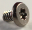 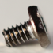 |
| M1.2 x L2.8 3IP        | M1352116-001 M1352117-001    |                               | 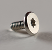 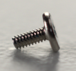 |
| M1.2 x L2.7 3IP        | M1369668-001                    |                              | 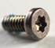 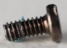 |
| M1.2 x L1.9 3IP        | M1334230-001 M1334231-001    |   | 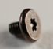 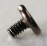 |
| M1.2 x L2.5 3IP        | M1352134-001 M1352135-001    |                              | 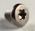 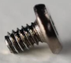 |
| M1.2 x L1.5 3IP        | M1334202-001 M1334202-001    |    | 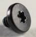 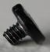 |
| M1.2 x L1.5 3IP        | M1334177-001 M1334229-001    |                              | 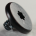 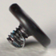 |
| M1.2 x L2.1 3IP        | M1341576-001 M1341577-001    |                              | 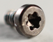 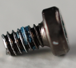 |
| M1.2 x L2.3 3IP        | M1341578-001 M1341579-001    |                              | 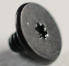 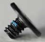 |
